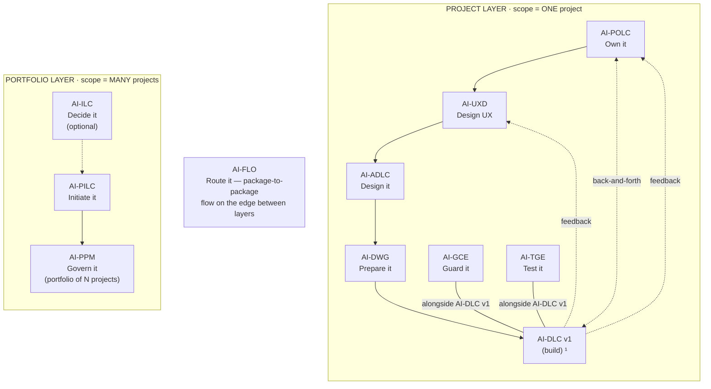

# AIFLC · The AI-* PDLC Family — Injectable Workflow Packages for AI-Assisted Software Delivery

[](./LICENSE)

**Version:** 0.1.0-beta.5
**Author:** [Mohammad Maheri](https://www.linkedin.com/in/mohammad-maheri-8399565b)

---

## What Is This?

The AI-* PDLC Family is part of **AIFLC** (AI Full Life Cycle) — a suite of **injectable workflow packages** that guide AI coding assistants through professional software delivery — from idea through architecture, workspace setup, governance, and test accountability.

Each package is a set of markdown files you drop into your IDE workspace. The AI reads them and gains structured expertise: it knows what to ask, what to produce, and when to hand off to the next package in the chain. No plugins, no APIs, no vendor lock-in.

**Think of it as:** Professional process knowledge, packaged so an AI assistant can execute it with human oversight at every gate.

---

## The Chain


  ¹ AI-DLC v1 = Amazon's open-source build lifecycle (not ours; we feed it).

---

## Packages

| Layer | Package | Type | What It Does | Reads → Produces | Marker | Activate |
|-------|---------|------|--------------|------------------|--------|:--------:|
| Portfolio | [AI-ILC](./pdlc-packages/ai-ilc/) | Interactive workflow | Evaluate raw ideas → Approved Idea Brief | Raw idea → Go/No-Go decision + routed brief | `ilc-state.md` | `_ILC_` |
| Portfolio | [AI-PILC](./pdlc-packages/ai-pilc/) | Interactive workflow | Raw requirement → Project Initiation Package (PIP) | Raw requirement (or Idea Brief) → PIP; mints `projectId` | `pilc-state.md` | `_PILC_` |
| Portfolio | [AI-PPM](./pdlc-packages/ai-ppm/) | Adaptive portfolio engine | Multiple PIPs → Portfolio governance & prioritization | PIPs + briefs (+ AI-FLO roll-up) → portfolio register, prioritization, dispatch | `ppm-state.md` | `_PPM_` |
| Project | [AI-POLC](./pdlc-packages/ai-polc/) | Interactive workflow | PIP/AP → Product Backlog Package (PBP) | PIP / AP → Product Backlog Package (PBP) | `polc-state.md` | `_POLC_` |
| Project | [AI-UXD](./pdlc-packages/ai-uxd/) | Interactive workflow | PIP/AP → UX Design Package (personas, flows, design system) | PIP / PBP (+ AP) → UX Design Package (UXP) | `uxd-state.md` | `_UXD_` |
| Project | [AI-ADLC](./pdlc-packages/ai-adlc/) | Interactive workflow | Requirements → Architecture Package (AP) | PIP (+ PBP + UXP) → Architecture Package (AP) | `adlc-state.md` | `_ADLC_` |
| Project | [AI-DWG](./pdlc-packages/ai-dwg/) | One-time generator | AP + PBP + UXP → Ready-to-code workspace | AP ∥ PBP ∥ UXP (any ≥1) → ready-to-code dev workspace | `dwg-state.md` (+ `rules/workspace-rules.md`) | `_DWG_` |
| Project | [AI-GCE](./pdlc-packages/ai-gce/) | Adaptive governance engine | Workspace → Compliance enforcement layer | Dev workspace → compliance enforcement layer (companion) | `.governance/hooks/` (+ `gce-state.md`) | `_GCE_` |
| Project | [AI-TGE](./pdlc-packages/ai-tge/) | Test governance engine | Workspace → Test strategy, register, coverage tracking | AP + dev workspace → test-governance layer (companion) | `.governance/test/tge-state.md` | `_TGE_` |

> **AI-DLC v1** ([awslabs/aidlc-workflows](https://github.com/awslabs/aidlc-workflows)) is NOT part of this suite — it's Amazon's open-source build lifecycle. Our chain produces the workspace AI-DLC v1 consumes.
>
> **Fabric (not table rows):** **AI-FLO** (router / orchestration — package-to-package flow, shown on the edge of the diagram above, `flo-state.md`, `_FLO_`) · **AI-DFE** (data fabric engine — gathers data from all packages and distributes structured JSON for dashboards and status roll-ups, `_DFE_`, `DAT__`). Both run *alongside* the chain rather than as linear steps, so neither is shown as a chain row above. They are family-scoped fabric engines that install with the family. Type `_ACTIVE_` at any time to see which package is active. Full activation and agent-shortcut keys are in `pdlc-packages/TRIGGER_KEYS_REFERENCE.md`.

---

## Quick Start

### 1. Pick a starting point

- **New project from scratch?** Start with [AI-PILC](./pdlc-packages/ai-pilc/) (project initiation)
- **Have requirements, need architecture?** Start with [AI-ADLC](./pdlc-packages/ai-adlc/)
- **Have architecture, need a workspace?** Start with [AI-DWG](./pdlc-packages/ai-dwg/)
- **Have an idea to evaluate?** Start with [AI-ILC](./pdlc-packages/ai-ilc/)
- **Managing multiple projects?** Start with [AI-PPM](./pdlc-packages/ai-ppm/)

### 2. Install only what you need

**Use the interactive installer** to pick packages and have them placed in the right location for your platform:

```powershell
# Windows (from repo root)
.\installer\install.ps1

# macOS / Linux (from repo root)
./installer/install.sh
```

Or install manually — packages are **independently installable**. You decide how many to run:

- **Solo** — install a single package on its own. Each one is fully self-contained and produces complete, professional output without any other package present.
- **Selective family** — install any subset that fits your work. The chain is modular, so combinations like `AI-PILC + AI-ADLC`, `AI-ADLC + AI-DWG`, or `AI-GCE + AI-TGE` work without requiring the packages in between. When a package detects a sibling's output markers, it enriches its own work with that context; when it doesn't, it runs standalone.
- **Full family** — install the whole chain for end-to-end coverage from idea to test accountability.

Install each package one at a time — adding a package never requires reinstalling the others.

### 3. Each package picks its own AI platform

Compatibility is **per package, not suite-wide**. Every package ships its own `setup/INSTALL.md` with platform-specific setup, so you can run different packages on different assistants in the same workspace if you want. Supported targets per package:

**Supported — install instructions provided:**

- **Kiro** (VS Code-based) — primary platform, full feature support
- **Amazon Q Developer**
- **Cursor**
- **Claude Code**
- **Cline** (VS Code extension)
- **OpenAI Codex** (CLI agent)
- **VS Code Agent** (VS Code agent framework)
- **GitHub Copilot** (⚠️ partial — workspace-level instructions only)

**Under test — compatibility expected, not yet validated (no dedicated install steps yet):**

- **Windsurf** (Codeium IDE)
- **Augment Code**
- **Tabnine Chat**
- **JetBrains AI Assistant**
- **Sourcegraph Cody**
- **Continue** (VS Code / JetBrains extension)
- **Aider** (CLI agent)

Each supported platform's INSTALL.md documents the exact destination paths. The general pattern is the same everywhere: place the package's `*-rules/core-workflow.md` where your AI reads always-loaded steering, and place the `*-rule-details/` folder where the workflow can resolve it on demand. See [INSTALL_GUIDE.md](./INSTALL_GUIDE.md) for the full platform matrix and setup steps.

### 4. Use

Open your IDE chat and tell the AI to use the package:

```
Using AI-PILC, help me initiate this project from my requirements
```

The AI reads the package's core workflow, adopts the appropriate professional role, and guides you through each stage with gates for your approval.

---

## Key Design Principles

- **Human-in-the-loop.** Every stage has an approval gate. The AI proposes; you decide.
- **Injectable.** Drop files into any workspace. No plugins, no lock-in.
- **Professional quality.** Each package embeds domain expertise (PMO, CTO, DevOps, QA). Output reads as if produced by a senior professional.
- **Chain-aware.** Packages can hand off to each other via state markers. But each works standalone too.
- **Platform-agnostic.** Works with any AI coding assistant that reads workspace files.
- **Adaptive depth.** Three tiers (Minimal / Standard / Comprehensive) adapt to project complexity.
- **Generic.** Zero project-specific content. Works for any project, any domain, any technology.

---

## Package-by-Package — In Detail

The table above is the map; this section is the territory. Every package gets a full profile — what it does, how it behaves alone vs. in the chain, the exact deliverable it produces (and what that deliverable contains), how it runs, the patterns it applies, where it stops, and how to activate and install it. Packages appear in **chain order**: the Portfolio layer, then the sequential Project layer, then the two continuous companions, then the two fabric engines that run alongside everything.

> **Common to every package:** pure Markdown (no plugins, no runtime, no build) · injectable (drop into a workspace) · standalone-capable (works with no siblings present) · human-gated (it proposes; you approve at every gate) · adaptive depth (it scales to project complexity). Each ships its own README, `setup/INSTALL.md`, and a machine-readable install manifest. Runtime output nests under the family workspace `pdlc-ws/`. `projectId` — minted by AI-PILC — is the correlation key threaded through every downstream marker, log, and dashboard.

---

### Portfolio Layer — reason across MANY projects

#### 1 · AI-ILC — *Decide it* (AI-Driven Idea Life Cycle)

Portfolio layer · interactive workflow · optional pre-stage · speaks as a product / innovation manager

Turns a raw idea, brainstorm note, or change request into an evidence-based **Go / No-Go decision** plus a routed brief. It is the "funnel before the funnel" — the front door that decides whether an idea deserves to become a project at all.

**Standalone:** Evaluates a single idea and hands you a decision + brief.

**In the chain:** The approved brief routes by **intent** — a new-project brief to AI-PILC, a feature or change-request brief to AI-PPM for an existing portfolio.

**Inputs:** Raw idea (any format)
**Output:** The **idea-management** cluster: `idea-register.md` (the funnel view), a per-idea entry, and a routed **Approved Idea / Feature / Change-Request Brief**, plus the `ilc-state.md` marker.

**How it works:** 6 stages — capture → shape → evaluate → scope → approve → route-handoff — with intent-based routing (`new-project` | `feature` | `change-request`) and depth that adapts to how heavy the idea is. Captures an early **lens** posture (AI / Automation) for downstream packages.

**Patterns:** Stage-gate innovation funnel · multi-criteria decision analysis (weighted scoring) · lean validation · impact / change classification.

**Boundary:** It decides and routes; it does not initiate the project or build the full business case (that is AI-PILC).

**Activate** `_ILC_` · **Marker** `ilc-state.md` · **Agent** `IQC__` · [Install](./pdlc-packages/ai-ilc/setup/INSTALL.md) · [Full README](./pdlc-packages/ai-ilc/README.md)

---

#### 2 · AI-PILC — *Initiate it* (AI-Driven Project Initiation Life Cycle)

Portfolio layer · interactive workflow · speaks as a PMO / project manager

Turns a raw requirement (or an Approved Idea Brief) into a complete, professional **Project Initiation Package (PIP)** — the charter, business case, and governance foundation a project needs before design begins. It **mints `projectId`**, the correlation key every later package carries.

**Standalone:** Initiates from a verbal brief, a PRD, or raw requirements.

**In the chain:** Consumes an AI-ILC brief and its PIP becomes the input for AI-POLC, AI-UXD, and AI-ADLC.

**Inputs:** Raw requirement / Idea Brief
**Output:** The **project-initiation** cluster (PIP): `01_*.md … 12_*.md` (intake, analysis, feasibility, business case, charter, RACI, registers), a `PROJECT_INITIATION_PACKAGE_README.md`, and the `pilc-state.md` marker.

**How it works:** 6 phases — inception → assessment → justification → authorization → planning → mobilization — each gated for approval. **Promotes the lens modes** into the governance spine's `Lens_Status.md` so the rest of the chain knows which facets are on.

**Patterns:** PMBOK / PMI (Initiating + Planning) · PRINCE2 · stage-gate governance · business case / investment appraisal · ITIL-style service context · P×I risk.

**Boundary:** It initiates and justifies; it does not design architecture, backlog, or UX.

**Activate** `_PILC_` · **Marker** `pilc-state.md` · **Agent** `IQA__` · [Install](./pdlc-packages/ai-pilc/setup/INSTALL.md) · [Full README](./pdlc-packages/ai-pilc/README.md)

---

#### 3 · AI-PPM — *Govern it* (AI-Driven Portfolio Management)

Portfolio layer · adaptive engine (continuous, not a one-pass workflow) · speaks as a PMO / portfolio manager

Governs the **set** of projects — registers them, prioritizes across them, makes admit/pause/retire decisions, and dispatches authorization down to the Project layer. It reasons across MANY projects where the lifecycle packages each own ONE.

**Standalone:** Manages a manual project list + status.

**In the chain:** Ingests multiple PIPs + Approved Idea Briefs, and (via AI-FLO roll-up) live project status — then dispatches work down through AI-FLO.

**Inputs:** Multiple PIPs + briefs (+ AI-FLO roll-up)
**Output:** The **portfolio** cluster: `portfolio-register.md`, `strategic-alignment-map.md`, `prioritization-scorecard.md`, `governance-decision-records/`, `dispatch-authorizations/` (DA-*.md), a `portfolio-health-dashboard.md`, and the `ppm-state.md` marker.

**How it works:** 5 phases / 10 stages — intake → prioritization → authorization → monitoring → optimization — plus **7 opt-in extensions** (balancing, what-if, dependency, capacity, themes, finance, benefits). It aggregates downstream data by `projectId`; it never recomputes it.

**Patterns:** PMI Standard for Portfolio Management · MoP (AXELOS) · SAFe Lean Portfolio Management · stage-gate portfolio governance · benefits realization.

**Boundary:** It governs the portfolio; it is **lens-neutral** (aggregates, doesn't apply a facet) and never talks to Project-layer packages directly — all dispatch goes through AI-FLO.

**Activate** `_PPM_` · **Marker** `ppm-state.md` · **Agent** `PGA__` · [Install](./pdlc-packages/ai-ppm/setup/INSTALL.md) · [Full README](./pdlc-packages/ai-ppm/README.md)

---

### Project Layer — execute ONE project (sequential: POLC → UXD → ADLC → DWG)

#### 4 · AI-POLC — *Own it* (AI-Driven Product Ownership Life Cycle)

Project layer · interactive workflow · step 1 of the sequential design chain · speaks as a product owner / product manager

Turns a PIP (and/or AP) into a **Product Backlog Package (PBP)** — the product vision, roadmap, prioritized epics, and the quality bar (Definition of Ready / Done) that governs what "done" means downstream.

**Standalone:** Works from a product brief or an existing backlog.

**In the chain:** Reads the PIP, exchanges value goals with AI-UXD, and feeds its DoR/DoD + prioritization into AI-DWG. It **tags features** with the lens facets (`aiFeature` / `automationFeature`, derived `agenticProfile`) so UX, architecture, governance, and test know what to treat specially.

**Inputs:** PIP / AP
**Output:** The **product-backlog** cluster (PBP): `product-vision.md`, `roadmap.md` (Now/Next/Later), `epics/`, `prioritization-scorecard.md` (WSJF / MoSCoW), `definition-of-ready-done.md`, `product-risk-register.md`, a `management_framework/` spine contribution, and the `polc-state.md` marker.

**How it works:** 6 phases / 16 stages — foundation → strategy → governance → stakeholders → assembly → operations — plus a **Tier 2 story-elaboration** mode (INVEST, Given/When/Then; off by default in chain mode) and **7 opt-in extensions** (advanced discovery, user-story mapping, full traceability, full risk, full docs, quality review, MVP/MMP).

**Patterns:** Scrum product ownership · SAFe LPM · WSJF / MoSCoW · Impact Mapping / JTBD / OKRs · User Story Mapping · INVEST · Definition of Ready/Done.

**Boundary:** It owns the *what* and *why* (backlog, value, priority); it does not design UX or architecture, and it does not write stories in the chain unless Tier 2 is switched on.

**Activate** `_POLC_` · **Marker** `polc-state.md` · **Agent** `BLH__` · [Install](./pdlc-packages/ai-polc/setup/INSTALL.md) · [Full README](./pdlc-packages/ai-polc/README.md)

---

#### 5 · AI-UXD — *Design the experience* (AI-Driven UX Design)

Project layer · interactive workflow · step 2 of the sequential design chain · speaks as a senior UX designer

Turns a PIP / PBP into a **UX Design Package (UXP)** — research-grounded personas and journeys, information architecture, user flows, a token-based design system, and an accessibility baseline.

**Standalone:** Works from a product brief + user research.

**In the chain:** Reads the PIP/AP, exchanges with AI-POLC (value goals focus research), and feeds three downstreams: personas/journeys → AI-POLC, design-system + frontend-standards → AI-DWG, accessibility baseline → AI-GCE. Designs the **interaction facet** for tagged AI / automation / agentic features (human-in-the-loop, approval/override UX).

**Inputs:** PIP / PBP (+ AP)
**Output:** The **ux-design** cluster (UXP): `personas/`, `journeys/`, `information-architecture/`, `user-flows/`, `design-system/` (+ W3C design tokens, components), `accessibility-baseline.md` (WCAG 2.2 target), a `UXP_README.md`, and the `uxd-state.md` marker.

**How it works:** 5 phases / 16 stages — discover → define → design → validate → assemble — with full persona→journey→flow→screen→component→token traceability and 15 output templates.

**Patterns:** Double Diamond · Atomic Design · W3C Design Tokens · WCAG 2.2 · Jobs-to-be-Done · information architecture · journey / service mapping · heuristic evaluation.

**Boundary:** It designs the experience; it does not decide backlog priority (AI-POLC) or system architecture (AI-ADLC), and it does not write production UI code.

**Activate** `_UXD_` · **Marker** `uxd-state.md` · **Agent** `UXC__` · [Install](./pdlc-packages/ai-uxd/setup/INSTALL.md) · [Full README](./pdlc-packages/ai-uxd/README.md)

---

#### 6 · AI-ADLC — *Design the system* (AI-Driven Architecture Design Life Cycle)

Project layer · interactive workflow · step 3 (terminal predecessor) of the sequential design chain · speaks as a CTO / solution architect. *(Inspired by [awslabs/aidlc-workflows](https://github.com/awslabs/aidlc-workflows).)*

Turns a PIP (+ PBP + UXP) into an **Architecture Package (AP)** — a C4-decomposed design with technology decisions, security, data, API, and integration specs, all captured as reviewable Architecture Decision Records.

**Standalone:** Works from requirements + a charter (or an existing architecture).

**In the chain:** Consumes the PIP and its Project-layer peers, and its AP feeds AI-DWG, AI-UXD, and AI-TGE. It is where **file-ownership boundaries originate** (DDD) — DEFINE here → GENERATE at AI-DWG → ENFORCE at AI-GCE. Designs the **architecture facet** for tagged AI / automation / agentic features (model serving/RAG, tool-use, reasoning-loop).

**Inputs:** PIP (+ PBP + UXP)
**Output:** The **architecture** cluster (AP): `01_*.md … 11_*.md`, `ADR/`, vision, C4 L1–L3, tech-stack, security, data, API, integration, an `Architecture_Workbook.md`, a `management_framework/` spine contribution, an `ARCHITECTURE_PACKAGE_README.md`, and the `adlc-state.md` marker.

**How it works:** 5 phases — foundation → decomposition → decisions → design → assembly — with C4 progressive decomposition and ADRs, plus **10 opt-in extensions**: DDD (tactical) · **Event Storming** · Domain Storytelling · Microservices · BFF · Event Sourcing/CQRS · Resilience · Feature Flags · Wardley Mapping · Threat Modeling (STRIDE). (It ships a real `ROADMAP.md` for these.)

**Patterns:** C4 model · Architecture Decision Records · quality attributes / NFRs · plus the 10 extensions above.

**Boundary:** It designs the system; it does not scaffold the workspace (AI-DWG) or write application code.

**Activate** `_ADLC_` · **Marker** `adlc-state.md` · **Agent** `ADA__` · [Install](./pdlc-packages/ai-adlc/setup/INSTALL.md) · [Full README](./pdlc-packages/ai-adlc/README.md)

---

#### 7 · AI-DWG — *Prepare it* (AI-Driven Workspace Generator)

Project layer · one-time generator + reconciler (the design→build hinge) · speaks as a DevOps / platform engineer. *(Inspired by [awslabs/aidlc-workflows](https://github.com/awslabs/aidlc-workflows).)*

Composes a **ready-to-code development workspace (DW)** from whichever design peers exist — it *is* the workspace: steering rules, project docs, config, source skeleton, and the AI-DLC v1 build inputs.

**Standalone:** Generates from any single structured package (AP, PBP, or UXP).

**In the chain:** Takes the **peer set** — AP ∥ PBP ∥ UXP, **any non-empty subset (≥1)** — and generates one output cluster per present input; an absent input skips its cluster with a quality-impact disclosure + your approval (no peer dominates). It **provisions AI-GCE and AI-TGE** into the generated workspace and the **lens scaffolding** for tagged features.

**Inputs:** AP ∥ PBP ∥ UXP (≥1)
**Output:** The **`{slug}-workspace/`** (IS the workspace): `.kiro/steering/workspace-rules.md` (the marker) + 13+ tech steering (if AP), `design-system.md`/`frontend-standards.md` (if UXP), `vision.md` (if PBP), `technical-environment.md`/`ui-implementation-spec.md`, `DEFINITION_OF_DONE.md`, project docs, `.github/`/`.editorconfig`/`docker-compose.yml`/`CODEOWNERS`, a carried-forward `management_framework/` spine, and a `{src-structure}/` (if AP).

**How it works:** 3 modes — **1 generate** (forward) · **2 reconcile** (reverse-triggered when an upstream peer revises) · **3 brownfield** — over 27 mapping transforms, with non-destructive reconciliation and provenance tracking. Testing-strategy is **delegation-on-activation**: AI-TGE owns it when active, else AI-DWG produces a basic one.

**Patterns:** Project scaffolding / generators · policy-as-code · multi-source convergence + conditional generation · non-destructive reconciliation · provenance · AI-agnostic canonical + adapter rendering · day-1 developer experience.

**Boundary:** It prepares the workspace; it does not build the software (AI-DLC v1 does) or make product/architecture decisions (it renders its peers' decisions).

**Activate** `_DWG_` · **Marker** `workspace-rules.md` (+ engine state `dwg-state.md`) · **Agent** `WIA__` · [Install](./pdlc-packages/ai-dwg/setup/INSTALL.md) · [Full README](./pdlc-packages/ai-dwg/README.md)

---

### Project Layer — continuous companions (run alongside the build)

#### 8 · AI-GCE — *Guard it* (AI-Driven Governance & Compliance Engine)

Project layer · adaptive governance engine · companion (runs in the generated workspace, alongside AI-DLC v1) · speaks as a compliance / governance lead. *(Inspired by [awslabs/aidlc-workflows](https://github.com/awslabs/aidlc-workflows).)*

Reads the development workspace and derives a **compliance & enforcement layer** — the hooks, rules, agents, and audit log that keep the build inside its own declared standards, continuously.

**Standalone:** Derives governance for any workspace that has `.kiro/steering/` files.

**In the chain:** AI-DWG provisions it, and it re-derives selectively whenever the workspace updates. It is the **ENFORCE** end of the ADLC→DWG→GCE file-ownership relay and enforces **Team Topologies** boundaries (`GOV-TT`) from the module structure + CODEOWNERS. Governs tagged AI / automation features via lens agents.

**Inputs:** Development workspace (`workspace-rules.md`, DoD, TEAM_AGREEMENTS, CODEOWNERS, folder layout)
**Output:** A compliance layer: `.compliance-state.json`, `.kiro/hooks/*.kiro.hook` (the marker folder — 9 always + up to 6 conditional), `.kiro/agents/*.md` (8 process agents, GCE-AG-01..08), `.governance/` (rules: 10 always + 12 tier-gated; log; README; AGENT-GUIDE; AGENT_REGISTRY), and a `compliance-dashboard.md`.

**How it works:** 4 modes over a **3-tier progressive maturity** model, two-source derivation (architectural + non-architectural), and ~23 derivation generators. Every JSONL log event carries `projectId`.

**Patterns:** **Team Topologies** (GOV-TT enforcement) · policy-as-code · separation of duties & change control · two-source derivation · progressive maturity (3 tiers) · audit trail · configuration-drift detection.

**Boundary:** It governs code discipline; it does not run tests (AI-TGE) or execute/deploy code. It enforces rules; it never authors upstream design.

**Activate** `_GCE_` · **Marker** `.kiro/hooks/` folder (+ `.compliance-state.json`) · **Agents** GCE-AG-01..08 (+ lens `AIG__`/`ATG__`) · [Install](./pdlc-packages/ai-gce/setup/INSTALL.md) · [Full README](./pdlc-packages/ai-gce/README.md)

---

#### 9 · AI-TGE — *Test it* (AI-Driven Test Governance Engine)

Project layer · hybrid test-governance engine · companion (runs alongside AI-DLC v1, sibling of AI-GCE) · speaks as a QA / test architect. *(Inspired by [awslabs/aidlc-workflows](https://github.com/awslabs/aidlc-workflows).)*

Derives which tests **must** exist from architectural commitments, then continuously tracks whether they do — answering "did we test what we designed, and which missing tests matter most?"

**Standalone:** (four auto-detected modes) An AP yields an architecture-derived strategy, existing tests yield a brownfield assessment, and a running build yields observation-only tracking.

**In the chain:** Reads AP + DW + AI-DLC v1 state for full strategy + observation, and **owns `testing-strategy.md`** when active (AI-DWG defers to it). Tests tagged AI / automation / agentic features via lens agents.

**Inputs:** AP + DW + `aidlc-docs`
**Output:** The **`.governance/test/`** layer: `test-strategy.md`, `test-register.md`, `coverage-report.md`, `debt-scorecard.md`, `defect-log.md`, a `quality-dashboard.md`, and the `tge-state.md` marker.

**How it works:** 2 phases / 12 stages — Strategy (Stages 1–6: detection, architecture reading, requirement derivation, brownfield, strategy, risk scoring) + Observation (Stages 7–12: state observation, acceptance mapping, coverage, reconciliation, defects, debt) — across 4 modes, with 4-factor risk scoring and adaptive depth (Minimal / Standard / Comprehensive).

**Patterns:** ISTQB taxonomy · IEEE 829 · risk-based testing · test pyramid · two-source derivation · commitment-based coverage · technical-debt governance.

**Boundary:** It governs test accountability; it never writes or runs test code, and it is complementary to (not a replacement for) AI-GCE (code compliance).

**Activate** `_TGE_` · **Marker** `.tge/tge-state.md` · **Agents** `TGV__` / `CVR__` (+ lens `AIQ__`/`ATQ__`) · [Install](./pdlc-packages/ai-tge/setup/INSTALL.md) · [Full README](./pdlc-packages/ai-tge/README.md)

---

### Fabric Engines — run alongside the whole family (not chain rows)

#### 10 · AI-FLO — *Route it* (AI-Driven Flow Orchestrator)

The family's **edge router**, on the boundary between the Portfolio and Project layers · continuous fabric engine (family-agnostic in v2.0) · speaks as a process / orchestration engineer

Carries decisions down and status up — it reads every package's state marker, decides the next hop along the family's bindings graph, validates the gate at each hop, and flags conflicts. It turns a set of independent packages into a coordinated pipeline.

**Standalone:** Additive and never required — without it, same-layer packages still hand off via direct marker detection; it adds cross-layer and cross-family coordination and is never a single point of failure. It is **advisory** (records routing decisions for a human to act on; does not auto-start sessions).

**In the chain:** Same as standalone — it is always additive, never gating.

**Inputs:** Any package's `*-state.md` marker (wildcard) + the fabric trio (`FAMILY_BINDINGS.md` / `GATE_PROTOCOL.md` / `FAMILY_INTERFACE.md`)
**Output:** Routing artifacts under `_FLO_/`: `flo-state.md` (marker), `routing-table.md`, `routing-log.md` (append-only), `fabric-audit-log.md`, `conflict-alerts/`, `readiness-checks/`.

**How it works:** 3 phases / 10 stages — configure → route → monitor — across 3 topology modes (co-located, hub-and-spoke, fully distributed), with flag-and-hold conflict detection (10 types, C1–C10), an anti-deadlock timeout + operator force-through, and drift brokering (`DFT__ route`). Emits the internal capability `orchestration-state@1`.

**Patterns:** Orchestration (mediator/router) · orchestration⇄choreography hybrid · content-based routing · quality-gate validation · flag-and-hold (circuit-breaker analog) · saga / long-running coordination · correlation identifier · append-only audit log.

**Boundary:** It routes and records; it never decides *what* to build (AI-PPM decides; the operator overrides), never produces a package's artifacts, and (in v1.0) never auto-executes a session.

**Activate** `_FLO_` · **Marker** `flo-state.md` · **Agents** `FHC__` (health) / `FIA__` (integrity) · [Install](./pdlc-packages/ai-flo/setup/INSTALL.md) · [Full README](./pdlc-packages/ai-flo/README.md)

---

#### 11 · AI-DFE — *Fabric it* (AI-Driven Data Fabric)

The family's **data layer** · continuous fabric engine (family-agnostic) · sole owner and sole writer of `pdlc-ws/data/` · speaks as a data-fabric engineer

Gathers every package's scattered Markdown output, shapes it into schema-validated JSON per consumer need, and distributes it to one governed read-point — so dashboards, extensions, and reports get clean, machine-readable data without knowing where the raw files live.

**Standalone:** Additive and never required — packages produce their Markdown with or without it; it adds a machine-readable surface on top. Producers and consumers are fully decoupled: a producer just emits Markdown; a consumer declares a demand and reads `REGISTRY.json`.

**In the chain:** Same as standalone — it is always additive, never gating.

**Inputs:** Every package's output marker (wildcard) + each consumer's declared `data-demand/` declarations
**Output:** The **`pdlc-ws/data/`** surface: `REGISTRY.json` (the single index), per-package `{pkg}-data.json` (Layer 1) + demand-shaped consumer outputs (Layer 2), `CONSUMER_REGISTRY.md`, `history/` snapshots, and the `dfe-state.md` marker.

**How it works:** 3 phases — configure (discover) → operate (gather, shape, distribute, monitor) → govern (validate, freshness, history, cleanup) — a two-layer pipeline, schema-on-write, and graceful degradation (a missing source becomes a `null` field, never an error). Emits the internal capability `data-surface@1`.

**Patterns:** ETL / ingestion pipeline · single source of truth (registry) · schema-on-write (contract-first) · publisher/subscriber decoupling · single-writer ownership · snapshotting · null-object degradation · materialized view.

**Boundary:** It fabricates a data surface; it never authors or edits a package's source content, never routes decisions or decides when a package runs (that is AI-FLO), and never writes outside `pdlc-ws/data/`.

**Activate** `_DFE_` (operations `DAT__`) · **Marker** `dfe-state.md` · **Agents** `DHC__` (health) / `DFA__` (integrity) · [Install](./pdlc-packages/ai-dfe/setup/INSTALL.md) · [Full README](./pdlc-packages/ai-dfe/README.md)

---

## Patterns, Methodologies & Frameworks Across the Family

Every package aligns with established industry practice and adapts it to an AI-assisted, human-gated workflow. Each package README carries the full **framework → *what it applies* → *where it stops*** table; this is the family-wide index.

| Package | Frameworks & patterns it applies |
|---------|----------------------------------|
| **AI-ILC** | Stage-gate innovation funnel · multi-criteria decision analysis (weighted scoring) · lean validation · portfolio funnel · impact / change classification |
| **AI-PILC** | PMBOK / PMI (Initiating + Planning) · PRINCE2 · stage-gate governance · business case / investment appraisal · ITIL-style service context · P×I risk |
| **AI-PPM** | PMI Standard for Portfolio Management · MoP (AXELOS) · SAFe Lean Portfolio Management · stage-gate portfolio governance · benefits realization |
| **AI-POLC** | Scrum product ownership · SAFe LPM · WSJF / MoSCoW · Impact Mapping / JTBD / OKRs · User Story Mapping · INVEST · Definition of Ready/Done |
| **AI-UXD** | Double Diamond · Atomic Design · W3C Design Tokens · WCAG 2.2 · Jobs-to-be-Done · information architecture · journey / service mapping · heuristic evaluation |
| **AI-ADLC** | C4 model · Architecture Decision Records · quality attributes / NFRs · **+ 10 opt-in extensions**: DDD, Event Storming, Domain Storytelling, Microservices, BFF, Event Sourcing/CQRS, Resilience, Feature Flags, Wardley Mapping, Threat Modeling (STRIDE) |
| **AI-DWG** | Project scaffolding / generators · policy-as-code · multi-source convergence + conditional generation · non-destructive reconciliation · provenance · AI-agnostic canonical + adapter rendering · developer experience (day-1) |
| **AI-GCE** | **Team Topologies** (GOV-TT enforcement) · policy-as-code · separation of duties & change control · two-source derivation · progressive maturity (3 tiers) · audit trail · configuration-drift detection |
| **AI-TGE** | ISTQB taxonomy · IEEE 829 · risk-based testing · test pyramid · two-source derivation · commitment-based coverage · technical-debt governance |

---

## Cross-Cutting Lenses (AI · Automation · Agentic)

Independent of the chain, the family carries a **lens seam** — cross-cutting modes that, when switched on, make every design package apply a domain facet to the work it touches. One switch; a different facet per package. Adding a lens is a registry-only change (`pdlc-packages/contracts/LENS_REGISTRY.md`) — zero core edits.

| Lens | Mode (on / off) | Key | Purpose |
|------|-----------------|-----|---------|
| **AI Lens** | AI-Powered / No-AI | `_AILENS_` | Design AI features — model serving/RAG, AI-feature UX (human-in-the-loop), AI governance & testing |
| **Automation Lens** | Automated / Manual | `_AUTOLENS_` | Design automated features — workflow automation, approval / monitoring / override UX |
| **Agentic** (AI ∩ Automation) | derived — both on | — | Composed facet for agentic features — tool-use, memory, reasoning-loop; tool-permission / kill-switch governance; trajectory / step-cap testing |

**How a lens flows through the chain:** **AI-PILC** promotes the modes into the governance spine's `Lens_Status.md` → **AI-POLC** tags features (`aiFeature` / `automationFeature`, derived `agenticProfile`) → **AI-UXD** and **AI-ADLC** design the interaction and architecture facets → **AI-DWG** provisions the scaffolding into the dev workspace → **AI-GCE** and **AI-TGE** govern and test the tagged features via Layer-3 agents (`AIG__`/`ATG__` governance, `AIQ__`/`ATQ__` quality). AI-ILC captures an early posture; AI-PPM is lens-neutral (it aggregates, it doesn't apply a facet).

---

## For AI Agents — Family Manifest

<details>
<summary>Machine-readable YAML manifest (click to expand)</summary>

This block is a machine-readable index of the whole family. An AI assistant can parse it to understand what each package is, how packages relate, and where to install them. It is an **index, not a full installer** — each package ships its own complete machine-readable install manifest (in its README's *Installation* section) with the exact per-platform orchestrator slot and copy operations.

**How to read it:** every package installs into one uniform home — `.aiflc/pdlc/` — on every platform; only a single always-loaded **session orchestrator** sits in each platform's native slot and `Read`s a package core on demand. Packages detect each other by **marker file** (never by path), and `projectId` (minted by AI-PILC) is the correlation key threaded through the chain. To install: either run the family installer (`installer/install.ps1` / `install.sh`) and pick packages, or follow an individual package's manifest.

```yaml
# AIFLC — AI-* PDLC FAMILY MANIFEST (machine-readable index)
brand: AIFLC
family: pdlc
family_repo: AIPDLC
version: 0.1.0-beta.5
package_home: .aiflc/pdlc/          # uniform on EVERY platform (cores + rule-details + fabric)
source_root: pdlc-packages/          # clone root of this repo
workspace_output_root: pdlc-ws/      # all runtime output nests here
correlation_key: projectId           # minted by AI-PILC; threaded through every downstream marker/log
status_key: _ACTIVE_                  # type this to see which package is currently active
orchestrator:
  model: one always-loaded session orchestrator per platform; Reads a package core on demand
  per_platform_slot: see each package's install manifest (Kiro .kiro/steering/, Amazon Q .amazonq/rules/pdlc/, Cursor .cursor/rules/, Cline .clinerules/, Claude Code CLAUDE.md @import, Copilot .github/, Codex/VS Code AGENTS.md)
install_options:
  - family_installer: "installer/install.ps1 (Windows) | installer/install.sh (macOS/Linux) — pick packages"
  - per_package_manifest: "each package README > Installation > machine-readable manifest"
capability_note: "Each package declares its Communication Fabric capability (emits-type / consumes) in its core's § Gate Contract; see the package's own manifest for exact tokens."
layers:
  portfolio: reasons across MANY projects
  edge: routes on the boundary between layers (AI-FLO)
  project: executes ONE project (POLC -> UXD -> ADLC -> DWG, then GCE + TGE alongside the build)
  fabric: runs alongside the whole family (AI-FLO router, AI-DFE data)
packages:
  - code: AI-ILC
    layer: portfolio
    type: interactive-workflow (optional pre-stage)
    activate: _ILC_
    marker: ilc-state.md
    reads: raw idea (any format)
    produces: Approved Idea / Feature / Change-Request Brief + idea register
    governance_agent: IQC__
    install: pdlc-packages/ai-ilc/setup/INSTALL.md
  - code: AI-PILC
    layer: portfolio
    type: interactive-workflow
    activate: _PILC_
    marker: pilc-state.md
    reads: raw requirement | ilc-state.md (Approved Idea Brief)
    produces: Project Initiation Package (PIP); mints projectId
    governance_agent: IQA__
    install: pdlc-packages/ai-pilc/setup/INSTALL.md
  - code: AI-PPM
    layer: portfolio
    type: adaptive-portfolio-engine (continuous)
    activate: _PPM_
    marker: ppm-state.md
    reads: multiple pilc-state.md + Approved Idea Briefs (+ AI-FLO roll-up)
    produces: portfolio register + cross-project prioritization + dispatch authorizations
    governance_agent: PGA__
    install: pdlc-packages/ai-ppm/setup/INSTALL.md
  - code: AI-POLC
    layer: project
    type: interactive-workflow (design step 1)
    activate: _POLC_
    marker: polc-state.md
    reads: pilc-state.md | adlc-state.md
    produces: Product Backlog Package (PBP)
    governance_agent: BLH__
    install: pdlc-packages/ai-polc/setup/INSTALL.md
  - code: AI-UXD
    layer: project
    type: interactive-workflow (design step 2)
    activate: _UXD_
    marker: uxd-state.md
    reads: pilc-state.md | adlc-state.md (+ POLC value goals)
    produces: UX Design Package (UXP)
    governance_agent: UXC__
    install: pdlc-packages/ai-uxd/setup/INSTALL.md
  - code: AI-ADLC
    layer: project
    type: interactive-workflow (design step 3, terminal predecessor)
    activate: _ADLC_
    marker: adlc-state.md
    reads: pilc-state.md (+ PBP + UXP)
    produces: Architecture Package (AP)
    emits_capability: architecture-design@1
    governance_agent: ADA__
    install: pdlc-packages/ai-adlc/setup/INSTALL.md
  - code: AI-DWG
    layer: project
    type: one-time-generator + reconciler (design->build hinge)
    activate: _DWG_
    marker: workspace-rules.md            # (+ engine state dwg-state.md)
    reads: adlc-state.md || polc-state.md || uxd-state.md   # any non-empty subset (>=1)
    produces: development workspace (DW) + AI-DLC v1 build inputs; provisions AI-GCE + AI-TGE
    emits_capability: development-workspace@1
    governance_agent: WIA__
    install: pdlc-packages/ai-dwg/setup/INSTALL.md
  - code: AI-GCE
    layer: project
    type: adaptive-governance-engine (companion, alongside the build)
    activate: _GCE_
    marker: .kiro/hooks/                   # folder (+ .compliance-state.json)
    reads: workspace-rules.md (the DW)
    consumes_capability: development-workspace@1
    produces: compliance & enforcement layer (hooks, rules, agents, JSONL audit log)
    governance_agents: [GCE-AG-01..08, AIG__, ATG__]
    install: pdlc-packages/ai-gce/setup/INSTALL.md
  - code: AI-TGE
    layer: project
    type: hybrid-test-governance-engine (companion, alongside the build)
    activate: _TGE_
    marker: .tge/tge-state.md
    reads: workspace-rules.md + adlc-state.md + aidlc-docs/aidlc-state.md
    consumes_capability: [development-workspace@1, architecture-design@1]
    produces: test-governance layer (strategy, register, coverage, debt, defects, dashboard)
    governance_agents: [TGV__, CVR__, AIQ__, ATQ__]
    install: pdlc-packages/ai-tge/setup/INSTALL.md
  - code: AI-FLO
    layer: edge (fabric)
    type: fabric router / orchestration engine (continuous, advisory in v1.0)
    activate: _FLO_
    marker: flo-state.md
    reads: any *-state.md + fabric trio (FAMILY_BINDINGS.md, GATE_PROTOCOL.md, FAMILY_INTERFACE.md)
    produces: routing artifacts under _FLO_/ (routing table, log, conflict alerts, readiness checks)
    emits_capability: orchestration-state@1
    consumes_capability: "*"
    governance_agents: [FHC__, FIA__]
    install: pdlc-packages/ai-flo/setup/INSTALL.md
  - code: AI-DFE
    layer: fabric
    type: data fabric engine (continuous; sole writer of pdlc-ws/data/)
    activate: _DFE_                        # operations key: DAT__
    marker: dfe-state.md
    reads: any *-state.md + consumer data-demand/ declarations
    produces: machine-readable data surface at pdlc-ws/data/ (REGISTRY.json + per-package JSON)
    emits_capability: data-surface@1
    consumes_capability: "*"
    governance_agents: [DHC__, DFA__]
    install: pdlc-packages/ai-dfe/setup/INSTALL.md
```

</details>

---

## ⚠️ Brownfield Deployment Warning

If you are injecting packages into an **existing project** (brownfield), please take the following precautions:

1. **Back up first.** Commit all work to version control or take a snapshot before injection.
2. **Use a test branch.** Try the package in an isolated branch before applying to your main codebase.
3. **Review output structure.** Each package documents what it generates — check for conflicts with your existing files and folders.
4. **No warranty.** This software is provided "AS IS" under Apache 2.0. The author accepts no liability for overwritten files, broken pipelines, lost data, or any other damage resulting from integration into existing environments. You are solely responsible for determining appropriateness.

See [LICENSE](./LICENSE) and [NOTICE](./NOTICE) for full liability and warranty disclaimer details.

---

## Repository Structure

```
AIPDLC/
├── README.md              ← You are here
├── LICENSE                ← Apache 2.0
├── NOTICE                 ← Attribution requirement
├── CONTRIBUTING.md        ← How to contribute
├── SECURITY.md            ← Vulnerability reporting
├── INSTALL_GUIDE.md       ← Unified installation guide (all platforms)
├── installer/             ← Interactive package installer (PowerShell + Bash)
├── narrative/             ← Whitepapers and HOW documents
├── knowledge_docs/        ← Design patterns and reference material (repo reference, not installed)
│
└── pdlc-packages/         ← All packages (one level down to keep root clean)
    ├── ai-ilc/            ← Idea evaluation workflow
    ├── ai-pilc/           ← Project initiation workflow
    ├── ai-adlc/           ← Architecture design workflow
    ├── ai-uxd/            ← UX design workflow
    ├── ai-polc/           ← Product ownership workflow
    ├── ai-dwg/            ← Workspace generator
    ├── ai-ppm/            ← Portfolio management engine
    ├── ai-flo/            ← Flow router engine
    ├── ai-gce/            ← Governance compliance engine
    ├── ai-tge/            ← Test governance engine
    ├── ai-dfe/            ← Data fabric engine
    │
    └── contracts/         ← Cross-package conventions & contracts
```

> **Why the subfolder?** To keep your workspace root clean. Cloning this repo only places a handful of files (README, LICENSE, etc.) at the top level — all operational content lives inside `pdlc-packages/`. The installer reads from this subfolder automatically.

---

## Use Them Together or Alone

**Full chain** (maximum value): AI-ILC → AI-PILC → AI-POLC → AI-UXD → AI-ADLC → AI-DWG → AI-GCE + AI-TGE → AI-DLC v1 (build)

**Standalone** (each package works independently):
- AI-PILC alone produces a professional Project Initiation Package
- AI-ADLC alone produces a complete Architecture Package
- AI-DWG alone generates a workspace from any architecture document
- AI-GCE alone derives governance for any existing workspace
- AI-TGE alone assesses test coverage against architectural commitments

When used in the chain, each package detects its predecessor's output markers and enriches its own work with that context. When used standalone, it gracefully handles missing predecessors.

---

## Compatibility

| Platform | Supported | Install Guide |
|----------|:---------:|:-------------:|
| Kiro | ✅ | [INSTALL_GUIDE.md](./INSTALL_GUIDE.md#kiro) |
| Amazon Q Developer | ✅ | [INSTALL_GUIDE.md](./INSTALL_GUIDE.md#amazon-q-developer) |
| Cursor | ✅ | [INSTALL_GUIDE.md](./INSTALL_GUIDE.md#cursor) |
| Cline | ✅ | [INSTALL_GUIDE.md](./INSTALL_GUIDE.md#cline) |
| Claude Code | ✅ | [INSTALL_GUIDE.md](./INSTALL_GUIDE.md#claude-code) |
| OpenAI Codex | ✅ | [INSTALL_GUIDE.md](./INSTALL_GUIDE.md#openai-codex) |
| GitHub Copilot | ⚠️ Partial | [INSTALL_GUIDE.md](./INSTALL_GUIDE.md#github-copilot) |
| VS Code Agent | ✅ | [INSTALL_GUIDE.md](./INSTALL_GUIDE.md#vs-code-agent-framework) |

> Compatibility is per package — every package ships the same platform coverage. See [INSTALL_GUIDE.md](./INSTALL_GUIDE.md) for the unified multi-platform installation guide.

---

## Contributing

See [CONTRIBUTING.md](./CONTRIBUTING.md) for guidelines and our Contributor License Agreement.

---

## Learn More — Knowledge Documents & Narrative

The `knowledge_docs/` folder ships with this repo as **deep-dive reference material** — not installed into workspaces, but available for humans and AI agents who want to understand how and why the system works. The [WHITEPAPER](./narrative/WHITEPAPER.md) is the comprehensive design narrative.

### Getting started (how-to guides)

| Guide | What it covers |
|-------|----------------|
| [How to Run the Full Chain](./knowledge_docs/HOW_TO_RUN_THE_FULL_CHAIN.md) | End-to-end walkthrough: ILC → PILC → PPM → POLC → UXD → ADLC → DWG → GCE + TGE |
| [How to Initiate a Project](./knowledge_docs/HOW_TO_INITIATE_A_PROJECT.md) | Using AI-PILC to produce a PIP from scratch |
| [How to Design Architecture](./knowledge_docs/HOW_TO_DESIGN_ARCHITECTURE.md) | Using AI-ADLC to produce an Architecture Package |
| [How to Design User Experience](./knowledge_docs/HOW_TO_DESIGN_USER_EXPERIENCE.md) | Using AI-UXD to produce a UX Design Package |
| [How to Manage Product Backlog](./knowledge_docs/HOW_TO_MANAGE_PRODUCT_BACKLOG.md) | Using AI-POLC for product ownership |
| [How to Prepare a Development Workspace](./knowledge_docs/HOW_TO_PREPARE_A_DEVELOPMENT_WORKSPACE.md) | Using AI-DWG to generate a ready-to-code workspace |
| [How to Manage a Portfolio of Projects](./knowledge_docs/HOW_TO_MANAGE_A_PORTFOLIO_OF_PROJECTS.md) | Using AI-PPM across multiple projects |
| [How to Evaluate an Idea Before Building](./knowledge_docs/HOW_TO_EVALUATE_AN_IDEA_BEFORE_BUILDING.md) | Using AI-ILC to qualify raw ideas |
| [How to Adopt Governance on a Project](./knowledge_docs/HOW_TO_ADOPT_GOVERNANCE_ON_A_PROJECT.md) | Introducing AI-GCE to an existing or new workspace |
| [How to Run a Compliance Audit](./knowledge_docs/HOW_TO_RUN_A_COMPLIANCE_AUDIT.md) | Using AI-GCE's audit agents |
| [How to Run the Data Fabric](./knowledge_docs/HOW_TO_RUN_THE_DATA_FABRIC.md) | Using AI-DFE to populate the data surface |
| [How to Use Test Mode](./knowledge_docs/HOW_TO_USE_TEST_MODE.md) | Using AI-TGE for test governance |
| [How to Skip or Reorder Packages](./knowledge_docs/HOW_TO_SKIP_OR_REORDER_PACKAGES.md) | Partial / out-of-order chain usage |

### Understanding the system (how it works)

| Document | Topic |
|----------|-------|
| [How Chain Handoff Works](./knowledge_docs/HOW_CHAIN_HANDOFF_WORKS.md) | Marker-based detection and package-to-package hand-off |
| [How Package Installation Works](./knowledge_docs/HOW_PACKAGE_INSTALLATION_WORKS.md) | The uniform `.aiflc/` home + per-platform orchestrator model |
| [How Multi-Platform Support Works](./knowledge_docs/HOW_MULTI_PLATFORM_SUPPORT_WORKS.md) | One set of rules, 8+ AI platforms |
| [How Package Activation & Isolation Works](./knowledge_docs/HOW_PACKAGE_ACTIVATION_ISOLATION_WORKS.md) | Explicit keys, `_ACTIVE_` status, no accidental switches |
| [How Depth Levels Work](./knowledge_docs/HOW_DEPTH_LEVELS_WORK.md) | Minimal / Standard / Comprehensive adaptation |
| [How Gates and Approvals Work](./knowledge_docs/HOW_GATES_AND_APPROVALS_WORK.md) | Human-in-the-loop gate protocol |
| [How State Files Work](./knowledge_docs/HOW_STATE_FILES_WORK.md) | Markers, traceability, `projectId` threading |
| [How the Communication Fabric Works](./knowledge_docs/HOW_COMMUNICATION_FABRIC_WORKS.md) | FAMILY_BINDINGS, GATE_PROTOCOL, capability seams |
| [How the Flow Orchestrator Works](./knowledge_docs/HOW_FLOW_ORCHESTRATOR_WORKS.md) | AI-FLO's routing engine, conflict types, topology |
| [How the DFE Data Fabric Works](./knowledge_docs/HOW_DFE_DATA_FABRIC_WORKS.md) | Gather → shape → distribute pipeline |
| [How ADLC Extensions Work](./knowledge_docs/HOW_ADLC_EXTENSIONS_WORK.md) | The 10 opt-in architecture extensions |
| [How ADLC Progressive Decomposition Works](./knowledge_docs/HOW_ADLC_PROGRESSIVE_DECOMPOSITION_WORKS.md) | C4 model applied by AI-ADLC |
| [How GCE Derivation Pipeline Works](./knowledge_docs/HOW_GCE_DERIVATION_PIPELINE_WORKS.md) | Two-source hook/rule generation |
| [How Tiered Governance Works](./knowledge_docs/HOW_TIERED_GOVERNANCE_WORKS.md) | Progressive maturity (3 tiers) in AI-GCE |
| [How TGE Test Governance Works](./knowledge_docs/HOW_TGE_TEST_GOVERNANCE_WORKS.md) | Architecture-derived test accountability |
| [How DWG Generation Engine Works](./knowledge_docs/HOW_DWG_GENERATION_ENGINE_WORKS.md) | Peer-input composition + 27 transforms |
| [How Project-Layer Collaboration Works](./knowledge_docs/HOW_PROJECT_LAYER_COLLABORATION_WORKS.md) | Sequential POLC→UXD→ADLC + feedback loops |
| [How Provenance Tracking Works](./knowledge_docs/HOW_PROVENANCE_TRACKING_WORKS.md) | `derivedFrom`, `projectId`, ownership metadata |
| [How Portfolio Management Works](./knowledge_docs/HOW_PORTFOLIO_MANAGEMENT_WORKS.md) | AI-PPM's 5-phase engine |
| [How ILC Idea Lifecycle Works](./knowledge_docs/HOW_ILC_IDEA_LIFECYCLE_WORKS.md) | AI-ILC's funnel + routing model |
| [How POLC Product Ownership Works](./knowledge_docs/HOW_POLC_PRODUCT_OWNERSHIP_WORKS.md) | AI-POLC's 6-phase lifecycle |
| [How UX Design Lifecycle Works](./knowledge_docs/HOW_UX_DESIGN_LIFECYCLE_WORKS.md) | AI-UXD's Double Diamond adaptation |

### Decision support (when to / why)

| Document | Question it answers |
|----------|---------------------|
| [When to Use Standalone vs Chain](./knowledge_docs/WHEN_TO_USE_STANDALONE_VS_CHAIN.md) | One package alone or the full family? |
| [When to Use Brownfield vs Greenfield](./knowledge_docs/WHEN_TO_USE_BROWNFIELD_VS_GREENFIELD.md) | Existing project vs. new project |
| [When to Use Minimal vs Comprehensive](./knowledge_docs/WHEN_TO_USE_MINIMAL_VS_COMPREHENSIVE.md) | Choosing the right depth level |
| [How to Choose Architecture Extensions](./knowledge_docs/HOW_TO_CHOOSE_ARCHITECTURE_EXTENSIONS.md) | Which of the 10 ADLC extensions to enable |
| [When to Activate Next Governance Tier](./knowledge_docs/WHEN_TO_ACTIVATE_NEXT_GOVERNANCE_TIER.md) | Progressive GCE maturity progression |
| [When to Trigger Re-Derivation](./knowledge_docs/WHEN_TO_TRIGGER_REDERIVATION.md) | When GCE/TGE need to regenerate |
| [When to Conform, Amend, or Waive Drift](./knowledge_docs/WHEN_TO_CONFORM_AMEND_OR_WAIVE_DRIFT.md) | Handling configuration drift |
| [Why Architecture Before Code Matters](./knowledge_docs/WHY_ARCHITECTURE_BEFORE_CODE_MATTERS.md) | Justifying upfront design investment |
| [Why Project Initiation Matters](./knowledge_docs/WHY_PROJECT_INITIATION_MATTERS.md) | The case for formal project initiation |
| [Why Governance Automation Matters](./knowledge_docs/WHY_GOVERNANCE_AUTOMATION_MATTERS.md) | ROI of automated compliance |
| [Why Testing Strategy Matters](./knowledge_docs/WHY_TESTING_STRATEGY_MATTERS.md) | Architecture-driven test accountability |
| [Lifecycle of a Project Through the Chain](./knowledge_docs/LIFECYCLE_OF_A_PROJECT_THROUGH_THE_CHAIN.md) | Full narrative: one project from idea to build |

### Design patterns (reusable across the family)

| Pattern | What it solves |
|---------|----------------|
| [Marker File Detection](./knowledge_docs/PATTERN_MARKER_FILE_DETECTION.md) | How packages find each other without hardcoded paths |
| [Gate Before Transition](./knowledge_docs/PATTERN_GATE_BEFORE_TRANSITION.md) | Human approval at every stage boundary |
| [Non-Destructive Reconciliation](./knowledge_docs/PATTERN_NON_DESTRUCTIVE_RECONCILIATION.md) | Updating without overwriting user edits |
| [Two-Source Model](./knowledge_docs/PATTERN_TWO_SOURCE_MODEL.md) | Architecture-derived + universal baseline |
| [Graceful Standalone](./knowledge_docs/PATTERN_GRACEFUL_STANDALONE.md) | Every package works without siblings |
| [Conditional Generation](./knowledge_docs/PATTERN_CONDITIONAL_GENERATION.md) | Generate only what the input supports |
| [Downstream Signaling](./knowledge_docs/PATTERN_DOWNSTREAM_SIGNALING.md) | Notifying successors of change |
| [Progressive Activation](./knowledge_docs/PATTERN_PROGRESSIVE_ACTIVATION.md) | Incremental feature enablement |
| [Custom Preservation](./knowledge_docs/PATTERN_CUSTOM_PRESERVATION.md) | Protecting user `<!-- custom -->` blocks |
| [Adaptive Intake](./knowledge_docs/PATTERN_ADAPTIVE_INTAKE.md) | Accepting varied input formats gracefully |

### Reference maps & anatomy guides

| Document | Use |
|----------|-----|
| [Glossary](./knowledge_docs/GLOSSARY.md) | Definitions of all key terms |
| [Reference Map: Markers](./knowledge_docs/REFERENCE_MAP_MARKERS.md) | Every state marker across the family |
| [Reference Map: Triggers](./knowledge_docs/REFERENCE_MAP_TRIGGERS.md) | Every activation and agent key |
| [Reference Map: Signals](./knowledge_docs/REFERENCE_MAP_SIGNALS.md) | Every downstream/upstream signal |
| [Reference Map: DWG Input→Output](./knowledge_docs/REFERENCE_MAP_DWG_INPUT_TO_OUTPUT.md) | What DWG generates from each peer |
| [Reference Map: Baseline Rules](./knowledge_docs/REFERENCE_MAP_BASELINE_RULES.md) | GCE/TGE universal minimums |
| [Anatomy of a State File](./knowledge_docs/ANATOMY_OF_A_STATE_FILE.md) | Structure of `*-state.md` markers |
| [Anatomy of a Steering File](./knowledge_docs/ANATOMY_OF_A_STEERING_FILE.md) | Structure of workspace-rules and tech steering |
| [Anatomy of a Hook](./knowledge_docs/ANATOMY_OF_A_HOOK.md) | Structure of GCE-generated hooks |
| [Anatomy of an ADR](./knowledge_docs/ANATOMY_OF_AN_ADR.md) | Architecture Decision Record format |
| [Knowledge Documents Catalogue](./knowledge_docs/_KNOWLEDGE_DOCUMENTS_CATALOGUE.md) | Full index of all 90+ documents |

> **See also:** [WHITEPAPER.md](./narrative/WHITEPAPER.md) — the comprehensive design narrative covering philosophy, architecture, and the full family model.

---

## Security

To report a vulnerability, see [SECURITY.md](./SECURITY.md).

---

## License

**Apache License 2.0 with Attribution Addendum**

Free to use for personal, commercial, educational, and organizational purposes. Modify and distribute freely. One requirement:

> Any distributed product substantially based on the PDLC family of AIFLC must include:
> *"Built on AIFLC by Mohammad Maheri — [LinkedIn](https://www.linkedin.com/in/mohammad-maheri-8399565b)"*

See [LICENSE](./LICENSE) and [NOTICE](./NOTICE) for full terms.

> AIFLC is licensed **per family**. This license covers the PDLC family only. Other AIFLC families are separate repositories with their own license terms.

**Copyright:** © 2026 Mohammad Maheri

---

## Trademark Notice

PMBOK® and PMI® are registered trademarks of the Project Management Institute, Inc. PRINCE2® and ITIL® are registered trademarks of AXELOS Limited. SAFe® and Scaled Agile Framework® are registered trademarks of Scaled Agile, Inc. ISTQB® is a registered trademark of the International Software Testing Qualifications Board. WCAG is developed by the World Wide Web Consortium (W3C). IEEE is a registered trademark of the Institute of Electrical and Electronics Engineers. C4 model is by Simon Brown. Scrum is a trademark of Scrum.org and the Scrum Alliance. Amazon, Amazon Q, and AWS are trademarks of Amazon.com, Inc. GitHub and GitHub Copilot are trademarks of GitHub, Inc. (Microsoft). VS Code and Visual Studio Code are trademarks of Microsoft Corporation. Cursor is a trademark of Anysphere, Inc. OpenAI and Codex are trademarks of OpenAI. Claude is a trademark of Anthropic. Kiro is a trademark of Amazon.

All other product names, logos, and brands mentioned in this repository are the property of their respective owners. Their use herein is purely nominative — to identify the bodies of knowledge, platforms, or standards that this work aligns with or supports.

**AIFLC is an independent work. It is neither affiliated with, endorsed by, sponsored by, nor certified by any of the organizations named above.**

---

*Part of [AIFLC](https://github.com/mbmd/AIFLC) — AI Full Life Cycle · The AI-* PDLC Family · See the [AIFLC Roadmap](https://github.com/mbmd/AIFLC/blob/main/ROADMAP.md)*
