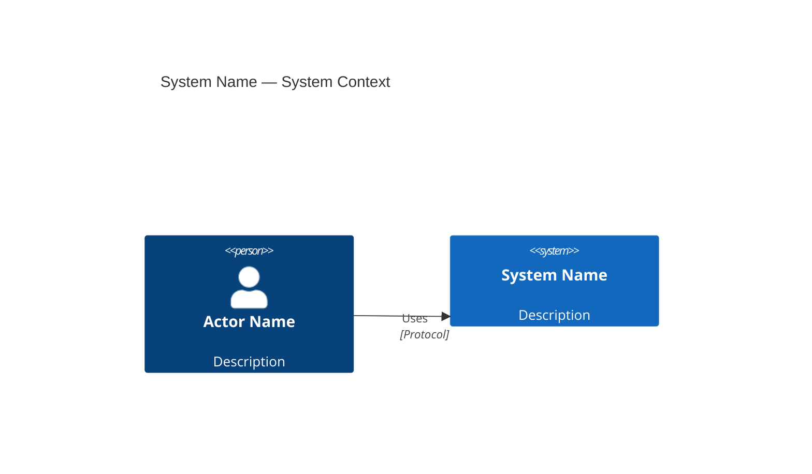
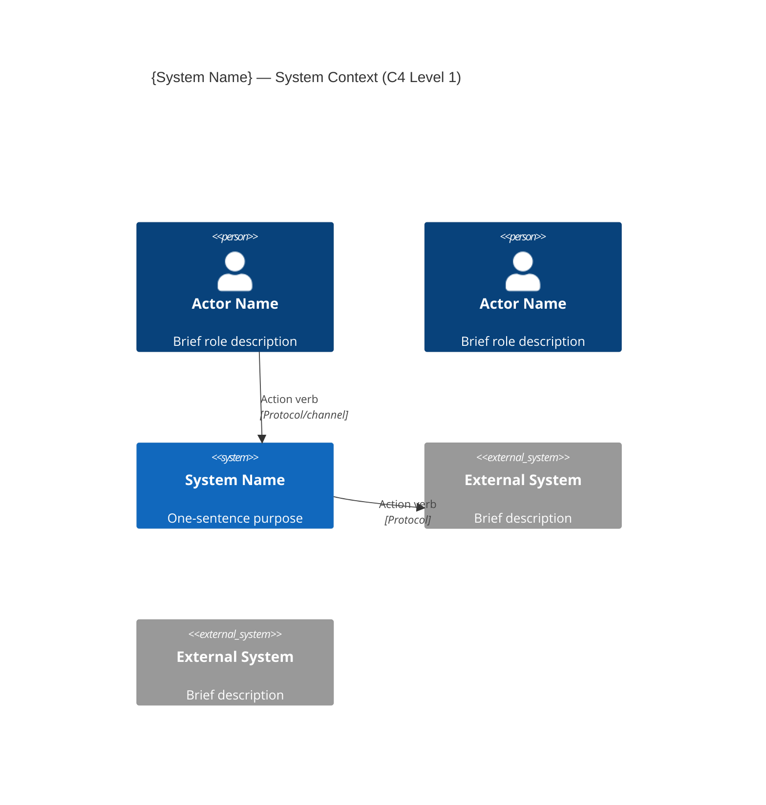
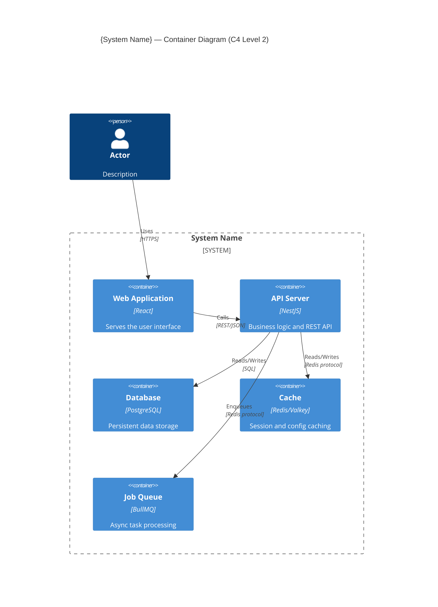
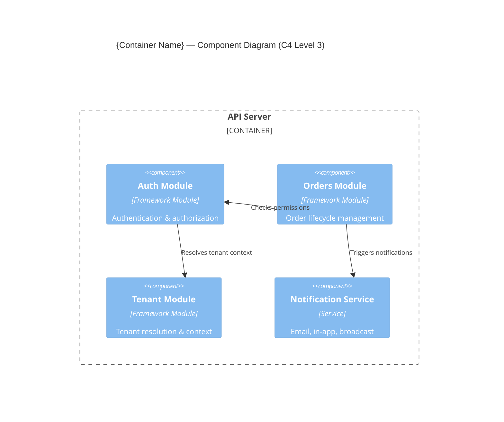
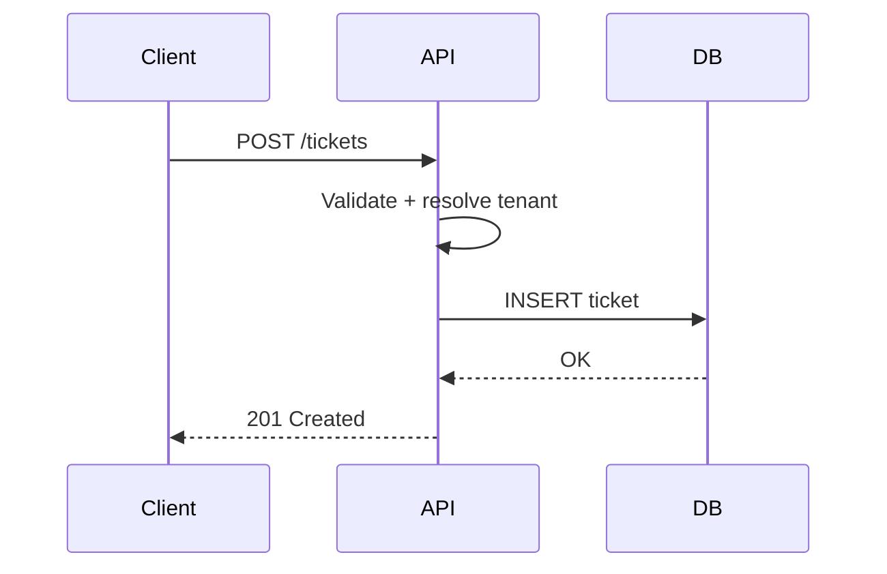
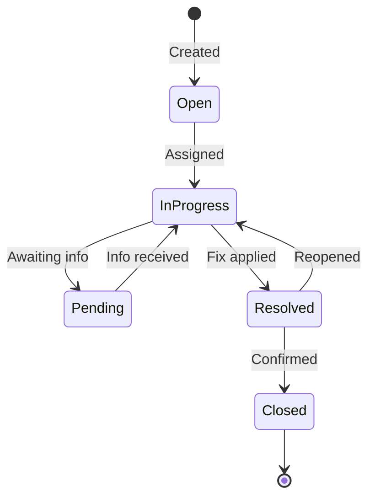

<!-- Copyright (c) 2026 Mohammad Maheri. Licensed under Apache 2.0. See LICENSE. Attribution required - see NOTICE. -->
# Diagram Standards

## Purpose

AI-ADLC produces architectural diagrams at every decomposition level. This document defines the conventions, notation, quality rules, and format requirements for all diagrams produced during the workflow.

---

## C4 Model Overview

AI-ADLC uses the [C4 Model](https://c4model.com/) for progressive architectural decomposition:

```
Level 1: System Context    — The system in its environment (who uses it, what it connects to)
Level 2: Container         — Major deployable/runtime units inside the system
Level 3: Component         — Internal modules/components within a container
Level 4: Code              — (NOT produced by AI-ADLC — this is AI-DLC v1's territory)
```

Each level zooms in from the previous. A reader should be able to understand the system by reading L1 → L2 → L3 in sequence.

---

## Diagram Formats

AI-ADLC supports two diagram formats. Choose based on user preference and platform support:

### Option A: Mermaid (Preferred when platform renders it)



### Option B: ASCII (Universal compatibility)

```
┌──────────────────┐         ┌──────────────────┐
│   Component A    │────────►│   Component B    │
│   (Technology)   │ Protocol│   (Technology)   │
└──────────────────┘         └──────────────────┘
```

**Selection rule:** Use Mermaid as default. Fall back to ASCII if:
- User requests it
- Platform doesn't render Mermaid
- Diagram is too complex for Mermaid's layout engine

**Always provide:** A text narrative below every diagram explaining what it shows. Diagrams are not self-sufficient — they need accompanying explanation.

---

## C4 Level 1: System Context Diagram

### What It Shows
- The system as a single box
- External actors (people) who interact with it
- External systems that integrate with it
- Relationships (who talks to whom, how)

### Mermaid Template



### ASCII Template

```
                        ┌─────────────────────────────────────┐
                        │        SYSTEM BOUNDARY               │
   ┌────────────┐      │                                      │      ┌────────────────┐
   │  Actor 1   │─────►│                                      │─────►│  External Sys  │
   │  (Role)    │ HTTPS│        {System Name}                 │ API  │  (Description) │
   └────────────┘      │                                      │      └────────────────┘
                        │                                      │
   ┌────────────┐      │                                      │      ┌────────────────┐
   │  Actor 2   │─────►│                                      │◄─────│  External Sys  │
   │  (Role)    │ HTTPS│                                      │Events│  (Description) │
   └────────────┘      └─────────────────────────────────────┘      └────────────────┘
```

### Required Accompanying Table

```markdown
## External Actors

| Actor | Description | Interaction |
|-------|-------------|-------------|
| {Name} | {Who they are} | {What they do with the system, via what channel} |

## External Systems

| System | Type | Interaction |
|--------|------|-------------|
| {Name} | {What kind of system} | {Direction + purpose + protocol} |
```

---

## C4 Level 2: Container Diagram

### What It Shows
- The system decomposed into containers (deployable units)
- Each container: name, technology choice, primary responsibility
- Relationships between containers (protocol, data flow)
- External actors/systems from L1 still visible (for context)

### Mermaid Template



### Required Accompanying Table

```markdown
## Containers

| Container | Technology | Responsibility | Scaling |
|-----------|-----------|----------------|---------|
| {Name} | {Tech stack} | {Primary responsibility — 1 sentence} | {How it scales} |
```

### Container Naming Rules

- Name by WHAT it does, not how (✅ "API Server" not ❌ "NestJS App")
- Technology in parentheses or separate column
- One clear responsibility per container (Single Responsibility at deployment level)

---

## C4 Level 3: Component Diagram

### What It Shows
- Internal structure of ONE container (typically the main application)
- Modules, services, or major classes
- Dependencies between components
- External interfaces exposed by each component

### Mermaid Template



### Required Accompanying Table

```markdown
## Components

| Component | Type | Responsibility | Depends On |
|-----------|------|----------------|-----------|
| {Name} | {Module / Service / Library} | {What it does} | {Other components it requires} |
```

### Component Granularity Rules

| Depth Level | Component Granularity |
|-------------|----------------------|
| Minimal | 5-10 major modules with responsibilities |
| Standard | 10-20 components with dependency arrows |
| Comprehensive | 15-30 components + interface contracts + sequence diagrams for key flows |

---

## Relationship Labels

Every arrow/relationship in a diagram MUST have:

1. **Verb** — what action occurs (Uses, Calls, Reads, Writes, Publishes, Subscribes, Queries)
2. **Technology/Protocol** — how the communication happens (REST, gRPC, SQL, WebSocket, AMQP, Event)

**Good examples:**
- `"Calls" "REST/JSON"`
- `"Reads/Writes" "SQL over TCP"`
- `"Publishes events" "AMQP"`
- `"Streams updates" "WebSocket"`

**Bad examples:**
- ❌ `"Connects to"` (too vague — connects how?)
- ❌ No label at all (what flows between them?)
- ❌ `"API"` alone (what kind? REST? gRPC? GraphQL?)

---

## Color/Style Conventions (for Mermaid)

| Element Type | C4 Type | Typical Color |
|-------------|---------|:-------------:|
| Person (actor) | Person | Blue |
| Internal system/container | System / Container | Blue |
| External system | System_Ext | Gray |
| Database | ContainerDb | Blue with DB icon |
| Message queue | ContainerQueue | Blue with queue icon |
| System boundary | System_Boundary | Dashed border |

---

## Diagram Quality Checklist

Apply to EVERY diagram before saving:

- [ ] Title present and matches document context
- [ ] Every element has a name AND description
- [ ] Every relationship has a verb AND protocol
- [ ] No orphan nodes (everything connected to at least one other element)
- [ ] Technology labels are specific (not generic)
- [ ] Consistent naming with other diagrams (same system = same name everywhere)
- [ ] Direction of arrows is meaningful (caller → callee, or data flow direction)
- [ ] Diagram is not too crowded (max ~15 elements per diagram; split if larger)
- [ ] Text narrative below explains what the diagram shows
- [ ] Accompanying table provides details the diagram can't show

---

## Diagram Consistency Across Levels

| Rule | Enforcement |
|------|------------|
| L1 system = the boundary box in L2 | Everything inside L2 must be inside L1's system |
| L2 containers = the boundary boxes in L3 | L3 zooms into exactly one L2 container |
| External systems in L1 = those referenced in L2/L3 | Same names, same descriptions |
| Technology in L2 = technology in ADRs | If ADR says PostgreSQL, L2 must say PostgreSQL (not "Database") |
| Actor names consistent L1-L2 | Same actor, same name, same description |

---

## Supplementary Diagrams (Optional)

Beyond C4, AI-ADLC may produce these when depth requires:

| Diagram Type | When Used | Format |
|-------------|-----------|--------|
| **Sequence diagram** | Complex interaction flows (auth flow, ticket lifecycle) | Mermaid `sequenceDiagram` |
| **Deployment diagram** | Physical/virtual infrastructure topology | ASCII or Mermaid |
| **Data flow diagram** | Sensitive data pathways (for security architecture) | ASCII |
| **Entity relationship (ERD)** | Core data model relationships | Mermaid `erDiagram` or ASCII |
| **State diagram** | Workflow/ticket state machines | Mermaid `stateDiagram-v2` |

### Sequence Diagram Template



### State Diagram Template



---

## Diagram Don'ts

| Don't | Why | Do Instead |
|-------|-----|-----------|
| Diagram without narrative | Readers may misinterpret | Always add explanatory text below |
| Too many elements (>15) | Unreadable; cognitive overload | Split into multiple diagrams |
| Generic labels ("Service A") | Meaningless to readers | Use real names and technologies |
| Mixing abstraction levels | Confuses L2 with L3 concepts | One level per diagram |
| Arrows without labels | Ambiguous communication | Always label with verb + protocol |
| Inconsistent naming | "API Server" in L2 but "Backend" in L3 | Same name everywhere |
| Screenshot of a whiteboard | Not version-controllable | Use text-based notation |
