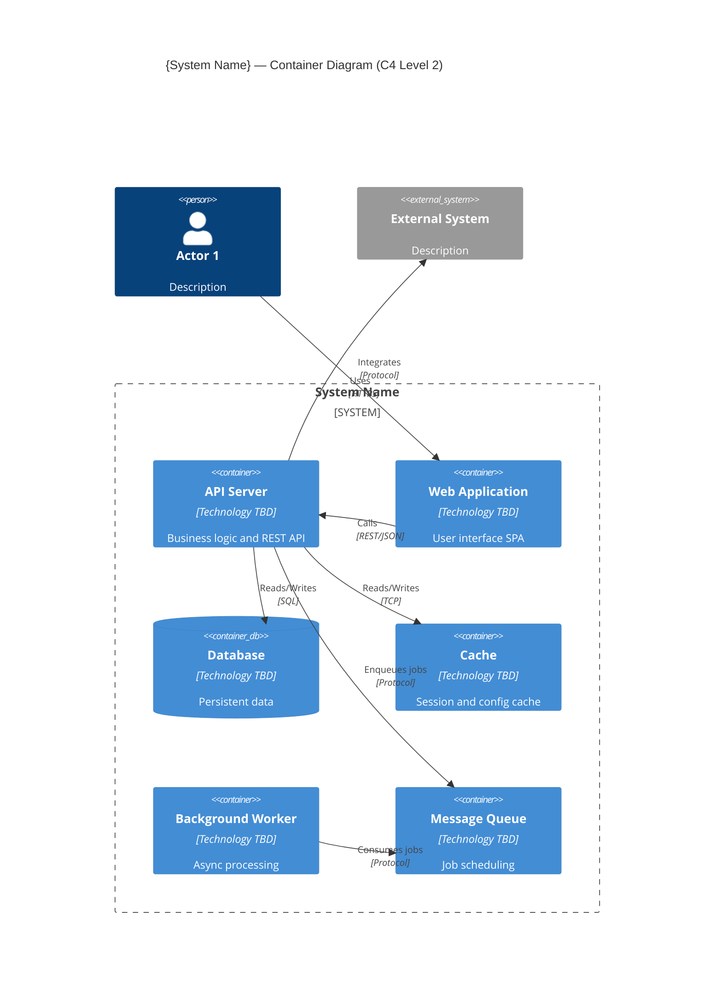

<!-- Copyright (c) 2026 Mohammad Maheri. Licensed under Apache 2.0. See LICENSE. Attribution required - see NOTICE. -->
# Container Design (C4 Level 2)

## Stage: 5 of 13
## Phase: 🟠 DECOMPOSITION
## Execution: ALWAYS

---

## Purpose

Decompose the system (the single box from C4 L1) into its major **containers** — the independently deployable/runnable units that make up the system. Each container is a separately running process or deployment unit: an application, a database, a cache, a message queue, a background worker, etc.

**CTO Mindset:** "What are the big runtime pieces? What deploys independently? What has its own process boundary?"

---

## MANDATORY: Stage Sub-Role — Systems Engineer

During THIS stage, ALSO adopt the mindset of a **Systems Engineer**. This does NOT replace your primary role (CTO / Chief Architect) — it ADDS a thinking dimension.

### Behavioral Shifts
- Define each container as an independently deployable unit with a clear responsibility boundary and scaling story
- Map inter-container communication explicitly: synchronous (creates coupling) vs. asynchronous (decouples)
- Identify fault domains — "if this container fails, what else fails?" — and isolate where possible
- Challenge co-location of responsibilities — "must these be in the same container, or are they separate for a reason?"

### Anti-Patterns for This Stage
- Do NOT group by technical layer (API container, DB container) — group by business capability
- Do NOT assume synchronous REST between all containers — justify sync vs. async for each connection

### Quality Check
A good output at this stage sounds like:
- "5 containers identified: each with responsibility, technology, scaling strategy, and failure isolation; 3 sync + 2 async inter-container links, each justified..."

---

## Depth Adaptation

| Depth | Container Design Behavior |
|-------|--------------------------|
| **Minimal** | Identify containers by type (app, DB, cache). Brief responsibility per container. Single diagram. Minimal relationship detail. |
| **Standard** | Full C4 L2 diagram with technology labels. Container table with responsibility, technology, and scaling. Relationship table with protocol and data flow direction. |
| **Comprehensive** | Multiple diagram views (runtime, deployment, data flow). Container capacity analysis. Detailed inter-container communication (sync/async, payload, frequency). Container failure modes and fallback behavior. |

---

## Step-by-Step Execution

### Step 1: Load Context

1. System Context document (Stage 4) — actors, external systems, relationships
2. Architecture Vision (Stage 3) — principles (especially: monolith vs. microservices, deployment constraints)
3. Requirements Summary (Stage 2) — functional domains, scale targets, NFRs
4. State file — constraints, principles

---

### Step 2: Determine Decomposition Strategy

Before identifying containers, decide the structural approach:

```markdown
### Q-DEC-02: Decomposition Strategy

**Context:** The system needs to be split into runtime units. The approach fundamentally affects complexity, team coordination, and deployment.

**Options:**
- (a) **Modular Monolith** — Single deployable application with strong internal module boundaries. Shared database. Simplest operations.
- (b) **Service-Oriented** — 2-5 coarse-grained services with clear bounded contexts. Separate deployments, possibly shared database.
- (c) **Microservices** — Many small, independently deployable services. Each owns its data. Complex operations but maximum independence.
- (d) **Hybrid** — Monolith core with extracted services for specific concerns (e.g., async workers, real-time, integrations).

**Decision Drivers:**
- Team size: {n} FTE (from Stage 2)
- Principle: {reference relevant principle — e.g., "P5: Modular Monolith First"}
- Scale requirements: {summary}
- Deployment constraint: {on-prem/cloud/hybrid}

**Recommended:** {option}
**Rationale:** {Reference team size, operational complexity tolerance, principles. A team of <20 rarely benefits from microservices. On-prem deployment favors fewer moving parts.}

→ _This decision generates ADR-{nnn}_

**Your Decision:** _[awaiting input]_
```

**If principles already dictate this (e.g., "P5: Modular Monolith First"):** Skip the question and confirm: "Per Principle P5, we're using a modular monolith approach. Confirmed?"

---

### Step 3: Identify Containers

Based on the decomposition strategy, identify all runtime containers:

#### Container Categories

| Category | What It Is | Examples |
|----------|-----------|---------|
| **Application** | Code that runs business logic | API server, web app, worker process |
| **Web/UI** | Frontend application served to users | SPA, static site, server-rendered app |
| **Data Store** | Persistent storage | RDBMS, document DB, graph DB |
| **Cache** | Fast temporary storage | Redis, Memcached, Valkey |
| **Search** | Full-text search index | Elasticsearch, Meilisearch, OpenSearch |
| **Queue/Broker** | Message passing / job scheduling | RabbitMQ, Redis queues, Kafka |
| **File Storage** | Binary/document storage | MinIO, local filesystem, NFS |
| **Proxy/Gateway** | Traffic routing and TLS | Nginx, HAProxy, API gateway |
| **Background Worker** | Async processing | Email sender, report generator, AI caller |

#### Container Identification Process

For each functional domain (from Stage 2), ask:
1. Does this need its own runtime process? Or can it be a module within an existing container?
2. Does this have different scaling characteristics? (If yes → separate container)
3. Does this have different technology requirements? (If yes → separate container)
4. Does this have different deployment cadence? (If yes → consider separation)

**Produce the container list:**

```markdown
## Containers

| # | Container | Type | Responsibility | Technology (TBD) | Scaling Model |
|---|-----------|------|---------------|:----------------:|:-------------:|
| 1 | {name} | {Application/DataStore/Cache/etc.} | {What it does — 1 sentence} | _[Stage 6]_ | {Horizontal/Vertical/N/A} |
```

**Rules:**
- Name by RESPONSIBILITY, not technology ("API Server" not "NestJS App")
- Technology column left as TBD (filled in Stage 6 — Technology Stack)
- Each container has ONE clear primary responsibility
- If a container does too many things → consider splitting
- Include infrastructure containers (database, cache, queue) — they're real deployment units

---

### Step 4: Define Container Responsibilities

For each container, clearly document:

```markdown
### {Container Name}

| Attribute | Detail |
|-----------|--------|
| **Type** | {Application / Data Store / Cache / Queue / UI / Worker / Proxy} |
| **Primary Responsibility** | {One sentence — what it does and why it exists separately} |
| **Secondary Responsibilities** | {Additional things it handles, if any} |
| **Data Owned** | {What data this container is authoritative for} |
| **Scaling** | {How it scales — horizontal (add instances) / vertical (add resources) / fixed} |
| **Statefulness** | {Stateless (can restart/scale freely) / Stateful (needs persistence)} |
| **Availability Requirement** | {Must be HA / Can tolerate brief downtime / Background (eventually consistent)} |
```

---

### Step 5: Define Inter-Container Relationships

Map how containers communicate with each other:

```markdown
## Container Relationships

| From | To | Communication | Pattern | Data/Purpose |
|------|----|:-------------:|---------|-------------|
| {Container A} | {Container B} | {Sync REST / Async Queue / Direct DB / WebSocket / Event} | {Request-Response / Pub-Sub / Fire-and-Forget / Streaming} | {What flows between them} |
```

**Communication patterns to consider:**

| Pattern | When to Use | Trade-off |
|---------|-------------|-----------|
| **Synchronous (REST/gRPC)** | Caller needs immediate response | Coupling; cascading failure risk |
| **Asynchronous (Queue)** | Work can be deferred; fire-and-forget | Complexity; eventual consistency |
| **Event-driven (Pub/Sub)** | Multiple consumers; loose coupling | Event schema management; ordering |
| **Shared Database** | Monolith; same bounded context | Tight coupling but simple |
| **Streaming (WebSocket/SSE)** | Real-time updates to clients | Connection management; scaling |

---

### Step 6: Map Actors and Externals to Containers

Show which container each actor/external system communicates with:

```markdown
## External Communication Mapping

| External Entity | Communicates With (Container) | Protocol | Direction |
|----------------|:-----------------------------:|----------|:---------:|
| {Actor 1 — from L1} | {Container name} | {HTTPS, etc.} | Inbound |
| {External System 1 — from L1} | {Container name} | {Protocol} | {In/Out/Both} |
```

**Validation:** Every actor and external system from Stage 4 MUST map to at least one container. If something from L1 has no container to talk to, either a container is missing or the L1 was wrong.

---

### Step 7: Produce C4 Level 2 Diagram

Following `common/diagram-standards.md`:



**Diagram rules:**
- [ ] System boundary box contains ALL containers
- [ ] Actors and external systems from L1 shown OUTSIDE the boundary
- [ ] Every container has: name, type label, responsibility description
- [ ] Technology labels show "TBD" if Stage 6 hasn't been done yet
- [ ] Relationship arrows labeled with protocol
- [ ] Max 15 elements in one diagram; split if larger

---

### Step 8: Identify Key Architecture Decisions

During container design, decisions arise that need ADRs. Common ones:

| Decision | ADR Trigger |
|----------|:----------:|
| Monolith vs. services | ✅ (if not already decided in Step 2) |
| Number of UI applications (1 vs. many) | ✅ if debated |
| Shared database vs. database-per-service | ✅ |
| Sync vs. async communication patterns | ✅ if significant trade-off |
| Queue/broker selection approach | Usually deferred to Stage 6 |

Produce ADRs for any decisions made. Log in state file ADR register.

---

### Step 9: Update State File

Store the container list in state (used by all subsequent stages):

```markdown
## Containers (from Stage 5)

| Container | Type | Responsibility |
|-----------|------|---------------|
| {name} | {type} | {responsibility} |
```

---

### Step 10: Present for Review

```markdown
## Review: Container Design (C4 Level 2) — {system_name}

I've decomposed the system into its major containers.

**Decomposition strategy:** {Monolith / Service-Oriented / Microservices / Hybrid}

**Containers identified ({n}):**
| # | Container | Type | Responsibility |
|---|-----------|------|---------------|
{container table}

**Communication patterns:**
- Sync (REST): {n} relationships
- Async (Queue): {n} relationships
- Real-time (WebSocket): {n} relationships

**Key design observations:**
- {Observation 1 — e.g., "Single application container with 3 separate UIs"}
- {Observation 2 — e.g., "Background worker decoupled for AI and email processing"}
- {Observation 3 — e.g., "Cache layer critical for multi-tenant config performance"}

**ADRs produced this stage:** {n}

**Full document:** Saved to `{file_path}`

---

**Your response:**
- (a) **Approve** — Container structure is right; proceed to Technology Stack
- (b) **Split a container** — {X} should be two separate containers
- (c) **Merge containers** — {X} and {Y} should be one container
- (d) **Add a container** — Missing a runtime unit
- (e) **Challenge communication** — Sync/async patterns need revision
```

---

### Step 11: Log and Transition

1. Update state: Stage 5 = ✅ Done; Current Phase = DECISIONS; Current Stage = 6
2. Update Architecture Workbook: session log
3. Log ADRs produced

Display:

```
✅ Stage 5: Container Design (C4 L2) — Complete

📦 Containers: {n} | 🔗 Relationships: {n} | 📐 ADRs: {n}
📄 Saved to: {file_path}

━━━━━━━━━━━━━━━━━━━━━━━━━━━━━━━━━━━━━━━━━━━━━━━━━━━
✅ DECOMPOSITION PHASE COMPLETE (Stages 4-5)
━━━━━━━━━━━━━━━━━━━━━━━━━━━━━━━━━━━━━━━━━━━━━━━━━━━

System shape defined: {n} actors, {m} externals, {p} containers.
Now we select the technology and lock key patterns.

Next → DECISIONS PHASE
Stage 6: Technology Stack Selection

Proceeding...
```

---

## Output File

Save to:
- Numbered: `{output_root}/03_Container_Diagram_C4L2.md`
- Phase folders: `{output_root}/decomposition/Container_Diagram_C4L2.md`

---

## Container Design Quality Checks

| Check | Pass Criteria |
|-------|---------------|
| Single Responsibility | Each container has one clear purpose |
| Complete mapping | Every L1 actor/external maps to at least one container |
| No orphans | Every container participates in at least one relationship |
| Scaling clarity | Each container's scaling model is stated |
| Communication labeled | Every relationship has protocol and pattern |
| Principle compliance | Decomposition aligns with architecture principles |
| Constraint compliance | No container requires infrastructure that violates constraints |
| Reasonable count | Not too few (<3 suggests under-decomposition) or too many (>20 suggests premature microservices) |
