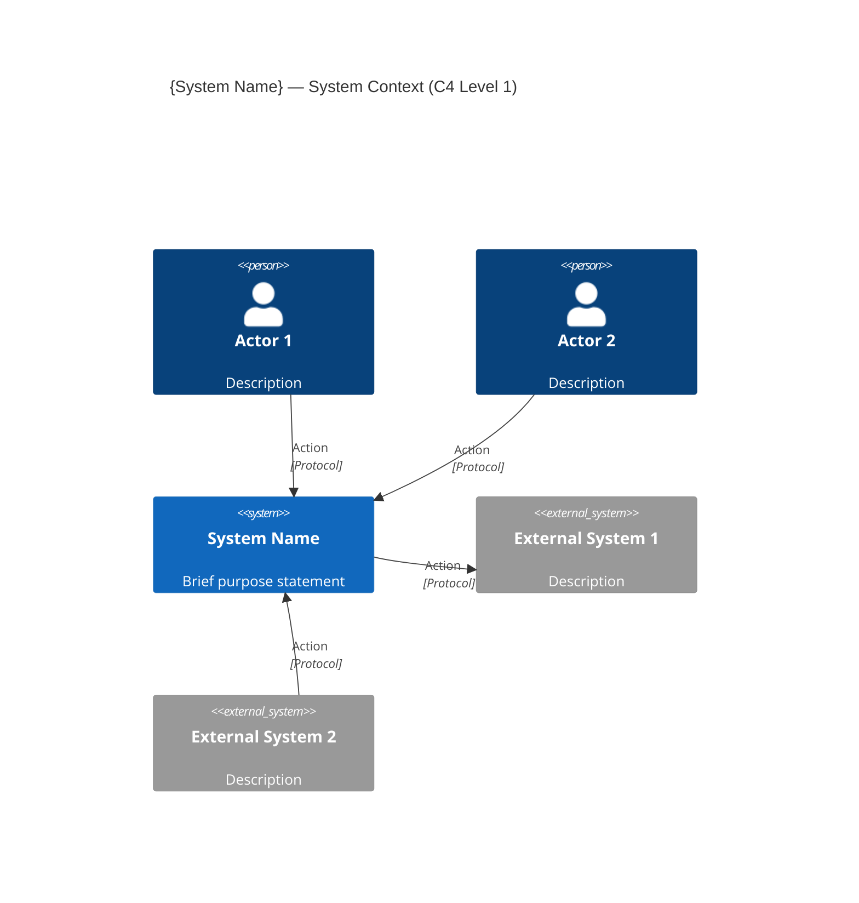

# System Context (C4 Level 1)

## Stage: 4 of 13
## Phase: 🟠 DECOMPOSITION
## Execution: ALWAYS

---

## Purpose

Define the system boundary — what is INSIDE our system and what is OUTSIDE. Identify all external actors (people) and external systems that interact with it. This is the highest-level architectural view and sets the scope for everything that follows.

**CTO Mindset:** "Before I design internals, I need to be crystal clear about what crosses the boundary."

---

## MANDATORY: Stage Sub-Role — Systems Engineer

During THIS stage, ALSO adopt the mindset of a **Systems Engineer**. This does NOT replace your primary role (CTO / Chief Architect) — it ADDS a thinking dimension.

### Behavioral Shifts
- Define what's OUTSIDE before detailing what's inside — the boundary is the deliverable, not internals
- For every external actor/system, define the interface contract: protocol, direction, data, trust level, failure mode
- Challenge every element at the boundary — "does this NEED to be external, or have we drawn the line in the wrong place?"
- Classify dependencies by criticality: hard (blocks function) vs. soft (degrades gracefully)

### Anti-Patterns for This Stage
- Do NOT jump into container decomposition — L1 must be stable before L2 begins
- Do NOT list integrations without specifying what crosses the boundary (data, frequency, direction)

### Quality Check
A good output at this stage sounds like:
- "System boundary defined: 4 external actors, 6 external systems; each with protocol, data flow direction, criticality tier, and failure impact noted..."

---

## Depth Adaptation

| Depth | System Context Behavior |
|-------|------------------------|
| **Minimal** | List actors and external systems. Simple diagram. Brief relationship descriptions (protocol only). |
| **Standard** | Full C4 L1 diagram with narrative. Actors table with interaction descriptions. External systems table with direction, protocol, and data exchanged. |
| **Comprehensive** | Detailed C4 L1 with all data flows documented. Actor journey descriptions. External system criticality analysis. Failure impact per integration point. SLA requirements per external dependency. |

---

## Step-by-Step Execution

### Step 1: Load Context

1. Architecture Requirements Summary (Stage 2) — functional domains, integrations, actors
2. Architecture Vision (Stage 3) — constraints, principles
3. State file — confirmed scope and drivers

---

### Step 2: Define the System Boundary

Clearly state what is INSIDE vs. OUTSIDE:

```markdown
## System Boundary Definition

**The System:** {system_name} — {1-sentence description}

**Inside the boundary (we build and control):**
- {Component/capability 1}
- {Component/capability 2}
- {All internally-owned deployable pieces}

**Outside the boundary (we integrate with but don't own):**
- {External system 1}
- {External system 2}
- {Infrastructure we use but don't build — OS, network, DNS}
```

**Boundary decisions to make:**

| Question | Implication |
|----------|------------|
| Does the reverse proxy / load balancer belong inside? | Usually outside — it's infrastructure, not application |
| Does the database belong inside? | Usually inside — we define and own the schema |
| Does the AI/ML platform belong inside? | Depends — if separately maintained, it's external |
| Does monitoring infrastructure belong inside? | Usually outside — it observes us but we don't build it |
| Does the identity provider belong inside? | If we build auth: inside. If federated SSO: external |

If boundary is ambiguous, ask:

```markdown
### Q-DEC-01: System Boundary — {Ambiguous Component}

**Context:** {Component} could be considered part of our system or an external system we integrate with. The distinction affects who owns it, who builds it, and how we interface with it.

**Options:**
- (a) **Inside** — We build/own it; it's part of our codebase and deployment
- (b) **Outside** — It's separately managed; we integrate via API/protocol
- (c) **Boundary service** — We build the adapter/interface layer; the core is external

**Recommended:** {option}
**Rationale:** {why}

**Your Decision:** _[awaiting input]_
```

---

### Step 3: Identify External Actors (People)

List all human roles that interact directly with the system:

```markdown
## External Actors

| # | Actor | Description | Interaction with System | Channel |
|---|-------|-------------|------------------------|---------|
| 1 | {Role name} | {Who they are — 1 sentence} | {What they do with the system} | {How — browser, API, mobile, etc.} |
```

**Actor identification checklist:**
- [ ] End users (who uses the primary functionality?)
- [ ] Administrators (who configures/manages the system?)
- [ ] Managers/supervisors (who monitors/reports?)
- [ ] External partners (who integrates from outside?)
- [ ] Support/operations (who operates the infrastructure?)
- [ ] Different permission levels of the same role?

**Rules:**
- Actors are ROLES, not named individuals
- Each actor has a distinct interaction pattern (if two roles do the same thing, merge them)
- Consider: does one person play multiple actor roles? (Yes is fine — list the roles separately)
- Include only actors who interact with the SYSTEM directly (not via another actor)

---

### Step 4: Identify External Systems

List all systems that communicate with ours:

```markdown
## External Systems

| # | System | Type | Direction | Protocol | Data Exchanged | Criticality |
|---|--------|------|:---------:|----------|----------------|:-----------:|
| 1 | {Name} | {Category} | {In/Out/Bidirectional} | {Protocol} | {What flows} | {Critical/Important/Optional} |
```

**Direction:**
- **Inbound** — External system sends data TO us (we consume)
- **Outbound** — We send data TO external system (we produce)
- **Bidirectional** — Both directions

**Criticality:**
- **Critical** — System cannot function without this integration
- **Important** — Significant functionality depends on it
- **Optional** — Enhances capability but system works without it

**External system categories:**
- Identity/Directory (LDAP, AD, SSO providers)
- Communication (Email, SMS, push notification services)
- Monitoring/Observability (alerting tools, log collectors)
- AI/ML platforms (classification, NLP, recommendation)
- Storage (file systems, object stores — if external)
- Data sources (feeds, imports, discovery tools)
- Downstream consumers (webhooks, event subscribers)
- Infrastructure services (DNS, reverse proxy, load balancer, certificate management)

---

### Step 5: Define Relationships

For each actor→system and system→external relationship, define:

```markdown
## Relationships

| From | To | Action/Verb | Technology | Data/Purpose |
|------|----|-------------|-----------|--------------|
| {Actor/System} | {System/External} | {What happens — verb} | {Protocol/channel} | {What crosses the boundary} |
```

**Relationship quality rules:**
- Every actor must have at least one relationship TO the system
- Every external system must have at least one relationship WITH the system
- Relationships have a VERB (not just "connects to")
- Technology/protocol is specified (HTTPS, REST, LDAP, SMTP, WebSocket, etc.)
- Data description tells WHAT crosses the boundary

---

### Step 6: Produce C4 Level 1 Diagram

Following `common/diagram-standards.md`, produce the context diagram:

**Mermaid format:**



**Diagram validation:**
- [ ] System is a single box (we're at L1 — no internals shown)
- [ ] All actors from table are in the diagram
- [ ] All external systems from table are in the diagram
- [ ] All relationships are labeled (verb + protocol)
- [ ] No orphan elements
- [ ] Title is correct

**If diagram exceeds 15 elements:** Split into multiple diagrams by actor category (e.g., "User-facing Context" and "Integration Context").

---

### Step 7: Narrative Description

Below the diagram, provide a narrative that explains:

1. What the system does (from the outside looking in)
2. Who uses it and how
3. What it depends on (critical external systems)
4. What consumes from it (downstream systems)
5. Key communication patterns (sync vs. async, real-time vs. batch)

**Length:** 3-5 paragraphs for Standard depth.

---

### Step 8: Identify Architecture Questions for Workbook

During context analysis, questions may arise that belong in later stages. Log them:

```markdown
### Questions for Later Stages

| Question | Target Stage | Priority |
|----------|:------------:|:--------:|
| "How do we handle failover for {external system}?" | Stage 11 (Infrastructure) | Medium |
| "What auth protocol does {external} support?" | Stage 8 (Security) | High |
```

Add these to the Architecture Workbook.

---

### Step 9: Assemble Document

Using template `templates/system-context.md`, compile:

1. System Boundary Definition
2. External Actors (table)
3. External Systems (table)
4. Relationships (table)
5. C4 Level 1 Diagram (Mermaid or ASCII)
6. Narrative Description
7. Notes for Later Stages (if any)

**Validate:**
- [ ] Every functional domain (from Stage 2) is implicitly inside the system boundary
- [ ] Every integration point (from Stage 2) has a corresponding external system
- [ ] No external system violates a constraint (e.g., cloud service when on-prem only)
- [ ] Actors match user types from requirements
- [ ] System description aligns with vision statement (Stage 3)

---

### Step 10: Present for Review

```markdown
## Review: System Context (C4 Level 1) — {system_name}

I've defined the system boundary and context.

**System shape:**
- **Actors:** {n} external roles interact with the system
- **External systems:** {n} integrations identified
- **Relationships:** {n} communication paths mapped
- **Criticality:** {n} critical dependencies

**Key observations:**
- {Observation 1 — e.g., "Heavy integration surface — 8 external systems"}
- {Observation 2 — e.g., "All actors access via browser — no native app clients"}
- {Observation 3 — e.g., "AI platform is optional — system works without it"}

**Full document:** Saved to `{file_path}`

---

**Your response:**
- (a) **Approve** — System boundary is correct; proceed to Container Design
- (b) **Adjust boundary** — Some items should be inside/outside that aren't
- (c) **Add actors** — Missing user roles
- (d) **Add integrations** — Missing external systems
- (e) **Challenge relationships** — Communication patterns need revision
```

---

### Step 11: Log and Transition

1. Update state: Stage 4 = ✅ Done; Current Stage = 5
2. Update state: Note actor count and external system count (used for consistency in later stages)
3. Update Architecture Workbook with any open questions identified

Display:

```
✅ Stage 4: System Context (C4 L1) — Complete

👥 Actors: {n} | 🔌 External systems: {n} | 🔗 Relationships: {n}
📄 Saved to: {file_path}

Next → Stage 5: Container Design (C4 Level 2)
I'll decompose the system into its major deployable containers.

Proceeding...
```

---

## Output File

Save to:
- Numbered: `{output_root}/02_System_Context_C4L1.md`
- Phase folders: `{output_root}/decomposition/System_Context_C4L1.md`

---

## Context Diagram Quality Checks

| Check | Pass Criteria |
|-------|---------------|
| Clear boundary | Unambiguous what's inside vs. outside |
| Complete actors | All user types from requirements represented |
| Complete externals | All integration points from Stage 2 represented |
| Labeled relationships | Every arrow has verb + protocol |
| No internals shown | System is a single box (this is L1, not L2) |
| Constraint-compliant | No external system violates constraints |
| Consistency | Actor/system names match requirements terminology |
| Criticality assessed | Each external system rated Critical/Important/Optional |
