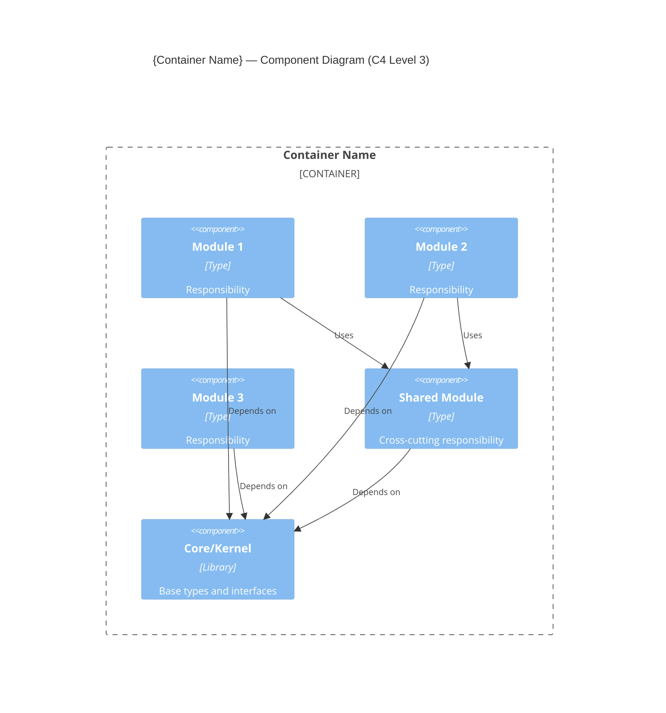
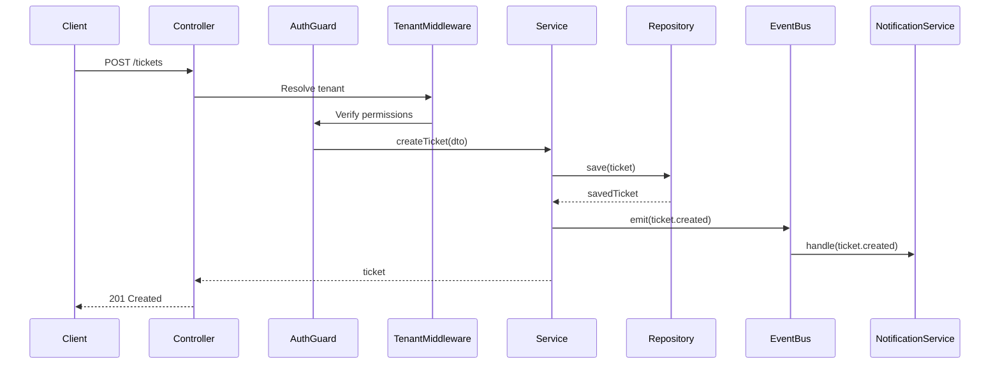

# Component Design (C4 Level 3)

## Stage: 12 of 13
## Phase: 🟢 DESIGN
## Execution: ALWAYS

---

## Purpose

Decompose the main containers (from C4 L2) into their internal components — modules, services, and key interfaces. Define module boundaries, dependency rules, and cross-cutting concern propagation. This is the most detailed architectural level before code — developers build from this.

**CTO Mindset:** "This is where architecture meets implementation. The module boundaries I define here determine team autonomy, code maintainability, and change propagation for years."

---

## MANDATORY: Stage Sub-Role — Systems Engineer

During THIS stage, ALSO adopt the mindset of a **Systems Engineer**. This does NOT replace your primary role (CTO / Chief Architect) — it ADDS a thinking dimension.

### Behavioral Shifts
- Define module boundaries by responsibility, NOT by technical layer — each module should have a single reason to change
- Specify dependency rules explicitly — what can depend on what; what MUST NOT depend on what
- Design for team autonomy — module boundaries should map to team ownership boundaries where possible
- Think about the "change propagation" test: if requirement X changes, how many modules need modification?

### Anti-Patterns for This Stage
- Do NOT create modules so fine-grained they have no meaning — a component should be large enough to own a coherent responsibility
- Do NOT allow circular dependencies between modules — they destroy independent deployability

### Quality Check
A good output at this stage sounds like:
- "Main container: 8 components; dependency rules: domain → never depends on infra; 2 cross-cutting concerns (auth, logging) injected via ports; change propagation: typical business change touches 1-2 modules..."

---

## Depth Adaptation

| Depth | Component Detail |
|-------|-----------------|
| **Minimal** | Module list with responsibilities and key dependencies. One diagram covering the main container. 5-10 components. |
| **Standard** | Module diagram + interface contracts + dependency rules + cross-cutting concerns. Per-container if multiple app containers. 10-20 components. |
| **Comprehensive** | Detailed module internals + sequence diagrams for key flows + DDD tactical patterns + dependency inversion points + extension mechanisms. 15-30 components. |

---

## Step-by-Step Execution

### Step 1: Load Context

1. Container list (Stage 5) — which containers to decompose
2. Technology stack (Stage 6) — framework module system (NestJS modules, Spring packages, etc.)
3. Multi-tenancy (Stage 7) — how tenant context propagates through components
4. Security (Stage 8) — where auth/authz guards sit in component hierarchy
5. Data architecture (Stage 9) — entity ownership per module
6. API architecture (Stage 10) — which modules expose API endpoints
7. Functional domains (Stage 2) — business capability groupings
8. Principles (Stage 3) — modularity principles

---

### Step 2: Determine Decomposition Approach

```markdown
### Q-DSG-04: Module Decomposition Strategy

**Context:** Components within a container can be organized by different principles. The right approach depends on domain complexity and team structure.

**Options:**
- (a) **Domain-Driven (Bounded Contexts)** — Modules aligned to business domains. Each module owns its entities, services, and APIs. Minimal cross-domain dependencies.
- (b) **Layer-Based** — Traditional layers: Controller → Service → Repository. Cross-cutting modules for shared concerns.
- (c) **Feature-Based** — Modules organized by user-facing feature. Each feature contains its own controller, service, and data access.
- (d) **Hybrid (DDD + Layers within)** — Top-level by domain/bounded context; internal structure per module is layered. Most common for complex systems.

**Recommended:** {Based on domain complexity, team structure, framework conventions}
**Rationale:** {Why — reference principles, team familiarity, scalability of approach}

**Your Decision:** _[awaiting input]_
```

---

### Step 3: Identify Modules/Components

For each container that warrants decomposition (typically the main application container):

```markdown
## Components — {Container Name}

### Domain Modules (Business Capabilities)

| # | Module | Bounded Context | Responsibility | Owns Entities | Exposes API? |
|---|--------|:--------------:|----------------|---------------|:------------:|
| 1 | {Module name} | {Domain} | {What it does — 1 sentence} | {Key entities it owns} | {Yes/No} |
| 2 | {Module name} | {Domain} | {Responsibility} | {Entities} | {Yes/No} |

### Platform/Shared Modules (Cross-Cutting)

| # | Module | Responsibility | Used By |
|---|--------|---------------|---------|
| 1 | {Module name} | {What cross-cutting concern it handles} | {All / Specific modules} |
| 2 | {Module name} | {Responsibility} | {Who uses it} |
```

**Module identification guidelines:**

| Signal | Implication |
|--------|------------|
| Distinct business domain | → Own module (e.g., Orders, Payments, Inventory) |
| Shared data/logic used by many | → Shared/platform module (e.g., Tenant, Auth, Notification) |
| Different rate of change | → Separate modules (things that change together stay together) |
| Different team ownership | → Module boundary = team boundary |
| Different data ownership | → Module owns its entities exclusively |
| Technical concern (not business) | → Infrastructure/platform module (e.g., Logging, Cache, Queue) |

---

### Step 4: Define Module Boundaries & Dependency Rules

```markdown
## Module Dependency Rules

### Allowed Dependencies

```
┌─────────────────────────────────────────────────────────┐
│                    DEPENDENCY DIRECTION                    │
│                                                           │
│  Domain Modules ────────► Shared/Platform Modules         │
│  (Orders, Payments, etc.)    (Auth, Tenant, Notification)│
│                                                           │
│  Domain Module A ─ ─ ─ ─ ✗ ─ ─ ─ ─ Domain Module B      │
│  (No direct dependency between domain modules)            │
│                                                           │
│  All Modules ────────► Core/Kernel Module                 │
│  (Base types, interfaces, utilities)                      │
└─────────────────────────────────────────────────────────┘
```

### Dependency Rules

| Rule | Description |
|------|-------------|
| **No circular dependencies** | Module A → B → A is forbidden |
| **Domain modules don't depend on each other directly** | Communication via events, shared interfaces, or orchestration layer |
| **Shared modules don't depend on domain modules** | Shared is the foundation; domain is the application |
| **All modules depend on core/kernel** | Base types, DTOs, exceptions, interfaces live here |
| **External access via adapters only** | No module directly calls external system SDK — goes through adapter interface |

### Inter-Module Communication

| Pattern | When Used | Example |
|---------|-----------|---------|
| **Direct method call** | Same module; strongly related | Service → Repository (within module) |
| **Interface / Contract** | Cross-module; loose coupling needed | OrdersModule uses NotificationInterface (not NotificationService directly) |
| **Event / Message** | Cross-domain; eventual consistency OK | Order.completed → triggers Fulfillment.ship event |
| **Orchestrator / Saga** | Multi-module transaction coordination | ChangeApproval orchestrates Notification + Workflow + Audit |
```

---

### Step 5: Define Module Interfaces (Standard/Comprehensive depth)

For key modules, define the public interface (what other modules can call):

```markdown
## Module Interfaces

### {Module Name} — Public API

| Method / Endpoint | Input | Output | Called By |
|------------------|-------|--------|-----------|
| `{method_name}` | {Parameters / DTO} | {Return type} | {Which modules call this} |
| `{method_name}` | {Input} | {Output} | {Callers} |

**Events Emitted:**
| Event | Payload | When Triggered |
|-------|---------|:-------------:|
| `{event.name}` | `{ relevant fields }` | {When this event fires} |

**Events Consumed:**
| Event | Source | Handler Action |
|-------|--------|:-------------:|
| `{event.name}` | {Module} | {What happens when received} |
```

---

### Step 6: Define Cross-Cutting Concerns

```markdown
## Cross-Cutting Concerns

### How Each Concern Propagates Through Components

| Concern | Mechanism | Where Enforced |
|---------|-----------|:-------------:|
| **Tenant context** | {Middleware injects → decorators access → ORM scopes} | Request lifecycle |
| **Authentication** | {Guard at controller level → token validated → user context set} | Before handler |
| **Authorization** | {Permission guard at handler/method level → role/permission check} | Handler entry |
| **Audit logging** | {Interceptor captures state changes → emits audit event → async write} | After handler |
| **Error handling** | {Exception filter catches → translates to API error format → logs} | Global filter |
| **Validation** | {DTO validation pipe → rejects before handler if invalid} | Before handler |
| **Transaction management** | {Decorator or service wrapper → begin/commit/rollback} | Service method level |
| **Caching** | {Cache interceptor or service-level decorator → check/populate/invalidate} | Service or controller |
| **Rate limiting** | {Guard or middleware → per-tenant/user counters in cache} | Before handler |
```

---

### Step 7: Produce C4 Level 3 Diagram

Following `common/diagram-standards.md`:



**Diagram rules:**
- One diagram per decomposed container (typically 1-2 diagrams total)
- Domain modules visually grouped together
- Shared/platform modules visually separate
- Dependency arrows show direction (caller → dependency)
- If >15 components: split into sub-diagrams by domain area
- Technology labels on components (e.g., "NestJS Module", "Service Class", "Guard")

---

### Step 8: Sequence Diagrams for Key Flows (Comprehensive depth)

For the 3-5 most architecturally significant flows, produce sequence diagrams:

```markdown
## Key Flow: {Flow Name — e.g., "Ticket Creation"}



**Purpose:** {What this flow demonstrates architecturally — e.g., "Shows tenant context propagation, auth enforcement, and event-driven notification decoupling"}
```

**Select flows that demonstrate:**
- Cross-cutting concerns in action (auth, tenant, audit)
- Inter-module communication patterns
- Async processing (queue-based flows)
- Error/failure paths (if architecturally significant)

---

### Step 9: Define Extension Mechanism (if applicable)

If the system needs to support future modules or plugins:

```markdown
## Extension Architecture

### How New Modules Are Added

| Step | What Happens |
|------|-------------|
| 1 | New module created following module template structure |
| 2 | Module registers itself (via framework DI / module discovery) |
| 3 | Module declares its entities, API routes, events, permissions |
| 4 | Platform automatically scopes module to tenant context |
| 5 | Module accesses shared services via defined interfaces |
| 6 | No existing module code modified |

### Module Contract (what every module must implement)

| Contract Element | Required? | Purpose |
|-----------------|:---------:|---------|
| Module registration | Yes | Framework discovers and loads the module |
| Entity definitions | Yes | ORM registers entities; migrations generated |
| API route definitions | If API-exposed | Routes auto-registered with API gateway |
| Permission declarations | Yes | RBAC system aware of module's permissions |
| Event declarations | If emitting | Event catalog knows this module's events |
| Health check | Recommended | Module reports its own health status |
```

---

### Step 10: Produce ADR(s)

Possible component-level ADRs:

| ADR | Decision |
|-----|----------|
| ADR-{nnn} | Module decomposition strategy (DDD vs. layers vs. hybrid) |
| ADR-{nnn} | Inter-module communication (direct vs. events vs. orchestrator) |
| ADR-{nnn} | Extension/plugin mechanism (if applicable) |

---

### Step 11: Assemble Document

Compile **Component Design** document:

1. Decomposition Strategy (approach + rationale)
2. Module/Component Inventory (per container)
3. Module Boundaries & Dependency Rules
4. Module Interfaces (Standard+)
5. Cross-Cutting Concerns Propagation
6. C4 Level 3 Diagram(s)
7. Sequence Diagrams for Key Flows (Comprehensive)
8. Extension Mechanism (if applicable)
9. ADR references

---

### Step 12: Present for Review

```markdown
## Review: Component Design (C4 Level 3) — {system_name}

I've decomposed the main container(s) into internal components.

**Decomposition:**
- **Strategy:** {DDD / Layers / Feature / Hybrid}
- **Domain modules:** {n} (business capability modules)
- **Shared modules:** {n} (cross-cutting platform modules)
- **Total components:** {n}

**Key architecture patterns:**
- Inter-module communication: {pattern — events / interfaces / orchestrator}
- Cross-cutting enforcement: {summary — middleware → guards → interceptors}
- Extension model: {pluggable / static / not applicable}

**Diagrams produced:**
- C4 L3: {n} diagram(s)
- Sequence diagrams: {n} key flows (Comprehensive only)

**ADRs produced:** {n}

**Full document:** Saved to `{file_path}`

---

**Your response:**
- (a) **Approve** — Component design is complete; proceed to Assembly
- (b) **Split/merge modules** — Boundary adjustments needed
- (c) **Add sequence diagrams** — Need more flow detail
- (d) **Challenge dependencies** — Coupling concerns
- (e) **Refine interfaces** — Module contracts need more precision
```

---

### Step 13: Log and Transition

1. Update state: Stage 12 = ✅ Done; Current Phase = ASSEMBLY; Current Stage = 13
2. Update ADR register
3. Update Architecture Workbook

Display:

```
✅ Stage 12: Component Design (C4 L3) — Complete

🧩 Modules: {n} domain + {m} shared | Dependencies: {rules summary}
📄 Saved to: {file_path}

━━━━━━━━━━━━━━━━━━━━━━━━━━━━━━━━━━━━━━━━━━━━━━━━━━━
✅ DESIGN PHASE COMPLETE (Stages 9-12)
━━━━━━━━━━━━━━━━━━━━━━━━━━━━━━━━━━━━━━━━━━━━━━━━━━━

All architecture concerns designed.
Now we assemble and cross-check the complete package.

Next → ASSEMBLY PHASE
Stage 13: Architecture Package Assembly

Proceeding...
```

---

## Output File

Save to:
- Numbered: `{output_root}/11_Component_Diagram_C4L3.md`
- Phase folders: `{output_root}/design/Component_Design_C4L3.md`

---

## Component Design Quality Checks

| Check | Pass Criteria |
|-------|---------------|
| Complete decomposition | Every functional domain has a corresponding module |
| Single responsibility | Each module has one clear purpose |
| Dependency direction | No circular dependencies; domain doesn't depend on domain |
| Interface defined | Key modules have public contract documented |
| Cross-cutting clear | All concerns (auth, tenant, audit, etc.) have enforcement mechanism |
| Diagram accurate | C4 L3 matches the component tables |
| Entities owned | Every entity from Stage 9 has exactly one owning module |
| API mapped | Every API endpoint from Stage 10 maps to a specific module |
| Extensible | New modules can be added without modifying existing ones (if principle requires) |
| Team-mappable | Module boundaries can align to team ownership |
