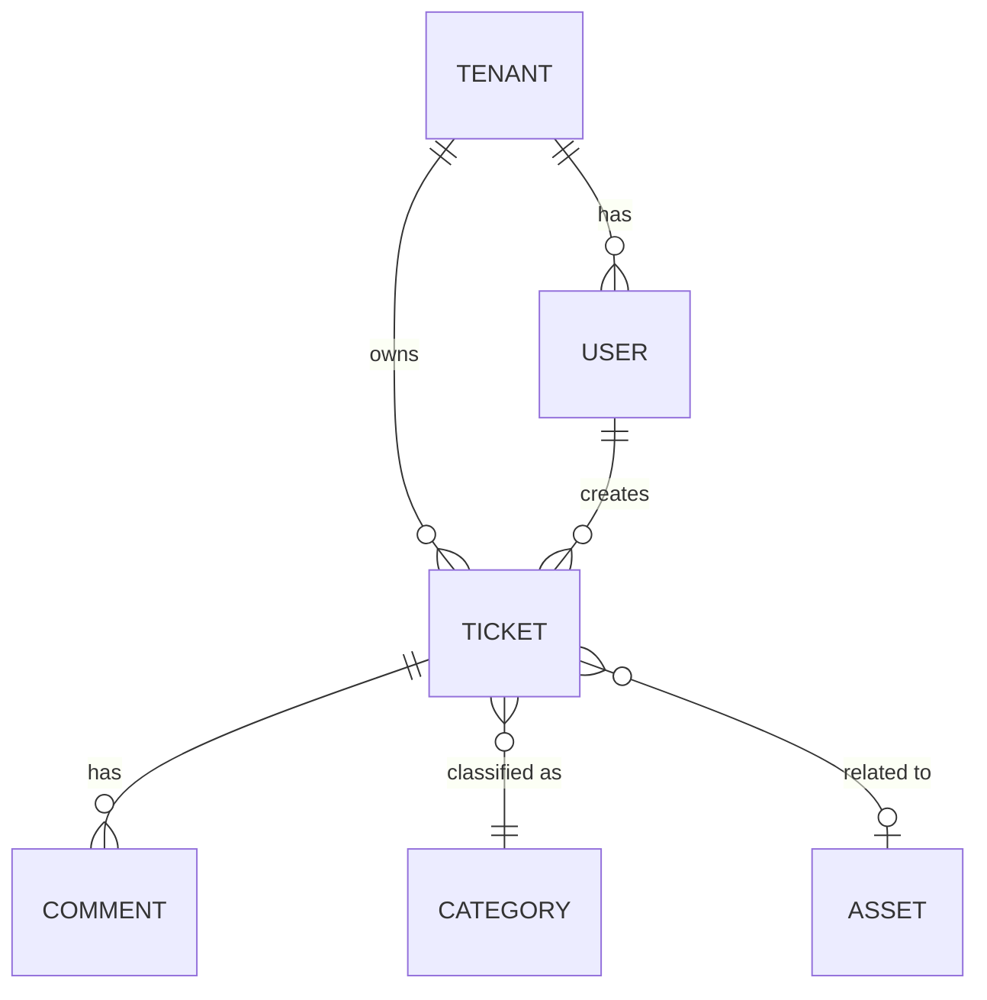

<!-- Copyright (c) 2026 Mohammad Maheri. Licensed under Apache 2.0. See LICENSE. Attribution required - see NOTICE. -->
# Data Architecture & Schema

## Stage: 9 of 13
## Phase: 🟢 DESIGN
## Execution: ALWAYS

---

## Purpose

Define how data is structured, stored, accessed, and managed across the system. This covers the logical data model, schema strategy, multi-tenant data scoping, storage patterns (relational, cache, search, files), and data lifecycle (retention, archival, backup).

**CTO Mindset:** "Data outlives code. The schema is the most stable part of the system — get the model right and implementations can change around it."

---

## MANDATORY: Stage Sub-Role — Data Architect

During THIS stage, ALSO adopt the mindset of a **Data Architect**. This does NOT replace your primary role (CTO / Chief Architect) — it ADDS a thinking dimension.

### Behavioral Shifts
- Model conceptual → logical → physical progressively; don't jump to tables before entities are stable
- Define consistency requirements PER boundary — not everything needs strong consistency; identify what does and what doesn't
- Plan for schema evolution from day one — define migration and versioning strategy upfront
- Consider data at rest AND in motion — storage is half the story; how data flows between components matters equally

### Anti-Patterns for This Stage
- Do NOT select a database technology before understanding the access patterns and consistency needs
- Do NOT design one monolithic schema when bounded contexts suggest separate stores

### Quality Check
A good output at this stage sounds like:
- "6 aggregates identified; consistency: Orders ACID, Notifications eventual; schema versioning: additive-only + migration tooling; tenant scoping via RLS..."

---

## Depth Adaptation

| Depth | Data Architecture Behavior |
|-------|---------------------------|
| **Minimal** | Core entities identified. Schema strategy defined. Storage pattern per data type. Brief lifecycle notes. |
| **Standard** | Full entity-relationship model. Schema management approach (migrations, versioning). Multi-tenant scoping. Cache strategy with TTLs. Search index strategy. Retention and backup approach. ADR for major data decisions. |
| **Comprehensive** | Detailed domain model with aggregate boundaries. Performance-optimized indexing strategy. Data partitioning/sharding analysis. Archival and purge automation design. Disaster recovery with RPO/RTO targets. Cross-region replication (if applicable). Multiple ADRs. |

---

## Step-by-Step Execution

### Step 1: Load Context

1. Technology Stack (Stage 6) — database, cache, search engine selected
2. Multi-Tenancy model (Stage 7) — isolation approach, tenant_id propagation
3. Security (Stage 8) — encryption at rest, audit requirements
4. Container list (Stage 5) — which containers own which data
5. Requirements (Stage 2) — functional domains, data volume estimates
6. Principles (Stage 3) — data-related principles

---

### Step 2: Define Data Model Strategy

```markdown
### Q-DSG-01: Data Modeling Approach

**Context:** The data model design philosophy affects how entities are structured, how domains are bounded, and how the schema evolves over time.

**Options:**
- (a) **Domain-Driven Design (DDD)** — Aggregates, bounded contexts, entities, value objects. Strong domain modeling. Richer but more complex.
- (b) **Traditional ERD** — Normalized relational model. Tables, foreign keys, joins. Simpler, well-understood.
- (c) **Hybrid** — DDD at the domain/service level for complex areas; traditional ERD for simpler CRUD areas.
- (d) **Event-sourced** — Store events, derive state. Full audit trail inherent. Complex to query.

**Recommended:** {Based on domain complexity and team familiarity}
**Rationale:** {Why — reference team skills, domain complexity, maintenance needs}

**Your Decision:** _[awaiting input]_
```

---

### Step 3: Identify Core Domain Entities

For each functional domain (from Stage 2), identify the primary entities:

```markdown
## Core Domain Entities

### {Domain 1 — e.g., "Ticket Management"}

| Entity | Description | Ownership | Tenant-Scoped? | Relationships |
|--------|-------------|:---------:|:--------------:|---------------|
| {Entity name} | {What it represents} | {Which container/module owns it} | {Yes/No} | {Key relationships — FK targets} |

### {Domain 2}
{Same table format}
```

**Entity identification rules:**
- Each entity represents a distinct business concept with its own lifecycle
- Entities have identity (ID) and persist independently
- If something only exists as part of another entity → it's a value object or embedded, not an entity
- If two domains reference the same concept → identify the owning domain (single source of truth)

---

### Step 4: Define Schema Patterns

```markdown
## Schema Patterns

### Multi-Tenant Scoping (if applicable)

| Pattern | Implementation |
|---------|---------------|
| Tenant discriminator | {Every table has `tenant_id` column — NOT NULL, indexed} |
| Global tables | {Exceptions: platform config, tenant registry, system metadata — NOT tenant-scoped} |
| Cross-tenant references | {Never — FK only within same tenant; platform-level linking via separate mechanism} |
| Row-Level Security | {PostgreSQL RLS policies as safety net — enabled per table} |

### Common Column Patterns

| Column(s) | Purpose | Applied To |
|-----------|---------|:----------:|
| `id` (UUID or BIGINT) | Primary key | All tables |
| `tenant_id` | Tenant scoping | All tenant-scoped tables |
| `created_at`, `updated_at` | Temporal tracking | All tables |
| `created_by`, `updated_by` | Actor tracking (audit) | All business tables |
| `deleted_at` | Soft delete | {Specify which tables use soft delete} |
| `version` | Optimistic locking | {Tables with concurrent update risk} |

### Flexible/Custom Fields

| Approach | Description | When to Use |
|----------|-------------|-------------|
| JSONB columns | Schemaless per-tenant custom fields | Per-tenant configuration; extensibility |
| EAV pattern | Entity-Attribute-Value tables | Highly dynamic schemas; many custom fields |
| Column-per-field | Strongly typed; schema migration required | Known, stable fields |

**Decision (if applicable):**

```markdown
### Q-DSG-02: Custom/Flexible Fields Strategy

**Context:** {If the system needs per-tenant or user-defined fields}

**Options:**
- (a) **JSONB column** — Single column per entity stores arbitrary key-value data. Schema-free. Query via JSON operators.
- (b) **EAV (Entity-Attribute-Value)** — Separate table for custom fields. Normalized but slower for complex queries.
- (c) **No custom fields in v1** — Fixed schema only. Custom fields deferred.

**Recommended:** {option}
**Rationale:** {Why — performance, query needs, flexibility vs. complexity}

**Your Decision:** _[awaiting input]_
```
```

---

### Step 5: Define Relationship Patterns

```markdown
## Relationship Patterns

### Generic Record Linking (if applicable)

| Pattern | Description |
|---------|-------------|
| **Universal relationship table** | Any entity linked to any other entity with typed relationship |
| **Structure** | `source_type`, `source_id`, `target_type`, `target_id`, `relationship_type`, `tenant_id` |
| **Active link types** | {List active relationships — e.g., "order↔shipment", "customer↔contract"} |
| **Future extensibility** | New entity types plug into existing linking infrastructure |

### Standard Relationship Patterns

| Pattern | When Used | Example |
|---------|-----------|---------|
| Foreign key (direct) | Strong ownership; cascade delete | Ticket → Tenant (belongs to) |
| Junction table (M:N) | Many-to-many without ownership | Agent ↔ Tenant assignments |
| Polymorphic reference | One entity references multiple types | Comment → (Ticket OR Change OR Request) |
| Self-referential | Hierarchical structures | OrgUnit → parent OrgUnit |
| Temporal relationship | Valid-from/valid-to dating | SLA assignment periods |
```

---

### Step 6: Define Storage Layers

```markdown
## Data Storage Layers

| Layer | Technology | What's Stored | Access Pattern | Retention |
|-------|-----------|--------------|:-------------:|:---------:|
| **Primary database** | {DB from Stage 6} | All business entities, configuration, relationships | CRUD; complex queries; transactions | {Indefinite / policy} |
| **Cache** | {Cache from Stage 6} | Sessions, tenant config, hot query results, rate-limit counters | Key-value; TTL-based | Ephemeral |
| **Search index** | {Search from Stage 6} | Full-text searchable fields (tickets, CIs, KB articles) | Full-text query; faceted search | Mirror of DB (eventual consistency) |
| **File storage** | {Storage from Stage 6} | Attachments, exports, logos, documents | Read/write by path; tenant-scoped | {Policy} |
| **Audit store** | {Same DB or separate} | Audit log events | Append-only; read for compliance | {Long — 2-7 years} |
```

---

### Step 7: Define Data Synchronization

How do storage layers stay consistent?

```markdown
## Data Synchronization

| Source | Target | Sync Method | Consistency | Lag Tolerance |
|--------|--------|:-----------:|:-----------:|:-------------:|
| Database | Search index | {Event-driven / Polling / Trigger} | Eventual | {Seconds / Minutes} |
| Database | Cache | {Write-through / Write-behind / Invalidation} | {Eventual / Strong} | {Milliseconds / Seconds} |
| Database | Reporting/Analytics | {Read replica / ETL / Materialized views} | Eventual | {Minutes / Hours} |
```

---

### Step 8: Define Data Lifecycle

```markdown
## Data Lifecycle Management

### Retention Policies

| Data Category | Active Retention | Archive After | Delete After | Regulatory Driver |
|--------------|:----------------:|:-------------:|:------------:|:-----------------:|
| Business data (tickets, etc.) | Indefinite in active DB | {n} years → cold storage | {Never / n years} | {Regulation if any} |
| Audit logs | {n} years hot | {n} years cold | {n} years total | {Compliance requirement} |
| Session/temp data | Until expiry | — | On expiry | — |
| User PII | While account active | — | On account deletion | {GDPR / privacy law} |
| Attachments | With parent entity | With parent | With parent | — |

### Backup Strategy

| Aspect | Approach |
|--------|----------|
| Full backup frequency | {Daily / Weekly} |
| Incremental/WAL | {Continuous / Every n minutes} |
| Backup location | {On-site + off-site / Replicated / Single} |
| Per-tenant restore | {Possible via {method} / Not supported} |
| Backup encryption | {Yes — same key management as at-rest} |
| Recovery testing | {Frequency — quarterly recommended} |
| RPO target | {From requirements — e.g., "1 hour max data loss"} |
| RTO target | {From requirements — e.g., "4 hours to restore"} |

### Migration Strategy

| Aspect | Approach |
|--------|----------|
| Migration tool | {Framework migrations / Flyway / Liquibase / Custom} |
| Versioning | {Sequential numbered / Timestamped} |
| Rollback | {Down migrations / Forward-only with compensating} |
| Multi-tenant impact | {Migrations run once (shared schema) / Per-tenant (schema-per-tenant)} |
| Zero-downtime | {Expand-contract pattern / Maintenance window acceptable} |
```

---

### Step 9: Entity Relationship Overview (Conceptual)

Produce a high-level ERD showing major entities and their relationships:

```markdown
## Conceptual Entity Relationship Diagram


```

**Diagram rules:**
- Show MAJOR entities only (10-20 max at conceptual level)
- Show relationship cardinality (1:1, 1:N, M:N)
- Group by domain if large
- Don't show every column — this is conceptual, not physical schema
- Physical schema details go in implementation documentation (AI-DLC v1 territory)

---

### Step 10: Produce ADR(s)

Possible data architecture ADRs:

| ADR | Decision |
|-----|----------|
| ADR-{nnn} | Data modeling approach (DDD vs. ERD vs. hybrid) |
| ADR-{nnn} | Custom fields strategy (JSONB vs. EAV vs. none) |
| ADR-{nnn} | Backup/recovery approach |
| ADR-{nnn} | Search synchronization strategy |

Only produce ADRs where meaningful alternatives were evaluated.

---

### Step 11: Assemble Document

Compile **Data Architecture** document:

1. Data Model Strategy (approach + rationale)
2. Core Domain Entities (per domain)
3. Schema Patterns (tenant scoping, common columns, flexible fields)
4. Relationship Patterns
5. Storage Layers (what goes where)
6. Data Synchronization (how layers stay consistent)
7. Data Lifecycle (retention, backup, migration)
8. Conceptual ERD
9. ADR references

---

### Step 12: Present for Review

```markdown
## Review: Data Architecture — {system_name}

I've designed the data architecture.

**Key decisions:**
- **Modeling approach:** {DDD / ERD / Hybrid}
- **Entities identified:** {n} across {m} domains
- **Storage layers:** {n} (primary DB, cache, search, files, audit)
- **Tenant scoping:** {approach — e.g., "tenant_id + RLS on all business tables"}
- **Custom fields:** {approach or N/A}
- **Backup RPO/RTO:** {values}

**Entity highlights:**
- {Top 3-5 most important entities and their purpose}

**ADRs produced:** {n}

**Full document:** Saved to `{file_path}`

---

**Your response:**
- (a) **Approve** — Data architecture is sound; proceed
- (b) **Add entities** — Missing domain entities
- (c) **Challenge model** — Different modeling approach preferred
- (d) **Adjust lifecycle** — Retention/backup needs revision
- (e) **Deepen ERD** — Need more entity detail
```

---

### Step 13: Log and Transition

1. Update state: Stage 9 = ✅ Done; Current Stage = 10
2. Update ADR register
3. Update Architecture Workbook

Display:

```
✅ Stage 9: Data Architecture & Schema — Complete

💾 Entities: {n} across {m} domains | Storage: {n} layers | Model: {approach}
📄 Saved to: {file_path}

Next → Stage 10: API Architecture & Contracts

Proceeding...
```

---

## Output File

Save to:
- Numbered: `{output_root}/07_Data_Architecture.md`
- Phase folders: `{output_root}/design/Data_Architecture.md`

---

## Data Architecture Quality Checks

| Check | Pass Criteria |
|-------|---------------|
| Completeness | Every functional domain has entities identified |
| Tenant scoping | All business tables are tenant-scoped (if multi-tenant) |
| Ownership clear | Every entity has one owning module/container |
| No orphans | Every entity participates in at least one relationship |
| Lifecycle defined | Retention, backup, and deletion policies for all data categories |
| Storage justified | Each storage layer has clear purpose (no redundant stores) |
| Sync defined | All secondary stores have sync mechanism documented |
| Constraint compliant | Storage choices comply with deployment/licensing constraints |
| Scale appropriate | Schema design supports stated scale targets |
| Migration planned | Schema evolution strategy defined |
