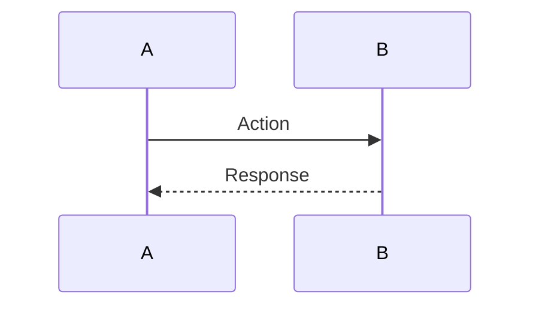

<!-- Copyright (c) 2026 Mohammad Maheri. Licensed under Apache 2.0. See LICENSE. Attribution required - see NOTICE. -->
# Component Design (C4 Level 3)

**Document Status:** {Draft / Review / Approved}
**Version:** {n.n}
**Date:** {YYYY-MM-DD}
**Author:** {Role}

---

## 1. Decomposition Strategy

**Approach:** {DDD Bounded Contexts / Layer-Based / Feature-Based / Hybrid}
**Rationale:** {Why this approach.}

---

## 2. Domain Modules

| # | Module | Bounded Context | Responsibility | Owns Entities | Exposes API? |
|---|--------|:--------------:|----------------|---------------|:------------:|
| 1 | {module} | {domain} | {responsibility} | {entities} | {Yes/No} |

---

## 3. Shared / Platform Modules

| # | Module | Responsibility | Used By |
|---|--------|---------------|---------|
| 1 | {module} | {responsibility} | {who} |

---

## 4. Dependency Rules

| Rule | Description |
|------|-------------|
| {rule} | {what it means} |

### Dependency Diagram

```
Domain Modules ────► Shared/Platform Modules ────► Core/Kernel
     ✗ ←──── Domain Module (no cross-domain direct dependencies)
```

---

## 5. Inter-Module Communication

| Pattern | When Used | Example |
|---------|-----------|---------|
| {pattern} | {when} | {example} |

---

## 6. Cross-Cutting Concerns

| Concern | Mechanism | Enforcement Point |
|---------|-----------|:-----------------:|
| {concern} | {how} | {where} |

---

## 7. Component Diagram (C4 L3)

```mermaid
C4Component
    title {Container Name} — Components

    Container_Boundary(app, "Container") {
        Component(mod1, "Module", "Type", "Responsibility")
    }

    Rel(mod1, mod2, "Uses")
```

---

## 8. Key Flow Sequences

### {Flow Name}



**Purpose:** {What this demonstrates architecturally.}

---

*Component Design v{version} | {date} | Status: {status}*
