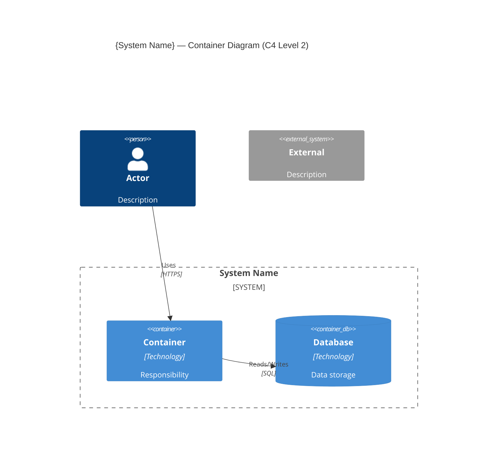

<!-- Copyright (c) 2026 Mohammad Maheri. Licensed under Apache 2.0. See LICENSE. Attribution required - see NOTICE. -->
# Container Diagram (C4 Level 2)

**Document Status:** {Draft / Review / Approved}
**Version:** {n.n}
**Date:** {YYYY-MM-DD}
**Author:** {Role}

---

## 1. Decomposition Strategy

{1-2 sentences: Modular Monolith / Service-Oriented / Microservices / Hybrid. Why.}

---

## 2. Containers

| # | Container | Type | Technology | Responsibility | Scaling |
|---|-----------|------|-----------|---------------|:-------:|
| 1 | {name} | {Application/DataStore/Cache/Queue/UI/Worker} | {tech} | {what it does} | {H/V/N/A} |

---

## 3. Container Relationships

| From | To | Communication | Pattern | Data/Purpose |
|------|----|:-------------:|---------|-------------|
| {container} | {container} | {Sync/Async/Stream} | {REST/Queue/Event/SQL} | {what flows} |

---

## 4. External Communication Mapping

| External Entity | Container | Protocol | Direction |
|----------------|:---------:|----------|:---------:|
| {actor/system from L1} | {container} | {protocol} | {In/Out/Both} |

---

## 5. Container Diagram

---

*Container Diagram v{version} | {date} | Status: {status}*
