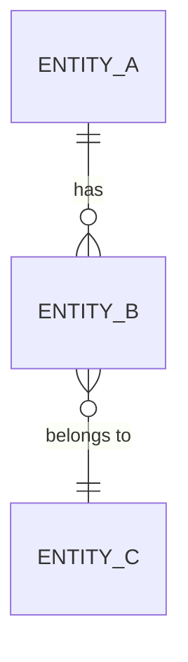

<!-- Copyright (c) 2026 Mohammad Maheri. Licensed under Apache 2.0. See LICENSE. Attribution required - see NOTICE. -->
# Data Architecture & Schema Strategy

**Document Status:** {Draft / Review / Approved}
**Version:** {n.n}
**Date:** {YYYY-MM-DD}
**Author:** {Role}

---

## 1. Data Model Strategy

**Approach:** {DDD / Traditional ERD / Hybrid / Event-Sourced}
**Rationale:** {Why this approach for this system.}

---

## 2. Core Domain Entities

### {Domain Name}

| Entity | Description | Ownership (Module) | Tenant-Scoped? | Key Relationships |
|--------|-------------|:------------------:|:--------------:|------------------|
| {entity} | {what it represents} | {module} | {Yes/No} | {relations} |

---

## 3. Schema Patterns

### Common Column Patterns

| Column(s) | Purpose | Applied To |
|-----------|---------|:----------:|
| {columns} | {purpose} | {scope} |

### Flexible Fields

| Approach | Description | Used Where |
|----------|-------------|-----------|
| {approach} | {description} | {entities} |

---

## 4. Storage Layers

| Layer | Technology | What's Stored | Access Pattern | Retention |
|-------|-----------|--------------|:-------------:|:---------:|
| {layer} | {tech} | {data} | {pattern} | {period} |

---

## 5. Data Synchronization

| Source | Target | Method | Consistency | Lag |
|--------|--------|:------:|:-----------:|:---:|
| {source} | {target} | {method} | {level} | {tolerance} |

---

## 6. Conceptual ERD

---

## 7. Data Lifecycle

### Backup Strategy

| Aspect | Approach |
|--------|----------|
| Frequency | {schedule} |
| RPO | {target} |
| RTO | {target} |

### Migration Strategy

| Aspect | Approach |
|--------|----------|
| Tool | {technology} |
| Rollback | {strategy} |

---

*Data Architecture v{version} | {date} | Status: {status}*
