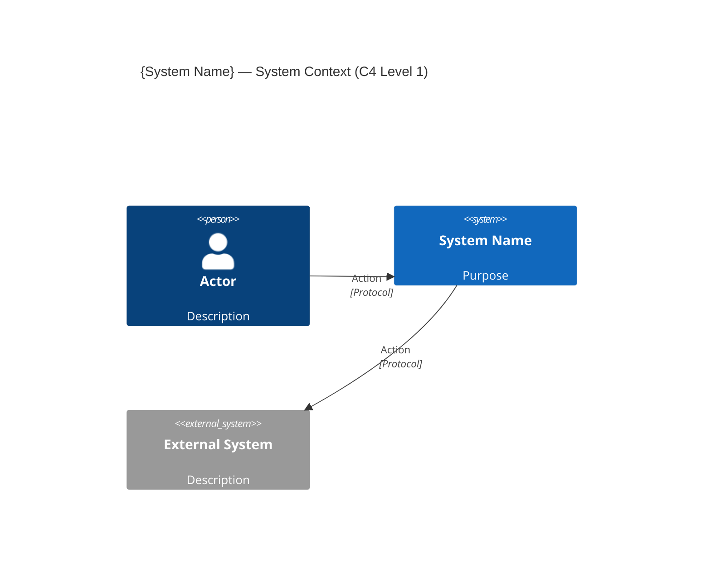

<!-- Copyright (c) 2026 Mohammad Maheri. Licensed under Apache 2.0. See LICENSE. Attribution required - see NOTICE. -->
# System Context Diagram (C4 Level 1)

**Document Status:** {Draft / Review / Approved}
**Version:** {n.n}
**Date:** {YYYY-MM-DD}
**Author:** {Role}

---

## 1. System Boundary Definition

**The System:** {system_name} — {1-sentence purpose}

**Inside the boundary:** {brief description of what we build}

**Outside the boundary:** {brief description of externals}

---

## 2. External Actors

| # | Actor | Description | Interaction | Channel |
|---|-------|-------------|-------------|---------|
| 1 | {role} | {who they are} | {what they do} | {how — browser, API, etc.} |

---

## 3. External Systems

| # | System | Type | Direction | Protocol | Data Exchanged | Criticality |
|---|--------|------|:---------:|----------|----------------|:-----------:|
| 1 | {name} | {category} | {In/Out/Both} | {protocol} | {what flows} | {Critical/Important/Optional} |

---

## 4. Context Diagram

---

## 5. Narrative Description

{3-5 paragraphs explaining the system context — what it does from outside, who uses it, what it depends on, key communication patterns.}

---

*System Context v{version} | {date} | Status: {status}*
