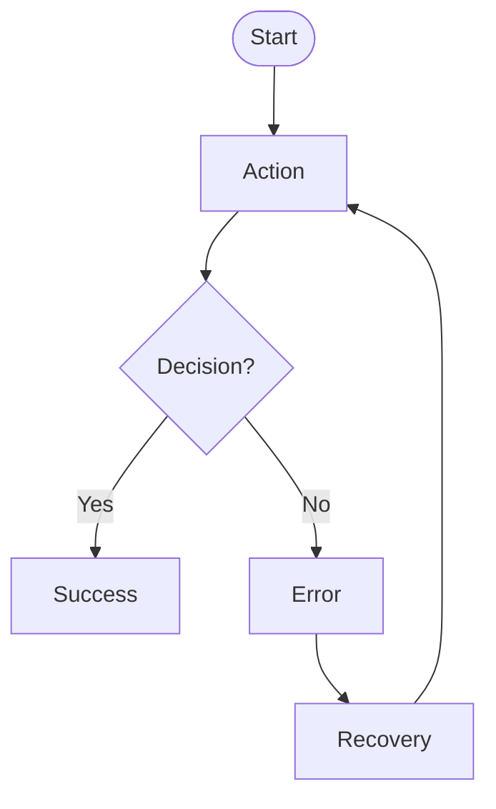

<!-- Copyright (c) 2026 Mohammad Maheri. Licensed under Apache 2.0. See LICENSE. Attribution required - see NOTICE. -->
# AI-UXD — Design Standards

**Purpose:** Design-specific conventions for AI-UXD artifacts. Covers diagram notation, design system structure, token format, and reference standards.

---

## Diagram Notation

AI-UXD produces several diagram types. Each uses a consistent notation:

### User Flow Diagrams

| Symbol | Meaning |
|--------|---------|
| ⬭ (Oval) | Start / End point |
| ▭ (Rectangle) | Action / Screen |
| ◇ (Diamond) | Decision point |
| ▱ (Parallelogram) | Input / Output |
| → (Arrow) | Direction of flow |
| ╌╌→ (Dashed arrow) | Optional / conditional path |
| ✕ (X in circle) | Error state |
| ↩ (Loop arrow) | Retry / back loop |

When rendered in markdown, use Mermaid syntax:


### Journey Map Structure

Rendered as a markdown table with emotional indicators:

| Stage | Action | Touchpoint | Emotion | Opportunity |
|-------|--------|------------|---------|-------------|
| {name} | {what user does} | {where/how} | 😊 / 😐 / 😟 + intensity (1-5) | {design opportunity} |

### Site Map / IA Structure

Use indented list for hierarchy:
```
├── Level 1: {label}
│   ├── Level 2: {label}
│   │   ├── Level 3: {label}
│   │   └── Level 3: {label}
│   └── Level 2: {label}
└── Level 1: {label}
```

### Component State Matrix

| State | Visual Change | Trigger | ARIA |
|-------|--------------|---------|------|
| Default | — | Page load | — |
| Hover | {description} | Mouse enter | — |
| Focus | {description} | Tab / click | `aria-selected` or equivalent |
| Active | {description} | Mouse down / Enter | — |
| Disabled | {description} | Programmatic | `aria-disabled="true"` |
| Loading | {description} | Async action | `aria-busy="true"` |
| Error | {description} | Validation fail | `aria-invalid="true"` |
| Empty | {description} | No data | `aria-label` with explanation |

---

## Design Token Format

AI-UXD tokens align with the W3C Design Tokens Format Module (2025.10). Structure:

### Token Tiers

| Tier | Purpose | Naming Convention | Example |
|------|---------|-------------------|---------|
| **Global** | Raw values (the palette) | `{category}.{item}.{variant}` | `color.blue.500` |
| **Semantic/Alias** | Purpose-named references | `{category}.{usage}.{state}` | `color.primary.default` |
| **Component** | Scoped to a specific component | `{component}.{property}.{state}` | `button.background.hover` |

### Token Categories

| Category | What It Defines | Examples |
|----------|----------------|----------|
| `color` | All color values | `color.primary.500`, `color.surface.default` |
| `typography` | Font families, sizes, weights, line heights | `typography.heading.lg`, `typography.body.md` |
| `spacing` | Margin, padding, gap values | `spacing.sm`, `spacing.section` |
| `sizing` | Width, height, icon sizes | `sizing.icon.md`, `sizing.avatar.lg` |
| `radius` | Border radius values | `radius.sm`, `radius.full` |
| `shadow` | Box shadow definitions | `shadow.elevation.1`, `shadow.focus` |
| `motion` | Duration, easing (if applicable) | `motion.duration.fast`, `motion.easing.default` |
| `breakpoint` | Responsive breakpoint values | `breakpoint.sm`, `breakpoint.lg` |
| `z-index` | Stacking order | `z.dropdown`, `z.modal`, `z.toast` |

### Token Documentation Format

Each token in the specification is documented as:

```markdown
| Token | Value | Type | Description |
|-------|-------|------|-------------|
| `color.primary.500` | `#2563EB` | color | Primary brand color, used for CTAs and links |
| `spacing.md` | `16px` | dimension | Standard content spacing |
```

---

## Atomic Design Hierarchy

Components are organized using Brad Frost's Atomic Design:

| Level | Definition | Examples |
|-------|-----------|----------|
| **Atoms** | Smallest indivisible elements | Button, Input, Label, Icon, Badge, Avatar |
| **Molecules** | Groups of atoms functioning as a unit | Search bar (input + button), Form field (label + input + error) |
| **Organisms** | Complex groups forming distinct sections | Header (logo + nav + search + avatar), Card grid, Data table |
| **Templates** | Page-level layout structures (no real content) | Dashboard layout, Settings layout, List-detail layout |
| **Pages** | Templates with real content (screens) | Dashboard Home, User Profile, Settings > Account |

### Component Documentation Structure

Every component spec follows this structure:

```markdown
# Component: {Name}

## Classification
- **Level:** Atom / Molecule / Organism
- **Category:** {Navigation / Input / Display / Feedback / Layout}

## Variants
| Variant | Use Case |
|---------|----------|
| Primary | Main action |
| Secondary | Supporting action |
| Ghost | Tertiary / in-context action |

## States
{State matrix — see above}

## Responsive Behavior
| Breakpoint | Behavior |
|------------|----------|
| Mobile (<640px) | {description} |
| Tablet (640-1024px) | {description} |
| Desktop (>1024px) | {description} |

## Accessibility
- **Role:** {ARIA role}
- **Keyboard:** {interaction pattern}
- **Screen reader:** {announcement behavior}
- **Focus indicator:** {description}

## Content Constraints
- **Min/Max characters:** {range}
- **Overflow:** {truncate / wrap / scroll}
- **Empty state:** {what shows when no content}

## Token Usage
| Property | Token |
|----------|-------|
| Background | `{component}.background.{state}` |
| Text color | `{component}.text.{state}` |
| Border radius | `radius.{value}` |
| Padding | `spacing.{value}` |
```

---

## Accessibility Standards Reference

AI-UXD targets **WCAG 2.2 Level AA** as minimum. Key criteria affecting design:

### Perceivable
- Contrast ratio: ≥4.5:1 for normal text, ≥3:1 for large text (18px+)
- Non-text contrast: ≥3:1 for UI components and graphical objects
- Text alternatives for all non-text content
- Content adaptable (logical reading order, orientation support)

### Operable
- All functionality keyboard-accessible
- Focus visible (clear focus indicators on all interactive elements)
- No keyboard traps
- Sufficient time for interactions
- No more than 3 flashes per second

### Understandable
- Language declared
- Consistent navigation patterns
- Error identification and suggestion
- Labels and instructions present

### Robust
- Valid markup structure
- ARIA roles and properties correct
- Status messages programmatically determinable

---

## Responsive Design Standards

### Breakpoint Definitions

AI-UXD uses content-driven breakpoints, not device-specific:

| Token | Value | Typical Context |
|-------|-------|-----------------|
| `breakpoint.xs` | 320px | Small mobile |
| `breakpoint.sm` | 640px | Large mobile / small tablet |
| `breakpoint.md` | 768px | Tablet portrait |
| `breakpoint.lg` | 1024px | Tablet landscape / small desktop |
| `breakpoint.xl` | 1280px | Desktop |
| `breakpoint.2xl` | 1536px | Large desktop |

### Grid System

| Property | Value | Notes |
|----------|-------|-------|
| Columns | 4 / 8 / 12 | Mobile / Tablet / Desktop |
| Gutter | `spacing.md` (16px) | Between columns |
| Margin | `spacing.lg` (24px) | Page edges |
| Max width | 1280px | Content container |

### Responsive Behavior Types

| Type | Description | When to use |
|------|-------------|-------------|
| **Reflow** | Content reflows to fit (columns reduce) | Default for content layouts |
| **Stack** | Horizontal → vertical on small screens | Cards, form fields, feature grids |
| **Hide** | Content hidden below breakpoint | Low-priority secondary content |
| **Adapt** | Different component renders per breakpoint | Navigation (drawer ↔ bar), tables (scroll ↔ cards) |
| **Scale** | Proportional sizing change | Typography, spacing, images |

---

## Voice & Tone Standards

### Tone Dimensions

| Dimension | Spectrum | This product's position |
|-----------|----------|------------------------|
| Formal ↔ Casual | {position} | Determined at Stage 8 |
| Serious ↔ Playful | {position} | Determined at Stage 8 |
| Technical ↔ Simple | {position} | Determined at Stage 8 |
| Authoritative ↔ Friendly | {position} | Determined at Stage 8 |

### Copy Pattern Types

| Context | Purpose | Example Pattern |
|---------|---------|-----------------|
| **Error** | Help user fix the problem | "We couldn't {action}. {What went wrong}. {How to fix it}." |
| **Empty state** | Guide user to populate | "{What would be here}. {How to add it}." |
| **Success** | Confirm completion | "{What happened}. {What's next}." |
| **Loading** | Set expectation | "{What's happening}..." |
| **Onboarding** | Teach by doing | "{What this is}. {Why it matters}. {What to do}." |
| **CTA** | Drive action | Start with verb. Be specific. "{Verb} {object}." |
| **Confirmation** | Prevent mistakes | "{Consequence}. {Are you sure?} [{Verb}] [Cancel]" |

---

## i18n / RTL / Localization Standards

When the conditional i18n feature is active:

### Text Expansion Rules

| Source Language | Expected Expansion |
|----------------|--------------------|
| English → German | +30-35% |
| English → French | +15-20% |
| English → Japanese | -10-20% (characters) but may need more vertical space |
| English → Arabic | Similar length but RTL layout |

**Design implication:** All text containers must accommodate ≥35% expansion without breaking layout.

### Bidirectional Layout

| Property | LTR | RTL |
|----------|-----|-----|
| Text alignment | Left | Right |
| Reading direction | Left → Right | Right → Left |
| Icon direction (arrows, progress) | → | ← |
| Layout mirroring | Normal | Horizontally mirrored |
| Number/date format | Locale-dependent | Locale-dependent |

### Locale-Aware Tokens

| Token | LTR Value | RTL Value | Notes |
|-------|-----------|-----------|-------|
| `spacing.start` | `margin-left` | `margin-right` | Use logical properties |
| `spacing.end` | `margin-right` | `margin-left` | Use logical properties |
| `direction.inline` | `ltr` | `rtl` | Text flow |
| `direction.block` | `ttb` | `ttb` | Vertical flow (same) |

---

## External Tool References

AI-UXD is tool-agnostic but acknowledges external tools:

| Tool Type | How AI-UXD References |
|-----------|----------------------|
| Figma / Sketch / XD | Link to file + screen name (never embed proprietary format) |
| Prototyping tools | Link + interaction description in markdown |
| Design token tools (Style Dictionary, Tokens Studio) | Output format guidance in Design_Tokens.md |
| Icon libraries | Reference by name + link; specify style rules for custom icons |

**Rule:** AI-UXD produces the GOVERNANCE (what must exist, how it must work). External tools produce the IMPLEMENTATION (the actual pixels). Link between them; never depend on them.

---

*Part of AI-UXD v1.0.0 | Reference: core-workflow.md § Key Principles*
