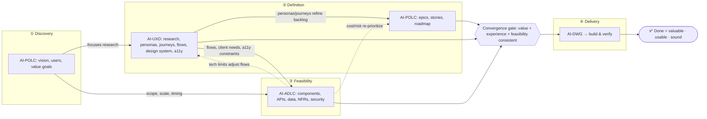

# How Project-Layer Collaboration Works

**Purpose:** Explains how the three Project-layer packages — **AI-POLC** (product ownership), **AI-UXD** (user experience), and **AI-ADLC** (architecture) — relate, sequence, and feed each other before converging on **AI-DWG**. The AIFLC chain serializes these as **POLC → UXD → ADLC → DWG** for quality assurance, with feedback loops that provide iterative refinement without changing the forward sequence.

---

## Why This Matters

In the real world, product, UX, and architecture are concurrent disciplines — they inform each other continuously. A late discovery (a usability finding, a feasibility limit, a cost surprise) should loop back upstream while work is still malleable.

The AI-* Family serializes these disciplines as **AI-POLC → AI-UXD → AI-ADLC → AI-DWG** — each package completes its primary output before the next starts. This serialization ensures each discipline builds on firm upstream decisions rather than guessing. But the chain preserves **feedback loops** (ADLC→POLC cost/risk, ADLC→UXD constraints, UXD→POLC persona refinement) that allow iterative refinement without changing the forward sequence.

This document explains the sequential model and its feedback mechanisms so you can run the three packages the way they're meant to be run — in order, with live feedback when discoveries require upstream adjustment.

---

## The Three Disciplines and Their Packages

| Discipline | Owns | Package | Output artifact |
|-----------|------|---------|-----------------|
| Product Ownership | the *problem* and the *value* | **AI-POLC** | Product Backlog Package (PBP) |
| UX Design | the *experience* | **AI-UXD** | UX Design Package (UXP) |
| Architecture Design | the *feasibility* and the *structure* | **AI-ADLC** | Architecture Package (AP) |

All three feed the workspace generator (**AI-DWG**), which accepts any non-empty subset of the three artifacts and generates the ready-to-code workspace.

---

## A Sequential Chain with Feedback Loops

The AIFLC chain is **sequential**: POLC completes, then UXD, then ADLC, then DWG. This is intentional — it ensures:

- **POLC defines scope before UX research begins** (UXD knows what to design for)
- **UXD delivers the experience before architecture locks structure** (ADLC has real constraints to design against)
- **ADLC completes last, with full upstream context** (AP is informed by both PBP and UXP)

What makes this different from a "dumb relay" is the **feedback loops**:

- Each package reads its peers' state markers and can **trigger re-entry** when a downstream discovery conflicts with an upstream decision
- These loops are non-destructive reviews, not restarts — they refine, not replace

The center-of-gravity sequence is **Product → UX → Architecture → Build**, and the packages execute in that order.

---

## The Sequential Execution Model

| # | Phase | Package | What happens |
|---|-------|---------|--------------|
| ① | **Product Ownership** | **AI-POLC** | Define the problem, target users, value goals, business priorities, epics, stories, roadmap. Produces the PBP. |
| ② | **UX Design** | **AI-UXD** | Research, personas, journey maps, information architecture, flows, design system, accessibility targets. Builds on PBP. Produces the UXP. |
| ③ | **Architecture Design** | **AI-ADLC** | Components, APIs, data model, NFRs, security, scale. Builds on PBP + UXP. Produces the AP. |
| ④ | **Workspace Generation** | **AI-DWG** | Composes all three (AP + PBP + UXP) into the ready-to-code workspace. |

Each package has full context from its predecessors. Feedback loops fire when a downstream discovery (a feasibility limit, a cost surprise) requires upstream adjustment.

---

## Who Feeds Whom (Feed Matrix)

> Dominant flow = **downward feeds** (Product → UX → Architecture). Reality check = **upward feedback** (Architecture/UX → Product).

| From → To | What flows | Direction |
|-----------|-----------|-----------|
| **AI-POLC → AI-UXD** | Vision, target segments, value goals, problem statements, success metrics, business priorities (these *focus* UX research on the users that matter to the value goal) | feed |
| **AI-POLC → AI-ADLC** | Functional scope, priorities, expected scale/volume, business constraints, roadmap timing, compliance/regulatory needs | feed |
| **AI-UXD → AI-POLC** | Personas, journey maps, validated/invalidated assumptions, usability findings — which **refine and re-prioritize the backlog**; UX often hands product the personas it writes stories around | feedback / co-produce |
| **AI-UXD → AI-ADLC** | User flows, screen inventory, interaction complexity, client/frontend requirements, responsiveness & latency expectations, offline/real-time needs, accessibility targets (which become real technical constraints) | feed |
| **AI-ADLC → AI-POLC** | Feasibility, effort/cost, sequencing constraints, technical risk & debt — **reshapes prioritization** ("that feature is 3× the cost, reorder the roadmap") | feedback |
| **AI-ADLC → AI-UXD** | Technical boundaries — what the platform can render, data availability & speed, performance ceilings — which constrain what UX can promise | feedback |

The tightest pairing is **AI-UXD ↔ AI-POLC**: UX produces the personas and journeys that AI-POLC consumes, while AI-POLC's value goals focus UX research. The line between product discovery and UX research is deliberately blurry.

---

## The Feedback Loops (Where the Real Work Is)

The loops, not the feeds, are what make this iterative:

1. **UX → Product refine loop:** UX research kills or reshapes a story → backlog changes.
2. **Architecture → Product cost loop:** Architecture's cost/risk verdict reorders the roadmap.
3. **Architecture → UX constraint loop:** A latency/data limit forces a simpler interaction → UX adjusts flows.

Anyone treating this as a one-way pipeline rebuilds work when a loop fires late. The packages are designed to let these loops run *before* the build, not after.

---

## Diagrams

### Swimlane Timeline (path of work completion)

```
 TIME ─────────────────────────────────────────────────────────────────────────►

        ① DISCOVERY        ② DEFINITION        ③ FEASIBILITY      ④ DELIVERY      DONE
        (problem & value)  (experience & scope) (firm the build)  (build & verify)
        ┌────────────────┬────────────────────┬──────────────────┬───────────────┐
AI-POLC │ ●Vision        │  Epics & stories   │  Re-prioritize   │  Accept work  │
        │  Target users  │──┐  Roadmap         │  on cost/risk ◄──┤  vs criteria  │──► ✅
        │  Value goals   │  │     ▲            │       ▲          │     ▲         │   value
        │      │ feeds   │  │     │ refine     │       │ cost     │     │         │  delivered
        │      ▼         │  │     ↩ (UX)       │       ↩ (Arch)   │     │         │
        │   ───┴─────────┼──┼─────┴────────────┼───────┴──────────┼─────┴─────────│
        │      │ feeds   │  │ personas/journeys│                  │  acceptance   │
AI-UXD  │      ▼         │  ▼ feed stories     │                  │  + usability  │
        │  ●Research     │  Journeys, IA       │  Adjust flows    │  QA on built  │──► ✅
        │   personas     │  Flows, wireframes  │  to tech limits  │  experience   │   usable
        │   journeys     │  Design system ─────┼──┐    ▲          │     ▲         │  experience
        │                │  Accessibility tgt  │  │    ↩ (Arch    │     │         │
        │   ─────────────┼─────────────────────┼──┼────constraints)────┴─────────│
        │                │  flows + a11y +      │  │               │  conforms to │
AI-ADLC │  ○(advises     │  client needs feed   │  ▼               │  architecture│
        │   feasibility  │  architecture        │ ●Components,APIs │  & NFRs      │──► ✅
        │   early)       │──────────────────────┤  Data model     │              │   feasible
        │                │                      │  NFRs, security │  build on it  │  & sound
        └────────────────┴──────────────────────┴──────────────────┴──────────────┘
                                                 ▲
                                    CONVERGENCE GATE — the trio agrees:
                                    problem (POLC) + experience (UXD) + feasibility (ADLC)
                                    are consistent  →  AI-DWG generates the workspace here
```

**Legend:** `●` = leads/originates that phase · `○` = advisory presence · `▼ feeds` = dominant downward flow · `↩` = feedback loop · `CONVERGENCE GATE` = the real "ready to generate the workspace" moment.

### Critical Path (one line)

```
Problem/value (POLC) ─► focused research + experience (UXD) ─► firmed architecture (ADLC)
        ▲  ▲                    │                              │
        │  └──── refine backlog ─┘                             │
        └──────────── re-prioritize on cost/risk ──────────────┘
                              │
                              ▼
              AI-DWG ─► build ─► verify {valuable · usable · sound} ─► ✅ DONE
```

### Portable Mermaid (same model)



---

## How This Reaches AI-DWG

AI-DWG is the convergence point. In the sequential model, all three inputs are **guaranteed present** by the time DWG starts (ADLC is the terminal predecessor):

| Input | Producer | Completed in step | Role |
|-------|----------|:-----------------:|:----:|
| Product Backlog Package (PBP) | AI-POLC | ① | product cluster |
| UX Design Package (UXP) | AI-UXD | ② | UX cluster |
| Architecture Package (AP) | AI-ADLC | ③ | tech cluster |

**By default, AI-DWG validates that all three are present** before generating — the sequential guarantee means this is a sanity check, not a parallel-convergence wait. For brownfield/partial scenarios (where a package was skipped via profile), AI-DWG can still generate from any non-empty subset; but proceeding with fewer than three is a deliberate, **user-approved exception** with acknowledged reduced coverage.

After delivery, runtime feedback flows **back to AI-UXD and AI-POLC**, closing the loop so the experience and the backlog stay honest as the build reveals new facts.

---

## Key Nuances (the parts people get wrong)

- **The strongest single feed is Product → (UX + Architecture).** AI-POLC sets direction for both; that's why it leads discovery.
- **UX and Product are the most tightly fused pair.** Personas and journeys legitimately belong to either; AI-UXD and AI-POLC co-produce them.
- **Architecture is the most constrained but pushes back the hardest.** AI-ADLC consumes the *what* (AI-POLC) and the *how it feels* (AI-UXD), but its feasibility verdict can override both — a great design that can't be built on time isn't a great design.
- **The convergence gate is not a signed document — it's consistency.** "Ready to generate the workspace" means the three answers (value / experience / feasibility) stop contradicting each other.
- **"Done" is a three-way check:** simultaneously **valuable** (product accepts), **usable** (UX/QA confirms the built experience), and **feasible/sound** (runs on the architecture, meets NFRs).
- **Mental model:** AI-POLC owns the *problem & value*, AI-UXD owns the *experience*, AI-ADLC owns the *feasibility & structure* — the trio's job is to keep those three answers consistent as all three evolve.

---

## What to Watch For

The forward chain models the **downward feeds** strongly and the **upward feedback** more lightly. Two loops deserve deliberate attention because they are easy to skip:

- The **architecture → product cost/risk re-prioritization** loop (do you actually reorder the roadmap when AI-ADLC flags a 3× feature?), and
- The **architecture → UX constraint** loop (do you simplify a flow when a latency or data limit appears?).

Run AI-ADLC early enough — even in advisory mode during discovery and definition — that these loops fire *before* the build, not after.

**How the loops actually run:** because AI-POLC, AI-UXD, and AI-ADLC are all Project-layer packages, they exchange directly — each package reads its peers' state markers (`polc-state.md`, `uxd-state.md`, `adlc-state.md`) when it starts or resumes, and offers a non-destructive review when a peer's output changes after work already exists. No central router is involved for these same-layer loops (AI-FLO carries data *across* layers — Portfolio ↔ Project — not laterally between same-layer peers). So a late architecture constraint reaches AI-UXD because AI-UXD detects the updated `adlc-state.md` directly, and a cost/risk verdict reaches AI-POLC the same way.

---

## Related Documents

| Document | Why it's related |
|----------|------------------|
| [`HOW_CHAIN_HANDOFF_WORKS.md`](HOW_CHAIN_HANDOFF_WORKS.md) | The marker/contract mechanics behind multi-input convergence at AI-DWG |
| [`HOW_DWG_GENERATION_ENGINE_WORKS.md`](HOW_DWG_GENERATION_ENGINE_WORKS.md) | How AI-DWG turns AP + PBP + UXP into a workspace |
| [`HOW_UX_DESIGN_LIFECYCLE_WORKS.md`](HOW_UX_DESIGN_LIFECYCLE_WORKS.md) | The AI-UXD package internals |
| [`HOW_POLC_PRODUCT_OWNERSHIP_WORKS.md`](HOW_POLC_PRODUCT_OWNERSHIP_WORKS.md) | The AI-POLC package internals |
| [`HOW_TO_DESIGN_ARCHITECTURE.md`](HOW_TO_DESIGN_ARCHITECTURE.md) | Running AI-ADLC in practice |
| [`HOW_TO_DESIGN_USER_EXPERIENCE.md`](HOW_TO_DESIGN_USER_EXPERIENCE.md) | Running AI-UXD in practice |
| [`HOW_TO_MANAGE_PRODUCT_BACKLOG.md`](HOW_TO_MANAGE_PRODUCT_BACKLOG.md) | Running AI-POLC in practice |
| [`WHY_ARCHITECTURE_BEFORE_CODE_MATTERS.md`](WHY_ARCHITECTURE_BEFORE_CODE_MATTERS.md) | Why feasibility must firm up before the build |

*Knowledge Document | Created: 2026-06-17 | Author: [Mohammad Maheri](https://www.linkedin.com/in/mohammad-maheri-8399565b)*
