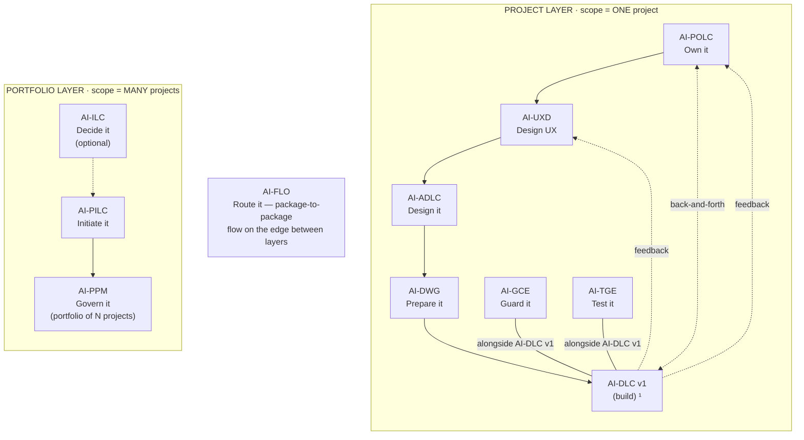

# AI-ADLC (AI-Driven Architecture Design Life Cycle)

[](./LICENSE)

**Version:** 1.1.0
**Created By:** Maheri — [LinkedIn](https://www.linkedin.com/in/mohammad-maheri-8399565b)
**Inspired By:** [awslabs/aidlc-workflows](https://github.com/awslabs/aidlc-workflows) (MIT-0)
**License:** Apache 2.0 with Attribution Addendum — See `LICENSE` and `NOTICE`

---

## The AI-* PDLC Family

AI-ADLC is part of **AIFLC** (AI Full Life Cycle) — the AI-* PDLC Family of injectable workflow packages.


  ¹ AI-DLC v1 = Amazon's open-source build lifecycle (not ours; we feed it).

| Layer | Package | Type | Input | Output |
|-------|---------|------|-------|--------|
| Portfolio | **AI-ILC** ² | Interactive workflow (lifecycle) | Raw idea | Approved Idea Brief / Feature Brief |
| Portfolio | **AI-PILC** | Interactive workflow (lifecycle) | Raw requirement | Project Initiation Package (PIP) |
| Portfolio | **AI-PPM** ³ | Adaptive portfolio engine | Multiple PIPs + Approved Idea Briefs | Portfolio register + cross-project prioritization & governance |
| Edge | **AI-FLO** ³ | Router / orchestration engine | Any package output marker | Routing decision + handoff to next package/layer |
| Project | **AI-POLC** ³ | Interactive workflow (lifecycle) | PIP | Product Backlog Package (PBP) |
| Project | **AI-UXD** ³ | Interactive workflow (lifecycle) | PIP + PBP | UX Design Package (UXP): personas/journeys, IA, user flows, design system + tokens, accessibility baseline |
| Project | **AI-ADLC** | Interactive workflow (lifecycle) | PIP + PBP + UXP | Architecture Package (AP) |
| Project | **AI-DWG** | One-time generator | AP + PBP + UXP | Ready-to-code development workspace (DW) |
| Project | **AI-GCE** | Adaptive governance engine | DW (AI-DWG output) | Compliance enforcement layer |
| Project | **AI-TGE** | Test governance engine | DW / build artifacts | Test governance & quality layer |
| Project | **AI-DLC v1** ¹ | Interactive workflow (lifecycle) | DW + GCE + User Stories (from AI-POLC) | Working Software |

> ¹ **AI-DLC v1** ([awslabs/aidlc-workflows](https://github.com/awslabs/aidlc-workflows)) is NOT our product. Our chain produces the workspace AI-DLC v1 consumes.
> ² **AI-ILC** is an **optional pre-stage** (the funnel before the funnel). The chain still works without it for users who start at AI-PILC. `⇢` denotes the optional link.
> ³ All packages in this table are **built**. AI-PPM (portfolio engine), AI-FLO (router), AI-POLC (product ownership lifecycle), and AI-UXD (UX design lifecycle) were the last four — completed June 2026. Within the Project layer, **AI-POLC, AI-UXD, and AI-ADLC run sequentially** (POLC→UXD→ADLC) — each feeds the next, culminating at AI-DWG which receives all three outputs (AP + PBP + UXP). **AI-GCE and AI-TGE run alongside AI-DLC v1** as continuous quality engines; **AI-POLC ⇄ AI-DLC v1** exchange backlog/acceptance throughout delivery; and **AI-DLC v1 runtime feedback flows back to both AI-UXD and AI-POLC**. Feedback loops (ADLC→POLC cost/risk, ADLC→UXD constraints) provide iterative refinement without changing the forward sequence.

> **AI-DFE** ([Data Fabric Engine](../ai-dfe/)) is a family-scoped **companion** — it gathers data from all packages and distributes structured JSON for dashboards and status roll-ups. It runs alongside the chain rather than as a linear step, so it is not shown as a chain row above.

---

## What is AI-ADLC?

AI-ADLC is an injectable workflow that guides an AI assistant (acting as CTO/Chief Architect) and a human user through the complete process of designing a solution architecture — from receiving project requirements to delivering a professional, development-ready Architecture Package.

It is general-purpose, reusable, and contains zero project-specific content. Drop it into any workspace, point it at requirements, and it walks you through 5 phases and 13 stages of structured architecture design.

---

## Where AI-ADLC Sits in the Chain

AI-ADLC is the **third step of the Project layer** — the terminal design step before workspace generation: **AI-POLC → AI-UXD → AI-ADLC → AI-DWG**. Acting as a CTO/Chief Architect, it turns requirements (plus the backlog and UX design when present) into a development-ready **Architecture Package (AP)**. Because it is the terminal predecessor, by the time it completes all three of AI-DWG's inputs (AP + PBP + UXP) are present.

| Aspect | AI-ADLC |
|--------|---------|
| **Layer** | Project |
| **Position** | Third in the Project-layer sequence (POLC → UXD → ADLC → DWG); terminal design step |
| **Predecessor** | AI-PILC (PIP); AI-POLC (PBP) and AI-UXD (UXP) when chained |
| **Direct successors** | AI-DWG (consumes the AP to generate the workspace); AI-TGE (reads the AP to derive tests) |
| **Reads (input)** | PIP (`pilc-state.md`) or standalone requirements; optionally PBP (`polc-state.md`) and UXP (`uxd-state.md`) |
| **Produces (output)** | Architecture Package (AP) under `pdlc-ws/projects/PRJ-{ABBREV}-{slug}/architecture/` |
| **Output marker** | `adlc-state.md` |
| **Correlation key** | Adopts the upstream `projectId` (never re-mints) |
| **Capability emitted** | `architecture-design@1` (consumed by AI-DWG and AI-TGE; read back by AI-POLC/AI-UXD) |
| **Capability consumed** | `project-initiation@1`; optionally `product-backlog@1`, `ux-design@1` (all internal) |

**Simplified chain view** (see the diagram above for the full topology):

```
AI-PILC → [ AI-POLC → AI-UXD → AI-ADLC → AI-DWG ] → AI-DLC v1
                                ▲ you are here (terminal design step)
```

AI-ADLC answers **"how is this built — structure, technology, and the decisions behind them?"** It defines the file-ownership boundaries (DDD) that flow **DEFINE → GENERATE → ENFORCE** (AI-ADLC → AI-DWG → AI-GCE). It does not generate the workspace (AI-DWG), enforce the design (AI-GCE), or write code (AI-DLC v1). Feedback loops let it push cost/risk bands back to AI-POLC and constraints back to AI-UXD.

### Standalone vs. chained

- **Standalone.** Point it at requirements + a charter (or an existing architecture to extend) and it produces a full AP — no other package required.
- **Chained (upstream).** It reads `pilc-state.md` for the PIP and, in the sequential model, enriches from `polc-state.md` (backlog priorities) and `uxd-state.md` (UI architecture needs).
- **Chained (downstream).** On completion it writes `adlc-state.md` and the AP; AI-DWG generates the workspace from it and AI-TGE derives the test strategy.
- **Brownfield-aware.** Existing-system integration is a first-class intake mode, not an afterthought.
- **Extensions on demand.** Ten advanced architecture patterns activate only when the system justifies them (see Extensions below) — each becomes a set of blocking, verified constraints once enabled.

---

## Key Features

| Feature | Description |
|---------|-------------|
| **CTO Perspective** | AI acts as an experienced Chief Architect — pragmatic, team-aware, constraint-respectful |
| **Adaptive Intake** | Handles full PIP, raw PRD, verbal description, or brownfield extension |
| **ADR-Driven** | Every major decision produces a formal Architecture Decision Record |
| **C4 Model** | Progressive decomposition: System Context → Containers → Components |
| **Constraint-Aware** | Never recommends outside stated boundaries |
| **Resumable** | State file enables multi-session architecture work |
| **Platform-Agnostic** | Works with Kiro, Q Developer, Cursor, Cline, Claude Code, Copilot |

---

## What It Produces

A complete Architecture Package containing:

- Architecture Vision & Principles
- System Context Diagram (C4 Level 1)
- Container Diagram (C4 Level 2)
- Technology Stack Document (with ADRs)
- Multi-Tenancy Architecture (if applicable)
- Security & Identity Architecture
- Data Architecture & Schema Strategy
- API Architecture & Contracts
- Integration Architecture
- Infrastructure & Deployment Architecture
- Component Design (C4 Level 3)
- Architecture Decision Records (ADR-001, ADR-002, ...)
- Architecture Workbook
- Package README (summary and reading guide)

---

## The Five Phases

```
🔵 FOUNDATION       →  Load context, assess complexity, define vision & principles
🟠 DECOMPOSITION    →  Define system boundaries, containers (C4 L1 + L2)
🟡 DECISIONS        →  Select technology, isolation patterns, security model
🟢 DESIGN           →  Detail data, API, integrations, infrastructure, components (C4 L3)
🚀 ASSEMBLY         →  Consolidate, cross-check, produce final package
```

---

## Activation

**Explicit key:** type `_ADLC_` in any prompt to activate AI-ADLC unambiguously — even when other AI-* packages share the workspace. The status key `_ACTIVE_` reports which package is currently active. A package switch never happens without your explicit key or confirmation, and any switch is announced on the first line of the response (`Active package: AI-ADLC`). See [`../TRIGGER_KEYS_REFERENCE.md`](../TRIGGER_KEYS_REFERENCE.md) for the full family key table.

---

## Installation

AI-ADLC is pure Markdown — no runtime, no dependencies, no build step. "Installing" means placing two folders and one always-loaded router file where your AI agent will read them.

### The model (read this first)

Installation writes to exactly three places:

1. **The package home** — `ai-adlc-rules/` (the core **dispatcher**) and `ai-adlc-rule-details/` (stage details, extensions, and templates, read on demand) are copied into `.aiflc/pdlc/`. This path is **identical on every platform**.
2. **One always-loaded orchestrator** — a single small router placed in your platform's native auto-load slot. It is the *only* file that loads automatically; it reads the AI-ADLC core on demand when you activate the package. (Nothing under `.aiflc/` auto-loads — that keeps the context window free no matter how many packages you install.)
3. **The output workspace** — `pdlc-ws/` at your workspace root; AI-ADLC writes the Architecture Package under `pdlc-ws/projects/PRJ-{ABBREV}-{slug}/architecture/`.

### Option A — Install alongside the family (recommended)

Run the family installer from the repo root. It places AI-ADLC (and any other packages you pick) correctly for your platform, deploys the orchestrator, and creates `pdlc-ws/`.

```powershell
# Windows (PowerShell) — install just AI-ADLC on Kiro
.\installer\install.ps1 -TargetWorkspace "C:\path\to\your\project" -Platform kiro -Packages "ai-adlc"
```

```bash
# macOS / Linux — install just AI-ADLC on Kiro
./installer/install.sh --target ~/path/to/your/project --platform kiro --packages ai-adlc
```

Swap `-Packages "ai-adlc"` for `-Bundle minimal` (AI-PILC + AI-ADLC + AI-DWG), `-Bundle arch` (AI-ADLC + AI-DWG + AI-GCE), or `-Bundle full` to install more of the chain at once. Supported `-Platform` values: `kiro`, `cursor`, `claude-code`, `cline`, `amazonq`, `copilot`.

### Option B — Install this package individually (manual)

Two copy operations plus one orchestrator placement. Copy the two package folders into the uniform home (same on every platform):

```
ai-adlc/ai-adlc-rules/        →  <workspace>/.aiflc/pdlc/ai-adlc-rules/
ai-adlc/ai-adlc-rule-details/ →  <workspace>/.aiflc/pdlc/ai-adlc-rule-details/
```

Then place the always-loaded orchestrator (`session-orchestrator.md`, from the packages root) in your platform's slot:

| Platform | Orchestrator destination | How it loads |
|----------|--------------------------|--------------|
| **Kiro** | `.kiro/steering/session-orchestrator-pdlc.md` | Auto-loaded steering |
| **Amazon Q** | `.amazonq/rules/pdlc/session-orchestrator.md` | Auto-loaded rule |
| **Cursor** | `.cursor/rules/pdlc-session-orchestrator.mdc` | Add `alwaysApply: true` frontmatter |
| **Cline** | `.clinerules/pdlc-session-orchestrator.md` | Auto-loaded rule |
| **Claude Code** | `CLAUDE_PDLC_ORCHESTRATOR.md` | Import from root `CLAUDE.md` via `@CLAUDE_PDLC_ORCHESTRATOR.md` |
| **GitHub Copilot** | `.github/copilot-instructions-pdlc-orchestrator.md` | Workspace instructions |
| **Codex / VS Code agent** | `AGENTS.md` (workspace root) | Auto-loaded agent instructions |

> Claude Code uses a parallel orchestrator source, `session-orchestrator.claude.md`. Finally, create `pdlc-ws/` at your workspace root for output.

### For AI agents — machine-readable install manifest

An AI assistant can install AI-ADLC by parsing and executing the block below. All `copy.from` and `orchestrator.source` paths are relative to `source_root`; every destination is relative to the workspace root. Pick the one `orchestrator.slot` row that matches the target platform. The manifest is **platform-agnostic** — everything except `orchestrator.slot` is identical on every platform.

```yaml
# AIFLC INSTALL MANIFEST — AI-ADLC
package: AI-ADLC
family: pdlc                       # package home: .aiflc/pdlc/
version: 1.1.0
runtime: none                      # pure Markdown; no deps, no build
source_root: pdlc-packages/        # clone root of the AIPDLC repo
activation_phrase: "Using AI-ADLC, design the architecture"
trigger_key: "_ADLC_"              # universal explicit key (recognized by the orchestrator on any platform); or use activation_phrase
status_key: "_ACTIVE_"             # reports which package is currently active
depends_on: []                     # standalone-capable from requirements + charter
optional_inputs:
  - marker: pilc-state.md          # AI-PILC PIP (requirements, scope, charter)
  - marker: polc-state.md          # AI-POLC backlog priorities
  - marker: uxd-state.md           # AI-UXD UI architecture needs
emits_capability: "architecture-design@1"
output_marker: adlc-state.md
output_dir: pdlc-ws/               # per-project AP under pdlc-ws/projects/PRJ-.../architecture/
copy:
  - from: ai-adlc/ai-adlc-rules
    to: .aiflc/pdlc/ai-adlc-rules
  - from: ai-adlc/ai-adlc-rule-details
    to: .aiflc/pdlc/ai-adlc-rule-details
orchestrator:
  source: session-orchestrator.md            # the ONLY always-loaded file
  source_claude: session-orchestrator.claude.md   # use this source for claude-code
  slot:
    kiro: .kiro/steering/session-orchestrator-pdlc.md
    amazonq: .amazonq/rules/pdlc/session-orchestrator.md
    cursor: .cursor/rules/pdlc-session-orchestrator.mdc   # + frontmatter alwaysApply: true
    cline: .clinerules/pdlc-session-orchestrator.md
    claude-code: CLAUDE_PDLC_ORCHESTRATOR.md              # import from root CLAUDE.md
    copilot: .github/copilot-instructions-pdlc-orchestrator.md
    codex: AGENTS.md
    vscode: AGENTS.md
core_entry: .aiflc/pdlc/ai-adlc-rules/core-workflow.md    # orchestrator Reads this on activation
rule_details_home: .aiflc/pdlc/ai-adlc-rule-details/      # core resolves these on demand
verify:
  - path_exists: .aiflc/pdlc/ai-adlc-rules/core-workflow.md
  - path_exists: .aiflc/pdlc/ai-adlc-rule-details/
  - orchestrator_present_in_platform_slot: true
  - action: 'say "Using AI-ADLC, design the architecture" and expect the AI-ADLC welcome message'
```

### Verify

1. Open the workspace in your IDE with the AI agent active.
2. Confirm the orchestrator loaded (Kiro: it appears in the Steering panel).
3. Start a chat: `Using AI-ADLC, design the architecture`.
4. AI-ADLC greets you and begins; architecture output appears under `pdlc-ws/projects/PRJ-.../architecture/`.

For the full per-platform walkthrough (including limitations and workarounds), see [setup/INSTALL.md](./setup/INSTALL.md) and the family-wide [INSTALL_GUIDE.md](../../INSTALL_GUIDE.md).

---

## Output Directory Structure

AI-ADLC outputs into the standard multi-project layout. Architecture artifacts land in `architecture/` within the project folder:

```
pdlc-ws/projects/
├── PROJECTS.md                          ← workspace registry
└── PRJ-{ABBREV}-{slug}/                  ← one project
    ├── management_framework/             ← shared governance spine
    └── architecture/                     ← AI-ADLC output
        ├── adlc-state.md                 ← progress marker
        ├── architecture-vision.md
        ├── system-context.md
        ├── container-diagram.md
        ├── technology-stack.md
        ├── security-architecture.md
        ├── data-architecture.md
        ├── api-architecture.md
        ├── integration-architecture.md
        ├── component-design.md
        ├── architecture-workbook.md
        ├── ADR-001.md … ADR-NNN.md
        └── AP_README.md
```

> The `projects/` structure is always-on — solo, single-project, and multi-project alike. See `OUTPUT_AND_STATE_CONTRACT.md` for full details.

---

## Usage

1. Open your workspace with the AI assistant active
2. Start a chat:
   ```
   Using AI-ADLC, design the architecture for this system: [provide source]
   ```
3. The workflow activates and guides you through progressive design
4. Approve each stage's output at gates
5. All artifacts are produced in your configured output folder

---

## File Structure

```
ai-adlc/
├── README.md
├── LICENSE
├── ROADMAP.md
├── ai-adlc-rules/
│   └── core-workflow.md
└── ai-adlc-rule-details/
    ├── common/
    │   ├── process-overview.md
    │   ├── session-continuity.md
    │   ├── question-format-guide.md
    │   ├── content-validation.md
    │   ├── diagram-standards.md
    │   └── welcome-message.md
    ├── foundation/
    │   ├── workspace-detection.md
    │   ├── requirements-ingestion.md
    │   └── architecture-vision.md
    ├── decomposition/
    │   ├── system-context.md
    │   └── container-design.md
    ├── decisions/
    │   ├── technology-stack.md
    │   ├── multi-tenancy.md
    │   └── security-identity.md
    ├── design/
    │   ├── data-architecture.md
    │   ├── api-architecture.md
    │   ├── integration-infrastructure.md
    │   └── component-design.md
    ├── assembly/
    │   └── package-assembly.md
    ├── extensions/
    │   ├── README.md
    │   ├── ddd-tactical/
    │   │   ├── ddd-tactical.opt-in.md
    │   │   └── ddd-tactical.md
    │   ├── microservices/
    │   │   ├── microservices.opt-in.md
    │   │   └── microservices.md
    │   ├── bff-pattern/
    │   │   ├── bff-pattern.opt-in.md
    │   │   └── bff-pattern.md
    │   ├── event-sourcing-cqrs/
    │   │   ├── event-sourcing-cqrs.opt-in.md
    │   │   └── event-sourcing-cqrs.md
    │   ├── event-storming/
    │   │   ├── event-storming.opt-in.md
    │   │   └── event-storming.md
    │   ├── resilience-patterns/
    │   │   ├── resilience-patterns.opt-in.md
    │   │   └── resilience-patterns.md
    │   ├── feature-flags/
    │   │   ├── feature-flags.opt-in.md
    │   │   └── feature-flags.md
    │   ├── domain-storytelling/
    │   │   ├── domain-storytelling.opt-in.md
    │   │   └── domain-storytelling.md
    │   ├── threat-modeling/
    │   │   ├── threat-modeling.opt-in.md
    │   │   └── threat-modeling.md
    │   └── wardley-mapping/
    │       ├── wardley-mapping.opt-in.md
    │       └── wardley-mapping.md
    └── templates/
        ├── adr-template.md
        ├── adr-saga-pattern.md
        ├── architecture-vision.md
        ├── system-context.md
        ├── container-diagram.md
        ├── technology-stack.md
        ├── security-architecture.md
        ├── data-architecture.md
        ├── api-architecture.md
        ├── integration-architecture.md
        ├── component-design.md
        ├── multi-tenancy.md
        └── architecture-workbook.md
```

---

## Tenets

1. **CTO pragmatism** — Proven patterns over novel experiments; team-aware recommendations
2. **Decision transparency** — Every major choice has a recorded ADR with alternatives analysis
3. **Progressive detail** — C4 L1 → L2 → L3; never detail internals before boundaries are set
4. **Constraint-first** — Never recommend outside stated boundaries, no matter how "better" it seems
5. **Adaptive** — Scale rigor to complexity; don't over-architect simple systems
6. **Resumable** — Multi-session work with full state preservation
7. **Agnostic** — Works with any IDE, agent, or model

---

## Patterns, Methodologies & Frameworks Covered

AI-ADLC operationalizes **senior architecture practice** — progressive, decision-driven system design. Its **core** always applies the methodologies below; ten **advanced patterns** are opt-in extensions (catalogued in the next section) that activate only when the architecture justifies them. AI-ADLC aligns with these bodies of knowledge and adapts them to an AI-assisted, human-gated workflow; it does not certify against any of them.

| Framework / body of knowledge | What AI-ADLC applies | Where it stops (scope boundary) |
|---|---|---|
| **C4 model** (Simon Brown) | Progressive decomposition — System Context (L1) → Containers (L2) → Components (L3) — in Mermaid, boundaries before internals | Stops at L3; it does not emit code or L4 code-level diagrams (that's the build) |
| **Architecture Decision Records** (Nygard) | A formal ADR for every major decision — context, options considered, decision, consequences — sequentially numbered | It records and justifies decisions; runtime enforcement of them is AI-GCE |
| **Quality attributes / NFRs** (constraint-first) | Security, scalability, availability, performance, and tenancy treated as first-class constraints that recommendations may never exceed | Not a formal ISO/IEC 25010 audit — it designs to constraints, it doesn't score them |
| **Multi-tenancy, security & identity architecture** | Isolation patterns, trust boundaries, and the identity model as dedicated, ADR-backed decision stages | In-depth threat modeling is the opt-in Threat Modeling extension |
| **Data · API · integration architecture** | Schema strategy, contract-first API design, and integration topology as specifications | Specs only — implementation is the build (AI-DLC v1) |
| **10 advanced patterns** (opt-in extensions) | DDD tactical, Event Storming, Domain Storytelling, Microservices, BFF, Event Sourcing/CQRS, Resilience, Feature Flags, Wardley Mapping, Threat Modeling (STRIDE) — each a set of blocking, verified rules once enabled | Each stays dormant unless opted in; see the Extensions section below |

The boundary: AI-ADLC produces the **Architecture Package** (design + ADRs + diagrams) and defines the file-ownership boundaries that flow **DEFINE → GENERATE → ENFORCE** (AI-ADLC → AI-DWG → AI-GCE). It does not generate the workspace, enforce compliance, or build code.

---

## Cross-Cutting Lenses (AI · Automation · Agentic)

AI-ADLC designs the **architecture** side of the family's cross-cutting lenses — for any feature the lenses tagged upstream (modes live in `Lens_Status.md`, set at AI-PILC and tagged at AI-POLC). It ships `ai-lens/`, `automation-lens/`, and `agentic-lens/` facets.

| Lens | Mode (on / off) | Key | What AI-ADLC does when it's on |
|------|-----------------|-----|-------------------------------|
| **AI Lens** | AI-Powered / No-AI | `_AILENS_` | Designs the AI/ML architecture facet for tagged features (model serving, RAG, MLOps) |
| **Automation Lens** | Automated / Manual | `_AUTOLENS_` | Designs the automation architecture facet |
| **Agentic** (AI ∩ Automation) | derived — both on | — | Designs the agent architecture — tool-use, reasoning-loop, memory, and evaluation |

Downstream, AI-DWG provisions the scaffolding and AI-GCE / AI-TGE govern and test the tagged features via Layer-3 agents (`AIG__`/`ATG__`, `AIQ__`/`ATQ__`). *(This is distinct from the opt-in architecture extensions below — the lenses are cross-cutting modes, not per-project pattern add-ons.)*

---

## Extensions (v1.1 — Delivered)

AI-ADLC supports an extension system for advanced architectural patterns. Extensions activate via opt-in during the workflow when your system needs them. Once activated, extension rules are blocking constraints — enforced and verified at stage completion.

### Available Extensions (v1.1 — Complete)

| Extension | Pattern | Rules | When Needed |
|-----------|---------|:-----:|-------------|
| `ddd-tactical/` | DDD Tactical Patterns | DDD-01 → DDD-12 | Complex domain logic with aggregates, domain events, ACLs |
| `microservices/` | Microservices Deep-Dive | MS-01 → MS-12 | Service mesh, distributed tracing, saga patterns |
| `bff-pattern/` | Backend-for-Frontend | BFF-01 → BFF-10 | Multiple client types needing different API shapes |
| `event-sourcing-cqrs/` | Event Sourcing + CQRS | ES-01 → ES-12 | Full audit trail, temporal queries, event-driven state |
| `resilience-patterns/` | Resilience Catalog | RES-01 → RES-12 | Circuit breaker, bulkhead, graceful degradation |
| `feature-flags/` | Feature Flags & Progressive Delivery | FF-01 → FF-11 | Controlled rollout, A/B testing, kill switches |
| `event-storming/` | Event Storming (discovery) | EVS-01 → EVS-12 | Process/behaviour-heavy domain; discover events & boundaries before structure |
| `domain-storytelling/` | Domain Storytelling (discovery) | DST-01 → DST-10 | Narrative discovery (actor → activity → work object); alternative/complement to Event Storming |
| `wardley-mapping/` | Wardley Mapping | WDL-01 → WDL-08 | Build-vs-buy positioning; value-chain × evolution (Stage 6) |
| `threat-modeling/` | Threat Modeling — Deep | THM-01 → THM-10 | High-security systems; STRIDE DFD, attack trees, risk rating (Stage 8) |

Each extension provides: numbered rules with verification criteria, anti-patterns, ADR triggers, stage-completion checklists, and reusable templates.

### Future Extensions (see ROADMAP.md)

Serverless, AI/ML Integration, Micro-Frontends, GraphQL Federation, Multi-Region, Zero Trust, Kubernetes-Native, Edge Computing, Data Mesh, Chaos Engineering, and more.

---

## Author

Created by **Maheri** — [LinkedIn](https://www.linkedin.com/in/mohammad-maheri-8399565b)

Designed from real-world CTO architecture practice, combining structured design methodology with AI-driven interactive workflows.

---

## Further Reading

Deep-dive knowledge documents for this package (in the family repo under `knowledge_docs/`):

| Document | What it covers |
|----------|---------------|
| [How ADLC Progressive Decomposition Works](../../knowledge_docs/HOW_ADLC_PROGRESSIVE_DECOMPOSITION_WORKS.md) | C4 model progression — L1 → L2 → L3 in AI-ADLC |
| [How ADLC Extensions Work](../../knowledge_docs/HOW_ADLC_EXTENSIONS_WORK.md) | The 10 opt-in advanced architecture patterns |
| [How to Design Architecture](../../knowledge_docs/HOW_TO_DESIGN_ARCHITECTURE.md) | Practitioner guide — running AI-ADLC on a real project |
| [How to Choose Architecture Extensions](../../knowledge_docs/HOW_TO_CHOOSE_ARCHITECTURE_EXTENSIONS.md) | Decision guide — which extensions fit your system |
| [How to Handle Architecture Changes Mid-Project](../../knowledge_docs/HOW_TO_HANDLE_ARCHITECTURE_CHANGES_MID_PROJECT.md) | What happens when architecture changes after workspace generation |
| [How Package Installation Works](../../knowledge_docs/HOW_PACKAGE_INSTALLATION_WORKS.md) | How the installer places packages into your workspace |
| [How Chain Handoff Works](../../knowledge_docs/HOW_CHAIN_HANDOFF_WORKS.md) | How AI-ADLC reads UXP and feeds AI-DWG |
| [How Gates and Approvals Work](../../knowledge_docs/HOW_GATES_AND_APPROVALS_WORK.md) | The human-in-the-loop gate model at every stage |
| [How Depth Levels Work](../../knowledge_docs/HOW_DEPTH_LEVELS_WORK.md) | Minimal / Standard / Comprehensive adaptive tiers |
| [Lifecycle of an Architecture Decision](../../knowledge_docs/LIFECYCLE_OF_AN_ARCHITECTURE_DECISION.md) | How ADRs move through proposed → accepted → propagated → superseded |
| [Why Architecture Before Code Matters](../../knowledge_docs/WHY_ARCHITECTURE_BEFORE_CODE_MATTERS.md) | Stakeholder justification for upfront architecture investment |
| [Interaction Between Extensions and Governance](../../knowledge_docs/INTERACTION_BETWEEN_EXTENSIONS_AND_GOVERNANCE.md) | How activated extensions affect AI-GCE's derived rules |

---

## License

**Apache License 2.0 with Attribution Addendum**

- **Free to use:** Personal, commercial, educational, and organizational use — all permitted
- **Modify and distribute:** Create derivative works, redistribute, sublicense — all permitted
- **Attribution required:** Any distributed product substantially based on this work must include:

> *"Built on AIFLC by Mohammad Maheri — [LinkedIn](https://www.linkedin.com/in/mohammad-maheri-8399565b)"*

- **No warranty:** Provided "AS IS" without warranties of any kind

See `LICENSE` and `NOTICE` in this directory for full terms.

**Copyright:** © 2026 Mohammad Maheri

> **Note:** AI-DLC v1 (Development Life Cycle) is NOT part of the AI-* Family — it is a separate AWS product ([awslabs/aidlc-workflows](https://github.com/awslabs/aidlc-workflows)) licensed under MIT-0.

---

*Part of [AIFLC](../../README.md) — the AI-* PDLC Family*
