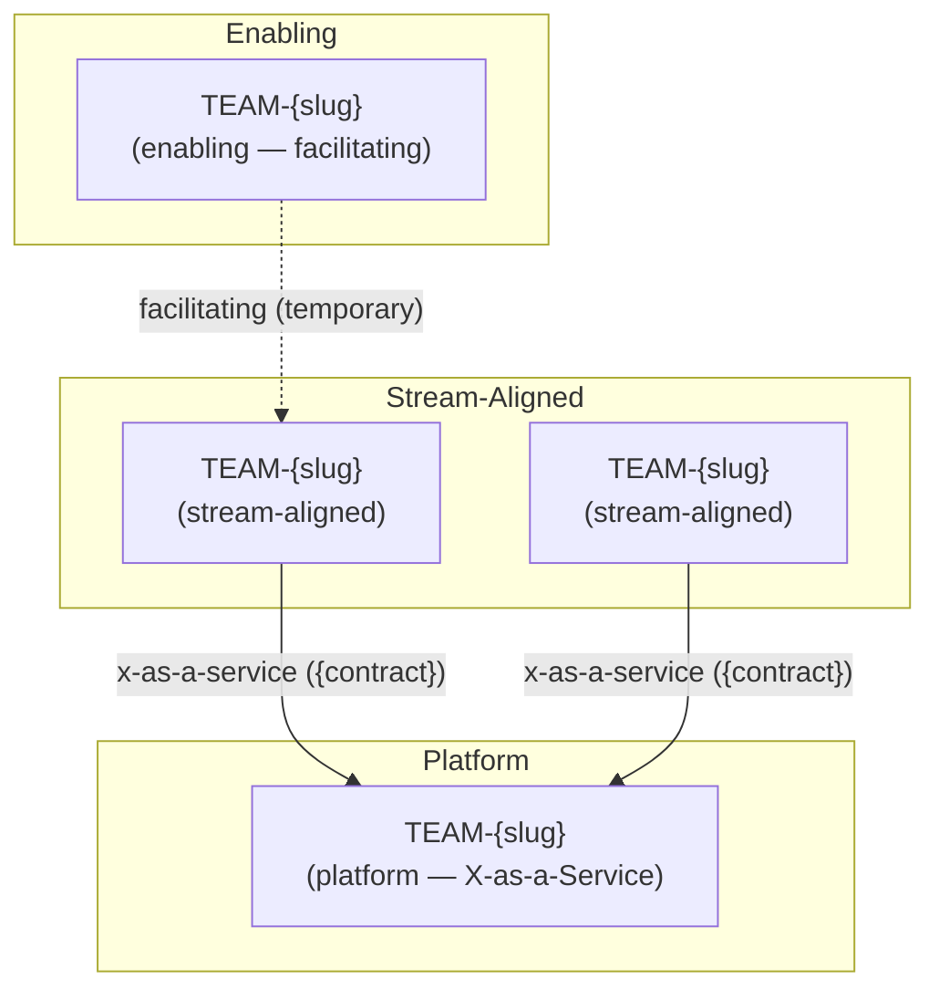

<!-- Copyright (c) 2026 Mohammad Maheri. Licensed under Apache 2.0. See LICENSE. Attribution required - see NOTICE. -->
# Team Topology Map

**Document Status:** {Draft / Review / Approved}
**Version:** {n.n}
**Date:** {YYYY-MM-DD}
**Author:** {Role}
**Extension:** team-topologies (opt-in) · **Produced at:** Stage 5 (Container Design)

> Produced only when the `team-topologies` extension is active. Models the teams, their types, and their interaction modes, and pairs with `team-context-registry.md` (the authoritative Team ↔ BC ↔ Service ownership map).

---

## 1. Teams

| # | Team ID | Name | Type | Owned Contexts (BC-*) | Owned Services (SVC-*) | Cognitive-Load Budget |
|---|---------|------|------|-----------------------|------------------------|-----------------------|
| 1 | TEAM-{slug} | {name} | stream-aligned \| platform \| enabling \| complicated-subsystem | {BC-slug, ...} | {SVC-slug, ... or n/a} | {e.g. max N contexts} |

**Team-type rules:** stream-aligned teams are the majority (TT-01); each non-stream-aligned team states why (TT-01); no context is owned by more than one team (TT-02).

---

## 2. Interaction Modes

| # | From Team | To Team | Mode | Sanctioned Coupling (contract) | End Condition |
|---|-----------|---------|------|-------------------------------|---------------|
| 1 | TEAM-{slug} | TEAM-{slug} | collaboration \| x-as-a-service \| facilitating | {contract ref — for x-as-a-service} | {time-box — for collaboration/facilitating} |

**Interaction rules:** every team-to-team dependency names exactly one mode (TT-03); collaboration is time-boxed (TT-03); enabling engagements are temporary (TT-07); X-as-a-Service points at a published contract (TT-10).

---

## 3. Topology Diagram

> Follow `diagram-standards.md`. Solid edges = runtime/contract dependency (collaboration, X-as-a-Service); dotted edges = facilitating (temporary, non-runtime).

---

## 4. Conway Alignment

| Bounded Context (BC-*) | Fracture Plane (from DDD-08) | Owning Team | Aligned? | Inverse-Conway Move (if not) |
|------------------------|------------------------------|-------------|:--------:|------------------------------|
| BC-{slug} | {context boundary} | TEAM-{slug} | ✅ / ⚠️ | {required reorg, or "—"} |

**Alignment rules:** team boundaries mirror fracture planes (TT-06); splits follow the DDD context map, not the org chart (TT-08). Flag mismatches as inverse-Conway maneuvers.

---

## 5. Narrative Description

{2–4 paragraphs: the shape of the team topology, why teams are typed as they are, where the platform reduces cognitive load, which collaborations are temporary, and any inverse-Conway move the architecture requires from the organization.}

---

*Generated by AI-ADLC · AIFLC PDLC Family · © Mohammad Maheri · https://github.com/mbmd/AIFLC*
