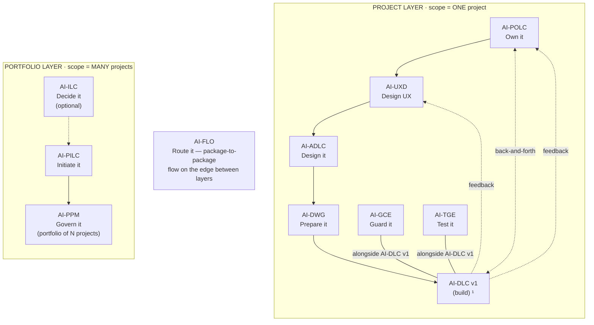

# AI-DWG — AI-Driven Workspace Generator

[](./LICENSE)

**Version:** 1.0.0

**Transform architecture into a ready-to-code development workspace.**

---

## What It Does

AI-DWG composes a complete development workspace from one or more design-time peer inputs — Architecture Package (from AI-ADLC), Product Backlog Package (from AI-POLC), and/or UX Design Package (from AI-UXD). Any non-empty combination is valid; none is privileged. It generates Kiro steering files, project instructions, repository structure, configuration files, and operational documents — scoped to the input clusters actually present.

**Input:** Any non-empty subset of {Architecture Package (AI-ADLC), Product Backlog Package (AI-POLC), UX Design Package (AI-UXD)} — all structured markdown documents. At least one is required; the more you provide, the richer the workspace.
**Output:** Ready-to-code workspace with governance, structure, and rules

---

## The AI-* PDLC Family

AI-DWG is part of **AIFLC** (AI Full Life Cycle) — the AI-* PDLC Family of injectable workflow packages.


  ¹ AI-DLC v1 = Amazon's open-source build lifecycle (not ours; we feed it).

| Layer | Package | Type | Input | Output |
|-------|---------|------|-------|--------|
| Portfolio | **AI-ILC** ² | Interactive workflow (lifecycle) | Raw idea | Approved Idea Brief / Feature Brief |
| Portfolio | **AI-PILC** | Interactive workflow (lifecycle) | Raw requirement | Project Initiation Package (PIP) |
| Portfolio | **AI-PPM** ³ | Adaptive portfolio engine | Multiple PIPs + Approved Idea Briefs | Portfolio register + cross-project prioritization & governance |
| Edge | **AI-FLO** ³ | Router / orchestration engine | Any package output marker | Routing decision + handoff to next package/layer |
| Project | **AI-POLC** ³ | Interactive workflow (lifecycle) | PIP | Product Backlog Package (PBP) |
| Project | **AI-UXD** ³ | Interactive workflow (lifecycle) | PIP + PBP | UX Design Package (UXP): personas/journeys, IA, user flows, design system + tokens, accessibility baseline |
| Project | **AI-ADLC** | Interactive workflow (lifecycle) | PIP + PBP + UXP | Architecture Package (AP) |
| Project | **AI-DWG** | One-time generator | AP + PBP + UXP | Ready-to-code development workspace (DW) |
| Project | **AI-GCE** | Adaptive governance engine | DW (AI-DWG output) | Compliance enforcement layer |
| Project | **AI-TGE** | Test governance engine | DW / build artifacts | Test governance & quality layer |
| Project | **AI-DLC v1** ¹ | Interactive workflow (lifecycle) | DW + GCE + User Stories (from AI-POLC) | Working Software |

> ¹ **AI-DLC v1** ([awslabs/aidlc-workflows](https://github.com/awslabs/aidlc-workflows)) is NOT our product. Our chain produces the workspace AI-DLC v1 consumes.
> ² **AI-ILC** is an **optional pre-stage** (the funnel before the funnel). The chain still works without it for users who start at AI-PILC. `⇢` denotes the optional link.
> ³ All packages in this table are **built**. AI-PPM (portfolio engine), AI-FLO (router), AI-POLC (product ownership lifecycle), and AI-UXD (UX design lifecycle) were the last four — completed June 2026. Within the Project layer, **AI-POLC, AI-UXD, and AI-ADLC run sequentially** (POLC→UXD→ADLC) — each feeds the next, culminating at AI-DWG which receives all three outputs (AP + PBP + UXP). **AI-GCE and AI-TGE run alongside AI-DLC v1** as continuous quality engines; **AI-POLC ⇄ AI-DLC v1** exchange backlog/acceptance throughout delivery; and **AI-DLC v1 runtime feedback flows back to both AI-UXD and AI-POLC**. Feedback loops (ADLC→POLC cost/risk, ADLC→UXD constraints) provide iterative refinement without changing the forward sequence.

> **AI-DFE** ([Data Fabric Engine](../ai-dfe/)) is a family-scoped **companion** — it gathers data from all packages and distributes structured JSON for dashboards and status roll-ups. It runs alongside the chain rather than as a linear step, so it is not shown as a chain row above.

---

## Where AI-DWG Sits in the Chain

AI-DWG is the **hinge of the Project layer** — the terminal step of the design chain (**AI-POLC → AI-UXD → AI-ADLC → AI-DWG**) and the point where design becomes an actual, ready-to-code **development workspace**. It is a **one-time generator + reconciler**, not a lifecycle: it runs, produces the workspace, and re-runs only when an upstream input changes.

| Aspect | AI-DWG |
|--------|---------|
| **Layer** | Project (the design → build hinge) |
| **Position** | Terminal step of the Project-layer design sequence (POLC → UXD → ADLC → DWG) |
| **Predecessors (peer inputs, ≥1)** | AP (AI-ADLC), PBP (AI-POLC), UXP (AI-UXD) — equal-impact peers; any non-empty subset |
| **Direct successors** | AI-GCE and AI-TGE (companions it provisions into the generated workspace); the workspace then feeds AI-DLC v1 (the build) |
| **Reads (input)** | Any non-empty subset of `adlc-state.md` ∥ `polc-state.md` ∥ `uxd-state.md` |
| **Produces (output)** | A self-contained dev workspace at `pdlc-ws/projects/PRJ-{ABBREV}-{slug}/{slug}-workspace/`, opened separately in its own IDE |
| **Output marker** | `dwg-state.md` (capability gate); AI-GCE/AI-TGE detect `rules/workspace-rules.md` + `.governance/workspace-manifest.yaml` |
| **Correlation key** | Adopts the upstream `projectId` (never mints one — it is not a project originator) |
| **Capability emitted** | `development-workspace@1` (internal + cross-family seam-out) |
| **Capability consumed** | `architecture-design@1` (the only mandatory payload for scaffolding), `product-backlog@1`, `ux-design@1` — all internal |
| **Generates for** | kiro · claude-code · cursor · codex · generic (multi-target) — one canonical `rules/` + a thin adapter per platform |

**Simplified chain view** (see the diagram above for the full topology):

```
AI-PILC → [ AI-POLC → AI-UXD → AI-ADLC → AI-DWG ] → AI-DLC v1  (build)
                                          ▲ you are here   (AI-GCE + AI-TGE run alongside the build)
```

AI-DWG answers **"turn the design into a workspace a team (and AI-DLC v1) can build in."** It composes — it does not author the design (ADLC/POLC/UXD), build the software (AI-DLC v1), or enforce the rules at runtime (AI-GCE). It is the **Layer-2 → Layer-3 hinge**: it provisions the AI-GCE and AI-TGE companions into the generated workspace so they activate there.

### Standalone vs. chained

- **Standalone.** Point it at any one structured design package (an AP, a PBP, or a UXP) and it generates the matching workspace clusters — no full chain required. Absent inputs are skipped with a disclosed quality impact (never silently).
- **Chained.** In the sequential model all three peers (AP + PBP + UXP) are present by the time DWG runs, so it generates the richest workspace: tech steering + src structure (AP), vision + DoR/DoD + planning (PBP), design system + tokens + a11y (UXP).
- **Three modes.** Mode 1 Full Generation (greenfield) · Mode 2 Delta Reconciliation (an upstream peer changed — non-destructive, preserves `<!-- custom -->` edits) · Mode 3 Brownfield Overlay (add steering to existing code).
- **Cross-family (optional).** `development-workspace@1` is also a seam-out, so another family can consume the generated workspace.

---

## Features

- **Full Generation** — one-shot workspace creation from architecture docs
- **Delta Reconciliation** — incremental updates when architecture changes
- **Extension-Aware** — detects AI-ADLC v1.1 extensions (DDD, Microservices, BFF, Event Sourcing, Resilience, Feature Flags)
- **Conditional Generation** — only produces steering files justified by the architecture
- **Provenance Tracking** — every generated rule traces to its AP source
- **Non-Destructive Updates** — reconciliation preserves team customizations
- **Technology-Adaptive** — generates stack-appropriate configs (Node, Python, .NET, Java, Generic)
- **Prescriptive Output** — steering files say "MUST/MUST NOT", not "should/consider"

---

## What It Generates

| Category | Files |
|----------|:-----:|
| Steering files (always) | 19 |
| Steering files (conditional) | Up to 8 |
| Operational documents | 6 |
| Planning templates | 3 |
| Config files | 5 |
| Source structure | Per C4 L3 modules |

---

## Output Directory Structure

AI-DWG generates a self-contained dev workspace within the project folder. It reads peer inputs (AP, PBP, UXP) from the same project and outputs a workspace meant to be opened separately in its own IDE:

```
pdlc-ws/projects/
├── PROJECTS.md                          ← workspace registry
└── PRJ-{ABBREV}-{slug}/                  ← one project
    ├── management_framework/             ← shared governance spine
    ├── pip/                              ← AI-PILC output (read by DWG)
    ├── architecture/                     ← AI-ADLC output (read by DWG)
    ├── ux/                               ← AI-UXD output (read by DWG)
    ├── backlog/                          ← AI-POLC output (read by DWG)
    │
    └── {slug}-workspace/                 ← AI-DWG output (dev workspace)
        ├── rules/               ← generated steering files
        ├── .kiro/hooks/                  ← AI-GCE governs here
        ├── management_framework/         ← spine carried forward
        ├── src/                          ← code structure per C4 L3
        ├── tests/                        ← test structure
        └── configs …                     ← CI/CD, linting, etc.
```

> The dev workspace is opened **separately** in its own IDE instance. AI-GCE and AI-TGE operate inside it. The `projects/` structure is always-on — see `OUTPUT_AND_STATE_CONTRACT.md`.

---

## Activation

**Explicit key:** type `_DWG_` in any prompt to activate AI-DWG unambiguously — even when other AI-* packages share the workspace. The status key `_ACTIVE_` reports which package is currently active. A package switch never happens without your explicit key or confirmation, and any switch is announced on the first line of the response (`Active package: AI-DWG`). See [`../TRIGGER_KEYS_REFERENCE.md`](../TRIGGER_KEYS_REFERENCE.md) for the full family key table.

---

## Installation

AI-DWG is pure Markdown — no runtime, no dependencies, no build step. "Installing" the package means placing two folders and one always-loaded router file where your AI agent will read them. (What AI-DWG then *generates* is a separate dev workspace — see Output Directory Structure above.)

### The model (read this first)

Installation writes to exactly three places:

1. **The package home** — `ai-dwg-rules/` (the core **generator/dispatcher**) and `ai-dwg-rule-details/` (mapping, reconciliation, and templates, read on demand) are copied into `.aiflc/pdlc/`. This path is **identical on every platform**.
2. **One always-loaded orchestrator** — a single small router placed in your platform's native auto-load slot. It is the *only* file that loads automatically; it reads the AI-DWG core on demand when you activate the package. (Nothing under `.aiflc/` auto-loads — that keeps the context window free no matter how many packages you install.)
3. **The output workspace** — `pdlc-ws/` at your workspace root. AI-DWG generates the dev workspace under `pdlc-ws/projects/PRJ-{ABBREV}-{slug}/{slug}-workspace/`.

### Option A — Install alongside the family (recommended)

Run the family installer from the repo root. It places AI-DWG (and any other packages you pick) correctly for your platform, deploys the orchestrator, and creates `pdlc-ws/`.

```powershell
# Windows (PowerShell) — install just AI-DWG on Kiro
.\installer\install.ps1 -TargetWorkspace "C:\path\to\your\project" -Platform kiro -Packages "ai-dwg"
```

```bash
# macOS / Linux — install just AI-DWG on Kiro
./installer/install.sh --target ~/path/to/your/project --platform kiro --packages ai-dwg
```

Swap `-Packages "ai-dwg"` for `-Bundle minimal` (AI-PILC + AI-ADLC + AI-DWG), `-Bundle arch` (AI-ADLC + AI-DWG + AI-GCE), or `-Bundle full` to install more of the chain at once. Supported `-Platform` values: `kiro`, `cursor`, `claude-code`, `cline`, `amazonq`, `copilot`.

### Option B — Install this package individually (manual)

Two copy operations plus one orchestrator placement. Copy the two package folders into the uniform home (same on every platform):

```
ai-dwg/ai-dwg-rules/        →  <workspace>/.aiflc/pdlc/ai-dwg-rules/
ai-dwg/ai-dwg-rule-details/ →  <workspace>/.aiflc/pdlc/ai-dwg-rule-details/
```

Then place the always-loaded orchestrator (`session-orchestrator.md`, from the packages root) in your platform's slot:

| Platform | Orchestrator destination | How it loads |
|----------|--------------------------|--------------|
| **Kiro** | `.kiro/steering/session-orchestrator-pdlc.md` | Auto-loaded steering |
| **Amazon Q** | `.amazonq/rules/pdlc/session-orchestrator.md` | Auto-loaded rule |
| **Cursor** | `.cursor/rules/pdlc-session-orchestrator.mdc` | Add `alwaysApply: true` frontmatter |
| **Cline** | `.clinerules/pdlc-session-orchestrator.md` | Auto-loaded rule |
| **Claude Code** | `CLAUDE_PDLC_ORCHESTRATOR.md` | Import from root `CLAUDE.md` via `@CLAUDE_PDLC_ORCHESTRATOR.md` |
| **GitHub Copilot** | `.github/copilot-instructions-pdlc-orchestrator.md` | Workspace instructions |
| **Codex / VS Code agent** | `AGENTS.md` (workspace root) | Auto-loaded agent instructions |

> The platforms above are where AI-DWG (the package) *runs*. Separately, AI-DWG can *generate for* kiro / claude-code / cursor / codex / generic (chosen at Config Gate Q2) — that governs what the generated workspace looks like. Claude Code uses a parallel orchestrator source, `session-orchestrator.claude.md`. Finally, create `pdlc-ws/` at your workspace root.

### For AI agents — machine-readable install manifest

An AI assistant can install AI-DWG by parsing and executing the block below. All `copy.from` and `orchestrator.source` paths are relative to `source_root`; every destination is relative to the workspace root. Pick the one `orchestrator.slot` row that matches the target platform. The manifest is **platform-agnostic** — everything except `orchestrator.slot` is identical on every platform.

```yaml
# AIFLC INSTALL MANIFEST — AI-DWG
package: AI-DWG
family: pdlc                       # package home: .aiflc/pdlc/
version: 1.0.0
runtime: none                      # pure Markdown; no deps, no build
source_root: pdlc-packages/        # clone root of the AIPDLC repo
activation_phrase: "Using AI-DWG, generate the workspace"
trigger_key: "_DWG_"               # universal explicit key (recognized by the orchestrator on any platform); or use activation_phrase
status_key: "_ACTIVE_"             # reports which package is currently active
depends_on: []                     # no install-time deps
optional_inputs:                   # AI-DWG requires AT LEAST ONE present at run time (peer-input rule)
  - marker: adlc-state.md          # AP — architecture (only mandatory payload for scaffolding)
  - marker: polc-state.md          # PBP — product backlog (enrichment)
  - marker: uxd-state.md           # UXP — UX design (enrichment)
emits_capability: "development-workspace@1"
output_marker: dwg-state.md        # capability gate; AI-GCE/AI-TGE detect rules/workspace-rules.md + .governance/workspace-manifest.yaml
output_dir: pdlc-ws/               # generated dev workspace at pdlc-ws/projects/PRJ-.../{slug}-workspace/ (opened separately)
generates_for: [kiro, claude-code, cursor, codex, generic]   # platform target(s) of the GENERATED workspace (Config Gate Q2)
copy:
  - from: ai-dwg/ai-dwg-rules
    to: .aiflc/pdlc/ai-dwg-rules
  - from: ai-dwg/ai-dwg-rule-details
    to: .aiflc/pdlc/ai-dwg-rule-details
orchestrator:
  source: session-orchestrator.md            # the ONLY always-loaded file
  source_claude: session-orchestrator.claude.md   # use this source for claude-code
  slot:
    kiro: .kiro/steering/session-orchestrator-pdlc.md
    amazonq: .amazonq/rules/pdlc/session-orchestrator.md
    cursor: .cursor/rules/pdlc-session-orchestrator.mdc   # + frontmatter alwaysApply: true
    cline: .clinerules/pdlc-session-orchestrator.md
    claude-code: CLAUDE_PDLC_ORCHESTRATOR.md              # import from root CLAUDE.md
    copilot: .github/copilot-instructions-pdlc-orchestrator.md
    codex: AGENTS.md
    vscode: AGENTS.md
core_entry: .aiflc/pdlc/ai-dwg-rules/core-generator.md    # orchestrator Reads this on activation
rule_details_home: .aiflc/pdlc/ai-dwg-rule-details/       # core resolves these on demand
verify:
  - path_exists: .aiflc/pdlc/ai-dwg-rules/core-generator.md
  - path_exists: .aiflc/pdlc/ai-dwg-rule-details/
  - orchestrator_present_in_platform_slot: true
  - action: 'say "Using AI-DWG, generate the workspace" and expect the AI-DWG welcome/config gate'
```

### Verify

1. Open the workspace in your IDE with the AI agent active.
2. Confirm the orchestrator loaded (Kiro: it appears in the Steering panel).
3. Ensure at least one peer input exists (`adlc-state.md`, `polc-state.md`, or `uxd-state.md`).
4. Start a chat: `Using AI-DWG, generate the workspace`.
5. AI-DWG runs its Config Gate and generates the dev workspace under `pdlc-ws/projects/PRJ-.../{slug}-workspace/`.

For the full per-platform walkthrough (including limitations and workarounds), see [setup/INSTALL.md](./setup/INSTALL.md) and the family-wide [INSTALL_GUIDE.md](../../INSTALL_GUIDE.md).

---

## Usage

```
# First time
Using #ai-dwg-rules, generate the development workspace from my architecture package.

# After architecture changes
Using #ai-dwg-rules, reconcile the workspace — {what changed}.
```

---

## File Structure

```
ai-dwg/
├── README.md                    ← You are here
├── LICENSE                      ← Apache 2.0 + Attribution
├── PLAN.md                      ← Design plan
├── ai-dwg-rules/
│   └── core-generator.md       ← Master generator / dispatcher (read on demand by the orchestrator)
├── ai-dwg-rule-details/
│   ├── common/                  ← Process overview, AP reading guide, validation
│   ├── mapping/                 ← 36 transformation rule files
│   ├── reconciliation/          ← Diff, merge, provenance, signaling
│   └── templates/               ← Output file templates (48 files)
└── setup/
    └── INSTALL.md               ← Installation instructions
```

---

## Tenets

1. **AP is the source of truth** — every rule traces to architecture
2. **Prescriptive over descriptive** — "MUST" not "should"
3. **Day-1 productivity** — developers start contributing immediately
4. **Non-destructive reconciliation** — team work is never lost
5. **Conditional generation** — no bloat; only what architecture justifies
6. **Detection by marker** — works regardless of folder structure
7. **Standalone capable** — works with or without the full AI-* chain

---

## Patterns, Methodologies & Frameworks Covered

AI-DWG is a **generator**, so the patterns it embodies are engineering approaches rather than a single external methodology. It applies the approaches below and adapts them to an AI-assisted, human-gated generation flow.

| Pattern / approach | What AI-DWG applies | Where it stops (scope boundary) |
|---|---|---|
| **Project scaffolding / generators** (cookiecutter · Yeoman · create-* style) | One-shot generation of a complete, ready-to-code workspace — structure, configs, steering, ops docs — from design inputs | It scaffolds once (and reconciles); it does not run the build or write feature code |
| **Policy-as-code / steering-as-code** | Prescriptive MUST / MUST-NOT steering rules derived from the architecture — governance expressed as workspace config | It generates the rules; enforcing them at runtime is AI-GCE |
| **Multi-source convergence + conditional generation** (peer-input principle) | Merges any non-empty subset of {AP, PBP, UXP} into one workspace — one output cluster per present input, none privileged, nothing generated that the inputs don't justify | An absent input's cluster is skipped (with disclosed quality impact) — it never invents the missing design |
| **Non-destructive reconciliation** (delta / 3-way merge) | Re-derives on an upstream change and preserves team edits marked `<!-- custom -->` — proposals, never silent overwrites | Not a VCS or merge tool — it proposes changes for approval |
| **Provenance & traceability** | Every generated rule carries a `source:` front-matter tracing it to the AP/PBP/UXP artifact that justified it | — |
| **AI-agnostic canonical + adapter rendering** | One platform-neutral `rules/` canonical + a thin adapter per target (Kiro/Claude Code/Cursor/Codex/generic); the generated workspace is also **build-method-agnostic** (AI-DLC, spec-driven, or freestyle) | It does not choose your build method — it records a derived hint for AI-GCE only |
| **Developer Experience / day-1 productivity** ("golden path") | A clone-and-contribute workspace — onboarding, contributing, definition-of-done, examples, CI/CD — so a new joiner needs zero "how do I…?" | — |

The boundary: AI-DWG **is** the workspace. It generates and reconciles it; it does not author the design (AI-ADLC / AI-POLC / AI-UXD), build the software (AI-DLC v1), or enforce the rules at runtime (AI-GCE / AI-TGE).

---

## Cross-Cutting Lenses (AI · Automation · Agentic)

AI-DWG is the **Layer-2 → Layer-3 hinge** for the family's cross-cutting lenses — where lens context crosses into the generated dev workspace. It provisions scaffolding and couriers each active lens's context forward (modes originate at AI-PILC in `Lens_Status.md`, tagged per-feature at AI-POLC).

| Lens | Mode (on / off) | Key | What AI-DWG does when it's on |
|------|-----------------|-----|-------------------------------|
| **AI Lens** | AI-Powered / No-AI | `_AILENS_` | Provisions AI-feature scaffolding and couriers the AI-lens context (`.ai-lens/manifest.json`) into the workspace |
| **Automation Lens** | Automated / Manual | `_AUTOLENS_` | Provisions automation scaffolding and couriers the automation context (`.automation-lens/manifest.json`) |
| **Agentic** (AI ∩ Automation) | derived — both on | — | Provisions the agent-framework scaffolding (tool registry, memory store, loop runner) and seeds the Layer-3 lens agents |

AI-GCE and AI-TGE then govern and test the tagged features in Layer 3 via those seeded agents (`AIG__`/`ATG__` governance, `AIQ__`/`ATQ__` quality).

---

## Compatibility

- AI-ADLC v1.0 (core workflow)
- AI-ADLC v1.1 (6 extensions)
- Standalone Architecture Package (any structured markdown)

---

## Author

**Created By:** Maheri — [LinkedIn](https://www.linkedin.com/in/mohammad-maheri-8399565b)
**Inspired By:** [awslabs/aidlc-workflows](https://github.com/awslabs/aidlc-workflows) (MIT-0)

---

## Further Reading

Deep-dive knowledge documents for this package (in the family repo under `knowledge_docs/`):

| Document | What it covers |
|----------|---------------|
| [How DWG Generation Engine Works](../../knowledge_docs/HOW_DWG_GENERATION_ENGINE_WORKS.md) | Internal mechanics of the peer-input, per-cluster generator |
| [How DWG Brownfield Detection Works](../../knowledge_docs/HOW_DWG_BROWNFIELD_DETECTION_WORKS.md) | How AI-DWG handles existing code (Mode 2 reconciliation) |
| [How to Prepare a Development Workspace](../../knowledge_docs/HOW_TO_PREPARE_A_DEVELOPMENT_WORKSPACE.md) | Practitioner guide — running AI-DWG after architecture |
| [How Package Installation Works](../../knowledge_docs/HOW_PACKAGE_INSTALLATION_WORKS.md) | How the installer places packages into your workspace |
| [How Chain Handoff Works](../../knowledge_docs/HOW_CHAIN_HANDOFF_WORKS.md) | How AI-DWG reads AP + PBP + UXP (peer-input ≥1) |
| [How Project Layer Collaboration Works](../../knowledge_docs/HOW_PROJECT_LAYER_COLLABORATION_WORKS.md) | How POLC, UXD, and ADLC converge at AI-DWG |
| [How Steering File Loading Works](../../knowledge_docs/HOW_STEERING_FILE_LOADING_WORKS.md) | What AI-DWG generates into the project workspace |
| [Pattern: Conditional Generation](../../knowledge_docs/PATTERN_CONDITIONAL_GENERATION.md) | How outputs are generated only when architecture justifies them |
| [Pattern: Non-Destructive Reconciliation](../../knowledge_docs/PATTERN_NON_DESTRUCTIVE_RECONCILIATION.md) | How delta mode preserves team customizations |
| [Pattern: Custom Preservation](../../knowledge_docs/PATTERN_CUSTOM_PRESERVATION.md) | The `<!-- custom -->` marker pattern |
| [Reference Map: DWG Input to Output](../../knowledge_docs/REFERENCE_MAP_DWG_INPUT_TO_OUTPUT.md) | Every AP/PBP/UXP input → destination workspace file |
| [Why Brownfield Awareness Matters](../../knowledge_docs/WHY_BROWNFIELD_AWARENESS_MATTERS.md) | Why existing-code handling is a first-class concern |

---

## License

**Apache License 2.0 with Attribution Addendum**

- **Free to use:** Personal, commercial, educational, and organizational use — all permitted
- **Modify and distribute:** Create derivative works, redistribute, sublicense — all permitted
- **Attribution required:** Any distributed product substantially based on this work must include:

> *"Built on AIFLC by Mohammad Maheri — [LinkedIn](https://www.linkedin.com/in/mohammad-maheri-8399565b)"*

- **No warranty:** Provided "AS IS" without warranties of any kind

See [LICENSE](./LICENSE) and [NOTICE](./NOTICE) in this directory for full terms.

**Copyright:** © 2026 Mohammad Maheri

---

*Part of [AIFLC](../../README.md) — the AI-* PDLC Family*
