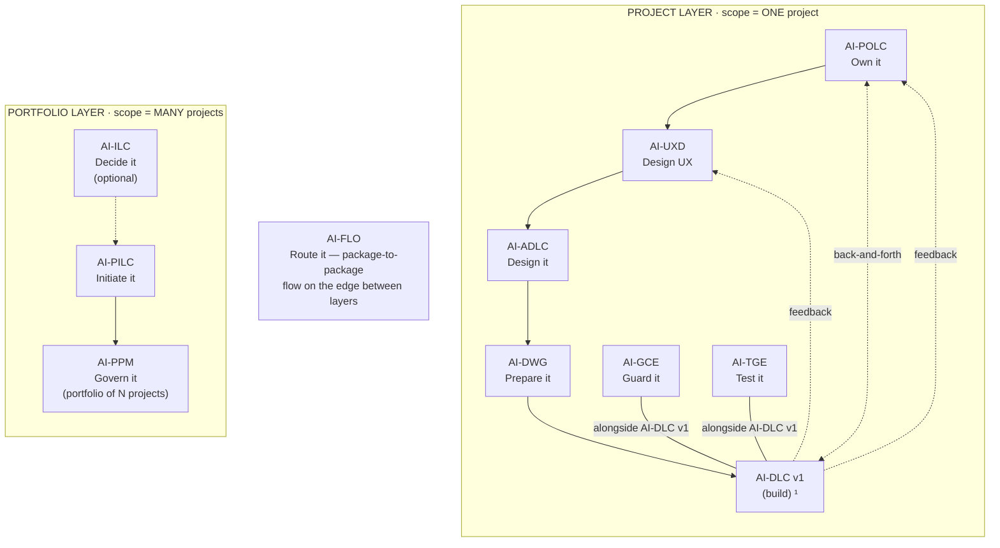

# AI-GCE — AI-Driven Governance & Compliance Engine

[](./LICENSE)

**Created By:** Maheri — [LinkedIn](https://www.linkedin.com/in/mohammad-maheri-8399565b)
**Inspired By:** [awslabs/aidlc-workflows](https://github.com/awslabs/aidlc-workflows) (MIT-0)
**Version:** 1.0.0

---

## What Is AI-GCE?

A **full project governance engine** that reads an AI-DWG development workspace and derives a tailored compliance enforcement layer — rules, hooks, agents, and logging infrastructure specific to that project's architecture, technology, team structure, and methodology.

**Not just architecture compliance.** AI-GCE enforces team topology, role segregation, session discipline, sprint governance, PR process, CI/CD gates, DevOps standards, and change management — all derived automatically from the workspace.

---

## The AI-* PDLC Family

AI-GCE is part of **AIFLC** (AI Full Life Cycle) — the AI-* PDLC Family of injectable workflow packages.


  ¹ AI-DLC v1 = Amazon's open-source build lifecycle (not ours; we feed it).

| Layer | Package | Type | Input | Output |
|-------|---------|------|-------|--------|
| Portfolio | **AI-ILC** ² | Interactive workflow (lifecycle) | Raw idea | Approved Idea Brief / Feature Brief |
| Portfolio | **AI-PILC** | Interactive workflow (lifecycle) | Raw requirement | Project Initiation Package (PIP) |
| Portfolio | **AI-PPM** ³ | Adaptive portfolio engine | Multiple PIPs + Approved Idea Briefs | Portfolio register + cross-project prioritization & governance |
| Edge | **AI-FLO** ³ | Router / orchestration engine | Any package output marker | Routing decision + handoff to next package/layer |
| Project | **AI-POLC** ³ | Interactive workflow (lifecycle) | PIP | Product Backlog Package (PBP) |
| Project | **AI-UXD** ³ | Interactive workflow (lifecycle) | PIP + PBP | UX Design Package (UXP): personas/journeys, IA, user flows, design system + tokens, accessibility baseline |
| Project | **AI-ADLC** | Interactive workflow (lifecycle) | PIP + PBP + UXP | Architecture Package (AP) |
| Project | **AI-DWG** | One-time generator | AP + PBP + UXP | Ready-to-code development workspace (DW) |
| Project | **AI-GCE** | Adaptive governance engine | DW (AI-DWG output) | Compliance enforcement layer |
| Project | **AI-TGE** | Test governance engine | DW / build artifacts | Test governance & quality layer |
| Project | **AI-DLC v1** ¹ | Interactive workflow (lifecycle) | DW + GCE + User Stories (from AI-POLC) | Working Software |

> ¹ **AI-DLC v1** ([awslabs/aidlc-workflows](https://github.com/awslabs/aidlc-workflows)) is NOT our product. Our chain produces the workspace AI-DLC v1 consumes.
> ² **AI-ILC** is an **optional pre-stage** (the funnel before the funnel). The chain still works without it for users who start at AI-PILC. `⇢` denotes the optional link.
> ³ All packages in this table are **built**. AI-PPM (portfolio engine), AI-FLO (router), AI-POLC (product ownership lifecycle), and AI-UXD (UX design lifecycle) were the last four — completed June 2026. Within the Project layer, **AI-POLC, AI-UXD, and AI-ADLC run sequentially** (POLC→UXD→ADLC) — each feeds the next, culminating at AI-DWG which receives all three outputs (AP + PBP + UXP). **AI-GCE and AI-TGE run alongside AI-DLC v1** as continuous quality engines; **AI-POLC ⇄ AI-DLC v1** exchange backlog/acceptance throughout delivery; and **AI-DLC v1 runtime feedback flows back to both AI-UXD and AI-POLC**. Feedback loops (ADLC→POLC cost/risk, ADLC→UXD constraints) provide iterative refinement without changing the forward sequence.

> **AI-DFE** ([Data Fabric Engine](../ai-dfe/)) is a family-scoped **companion** — it gathers data from all packages and distributes structured JSON for dashboards and status roll-ups. It runs alongside the chain rather than as a linear step, so it is not shown as a chain row above.

---

## Where AI-GCE Sits in the Chain

AI-GCE is a **continuous companion**, not a forward chain step. It runs **alongside AI-DLC v1** (the build), inside the AI-DWG-generated development workspace: it reads that workspace, derives a tailored compliance-enforcement layer, and then enforces it continuously as the code is built. AI-DWG provisions it into the dev workspace; it activates there when you type `_GCE_`.

| Aspect | AI-GCE |
|--------|---------|
| **Layer** | Project — a continuous companion (runs in the generated dev workspace, alongside the build) |
| **Position** | Alongside AI-DLC v1 (not a sequential design step); provisioned into the workspace by AI-DWG |
| **Predecessor** | AI-DWG (the development workspace) |
| **Runs with** | AI-DLC v1 (the build) and AI-TGE (its sibling companion) |
| **Reads (input)** | The dev workspace — `.governance/workspace-manifest.yaml` (discovery contract), `rules/`, Definition of Done, TEAM_AGREEMENTS, CODEOWNERS, the actual module layout |
| **Produces (output)** | A compliance-enforcement layer under `.governance/` — rules, hooks, process agents, a JSONL audit log, and a compliance dashboard |
| **Output marker** | `.governance/hooks/` folder (≥1 hook); `gce-state.md` is the capability gate |
| **Correlation key** | Reads the `projectId` and stamps it into every JSONL compliance event |
| **Capability emitted** | `governance-engine@1` (internal — companion to AI-DLC v1) |
| **Capability consumed** | `development-workspace@1` (from AI-DWG) |

**Simplified chain view** (see the diagram above for the full topology):

```
… AI-ADLC → AI-DWG → AI-DLC v1  (build)
                       ├── AI-GCE  ← you are here (guards, alongside)
                       └── AI-TGE  (tests, alongside)
```

AI-GCE answers **"is the team building it the way the design and governance say to?"** It **enforces discipline** — architecture, team topology, roles, session/sprint/PR process, DevOps, and change management — all **derived** from the workspace, not hand-configured. It does not build code (AI-DLC v1), run or govern tests (AI-TGE), or author the design (AI-ADLC/DWG), and it re-derives selectively when the workspace changes.

### Standalone vs. chained

- **Standalone.** It works on **any** workspace that has `rules/` — you don't need AI-DWG to have generated them. A minimal or empty steering set still yields the 10 built-in baseline rules (author ≠ approver, no direct-push to main, spec-before-code, session discipline…).
- **Chained.** With an AI-DWG workspace it reads `.governance/workspace-manifest.yaml` and derives fully-tailored, technology-specific enforcement.
- **Graceful degradation (OR-input).** It never blocks on missing steering — it degrades from fully-enriched enforcement down to baseline-only governance.
- **Platform-aware.** Rules/hooks/agents are generated on every platform, but **auto-enforcement (hook firing, agent shortcuts, automatic logging) is Kiro-specific**; elsewhere the rules are advisory documentation you bridge via CI/CD or manual audit (see Platform Capabilities below).

---

## Key Features

- **Zero configuration** — reads the workspace; derives everything from steering files
- **Two-source derivation** — built-in methodology baseline + steering-enriched project specifics
- **Four operating modes** — Full Generation, Re-Derivation, Brownfield Adoption, Tier Activation
- **Three-tier progressive compliance** — Day 0 (60-70%) → Sprint 2+ (80-90%) → Pre-Release (92%+)
- **Dual enforcement model** — 9 hooks (automatic, real-time) + 6 process agents (manual, milestone-triggered)
- **Hook debounce strategy** — security-critical on fileEdited; advisory on agentStop
- **Process agent shortcuts** — `SDC__`, `SGV__`, `CRV__`, `SQC__`, `CMG__`, `DOD__` invoke governance at milestones
- **Agent Process Guide** — generated user manual documents when to call, consequences of skipping, recovery procedures
- **Phase-aware enforcement** — rules only fire when applicable to current project phase
- **Silent when passing** — no output unless something is wrong
- **Technology-specific** — hooks use actual file patterns derived from tech-stack.md
- **Brownfield first-class** — baseline existing violations, enforce new code from day 1
- **Full audit trail** — every hook writes JSONL compliance events; Git-committed evidence
- **Package territory segregation** — three-layer isolation prevents hooks from firing on AI-* family infrastructure files (pattern scoping + runtime preamble + territory registry)

---

## How to Use

### Quick Start

In a workspace that has `rules/` populated (by AI-DWG):

```
Using AI-GCE, generate the compliance engine for this workspace
```

AI-GCE asks 1-2 questions, then generates everything in one pass.

### Four Modes

| Say This | Mode Triggered |
|----------|:-------------:|
| "Generate compliance engine" | Mode 1: Full Generation |
| "Steering changed — re-derive" | Mode 2: Re-Derivation |
| "Brownfield adoption" / "Baseline scan" | Mode 3: Brownfield |
| "Activate next compliance tier" | Mode 4: Tier Activation |

---

## What It Produces

Installed into the development workspace:

```
.governance/hooks/              ← 9 always-generated + up to 6 conditional enforcement hooks (JSON)
.governance/agents/             ← 6 process/audit governance agents (milestone-triggered)
.compliance-state.json    ← Tier tracking + readiness criteria
management_framework/dashboards/compliance-dashboard.md  ← Visual compliance overview (Dashboard Framework Convention)
.governance/
├── COMPLIANCE_README.md  ← Developer-facing guide
├── AGENT-GUIDE.md        ← Process agent user manual (when to call, consequences)
├── AGENT_REGISTRY.md     ← Single-source agent lookup
├── rules/                ← 18+ always rules + conditionals
├── agents/               ← Audit agent + init agent specs (legacy location)
└── compliance-log/       ← JSONL schema + workflows
```

**Enforcement model:** Hooks handle real-time code enforcement (automatic, on file save or session end). Agents handle governance milestones (manual, user-triggered at process boundaries). See `.governance/AGENT-GUIDE.md` for when to call each agent.

---

## Standalone Usage

AI-GCE works on **any workspace** that has `rules/` files — it does NOT require AI-DWG to have generated those files. You can:

- Create steering files manually and run AI-GCE against them
- Use AI-GCE on an existing project that already has its own steering setup
- Run AI-GCE without any predecessor package installed

Even if your workspace has minimal or no steering files, the **built-in baseline** provides universal governance rules (author ≠ approver, no direct-push to main, spec before code, session discipline, etc.) that apply to any project. Steering files enrich and specialize — their absence doesn't block.

**Graceful degradation (OR-input):** AI-GCE never blocks on missing steering. It degrades gracefully from full-enriched enforcement (every steering file produces tailored rules) to baseline-only governance (universal rules from the built-in set). Start wherever you are — bring what you have.

---

## Platform Capabilities

AI-GCE generates the same rules, hooks, and agents on every platform. But **hook execution and agent triggers are Kiro-specific** — they depend on Kiro's event system (`fileEdited`, `agentStop`, `preToolUse`).

| What You Get | Kiro | Claude Code / Cursor / Cline / Others |
|--------------|:----:|:-------------------------------------:|
| `.governance/rules/*.md` (readable rules) | ✅ | ✅ |
| Hook JSON files generated | ✅ | ✅ (generated but inert) |
| Agent files generated | ✅ | ✅ (generated but inert) |
| **Hooks auto-fire on events** | ✅ | ❌ |
| **Agent shortcuts (`SDC__`, etc.)** | ✅ | ❌ |
| **Compliance logging (automatic)** | ✅ | ❌ (manual) |

**On non-Kiro platforms:** Governance rules are fully available as documentation. The AI reads and follows them if instructed — but enforcement is advisory rather than automatic. Teams can bridge the gap via CI/CD checks or periodic manual audits.

For the full cross-platform matrix, see `PLATFORM_CAPABILITIES.md`.

---

## Activation

**Explicit key:** type `_GCE_` in any prompt to activate AI-GCE unambiguously — even when other AI-* packages share the workspace. The status key `_ACTIVE_` reports which package is currently active. A package switch never happens without your explicit key or confirmation, and any switch is announced on the first line of the response (`Active package: AI-GCE`). See [`../TRIGGER_KEYS_REFERENCE.md`](../TRIGGER_KEYS_REFERENCE.md) for the full family key table.

---

## Installation

AI-GCE is pure Markdown — no runtime, no dependencies, no build step. "Installing" the package means placing two folders and one always-loaded router file where your AI agent will read them. (What AI-GCE then *produces* — the `.governance/` enforcement layer — is written into the development workspace at run time.)

> **Companion note.** AI-GCE is a **Layer-3 (Execute) companion**. In the normal chain, **AI-DWG provisions it into the generated dev workspace automatically** (its Config Gate Q3), where it activates on `_GCE_`. Install it **directly** (below) only for standalone or brownfield adoption into an existing repository.

### The model (read this first)

Installation writes to exactly three places:

1. **The package home** — `ai-gce-rules/` (the core **engine/dispatcher**) and `ai-gce-rule-details/` (generators, re-derivation, and templates, read on demand) are copied into `.aiflc/pdlc/`. This path is **identical on every platform**.
2. **One always-loaded orchestrator** — a single small router placed in your platform's native auto-load slot. It is the *only* file that loads automatically; it reads the AI-GCE core on demand when you activate the package.
3. **The output layer** — AI-GCE writes its compliance layer into the target workspace's `.governance/` (rules, hooks, agents, logs) at run time.

### Option A — Install alongside the family (direct adoption)

Use the `governance` bundle to install AI-GCE (+ AI-TGE) directly into an **existing** project repository:

```powershell
# Windows (PowerShell) — governance companions into an existing repo
.\installer\install.ps1 -TargetWorkspace "C:\path\to\your\project" -Platform kiro -Bundle governance
```

```bash
# macOS / Linux
./installer/install.sh --target ~/path/to/your/project --platform kiro --bundle governance
```

Install just AI-GCE with `-Packages "ai-gce"`. Supported `-Platform` values: `kiro`, `cursor`, `claude-code`, `cline`, `amazonq`, `copilot`. (For a greenfield project, prefer `-Bundle design` and let AI-DWG provision AI-GCE into the generated workspace.)

### Option B — Install this package individually (manual)

Two copy operations plus one orchestrator placement. Copy the two package folders into the uniform home (same on every platform):

```
ai-gce/ai-gce-rules/        →  <workspace>/.aiflc/pdlc/ai-gce-rules/
ai-gce/ai-gce-rule-details/ →  <workspace>/.aiflc/pdlc/ai-gce-rule-details/
```

Then place the always-loaded orchestrator (`session-orchestrator.md`, from the packages root) in your platform's slot:

| Platform | Orchestrator destination | How it loads |
|----------|--------------------------|--------------|
| **Kiro** | `.kiro/steering/session-orchestrator-pdlc.md` | Auto-loaded steering |
| **Amazon Q** | `.amazonq/rules/pdlc/session-orchestrator.md` | Auto-loaded rule |
| **Cursor** | `.cursor/rules/pdlc-session-orchestrator.mdc` | Add `alwaysApply: true` frontmatter |
| **Cline** | `.clinerules/pdlc-session-orchestrator.md` | Auto-loaded rule |
| **Claude Code** | `CLAUDE_PDLC_ORCHESTRATOR.md` | Import from root `CLAUDE.md` via `@CLAUDE_PDLC_ORCHESTRATOR.md` |
| **GitHub Copilot** | `.github/copilot-instructions-pdlc-orchestrator.md` | Workspace instructions |
| **Codex / VS Code agent** | `AGENTS.md` (workspace root) | Auto-loaded agent instructions |

> Full hook auto-execution + agent shortcuts are Kiro-only (see Platform Capabilities). Claude Code uses a parallel orchestrator source, `session-orchestrator.claude.md`.

### For AI agents — machine-readable install manifest

An AI assistant can install AI-GCE by parsing and executing the block below. All `copy.from` and `orchestrator.source` paths are relative to `source_root`; every destination is relative to the workspace root. Pick the one `orchestrator.slot` row that matches the target platform. The manifest is **platform-agnostic** — everything except `orchestrator.slot` is identical on every platform.

```yaml
# AIFLC INSTALL MANIFEST — AI-GCE
package: AI-GCE
family: pdlc                       # package home:.aiflc/pdlc/
version: 1.0.0
runtime: none                      # pure Markdown; no deps, no build
role: layer-3-companion            # normally provisioned by AI-DWG; direct install for standalone/brownfield
source_root: pdlc-packages/        # clone root of the AIPDLC repo
activation_phrase: "Using AI-GCE, set up governance"
trigger_key: "_GCE_"               # universal explicit key (recognized by the orchestrator on any platform); or use activation_phrase
status_key: "_ACTIVE_"             # reports which package is currently active
depends_on: []                     # standalone-capable on any workspace that has rules/
optional_inputs:
  - marker:.governance/workspace-manifest.yaml   # AI-DWG discovery contract (primary)
  - marker: rules/workspace-rules.md              # legacy fallback
emits_capability: "governance-engine@1"
output_marker:.governance/hooks/  # folder with >=1 hook; gce-state.md is the capability gate
output_dir:.governance/           # compliance layer written into the target workspace root
copy:
  - from: ai-gce/ai-gce-rules
    to:.aiflc/pdlc/ai-gce-rules
  - from: ai-gce/ai-gce-rule-details
    to:.aiflc/pdlc/ai-gce-rule-details
orchestrator:
  source: session-orchestrator.md            # the ONLY always-loaded file
  source_claude: session-orchestrator.claude.md   # use this source for claude-code
  slot:
    kiro:.kiro/steering/session-orchestrator-pdlc.md
    amazonq:.amazonq/rules/pdlc/session-orchestrator.md
    cursor:.cursor/rules/pdlc-session-orchestrator.mdc   # + frontmatter alwaysApply: true
    cline:.clinerules/pdlc-session-orchestrator.md
    claude-code: CLAUDE_PDLC_ORCHESTRATOR.md              # import from root CLAUDE.md
    copilot:.github/copilot-instructions-pdlc-orchestrator.md
    codex: AGENTS.md
    vscode: AGENTS.md
core_entry:.aiflc/pdlc/ai-gce-rules/core-engine.md       # orchestrator Reads this on activation
rule_details_home:.aiflc/pdlc/ai-gce-rule-details/       # core resolves these on demand
verify:
  - path_exists:.aiflc/pdlc/ai-gce-rules/core-engine.md
  - path_exists:.aiflc/pdlc/ai-gce-rule-details/
  - orchestrator_present_in_platform_slot: true
  - action: 'say "Using AI-GCE, set up governance" and expect the AI-GCE mode detection'
```

### Verify

1. Open the target workspace in your IDE with the AI agent active (it should already have `rules/`, from AI-DWG or your own steering).
2. Confirm the orchestrator loaded (Kiro: it appears in the Steering panel).
3. Start a chat: `Using AI-GCE, set up governance`.
4. AI-GCE reads the workspace and generates the `.governance/` enforcement layer (rules, hooks, agents, log).

For the full per-platform walkthrough (including the Kiro-only enforcement caveats), see [setup/INSTALL.md](./setup/INSTALL.md), `PLATFORM_CAPABILITIES.md`, and the family-wide [INSTALL_GUIDE.md](../../INSTALL_GUIDE.md).

---

## Package Structure

```
ai-gce/
├── README.md                          ← This file
├── LICENSE                            ← Apache 2.0 + Attribution
├── PLAN.md                            ← Design rationale + gap analysis
├── ai-gce-rules/
│   └── core-engine.md             ← Master derivation engine (read on demand by the orchestrator; 4 modes)
├── ai-gce-rule-details/
│   ├── common/                        ← Cross-cutting docs (5 files)
│   ├── generators/                    ← Derivation logic per rule category (24 files, incl. agents-from-steering)
│   ├── re-derivation/                 ← Incremental update logic (3 files)
│   └── templates/                     ← Hook, agent, and log templates
│       ├── hooks/                     ← 9 hook JSON templates + enforcement guide
│       ├── agents/                    ← 8 agent templates + agent-guide + agent-registry
│       └── compliance-log/            ← Schema + workflows + dashboard template
└── setup/
    └── INSTALL.md
```

---

## Tenets

1. **Derive, don't configure.** The workspace already has the answers — read them.
2. **Governance is broader than architecture.** Roles, sessions, sprints, PRs, DevOps — all enforced.
3. **Progressive, not big-bang.** Three tiers. Teams adopt at their pace.
4. **Silent when compliant.** Noise kills adoption. Only speak when wrong.
5. **Every action logged.** Audit trail is non-negotiable. Every hook writes.
6. **Brownfield is normal.** Most projects have existing code. Baseline and improve.
7. **Rules are enforceable.** MUST/NEVER, not "consider." Binary pass/fail.
8. **Customizations survive.** Team additions marked `<!-- custom -->` persist through re-derivation.

---

## Patterns, Methodologies & Frameworks Covered

AI-GCE operationalizes **governance-as-code across the whole delivery discipline** — not just architecture compliance. It aligns with the bodies of knowledge below and adapts their concepts to an AI-assisted, automatically enforced layer; it does not certify against any of them.

| Framework / body of knowledge | What AI-GCE applies | Where it stops (scope boundary) |
|---|---|---|
| **Team Topologies** (Skelton & Pais) | Derives team- and role-aware governance — role segregation, ownership/CODEOWNERS boundaries, and team-interaction rules read from the workspace's team agreements | It **enforces** the topology encoded in the workspace; it does not design your org or team structure |
| **Policy-as-code / compliance-as-code** | Enforceable MUST/NEVER rules + hooks with binary pass/fail — preventive (warn *before* the mistake) and silent when compliant | A rule that can't be auto-checked isn't a GCE rule — it stays documentation |
| **Separation of duties & change control** | author ≠ approver, no direct-push to `main`, PR-readiness gates, and a change-management gate (`CMG__`) | It gates the process; it does not replace your VCS or CI platform |
| **Two-source derivation** | Combines a built-in methodology **baseline** (10 universal rules) with **steering-enriched** project specifics — baseline stands where steering is silent | It derives from what the workspace states; it never invents policy the workspace doesn't imply |
| **Progressive maturity model** (three tiers) | Staged enforcement — Day 0 (60-70%) → Sprint 2+ (80-90%) → Pre-Release (92%+), never big-bang | A pragmatic adoption ramp, not a formal CMMI/appraisal |
| **Audit trail & evidence** (append-only log) | Every hook writes a timestamped JSONL compliance event — Git-committed, reproducible evidence | An internal audit trail, not a certified external audit (SOC 2 / ISO 27001) |
| **Configuration-drift detection** | Detects drift of governed elements vs the AI-DWG baseline (a `DFT__` agent + a silent session-end drift check) | It watches the **baseline** only; its own derived rules are handled by re-derivation, not the drift loop |

The boundary: AI-GCE **governs discipline** — it derives and enforces the rules. It does not build the software (AI-DLC v1), govern tests (AI-TGE), or author the design (AI-ADLC / AI-DWG). On non-Kiro platforms the rules are fully generated but enforcement is advisory (see Platform Capabilities).

---

## Cross-Cutting Lenses (AI · Automation · Agentic)

AI-GCE is the **governance end** of the family's lens system. Engine cores carry no design-time lens seam; instead AI-GCE governs whatever the upstream lenses tagged, via Layer-3 agents provisioned into the workspace.

| Lens | Governance agent | What AI-GCE checks |
|------|------------------|--------------------|
| **AI Lens** | `AIG__` | Governance of AI-lens features (the rules for tagged `aiFeature` work) |
| **Automation Lens** | `ATG__` | Governance of automation-lens features (`automationFeature` work) |
| **Agentic** (AI ∩ Automation) | `AIG__` + `ATG__` (extended) | Adds agentic safeguards — tool-permission, excessive-agency, and kill-switch checks |

Modes originate upstream (set at AI-PILC in `Lens_Status.md`, tagged per-feature at AI-POLC); AI-GCE enforces against those tags. AI-TGE is the quality counterpart (`AIQ__` / `ATQ__`).

---

## Author

**Maheri** — [LinkedIn](https://www.linkedin.com/in/mohammad-maheri-8399565b)

AI-GCE is part of the AI-* injectable package family. Inspired by [awslabs/aidlc-workflows](https://github.com/awslabs/aidlc-workflows) (MIT-0 license).

---

## Further Reading

Deep-dive knowledge documents for this package (in the family repo under `knowledge_docs/`):

| Document | What it covers |
|----------|---------------|
| [How GCE Derivation Pipeline Works](../../knowledge_docs/HOW_GCE_DERIVATION_PIPELINE_WORKS.md) | How AI-GCE reads steering and derives enforcement rules |
| [How GCE Compliance Audit Works](../../knowledge_docs/HOW_GCE_COMPLIANCE_AUDIT_WORKS.md) | The audit mode and compliance scoring model |
| [How GCE Rederivation Works](../../knowledge_docs/HOW_GCE_REDERIVATION_WORKS.md) | Incremental re-derivation when architecture changes |
| [How Hook Generation Works](../../knowledge_docs/HOW_HOOK_GENERATION_WORKS.md) | How steering rules become IDE hooks |
| [How Tiered Governance Works](../../knowledge_docs/HOW_TIERED_GOVERNANCE_WORKS.md) | The 3-tier progressive compliance model |
| [How Compliance Logging Works](../../knowledge_docs/HOW_COMPLIANCE_LOGGING_WORKS.md) | JSONL audit trail from hook execution |
| [How Drift Intake Works](../../knowledge_docs/HOW_DRIFT_INTAKE_WORKS.md) | How architecture drift is detected and dispositioned |
| [How to Adopt Governance on a Project](../../knowledge_docs/HOW_TO_ADOPT_GOVERNANCE_ON_A_PROJECT.md) | Practitioner guide — first-time AI-GCE adoption |
| [How to Run a Compliance Audit](../../knowledge_docs/HOW_TO_RUN_A_COMPLIANCE_AUDIT.md) | Running the audit agent and interpreting results |
| [How to Retrofit Governance on Existing Code](../../knowledge_docs/HOW_TO_RETROFIT_GOVERNANCE_ON_EXISTING_CODE.md) | Brownfield mode — baseline existing violations |
| [How to Scale Governance as Project Matures](../../knowledge_docs/HOW_TO_SCALE_GOVERNANCE_AS_PROJECT_MATURES.md) | Tier graduation — when and how to increase coverage |
| [Why Governance Automation Matters](../../knowledge_docs/WHY_GOVERNANCE_AUTOMATION_MATTERS.md) | Stakeholder justification for AI-GCE's approach |
| [Interaction Between Steering and Hooks](../../knowledge_docs/INTERACTION_BETWEEN_STEERING_AND_HOOKS.md) | How steering files and hooks form dual enforcement |
| [Lifecycle of a Governance Rule](../../knowledge_docs/LIFECYCLE_OF_A_GOVERNANCE_RULE.md) | Rule lifecycle: born → active → re-derived → deprecated |

---

## License

**Apache License 2.0 with Attribution Addendum**

- **Free to use:** Personal, commercial, educational, and organizational use — all permitted
- **Modify and distribute:** Create derivative works, redistribute, sublicense — all permitted
- **Attribution required:** Any distributed product substantially based on this work must include:

> *"Built on AIFLC by Mohammad Maheri — [LinkedIn](https://www.linkedin.com/in/mohammad-maheri-8399565b)"*

- **No warranty:** Provided "AS IS" without warranties of any kind

See [LICENSE](./LICENSE) and [NOTICE](./NOTICE) in this directory for full terms.

**Copyright:** © 2026 Mohammad Maheri

---

*Part of [AIFLC](../../README.md) — the AI-* PDLC Family*
