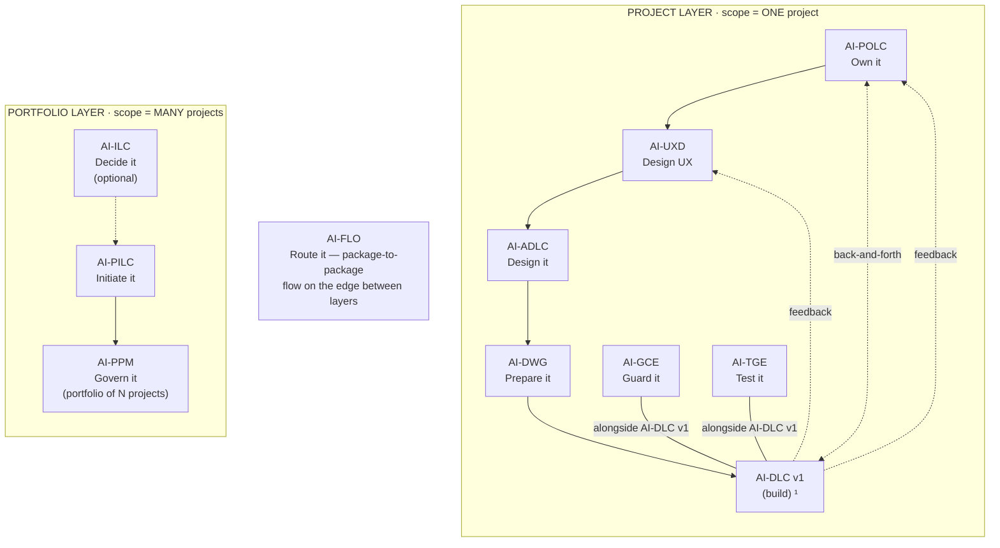

# AI-ILC — AI-Driven Idea Life Cycle

[](./LICENSE)

**Created By:** Maheri — [LinkedIn](https://www.linkedin.com/in/mohammad-maheri-8399565b)
**Version:** 1.0.0
**Package Type:** Interactive workflow (lifecycle)

---

## What It Does

AI-ILC takes a raw idea — from anyone, in any format — through a governed pipeline to a defensible go/no-go decision, then routes the approved idea to the right next step with zero context loss.

**Input:** A raw idea (verbal, one-liner, document, feature request)
**Output:** Approved Idea Brief / Change Request Brief / Feature Brief + Go/No-Go Decision Record

---

## The AI-* PDLC Family

AI-ILC is part of **AIFLC** (AI Full Life Cycle) — the AI-* PDLC Family of injectable workflow packages.


  ¹ AI-DLC v1 = Amazon's open-source build lifecycle (not ours; we feed it).

| Layer | Package | Type | Input | Output |
|-------|---------|------|-------|--------|
| Portfolio | **AI-ILC** ² | Interactive workflow (lifecycle) | Raw idea | Approved Idea Brief / Feature Brief |
| Portfolio | **AI-PILC** | Interactive workflow (lifecycle) | Raw requirement | Project Initiation Package (PIP) |
| Portfolio | **AI-PPM** ³ | Adaptive portfolio engine | Multiple PIPs + Approved Idea Briefs | Portfolio register + cross-project prioritization & governance |
| Edge | **AI-FLO** ³ | Router / orchestration engine | Any package output marker | Routing decision + handoff to next package/layer |
| Project | **AI-POLC** ³ | Interactive workflow (lifecycle) | PIP | Product Backlog Package (PBP) |
| Project | **AI-UXD** ³ | Interactive workflow (lifecycle) | PIP + PBP | UX Design Package (UXP): personas/journeys, IA, user flows, design system + tokens, accessibility baseline |
| Project | **AI-ADLC** | Interactive workflow (lifecycle) | PIP + PBP + UXP | Architecture Package (AP) |
| Project | **AI-DWG** | One-time generator | AP + PBP + UXP | Ready-to-code development workspace (DW) |
| Project | **AI-GCE** | Adaptive governance engine | DW (AI-DWG output) | Compliance enforcement layer |
| Project | **AI-TGE** | Test governance engine | DW / build artifacts | Test governance & quality layer |
| Project | **AI-DLC v1** ¹ | Interactive workflow (lifecycle) | DW + GCE + User Stories (from AI-POLC) | Working Software |

> ¹ **AI-DLC v1** ([awslabs/aidlc-workflows](https://github.com/awslabs/aidlc-workflows)) is NOT our product. Our chain produces the workspace AI-DLC v1 consumes.
> ² **AI-ILC** is an **optional pre-stage** (the funnel before the funnel). The chain still works without it for users who start at AI-PILC. `⇢` denotes the optional link.
> ³ All packages in this table are **built**. AI-PPM (portfolio engine), AI-FLO (router), AI-POLC (product ownership lifecycle), and AI-UXD (UX design lifecycle) were the last four — completed June 2026. Within the Project layer, **AI-POLC, AI-UXD, and AI-ADLC run sequentially** (POLC→UXD→ADLC) — each feeds the next, culminating at AI-DWG which receives all three outputs (AP + PBP + UXP). **AI-GCE and AI-TGE run alongside AI-DLC v1** as continuous quality engines; **AI-POLC ⇄ AI-DLC v1** exchange backlog/acceptance throughout delivery; and **AI-DLC v1 runtime feedback flows back to both AI-UXD and AI-POLC**. Feedback loops (ADLC→POLC cost/risk, ADLC→UXD constraints) provide iterative refinement without changing the forward sequence.

> **AI-DFE** ([Data Fabric Engine](../ai-dfe/)) is a family-scoped **companion** — it gathers data from all packages and distributes structured JSON for dashboards and status roll-ups. It runs alongside the chain rather than as a linear step, so it is not shown as a chain row above.

---

## Where AI-ILC Sits in the Chain

AI-ILC is the **optional front door** of the AI-* PDLC Family — the "funnel before the funnel." It lives in the **Portfolio layer** and runs before any project exists, turning a raw idea into a governed go/no-go decision and a routed brief. Because it is optional, the chain works fine for users who start at AI-PILC.

| Aspect | AI-ILC |
|--------|---------|
| **Layer** | Portfolio (optional pre-stage) |
| **Position** | Optional first entry point — before AI-PILC |
| **Predecessor** | None — accepts a raw idea directly |
| **Direct successors** | AI-PILC (new project / change request), AI-POLC (feature), AI-PPM (portfolio awareness) — resolved by intent |
| **Reads (input)** | A raw idea in any form — verbal, one-liner, document, or feature request |
| **Produces (output)** | A Go/No-Go Decision Record + one routed brief (Approved Idea / Change Request / Feature) under `pdlc-ws/ideas/` |
| **Input marker** | None (it is the front door) |
| **Output marker** | `ilc-state.md` |
| **Correlation key** | Mints an Idea Register ID; carries `projectId` when the idea targets an existing project |
| **Capability emitted** | `idea-decision@1` (consumed by AI-PILC, AI-POLC, AI-PPM) |

**Simplified chain view** (see the diagram above for the full topology):

```
AI-ILC → AI-PILC → AI-PPM → AI-FLO → AI-POLC → AI-UXD → AI-ADLC → AI-DWG → AI-DLC v1
   ▲ you are here (optional front door)
```

AI-ILC answers **"is this idea worth starting, and where should it go?"** — it does not initiate, design, or build. Its outbound routing logic is detailed in [How It Routes](#how-it-routes) below.

### Standalone vs. chained

- **Standalone.** AI-ILC needs no other package. Point it at an idea and it produces a defensible decision plus a portable brief you can hand to any process.
- **Chained (downstream).** On approval it writes `ilc-state.md` and one brief; AI-PILC (new-project/change) or AI-POLC (feature) detects the marker and consumes the brief as an extra intake mode — no re-explaining the idea.
- **Routed, not hard-wired.** Routes are **intent-based** — the brief names an intent (`new-project` / `change-request` / `feature`) and the consuming side resolves the actual target. If the preferred package isn't installed, the brief still stands alone.
- **Cross-family (optional).** AI-ILC can consume a *capability input* emitted by another AIFLC family (a capability-typed seam) to ground an idea in an enterprise capability roadmap; absent that, it works from the raw idea alone.

---

## Features

- **6-stage governed pipeline** — Capture → Shape → Evaluate → Scope → Approve → Route & Handoff
- **Gates at every stage** — human-in-the-loop; you decide, AI advises
- **Consistent evaluation** — 7-criterion scoring with configurable rubric (two-source model)
- **Value analysis** — articulates WHY an idea matters, not just whether it passes
- **Impact-driven routing** — determines whether an approved idea is a new project, a big change, or a small feature
- **Three brief types** — Approved Idea Brief (→ AI-PILC), Change Request Brief (→ AI-PILC change mgmt), Feature Brief (→ AI-DLC v1 backlog)
- **Audit trail from day one** — Decision Log + Idea Register; every choice recorded with rationale
- **Adaptive depth** — Minimal / Standard / Comprehensive based on idea complexity
- **Dynamic stage-based personas** — each stage activates the right expert voice with specialist sub-roles
- **Session continuity** — state file enables resume after interruption
- **Standalone + chain** — delivers full value without the rest of the AI-* family

---

## Who Uses It

- **Anyone** can submit an idea (democratic intake)
- **Innovation / Product / Portfolio Manager** governs the pipeline (evaluation, go/no-go, routing)

---

## How It Routes

```
┌─────────────────────────────────────────────┐
│  Does a project exist for this idea?         │
├──── NO ─────────────────────────────────────▶ AI-PILC (new project)
├──── YES + BIG change ───────────────────────▶ AI-PILC change management
└──── YES + SMALL change ─────────────────────▶ AI-DLC v1 backlog (feature)
```

"Big" = impacts scope, architecture, resources, or stakeholders beyond the team.
"Small" = bounded feature within existing project boundaries.

### Forward-Compatible Routing

Routes are **intent-based, not package-dependent.** AI-ILC writes a semantic intent — not a hard requirement on a specific package being installed. Resolution happens on the consuming side.

| Route Intent | Preferred Target | Fallback (if preferred absent) |
|--------------|-----------------|-------------------------------|
| `new-project` | AI-PILC | Brief is a portable document — usable with any project initiation process |
| `change-request` | AI-PILC change management | Brief is a portable change request — usable with any change control process |
| `feature` | AI-POLC (product backlog) | AI-DLC v1 backlog (or any backlog tool) |

**You are never blocked.** If a target package isn't installed, the brief still works as a standalone document you can feed into whatever process you use. The routing intent is metadata — the brief itself carries all the context.

---

## Activation

**Explicit key:** type `_ILC_` in any prompt to activate AI-ILC unambiguously — even when other AI-* packages share the workspace. The status key `_ACTIVE_` reports which package is currently active. A package switch never happens without your explicit key or confirmation, and any switch is announced on the first line of the response (`Active package: AI-ILC`). See [`../TRIGGER_KEYS_REFERENCE.md`](../TRIGGER_KEYS_REFERENCE.md) for the full family key table.

---

## Installation

AI-ILC is pure Markdown — no runtime, no dependencies, no build step. "Installing" means placing two folders and one always-loaded router file where your AI agent will read them.

### The model (read this first)

Installation writes to exactly three places:

1. **The package home** — `ai-ilc-rules/` (the core **dispatcher**) and `ai-ilc-rule-details/` (stage details + templates, read on demand) are copied into `.aiflc/pdlc/`. This path is **identical on every platform**.
2. **One always-loaded orchestrator** — a single small router placed in your platform's native auto-load slot. It is the *only* file that loads automatically; it reads the AI-ILC core on demand when you activate the package. (Nothing under `.aiflc/` auto-loads — that keeps the context window free no matter how many packages you install.)
3. **The output workspace** — `pdlc-ws/` at your workspace root; AI-ILC writes ideas under `pdlc-ws/ideas/`.

> **No other package required.** AI-ILC installs and runs entirely on its own — AI-PILC, AI-POLC, and the rest of the family are optional downstream consumers, not install-time dependencies.

### Option A — Install alongside the family (recommended)

Run the family installer from the repo root. It places AI-ILC (and any other packages you pick) correctly for your platform, deploys the orchestrator, and creates `pdlc-ws/`.

```powershell
# Windows (PowerShell) — install just AI-ILC on Kiro
.\installer\install.ps1 -TargetWorkspace "C:\path\to\your\project" -Platform kiro -Packages "ai-ilc"
```

```bash
# macOS / Linux — install just AI-ILC on Kiro
./installer/install.sh --target ~/path/to/your/project --platform kiro --packages ai-ilc
```

Swap `-Packages "ai-ilc"` for `-Bundle portfolio` (AI-ILC + AI-PILC + AI-PPM + AI-FLO) or `-Bundle full` to install more of the chain at once. Supported `-Platform` values: `kiro`, `cursor`, `claude-code`, `cline`, `amazonq`, `copilot`.

### Option B — Install this package individually (manual)

Two copy operations plus one orchestrator placement. Copy the two package folders into the uniform home (same on every platform):

```
ai-ilc/ai-ilc-rules/        →  <workspace>/.aiflc/pdlc/ai-ilc-rules/
ai-ilc/ai-ilc-rule-details/ →  <workspace>/.aiflc/pdlc/ai-ilc-rule-details/
```

Then place the always-loaded orchestrator (`session-orchestrator.md`, from the packages root) in your platform's slot:

| Platform | Orchestrator destination | How it loads |
|----------|--------------------------|--------------|
| **Kiro** | `.kiro/steering/session-orchestrator-pdlc.md` | Auto-loaded steering |
| **Amazon Q** | `.amazonq/rules/pdlc/session-orchestrator.md` | Auto-loaded rule |
| **Cursor** | `.cursor/rules/pdlc-session-orchestrator.mdc` | Add `alwaysApply: true` frontmatter |
| **Cline** | `.clinerules/pdlc-session-orchestrator.md` | Auto-loaded rule |
| **Claude Code** | `CLAUDE_PDLC_ORCHESTRATOR.md` | Import from root `CLAUDE.md` via `@CLAUDE_PDLC_ORCHESTRATOR.md` |
| **GitHub Copilot** | `.github/copilot-instructions-pdlc-orchestrator.md` | Workspace instructions |
| **Codex / VS Code agent** | `AGENTS.md` (workspace root) | Auto-loaded agent instructions |

> Claude Code uses a parallel orchestrator source, `session-orchestrator.claude.md`. Finally, create `pdlc-ws/` at your workspace root for output.

### For AI agents — machine-readable install manifest

An AI assistant can install AI-ILC by parsing and executing the block below. All `copy.from` and `orchestrator.source` paths are relative to `source_root`; every destination is relative to the workspace root. Pick the one `orchestrator.slot` row that matches the target platform. The manifest is **platform-agnostic** — everything except `orchestrator.slot` is identical on every platform.

```yaml
# AIFLC INSTALL MANIFEST — AI-ILC
package: AI-ILC
family: pdlc                       # package home:.aiflc/pdlc/
version: 1.0.0
runtime: none                      # pure Markdown; no deps, no build
source_root: pdlc-packages/        # clone root of the AIPDLC repo
activation_phrase: "Using AI-ILC, evaluate this idea:..."
trigger_key: "_ILC_"               # universal explicit key (recognized by the orchestrator on any platform); or use activation_phrase
status_key: "_ACTIVE_"             # reports which package is currently active
depends_on: []                     # standalone-capable; it is the chain's front door
optional_inputs:
  - type: "capability-input@^1"    # optional cross-family seam-in (e.g. an enterprise capability roadmap)
emits_capability: "idea-decision@1"
output_marker: ilc-state.md
output_dir: pdlc-ws/ideas/         # created under the workspace-root pdlc-ws/
copy:
  - from: ai-ilc/ai-ilc-rules
    to:.aiflc/pdlc/ai-ilc-rules
  - from: ai-ilc/ai-ilc-rule-details
    to:.aiflc/pdlc/ai-ilc-rule-details
orchestrator:
  source: session-orchestrator.md            # the ONLY always-loaded file
  source_claude: session-orchestrator.claude.md   # use this source for claude-code
  slot:
    kiro:.kiro/steering/session-orchestrator-pdlc.md
    amazonq:.amazonq/rules/pdlc/session-orchestrator.md
    cursor:.cursor/rules/pdlc-session-orchestrator.mdc   # + frontmatter alwaysApply: true
    cline:.clinerules/pdlc-session-orchestrator.md
    claude-code: CLAUDE_PDLC_ORCHESTRATOR.md              # import from root CLAUDE.md
    copilot:.github/copilot-instructions-pdlc-orchestrator.md
    codex: AGENTS.md
    vscode: AGENTS.md
core_entry:.aiflc/pdlc/ai-ilc-rules/core-workflow.md     # orchestrator Reads this on activation
rule_details_home:.aiflc/pdlc/ai-ilc-rule-details/       # core resolves these on demand
verify:
  - path_exists:.aiflc/pdlc/ai-ilc-rules/core-workflow.md
  - path_exists:.aiflc/pdlc/ai-ilc-rule-details/
  - orchestrator_present_in_platform_slot: true
  - action: 'say "Using AI-ILC, evaluate this idea" and expect the AI-ILC welcome message'
```

### Verify

1. Open the workspace in your IDE with the AI agent active.
2. Confirm the orchestrator loaded (Kiro: it appears in the Steering panel).
3. Start a chat: `Using AI-ILC, evaluate this idea`.
4. AI-ILC greets you and begins; output appears under `pdlc-ws/ideas/`.

For the full per-platform walkthrough (including limitations and workarounds), see [setup/INSTALL.md](./setup/INSTALL.md) and the family-wide [INSTALL_GUIDE.md](../../INSTALL_GUIDE.md).

---

## Usage

1. Open your workspace in your IDE with the AI assistant active
2. Start a chat and say:
   ```
   Using AI-ILC, help me evaluate this idea: [describe your idea or problem]
   ```
3. The workflow guides you through capture → shape → evaluate → scope → approve
4. Answer the structured questions at each stage and approve at the gates
5. On approval, an Approved Idea Brief is produced and routed onward (AI-PILC for projects, AI-POLC for features)

## File Structure

```
ai-ilc/
├── README.md                           ← This file
├── LICENSE                             ← Apache 2.0 with Attribution
├── PLAN.md                             ← Design rationale + build summary
├── ai-ilc-rules/
│   └── core-workflow.md                ← Master dispatcher — the heart (read on demand by the orchestrator)
├── ai-ilc-rule-details/
│   ├── common/
│   │   ├── process-overview.md         ← High-level workflow map
│   │   ├── session-continuity.md       ← State file spec + resume logic
│   │   ├── question-format-guide.md    ← How decisions are collected
│   │   ├── content-validation.md       ← Quality rules for outputs
│   │   └── welcome-message.md          ← First-time greeting
│   ├── idea-lifecycle/
│   │   ├── capture.md                  ← Stage 1: Log the idea fast
│   │   ├── shape.md                    ← Stage 2: Structure the problem
│   │   ├── evaluate.md                 ← Stage 3: Score + value analysis
│   │   ├── scope.md                    ← Stage 4: Define boundaries
│   │   ├── approve.md                  ← Stage 5: Go/no-go decision
│   │   └── route-handoff.md            ← Stage 6: Route + produce brief
│   ├── connectors/
│   │   └── portfolio-connector.md      ← Interface stub (v1.0 = single project)
│   └── templates/
│       ├── idea-register.md            ← Portfolio funnel register
│       ├── idea-entry.md               ← Structured idea statement
│       ├── decision-record.md          ← Decision log format
│       ├── approved-idea-brief.md      ← Brief for new projects
│       ├── change-request-brief.md     ← Brief for big changes
│       ├── feature-brief.md            ← Brief for small features
│       └── ilc-state.md                ← State file schema
└── setup/
    └── INSTALL.md                      ← Platform installation guide
```

---

## Tenets

1. **Every idea deserves a fair hearing.** The pipeline evaluates, not dismisses.
2. **Go/No-Go is always explicit.** No idea drifts into limbo — Approved, Parked, or Rejected.
3. **Context carries forward.** The brief carries everything learned — no cold starts for successors.
4. **The user decides, the AI advises.** Recommendations with rationale; the human makes the call.
5. **Audit trail from day one.** Every score, decision, and routing choice is logged.
6. **Standalone is first-class.** Full value without the AI-* family; chain integration is a bonus.
7. **Parked is not dead.** Parked ideas have a revisit date and re-enter when conditions change.

---

## Patterns, Methodologies & Frameworks Covered

AI-ILC operationalizes the **front of the innovation funnel** — turning ideas into governed, defensible decisions. It aligns with the bodies of knowledge below and adapts their concepts to an AI-assisted, human-gated workflow; it does not certify against any of them.

| Framework / body of knowledge | What AI-ILC applies | Where it stops (scope boundary) |
|---|---|---|
| **Stage-gate innovation funnel** (idea → decision) | A governed 6-stage funnel (Capture → Shape → Evaluate → Scope → Approve → Route) with a gate at each stage and an explicit go/no-go | Not full new-product development or execution — it hands off at the decision, it does not run the initiative |
| **Multi-criteria decision analysis / weighted scoring** | A 7-criterion scoring rubric (two-source: built-in baseline + optional enterprise overrides) yielding a defensible score and band | Not a bespoke enterprise scorecard engine; cross-project portfolio optimization belongs to **AI-PPM** |
| **Lean validation / value articulation** | Value analysis — the problem, the outcome, and the cost of *not* doing it — so a "why" accompanies every "whether" | No experiment design, MVP build, or metric instrumentation (that is build-time / AI-POLC) |
| **Portfolio funnel & idea management** | An Idea Register (funnel view) with Approved / Parked / Rejected states and revisit dates | Balancing and prioritizing many live initiatives is **AI-PPM** (v1.0 here is single-project context) |
| **Impact assessment & change classification** | Impact-driven routing — new project vs. big change vs. small feature — recorded as a portable intent | It classifies and routes; it does not perform the feasibility study or change analysis itself (that is AI-PILC) |

Everything above is expressed as a **gated deliverable** (a decision record and a routed brief), never as background theory. The next question — *how to actually start* — is answered by **AI-PILC**; portfolio-level prioritization by **AI-PPM**.

---

## Cross-Cutting Lenses (AI · Automation · Agentic)

AI-ILC participates in the family's **lens seam** — cross-cutting modes that, when switched on, make every design package apply a domain facet to the work it touches. At the idea stage AI-ILC captures the idea's *posture* on each lens; **AI-PILC** later promotes the chosen modes into the governance spine's `Lens_Status.md`, from where they flow through the whole chain.

| Lens | Mode (on / off) | Key | What AI-ILC does when it's on |
|------|-----------------|-----|-------------------------------|
| **AI Lens** | AI-Powered / No-AI | `_AILENS_` | Reads the idea through the AI-lens facet and records its AI posture |
| **Automation Lens** | Automated / Manual | `_AUTOLENS_` | Records the idea's automation posture |
| **Agentic** (AI ∩ Automation) | derived — both on | — | Records the idea's derived *agentic posture* (composed from the AI + automation postures — no separate prompt) |

Downstream, AI-PILC promotes these into formal modes, AI-DWG provisions the scaffolding, and AI-GCE / AI-TGE govern and test lens-tagged features via Layer-3 agents (`AIG__`/`ATG__`, `AIQ__`/`ATQ__`).

---

## What AI-ILC Does NOT Do

- Initiate projects (that's AI-PILC)
- Design architecture (that's AI-ADLC)
- Write code or tests
- Manage a multi-project portfolio (v1.0 = single project per workspace)
- Perform full feasibility studies (lightweight impact assessment only)

---

## Author

**Maheri** — [LinkedIn](https://www.linkedin.com/in/mohammad-maheri-8399565b)

Builder of the AI-* family of injectable workflow packages. AI-ILC is the optional front door — governing the decision to start before the work begins.

---

*Version 1.0.0 | AI-ILC — AI-Driven Idea Life Cycle*

---

## Further Reading

Deep-dive knowledge documents for this package (in the family repo under `knowledge_docs/`):

| Document | What it covers |
|----------|---------------|
| [How ILC Idea Lifecycle Works](../../knowledge_docs/HOW_ILC_IDEA_LIFECYCLE_WORKS.md) | Internal mechanics of the 6-stage idea pipeline |
| [How to Evaluate an Idea Before Building](../../knowledge_docs/HOW_TO_EVALUATE_AN_IDEA_BEFORE_BUILDING.md) | Practitioner guide — using AI-ILC on a real idea |
| [How Package Installation Works](../../knowledge_docs/HOW_PACKAGE_INSTALLATION_WORKS.md) | How the installer places packages into your workspace |
| [How Package Activation & Isolation Works](../../knowledge_docs/HOW_PACKAGE_ACTIVATION_ISOLATION_WORKS.md) | Activation keys, switching rules, multi-package coexistence |
| [How Chain Handoff Works](../../knowledge_docs/HOW_CHAIN_HANDOFF_WORKS.md) | How AI-ILC's output feeds AI-PILC or AI-POLC |
| [How Gates and Approvals Work](../../knowledge_docs/HOW_GATES_AND_APPROVALS_WORK.md) | The human-in-the-loop gate model at every stage |
| [How Depth Levels Work](../../knowledge_docs/HOW_DEPTH_LEVELS_WORK.md) | Minimal / Standard / Comprehensive adaptive tiers |
| [Pattern: Graceful Standalone](../../knowledge_docs/PATTERN_GRACEFUL_STANDALONE.md) | How AI-ILC works alone or as part of the chain |

---

## License

**Apache License 2.0 with Attribution Addendum**

- **Free to use:** Personal, commercial, educational, and organizational use — all permitted
- **Modify and distribute:** Create derivative works, redistribute, sublicense — all permitted
- **Attribution required:** Any distributed product substantially based on this work must include:

> *"Built on AIFLC by Mohammad Maheri — [LinkedIn](https://www.linkedin.com/in/mohammad-maheri-8399565b)"*

- **No warranty:** Provided "AS IS" without warranties of any kind

See `LICENSE` and `NOTICE` in this directory for full terms.

**Copyright:** © 2026 Mohammad Maheri

---

*Part of [AIFLC](../../README.md) — the AI-* PDLC Family*
