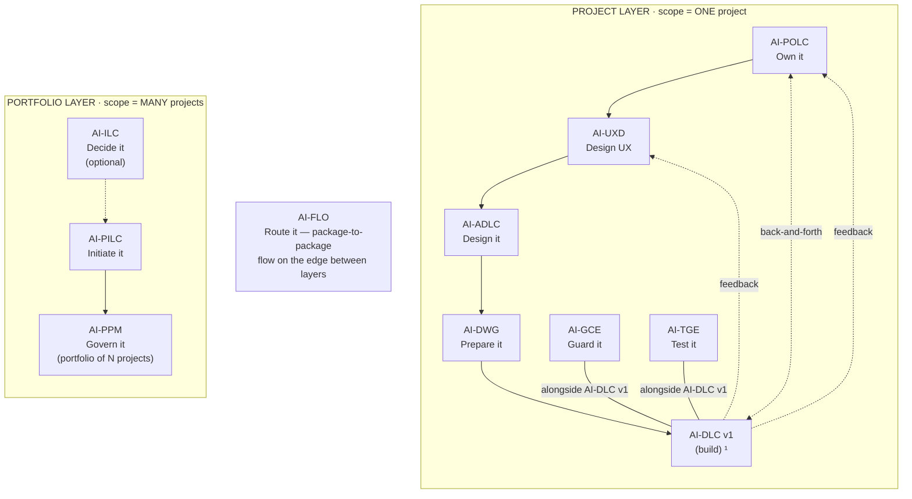

# AI-PILC (AI-Driven Project Initiation Life Cycle)

[](./LICENSE)

**Version:** 1.0.0
**Created By:** Maheri — [LinkedIn](https://www.linkedin.com/in/mohammad-maheri-8399565b)
**License:** Apache 2.0 with Attribution Addendum — See `LICENSE` and `NOTICE`

---

## The AI-* PDLC Family

AI-PILC is part of **AIFLC** (AI Full Life Cycle) — the AI-* PDLC Family of injectable workflow packages.


  ¹ AI-DLC v1 = Amazon's open-source build lifecycle (not ours; we feed it).

| Layer | Package | Type | Input | Output |
|-------|---------|------|-------|--------|
| Portfolio | **AI-ILC** ² | Interactive workflow (lifecycle) | Raw idea | Approved Idea Brief / Feature Brief |
| Portfolio | **AI-PILC** | Interactive workflow (lifecycle) | Raw requirement | Project Initiation Package (PIP) |
| Portfolio | **AI-PPM** ³ | Adaptive portfolio engine | Multiple PIPs + Approved Idea Briefs | Portfolio register + cross-project prioritization & governance |
| Edge | **AI-FLO** ³ | Router / orchestration engine | Any package output marker | Routing decision + handoff to next package/layer |
| Project | **AI-POLC** ³ | Interactive workflow (lifecycle) | PIP | Product Backlog Package (PBP) |
| Project | **AI-UXD** ³ | Interactive workflow (lifecycle) | PIP + PBP | UX Design Package (UXP): personas/journeys, IA, user flows, design system + tokens, accessibility baseline |
| Project | **AI-ADLC** | Interactive workflow (lifecycle) | PIP + PBP + UXP | Architecture Package (AP) |
| Project | **AI-DWG** | One-time generator | AP + PBP + UXP | Ready-to-code development workspace (DW) |
| Project | **AI-GCE** | Adaptive governance engine | DW (AI-DWG output) | Compliance enforcement layer |
| Project | **AI-TGE** | Test governance engine | DW / build artifacts | Test governance & quality layer |
| Project | **AI-DLC v1** ¹ | Interactive workflow (lifecycle) | DW + GCE + User Stories (from AI-POLC) | Working Software |

> ¹ **AI-DLC v1** ([awslabs/aidlc-workflows](https://github.com/awslabs/aidlc-workflows)) is NOT our product. Our chain produces the workspace AI-DLC v1 consumes.
> ² **AI-ILC** is an **optional pre-stage** (the funnel before the funnel). The chain still works without it for users who start at AI-PILC. `⇢` denotes the optional link.
> ³ All packages in this table are **built**. AI-PPM (portfolio engine), AI-FLO (router), AI-POLC (product ownership lifecycle), and AI-UXD (UX design lifecycle) were the last four — completed June 2026. Within the Project layer, **AI-POLC, AI-UXD, and AI-ADLC run sequentially** (POLC→UXD→ADLC) — each feeds the next, culminating at AI-DWG which receives all three outputs (AP + PBP + UXP). **AI-GCE and AI-TGE run alongside AI-DLC v1** as continuous quality engines; **AI-POLC ⇄ AI-DLC v1** exchange backlog/acceptance throughout delivery; and **AI-DLC v1 runtime feedback flows back to both AI-UXD and AI-POLC**. Feedback loops (ADLC→POLC cost/risk, ADLC→UXD constraints) provide iterative refinement without changing the forward sequence.

> **AI-DFE** ([Data Fabric Engine](../ai-dfe/)) is a family-scoped **companion** — it gathers data from all packages and distributes structured JSON for dashboards and status roll-ups. It runs alongside the chain rather than as a linear step, so it is not shown as a chain row above.

---

## What is AI-PILC?

AI-PILC is an injectable workflow that guides an AI assistant and a human user through the complete process of initiating a project — from receiving a raw requirement to delivering a professional, execution-ready **Project Initiation Package (PIP)**.

It is designed as a general-purpose, reusable framework with zero project-specific content. Drop it into any workspace, point it at a requirement, and it will walk you through 6 phases and 16 stages of structured project initiation — producing industry-standard, governance-grade deliverables at every step.

---

## Where AI-PILC Sits in the Chain

AI-PILC is the **first node** of the AI-* PDLC Family and lives in the **Portfolio layer** (scope = many projects). It turns a raw requirement into the Project Initiation Package (PIP) that every downstream package builds on.

| Aspect | AI-PILC |
|--------|---------|
| **Layer** | Portfolio |
| **Position** | First node — the chain entry point |
| **Optional predecessor** | AI-ILC (idea evaluation), detected via `ilc-state.md` |
| **Direct successor** | AI-PPM (portfolio governance); if AI-PPM is absent, hands off directly to AI-POLC |
| **Reads (input)** | A raw requirement in any form, or an Approved Idea Brief from AI-ILC |
| **Produces (output)** | Project Initiation Package (PIP) under `pdlc-ws/projects/PRJ-{ABBREV}-{slug}/pip/` |
| **Input marker (optional)** | `ilc-state.md` |
| **Output marker** | `pilc-state.md` |
| **Correlation key** | Mints `projectId` — the immutable, camelCase key every downstream package carries |
| **Capability emitted** | `project-initiation@1` (consumed by AI-POLC, AI-UXD, AI-ADLC, AI-PPM) |

**Simplified chain view** (see the diagram above for the full topology):

```
(AI-ILC) → AI-PILC → AI-PPM → AI-FLO → AI-POLC → AI-UXD → AI-ADLC → AI-DWG → AI-DLC v1
             ▲ you are here
                       (AI-GCE + AI-TGE run alongside the build)
```

AI-PILC answers **"should we start, and on what terms?"** — it does not design, build, or manage the backlog. It hands a governed, execution-ready mandate to the packages that do.

### Standalone vs. chained

AI-PILC is fully functional on its own — the chain is additive, never required.

- **Standalone.** Point it at any raw requirement (a PRD, RFP, spec, email, verbal brief, or an existing project to restructure). You are the orchestrator; AI-PILC produces a complete PIP with no other package present.
- **Chained (upstream).** If AI-ILC ran first, AI-PILC detects `ilc-state.md` and enriches Stage 2 with the Approved Idea Brief (scope, dependencies, risks, originating idea ID) — it never re-asks what the idea already answered.
- **Chained (downstream).** On completion it writes `pilc-state.md` and the PIP. AI-PPM, AI-POLC, AI-UXD, and AI-ADLC detect that marker and read the PIP automatically — no manual wiring.
- **Cross-family (optional).** AI-PILC can also consume a *validated business case* emitted by another AIFLC family (a capability-typed seam). Absent that, it builds the business case itself.

---

## Key Features

| Feature | Description |
|---------|-------------|
| **Injectable** | Drop into any workspace and activate — no project-specific setup |
| **Interactive** | Human-in-the-loop at every gate; you decide, AI recommends |
| **Adaptive** | Depth adjusts to project complexity (Minimal / Standard / Comprehensive) |
| **Resumable** | State file tracks progress; resume across sessions seamlessly |
| **Platform-Agnostic** | Works with Kiro, Amazon Q Developer, Cursor, Cline, Claude Code, GitHub Copilot |
| **Template-Based** | Consistent, professional deliverables via reusable templates |
| **Register-Driven** | Management registers (decisions, changes, risks, actions, assumptions, lessons) maintained automatically |
| **Source-Driven** | Never invents scope; always references the user's input document |

---

## What It Produces

A complete Project Initiation Package containing:

- Requirement Intake Form
- Requirements Analysis Report
- Clarification Questionnaire & Responses
- Feasibility Assessment & Prioritization
- Business Case
- Project Charter
- Stakeholder Register
- Scope Statement & WBS
- Resource & Budget Plan
- Risk Register
- RACI Matrix & Governance Plan
- Kickoff Agenda & Materials
- 6 Management Registers (Decision, Change, Issue, Action, Assumptions, Lessons)
- Package README (summary and handoff guide)

---

## The Six Phases

```
🔵 INCEPTION        →  Receive, validate, structure the requirement
🟠 ASSESSMENT       →  Analyze feasibility, resolve gaps, prioritize
🟡 JUSTIFICATION    →  Build the investment case
🟣 AUTHORIZATION    →  Formalize authority and boundaries
🟢 PLANNING         →  Plan scope, resources, risks, governance
🚀 MOBILIZATION     →  Prepare kickoff, assemble final package
```

---

## Activation

**Explicit key:** type `_PILC_` in any prompt to activate AI-PILC unambiguously — even when other AI-* packages share the workspace. The status key `_ACTIVE_` reports which package is currently active. A package switch never happens without your explicit key or confirmation, and any switch is announced on the first line of the response (`Active package: AI-PILC`). See [`../TRIGGER_KEYS_REFERENCE.md`](../TRIGGER_KEYS_REFERENCE.md) for the full family key table.

---

## Installation

AI-PILC is pure Markdown — no runtime, no dependencies, no build step. "Installing" means placing two folders and one always-loaded router file where your AI agent will read them.

### The model (read this first)

Installation writes to exactly three places:

1. **The package home** — `ai-pilc-rules/` (the core **dispatcher**) and `ai-pilc-rule-details/` (phase details + templates, read on demand) are copied into `.aiflc/pdlc/`. This path is **identical on every platform**.
2. **One always-loaded orchestrator** — a single small router placed in your platform's native auto-load slot. It is the *only* file that loads automatically; it reads the AI-PILC core on demand when you activate the package. (Nothing under `.aiflc/` auto-loads — that is what keeps the context window free no matter how many packages you install.)
3. **The output workspace** — `pdlc-ws/` at your workspace root, where AI-PILC writes the PIP.

### Option A — Install alongside the family (recommended)

Run the family installer from the repo root. It places AI-PILC (and any other packages you pick) correctly for your platform, deploys the orchestrator, and creates `pdlc-ws/`.

```powershell
# Windows (PowerShell) — install just AI-PILC on Kiro
.\installer\install.ps1 -TargetWorkspace "C:\path\to\your\project" -Platform kiro -Packages "ai-pilc"
```

```bash
# macOS / Linux — install just AI-PILC on Kiro
./installer/install.sh --target ~/path/to/your/project --platform kiro --packages ai-pilc
```

Swap `-Packages "ai-pilc"` for `-Bundle portfolio` (AI-ILC + AI-PILC + AI-PPM + AI-FLO) or `-Bundle full` to install more of the chain at once. Supported `-Platform` values: `kiro`, `cursor`, `claude-code`, `cline`, `amazonq`, `copilot`.

### Option B — Install this package individually (manual)

Two copy operations plus one orchestrator placement. Copy the two package folders into the uniform home (same on every platform):

```
ai-pilc/ai-pilc-rules/        →  <workspace>/.aiflc/pdlc/ai-pilc-rules/
ai-pilc/ai-pilc-rule-details/ →  <workspace>/.aiflc/pdlc/ai-pilc-rule-details/
```

Then place the always-loaded orchestrator (`session-orchestrator.md`, from the packages root) in your platform's slot:

| Platform | Orchestrator destination | How it loads |
|----------|--------------------------|--------------|
| **Kiro** | `.kiro/steering/session-orchestrator-pdlc.md` | Auto-loaded steering |
| **Amazon Q** | `.amazonq/rules/pdlc/session-orchestrator.md` | Auto-loaded rule |
| **Cursor** | `.cursor/rules/pdlc-session-orchestrator.mdc` | Add `alwaysApply: true` frontmatter |
| **Cline** | `.clinerules/pdlc-session-orchestrator.md` | Auto-loaded rule |
| **Claude Code** | `CLAUDE_PDLC_ORCHESTRATOR.md` | Import from root `CLAUDE.md` via `@CLAUDE_PDLC_ORCHESTRATOR.md` |
| **GitHub Copilot** | `.github/copilot-instructions-pdlc-orchestrator.md` | Workspace instructions |
| **Codex / VS Code agent** | `AGENTS.md` (workspace root) | Auto-loaded agent instructions |

> Claude Code uses a parallel orchestrator source, `session-orchestrator.claude.md`. Finally, create `pdlc-ws/` at your workspace root for output.

### For AI agents — machine-readable install manifest

An AI assistant can install AI-PILC by parsing and executing the block below. All `copy.from` and `orchestrator.source` paths are relative to `source_root`; every destination is relative to the workspace root. Pick the one `orchestrator.slot` row that matches the target platform. The manifest is **platform-agnostic** — everything except `orchestrator.slot` is identical on every platform.

```yaml
# AIFLC INSTALL MANIFEST — AI-PILC
package: AI-PILC
family: pdlc                       # package home: .aiflc/pdlc/
version: 1.0.0
runtime: none                      # pure Markdown; no deps, no build
source_root: pdlc-packages/        # clone root of the AIPDLC repo
activation_phrase: "Using AI-PILC, initiate a project from this requirement: ..."
trigger_key: "_PILC_"              # universal explicit key (recognized by the orchestrator on any platform); or use activation_phrase
status_key: "_ACTIVE_"             # reports which package is currently active
depends_on: []                     # standalone-capable
optional_inputs:
  - marker: ilc-state.md           # AI-ILC Approved Idea Brief (enriches Stage 2)
  - type: "validated-business-case@^1"   # optional cross-family seam-in
emits_capability: "project-initiation@1"
output_marker: pilc-state.md
output_dir: pdlc-ws/               # created at workspace root; never write output to the root itself
copy:
  - from: ai-pilc/ai-pilc-rules
    to: .aiflc/pdlc/ai-pilc-rules
  - from: ai-pilc/ai-pilc-rule-details
    to: .aiflc/pdlc/ai-pilc-rule-details
orchestrator:
  source: session-orchestrator.md            # the ONLY always-loaded file
  source_claude: session-orchestrator.claude.md   # use this source for claude-code
  slot:
    kiro: .kiro/steering/session-orchestrator-pdlc.md
    amazonq: .amazonq/rules/pdlc/session-orchestrator.md
    cursor: .cursor/rules/pdlc-session-orchestrator.mdc   # + frontmatter alwaysApply: true
    cline: .clinerules/pdlc-session-orchestrator.md
    claude-code: CLAUDE_PDLC_ORCHESTRATOR.md              # import from root CLAUDE.md
    copilot: .github/copilot-instructions-pdlc-orchestrator.md
    codex: AGENTS.md
    vscode: AGENTS.md
core_entry: .aiflc/pdlc/ai-pilc-rules/core-workflow.md    # orchestrator Reads this on activation
rule_details_home: .aiflc/pdlc/ai-pilc-rule-details/      # core resolves these on demand
verify:
  - path_exists: .aiflc/pdlc/ai-pilc-rules/core-workflow.md
  - path_exists: .aiflc/pdlc/ai-pilc-rule-details/
  - orchestrator_present_in_platform_slot: true
  - action: 'say "Using AI-PILC, initiate a project" and expect the AI-PILC welcome message'
```

### Verify

1. Open the workspace in your IDE with the AI agent active.
2. Confirm the orchestrator loaded (Kiro: it appears in the Steering panel).
3. Start a chat: `Using AI-PILC, initiate a project`.
4. AI-PILC greets you and begins; output appears under `pdlc-ws/`.

For the full per-platform walkthrough (including limitations and workarounds), see [setup/INSTALL.md](./setup/INSTALL.md) and the family-wide [INSTALL_GUIDE.md](../../INSTALL_GUIDE.md).

---

## Output Directory Structure

AI-PILC outputs into the standard multi-project layout. Each project gets its own folder under `projects/`, with PILC deliverables in a `pip/` subfolder and the shared governance spine at the project root:

```
pdlc-ws/projects/
├── PROJECTS.md                          ← workspace registry (active pointer ★)
└── PRJ-{ABBREV}-{slug}/                  ← one project
    ├── management_framework/             ← shared governance spine (Decision Log, etc.)
    └── pip/                              ← AI-PILC output
        ├── pilc-state.md                 ← progress marker
        ├── 01_Requirement_Submission/
        ├── 02_Screening_Prioritization/
        ├── 03_Business_Case/
        ├── 04_Project_Charter/
        ├── 05_Stakeholder_Management/
        ├── 06_Scope_Planning/
        ├── 07_Resource_Budget/
        ├── 08_Risk_Management/
        ├── 09_Governance_Communication/
        └── 10_Project_Kickoff/
```

> The `projects/` structure is always-on — solo, single-project, and multi-project alike. See `OUTPUT_AND_STATE_CONTRACT.md` for full details.

---

## Usage

1. Open your workspace in your IDE with the AI assistant active
2. Start a chat and say:

   ```
   Using AI-PILC, initiate a project from this requirement: [provide source]
   ```

3. The workflow activates and guides you from there
4. Answer structured questions when asked
5. Review and approve each deliverable at gates
6. All artifacts are generated in your configured output folder

---

## Adaptive Depth

AI-PILC automatically calibrates its depth based on your project's complexity:

| Depth | When Applied | Deliverable Detail |
|-------|-------------|-------------------|
| **Minimal** | Small scope, clear requirements, low risk | Streamlined; fewer interaction cycles |
| **Standard** | Normal complexity, some gaps to resolve | Full deliverable set; standard gates |
| **Comprehensive** | High complexity, many unknowns, large investment | Detailed analysis; multiple iterations |

You can override the depth at any time: "Change depth to Comprehensive"

---

## Session Continuity

AI-PILC supports multi-session workflows:

- Progress is saved in `pilc-state.md` after every stage
- On new session start, the workflow detects existing state and offers to resume
- You can safely close and return at any time
- All decisions and context are preserved

---

## File Structure

```
ai-pilc/
├── README.md                          ← This file
├── ai-pilc-rules/
│   └── core-workflow.md               ← Master dispatcher (read on demand by the orchestrator)
└── ai-pilc-rule-details/
    ├── common/
    │   ├── process-overview.md        ← High-level process map
    │   ├── session-continuity.md      ← Resume/state management rules
    │   ├── question-format-guide.md   ← Structured question formatting
    │   ├── content-validation.md      ← Deliverable quality checks
    │   └── welcome-message.md         ← One-time welcome display
    ├── inception/
    │   ├── workspace-detection.md     ← Stage 1: Setup
    │   ├── source-ingestion.md        ← Stage 2: Receive requirements
    │   └── requirement-structuring.md ← Stage 3: Structure into Intake Form
    ├── assessment/
    │   ├── requirements-analysis.md   ← Stage 4: Gap/ambiguity analysis
    │   ├── clarification-cycle.md     ← Stage 5: Structured Q&A
    │   ├── feasibility-assessment.md  ← Stage 6: 4-dimension scoring
    │   └── prioritization.md          ← Stage 7: Strategic alignment + MoSCoW
    ├── justification/
    │   └── business-case.md           ← Stage 8: Investment case
    ├── authorization/
    │   └── project-charter.md         ← Stage 9: Formal authority
    ├── planning/
    │   ├── stakeholder-management.md  ← Stage 10: Stakeholder register
    │   ├── scope-definition.md        ← Stage 11: WBS + boundaries
    │   ├── resource-budget.md         ← Stage 12: Team + costs
    │   ├── risk-management.md         ← Stage 13: Risk register
    │   └── governance-communication.md← Stage 14: RACI + comms
    ├── mobilization/
    │   ├── kickoff-preparation.md     ← Stage 15: Kickoff agenda
    │   └── package-assembly.md        ← Stage 16: Final consolidation
    └── templates/                     ← Reusable deliverable skeletons
        ├── requirement-intake-form.md
        ├── feasibility-assessment.md
        ├── business-case.md
        ├── project-charter.md
        ├── stakeholder-register.md
        ├── scope-statement.md
        ├── resource-plan.md
        ├── risk-register.md
        ├── raci-matrix.md
        ├── kickoff-agenda.md
        ├── decision-log.md
        ├── change-log.md
        ├── issue-log.md
        ├── action-items.md
        ├── assumptions-dependencies.md
        └── lessons-learned.md
```

---

## Tenets

1. **Human in the loop** — AI recommends; human decides. No autonomous progression past gates.
2. **Source-driven** — Never invent scope. Always reference the user's input.
3. **Adaptive** — Scale rigor to complexity. Don't over-process simple projects.
4. **Resumable** — Work across sessions without losing progress.
5. **Auditable** — Every decision logged with rationale. Full traceability.
6. **Agnostic** — No dependency on specific IDE, model, or vendor.
7. **Professional** — Industry-standard governance outputs. PMO-ready quality.

---

## Patterns, Methodologies & Frameworks Covered

AI-PILC operationalizes the **initiation and up-front planning** end of established project-governance practice. In short, it draws from established project-governance discipline:

- **Principles, performance domains, and process groups** — the standard vocabulary of modern project management
- **Business case-driven, stage-gated governance** — investment justification before authorization, staged delivery with management by exception
- **Service management context** — where applicable, for service-oriented initiatives

The table below maps each body of knowledge to *what AI-PILC actually applies* and *where it deliberately stops*. AI-PILC **aligns with** these frameworks and adapts their concepts to an AI-assisted, human-gated workflow — it does not certify against, or claim conformance to, any of them.

| Framework / body of knowledge | What AI-PILC applies | Where it stops (scope boundary) |
|---|---|---|
| **PMBOK / PMI** (process groups, performance domains) | The **Initiating** and **Planning** work: charter, stakeholder register, scope statement + WBS, resource & ROM budget, risk register, RACI, communications plan | **Executing, Monitoring & Controlling, Closing** — delivery-time concerns owned by build/PM tooling, not initiation |
| **PRINCE2** (governance principles) | Business-case-driven authorization, stage boundaries, "manage by exception," defined authority/roles, a go/no-go gate before commitment | Not a full PRINCE2 method tailoring; no run-stage product-based planning |
| **Stage-gate governance** | One explicit **initiation gate** — feasibility + business case must clear before a charter is authorized | Portfolio-level gating across many projects is **AI-PPM's** role, not AI-PILC's |
| **Business case / investment appraisal** | Cost-benefit framing, options analysis, ROM estimates, strategic-alignment and MoSCoW prioritization | Detailed financial modelling (multi-scenario NPV/IRR) is summarized, not exhaustively modelled |
| **Service management (ITIL-style)** | Service-oriented framing for initiatives that stand up or change a service | Not full service-lifecycle or operational service management |
| **Risk management (probability × impact)** | A qualitative P×I risk register with triggers, owners, and responses, established at initiation | Quantitative/Monte-Carlo analysis and live delivery-risk burndown |

Every concept above is expressed as a **deliverable** (one artifact per stage) behind a human approval gate — never as background theory. What AI-PILC leaves out is picked up elsewhere in the family: **AI-PPM** (portfolio prioritization and cross-project governance), **AI-POLC** (backlog and story-level prioritization such as WSJF), and the build lifecycle (execution).

---

## Cross-Cutting Lenses (AI · Automation · Agentic)

AI-PILC is where the family's cross-cutting **lens** modes are first promoted into the governance spine's `Lens_Status.md` (dual-written with the Decision Log). From here they flow through the whole chain — one switch, a different facet per package.

| Lens | Mode (on / off) | Key | What AI-PILC does when it's on |
|------|-----------------|-----|-------------------------------|
| **AI Lens** | AI-Powered / No-AI | `_AILENS_` | Adds an AI-powered feasibility view to the assessment |
| **Automation Lens** | Automated / Manual | `_AUTOLENS_` | Adds an automation feasibility view |
| **Agentic** (AI ∩ Automation) | derived — both on | — | Adds agent feasibility (tool-integration, loop-cost realism) + an EU-AI-Act risk note, folded into the feasibility sections |

Downstream, AI-POLC tags features per lens, AI-DWG provisions the scaffolding, and AI-GCE / AI-TGE govern and test lens-tagged features via Layer-3 agents (`AIG__`/`ATG__`, `AIQ__`/`ATQ__`).

---

## Differences from AI-DLC v1

| Aspect | AI-DLC v1 | AI-PILC |
|--------|--------|---------|
| **Domain** | Software development | Project initiation (pre-execution) |
| **Output** | Code + documentation | Project management deliverables |
| **Phases** | Inception → Construction → Operations | Inception → Assessment → Justification → Authorization → Planning → Mobilization |
| **End State** | Working software | Execution-ready Project Initiation Package |
| **Audience** | Developers | Project Managers, PMOs, Business Analysts, Sponsors |

---

## Contributing

Contributions welcome. When modifying:

- Core workflow changes affect all users — test thoroughly
- Phase detail files can be enhanced independently
- Templates can be customized per organization
- Always maintain zero project-specific content in the framework

---

## Author

Created by **Maheri** — [LinkedIn](https://www.linkedin.com/in/mohammad-maheri-8399565b)

Conceptualized and designed based on real-world PPM/PMO practice, combining structured project governance methodology with AI-driven interactive workflows.

---

## Further Reading

Deep-dive knowledge documents for this package (in the family repo under `knowledge_docs/`):

| Document | What it covers |
|----------|---------------|
| [How PILC Workflow Engine Works](../../knowledge_docs/HOW_PILC_WORKFLOW_ENGINE_WORKS.md) | Internal mechanics of the 6-phase / 16-stage initiation engine |
| [How to Initiate a Project](../../knowledge_docs/HOW_TO_INITIATE_A_PROJECT.md) | Practitioner guide — running AI-PILC on real requirements |
| [How Package Installation Works](../../knowledge_docs/HOW_PACKAGE_INSTALLATION_WORKS.md) | How the installer places packages into your workspace |
| [How Package Activation & Isolation Works](../../knowledge_docs/HOW_PACKAGE_ACTIVATION_ISOLATION_WORKS.md) | Activation keys, switching rules, multi-package coexistence |
| [How Chain Handoff Works](../../knowledge_docs/HOW_CHAIN_HANDOFF_WORKS.md) | How AI-PILC reads AI-ILC output and feeds AI-POLC |
| [How Gates and Approvals Work](../../knowledge_docs/HOW_GATES_AND_APPROVALS_WORK.md) | The human-in-the-loop gate model at every stage |
| [How Depth Levels Work](../../knowledge_docs/HOW_DEPTH_LEVELS_WORK.md) | Minimal / Standard / Comprehensive adaptive tiers |
| [How State Files Work](../../knowledge_docs/HOW_STATE_FILES_WORK.md) | State marker anatomy and session resume logic |
| [PILC Output Structure](../../knowledge_docs/PILC_OUTPUT_STRUCTURE.md) | Runtime output folder structure and portfolio feeding |
| [Why Project Initiation Matters](../../knowledge_docs/WHY_PROJECT_INITIATION_MATTERS.md) | Stakeholder justification — what breaks without initiation |

---

## License

**Apache License 2.0 with Attribution Addendum**

- **Free to use:** Personal, commercial, educational, and organizational use — all permitted
- **Modify and distribute:** Create derivative works, redistribute, sublicense — all permitted
- **Attribution required:** Any distributed product substantially based on this work must include:

> *"Built on AIFLC by Mohammad Maheri — [LinkedIn](https://www.linkedin.com/in/mohammad-maheri-8399565b)"*

- **No warranty:** Provided "AS IS" without warranties of any kind

See `LICENSE` and `NOTICE` in this directory for full terms.

**Copyright:** © 2026 Mohammad Maheri

> **Note:** AI-DLC v1 (Development Life Cycle) is NOT part of the AI-* Family — it is a separate AWS product ([awslabs/aidlc-workflows](https://github.com/awslabs/aidlc-workflows)) licensed under MIT-0.

---

*Part of [AIFLC](../../README.md) — the AI-* PDLC Family*
