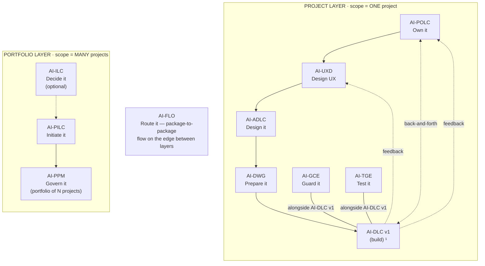

# AI-POLC — AI-Driven Product Ownership Life Cycle

[](./LICENSE)

**Version:** 1.0.0
**Created By:** Maheri — [LinkedIn](https://www.linkedin.com/in/mohammad-maheri-8399565b)
**License:** Apache 2.0 with Attribution

---

## What Is AI-POLC?

AI-POLC is an injectable workflow package that guides an AI assistant and a human Product Owner through establishing and operating disciplined product ownership — from business intent to a governed, prioritized Product Backlog Package (PBP) ready for development consumption.

**Identity:** AI-POLC turns business intent into a prioritized, value-justified product backlog, and is the single source of truth for *what gets built, in what order, and why*.

---

## The AI-* PDLC Family

AI-POLC is part of **AIFLC** (AI Full Life Cycle) — the AI-* PDLC Family of injectable workflow packages.


  ¹ AI-DLC v1 = Amazon's open-source build lifecycle (not ours; we feed it).

| Layer | Package | Type | Input | Output |
|-------|---------|------|-------|--------|
| Portfolio | **AI-ILC** ² | Interactive workflow (lifecycle) | Raw idea | Approved Idea Brief / Feature Brief |
| Portfolio | **AI-PILC** | Interactive workflow (lifecycle) | Raw requirement | Project Initiation Package (PIP) |
| Portfolio | **AI-PPM** ³ | Adaptive portfolio engine | Multiple PIPs + Approved Idea Briefs | Portfolio register + cross-project prioritization & governance |
| Edge | **AI-FLO** ³ | Router / orchestration engine | Any package output marker | Routing decision + handoff to next package/layer |
| Project | **AI-POLC** ³ | Interactive workflow (lifecycle) | PIP | Product Backlog Package (PBP) |
| Project | **AI-UXD** ³ | Interactive workflow (lifecycle) | PIP + PBP | UX Design Package (UXP): personas/journeys, IA, user flows, design system + tokens, accessibility baseline |
| Project | **AI-ADLC** | Interactive workflow (lifecycle) | PIP + PBP + UXP | Architecture Package (AP) |
| Project | **AI-DWG** | One-time generator | AP + PBP + UXP | Ready-to-code development workspace (DW) |
| Project | **AI-GCE** | Adaptive governance engine | DW (AI-DWG output) | Compliance enforcement layer |
| Project | **AI-TGE** | Test governance engine | DW / build artifacts | Test governance & quality layer |
| Project | **AI-DLC v1** ¹ | Interactive workflow (lifecycle) | DW + GCE + User Stories (from AI-POLC) | Working Software |

> ¹ **AI-DLC v1** ([awslabs/aidlc-workflows](https://github.com/awslabs/aidlc-workflows)) is NOT our product. Our chain produces the workspace AI-DLC v1 consumes.
> ² **AI-ILC** is an **optional pre-stage** (the funnel before the funnel). The chain still works without it for users who start at AI-PILC. `⇢` denotes the optional link.
> ³ All packages in this table are **built**. AI-PPM (portfolio engine), AI-FLO (router), AI-POLC (product ownership lifecycle), and AI-UXD (UX design lifecycle) were the last four — completed June 2026. Within the Project layer, **AI-POLC, AI-UXD, and AI-ADLC run sequentially** (POLC→UXD→ADLC) — each feeds the next, culminating at AI-DWG which receives all three outputs (AP + PBP + UXP). **AI-GCE and AI-TGE run alongside AI-DLC v1** as continuous quality engines; **AI-POLC ⇄ AI-DLC v1** exchange backlog/acceptance throughout delivery; and **AI-DLC v1 runtime feedback flows back to both AI-UXD and AI-POLC**. Feedback loops (ADLC→POLC cost/risk, ADLC→UXD constraints) provide iterative refinement without changing the forward sequence.

> **AI-DFE** ([Data Fabric Engine](../ai-dfe/)) is a family-scoped **companion** — it gathers data from all packages and distributes structured JSON for dashboards and status roll-ups. It runs alongside the chain rather than as a linear step, so it is not shown as a chain row above.

---

## Where AI-POLC Sits in the Chain

AI-POLC is the **first step of the Project layer** — the start of the sequential design chain **AI-POLC → AI-UXD → AI-ADLC → AI-DWG**. It turns the initiated project (and any idea/feature intent) into a governed, prioritized **Product Backlog Package (PBP)** — the single source of truth for *what gets built, in what order, and why*.

| Aspect | AI-POLC |
|--------|---------|
| **Layer** | Project |
| **Position** | First in the Project-layer sequence (POLC → UXD → ADLC → DWG) |
| **Predecessor** | AI-PILC (PIP); optionally AI-ILC feature briefs |
| **Direct successors** | AI-UXD (personas/journeys build on the backlog) and AI-DWG (consumes DoR/DoD + prioritization); exchanges backlog/acceptance with AI-DLC v1 throughout the build |
| **Reads (input)** | PIP (`pilc-state.md`); optionally AP (`adlc-state.md`), UXP (`uxd-state.md`), feature briefs (`ilc-state.md`) |
| **Produces (output)** | Product Backlog Package (PBP) under `pdlc-ws/projects/PRJ-{ABBREV}-{slug}/backlog/` |
| **Output marker** | `polc-state.md` |
| **Correlation key** | Adopts the upstream `projectId` (never re-mints); threads `derivedFrom` idea/feature lineage |
| **Capability emitted** | `product-backlog@1` (consumed by AI-DWG) |
| **Capability consumed** | `project-initiation@1`, `architecture-design@1`, `ux-design@1`; optional cross-family `enterprise-okr@1` seam-in |

**Simplified chain view** (see the diagram above for the full topology):

```
AI-PILC → [ AI-POLC → AI-UXD → AI-ADLC → AI-DWG ] → AI-DLC v1
            ▲ you are here (the Project layer starts here)
```

AI-POLC owns **what / why / in what order** — never **how** it's built (AI-DLC v1), **when / budget / resources** (AI-PILC), or **is-it-compliant** (AI-GCE/TGE). It also runs a two-way exchange with the build: it feeds the backlog and definition-of-done down, and processes acceptance and runtime feedback coming back.

### Standalone vs. chained

- **Standalone.** Give it a product brief or an existing backlog and it produces a full PBP — vision, roadmap, epics, prioritization, DoR/DoD — with no other package present.
- **Chained (upstream).** It detects `pilc-state.md` / `adlc-state.md` / `uxd-state.md` and enriches from each (business intent, technical feasibility bands, personas/journeys) without re-entry.
- **Chained (downstream).** On completion it writes `polc-state.md` and the PBP; AI-UXD and AI-DWG detect the marker, and AI-DLC v1 consumes the backlog during delivery.
- **Story elaboration is a load decision.** Tier 2 (INVEST stories + Given/When/Then) is **off by default in chain mode** (AI-DLC v1 elaborates stories); turn it on for standalone use or PO-quality pre-elaboration.
- **Cross-family (optional).** It can consume an `enterprise-okr@1` seam so a strategy family's OKRs cascade into the product backlog.

---

## Features

### Core (Tier 1 — Always Active)

- **Product Vision & Goals** — distill business intent into measurable goals
- **PO Charter & Authority** — define decision boundaries and RACI
- **Product Discovery & Roadmap** — Now/Next/Later strategic planning
- **Epic Decomposition** — goal→epic mapping with acceptance criteria
- **Value-Based Prioritization** — WSJF, MoSCoW, or value-effort with recorded rationale
- **Release & Increment Slicing** — MVP/MMP scope + delivery groupings
- **Definition of Ready / Done** — quality bar flowing to AI-DWG and AI-GCE
- **Product Risk & Assumptions** — product-level risk register
- **Traceability** — intent→epic→release linkage
- **Stakeholder Management** — power/interest matrix + communication cadence
- **Product Documentation** — release notes and changelog governance
- **Backlog Operations** — refinement, splitting criteria, tech-debt trade-offs
- **Acceptance & Feedback** — increment acceptance against DoD, DLC feedback loop

### Story Elaboration (Tier 2 — User-Activated)

- **INVEST-compliant stories** with Given/When/Then acceptance criteria
- Off by default in chain mode (AI-DLC v1 handles story creation)
- Activate for standalone use or PO-quality pre-elaboration

### Extensions (Opt-In)

- Advanced Discovery (OKRs, JTBD, opportunity scoring)
- User Story Mapping (journey backbone, walking skeleton, release-slice seeding)
- Full Traceability (audit-grade matrix, compliance evidence)
- Full Risk Register (scoring, owners, response plans, trend tracking)
- Value & Metrics Engine (KPIs, benefits realization, experiments)
- Full Product Docs (PRD, feature briefs, wiki governance)
- Quality Review AI-Assist (automated backlog quality scanning)
- MVP/MMP for Mature Products (next-version scoping)

---

## Output Directory Structure

AI-POLC outputs into the standard multi-project layout. Product backlog artifacts land in `backlog/` within the project folder:

```
pdlc-ws/projects/
├── PROJECTS.md                          ← workspace registry
└── PRJ-{ABBREV}-{slug}/                  ← one project
    ├── management_framework/             ← shared governance spine
    └── backlog/                          ← AI-POLC output
        ├── polc-state.md                 ← progress marker
        ├── product-vision.md
        ├── po-charter.md
        ├── product-roadmap.md
        ├── epics/
        ├── release-plan.md
        ├── definition-of-ready.md
        ├── definition-of-done.md
        ├── product-risk-register.md
        ├── traceability-matrix.md
        └── PBP_README.md
```

> The `projects/` structure is always-on — solo, single-project, and multi-project alike. See `OUTPUT_AND_STATE_CONTRACT.md` for full details.

---

## Activation

**Explicit key:** type `_POLC_` in any prompt to activate AI-POLC unambiguously — even when other AI-* packages share the workspace. The status key `_ACTIVE_` reports which package is currently active. A package switch never happens without your explicit key or confirmation, and any switch is announced on the first line of the response (`Active package: AI-POLC`). See [`../TRIGGER_KEYS_REFERENCE.md`](../TRIGGER_KEYS_REFERENCE.md) for the full family key table.

---

## Installation

AI-POLC is pure Markdown — no runtime, no dependencies, no build step. "Installing" means placing two folders and one always-loaded router file where your AI agent will read them.

### The model (read this first)

Installation writes to exactly three places:

1. **The package home** — `ai-polc-rules/` (the core **dispatcher**) and `ai-polc-rule-details/` (stage details + templates, read on demand) are copied into `.aiflc/pdlc/`. This path is **identical on every platform**.
2. **One always-loaded orchestrator** — a single small router placed in your platform's native auto-load slot. It is the *only* file that loads automatically; it reads the AI-POLC core on demand when you activate the package. (Nothing under `.aiflc/` auto-loads — that keeps the context window free no matter how many packages you install.)
3. **The output workspace** — `pdlc-ws/` at your workspace root; AI-POLC writes the backlog under `pdlc-ws/projects/PRJ-{ABBREV}-{slug}/backlog/`.

### Option A — Install alongside the family (recommended)

Run the family installer from the repo root. It places AI-POLC (and any other packages you pick) correctly for your platform, deploys the orchestrator, and creates `pdlc-ws/`.

```powershell
# Windows (PowerShell) — install just AI-POLC on Kiro
.\installer\install.ps1 -TargetWorkspace "C:\path\to\your\project" -Platform kiro -Packages "ai-polc"
```

```bash
# macOS / Linux — install just AI-POLC on Kiro
./installer/install.sh --target ~/path/to/your/project --platform kiro --packages ai-polc
```

Swap `-Packages "ai-polc"` for `-Bundle full` to install the whole chain at once. Supported `-Platform` values: `kiro`, `cursor`, `claude-code`, `cline`, `amazonq`, `copilot`.

### Option B — Install this package individually (manual)

Two copy operations plus one orchestrator placement. Copy the two package folders into the uniform home (same on every platform):

```
ai-polc/ai-polc-rules/        →  <workspace>/.aiflc/pdlc/ai-polc-rules/
ai-polc/ai-polc-rule-details/ →  <workspace>/.aiflc/pdlc/ai-polc-rule-details/
```

Then place the always-loaded orchestrator (`session-orchestrator.md`, from the packages root) in your platform's slot:

| Platform | Orchestrator destination | How it loads |
|----------|--------------------------|--------------|
| **Kiro** | `.kiro/steering/session-orchestrator-pdlc.md` | Auto-loaded steering |
| **Amazon Q** | `.amazonq/rules/pdlc/session-orchestrator.md` | Auto-loaded rule |
| **Cursor** | `.cursor/rules/pdlc-session-orchestrator.mdc` | Add `alwaysApply: true` frontmatter |
| **Cline** | `.clinerules/pdlc-session-orchestrator.md` | Auto-loaded rule |
| **Claude Code** | `CLAUDE_PDLC_ORCHESTRATOR.md` | Import from root `CLAUDE.md` via `@CLAUDE_PDLC_ORCHESTRATOR.md` |
| **GitHub Copilot** | `.github/copilot-instructions-pdlc-orchestrator.md` | Workspace instructions |
| **Codex / VS Code agent** | `AGENTS.md` (workspace root) | Auto-loaded agent instructions |

> Claude Code uses a parallel orchestrator source, `session-orchestrator.claude.md`. Finally, create `pdlc-ws/` at your workspace root for output.

### For AI agents — machine-readable install manifest

An AI assistant can install AI-POLC by parsing and executing the block below. All `copy.from` and `orchestrator.source` paths are relative to `source_root`; every destination is relative to the workspace root. Pick the one `orchestrator.slot` row that matches the target platform. The manifest is **platform-agnostic** — everything except `orchestrator.slot` is identical on every platform.

```yaml
# AIFLC INSTALL MANIFEST — AI-POLC
package: AI-POLC
family: pdlc                       # package home: .aiflc/pdlc/
version: 1.0.0
runtime: none                      # pure Markdown; no deps, no build
source_root: pdlc-packages/        # clone root of the AIPDLC repo
activation_phrase: "Using AI-POLC, build the product backlog"
trigger_key: "_POLC_"              # universal explicit key (recognized by the orchestrator on any platform); or use activation_phrase
status_key: "_ACTIVE_"             # reports which package is currently active
depends_on: []                     # standalone-capable; can lead from any single feed
optional_inputs:
  - marker: pilc-state.md          # AI-PILC PIP (business intent, scope)
  - marker: adlc-state.md          # AI-ADLC feasibility/cost-risk bands
  - marker: uxd-state.md           # AI-UXD personas/journeys
  - marker: ilc-state.md           # AI-ILC feature briefs (Route=feature)
  - type: "enterprise-okr@^1"      # optional cross-family seam-in (OKR cascade)
emits_capability: "product-backlog@1"
output_marker: polc-state.md
output_dir: pdlc-ws/               # per-project backlog under pdlc-ws/projects/PRJ-.../backlog/
copy:
  - from: ai-polc/ai-polc-rules
    to: .aiflc/pdlc/ai-polc-rules
  - from: ai-polc/ai-polc-rule-details
    to: .aiflc/pdlc/ai-polc-rule-details
orchestrator:
  source: session-orchestrator.md            # the ONLY always-loaded file
  source_claude: session-orchestrator.claude.md   # use this source for claude-code
  slot:
    kiro: .kiro/steering/session-orchestrator-pdlc.md
    amazonq: .amazonq/rules/pdlc/session-orchestrator.md
    cursor: .cursor/rules/pdlc-session-orchestrator.mdc   # + frontmatter alwaysApply: true
    cline: .clinerules/pdlc-session-orchestrator.md
    claude-code: CLAUDE_PDLC_ORCHESTRATOR.md              # import from root CLAUDE.md
    copilot: .github/copilot-instructions-pdlc-orchestrator.md
    codex: AGENTS.md
    vscode: AGENTS.md
core_entry: .aiflc/pdlc/ai-polc-rules/core-workflow.md    # orchestrator Reads this on activation
rule_details_home: .aiflc/pdlc/ai-polc-rule-details/      # core resolves these on demand
verify:
  - path_exists: .aiflc/pdlc/ai-polc-rules/core-workflow.md
  - path_exists: .aiflc/pdlc/ai-polc-rule-details/
  - orchestrator_present_in_platform_slot: true
  - action: 'say "Using AI-POLC, build the product backlog" and expect the AI-POLC welcome message'
```

### Verify

1. Open the workspace in your IDE with the AI agent active.
2. Confirm the orchestrator loaded (Kiro: it appears in the Steering panel).
3. Start a chat: `Using AI-POLC, build the product backlog`.
4. AI-POLC greets you and begins; backlog output appears under `pdlc-ws/projects/PRJ-.../backlog/`.

For the full per-platform walkthrough (including limitations and workarounds), see [setup/INSTALL.md](./setup/INSTALL.md) and the family-wide [INSTALL_GUIDE.md](../../INSTALL_GUIDE.md).

---

## File Structure

```
ai-polc/
├── README.md                           ← This file
├── LICENSE
├── PLAN.md                             ← Build plan and design rationale
├── ai-polc-rules/
│   └── core-workflow.md                ← Master dispatcher (read on demand by the orchestrator)
├── ai-polc-rule-details/
│   ├── common/                         ← Cross-cutting rules (5 files)
│   ├── foundation/                     ← Phase 1: Stages 1-3
│   ├── strategy/                       ← Phase 2: Stages 4-7
│   ├── governance/                     ← Phase 3: Stages 8-10
│   ├── stakeholders/                   ← Phase 4: Stages 11-12
│   ├── assembly/                       ← Phase 5: Stage 13
│   ├── operations/                     ← Phase 6: Stages 14-16
│   ├── tier2/                          ← Tier 2: Story elaboration
│   ├── extensions/                     ← 7 opt-in extensions (14 files)
│   └── templates/                      ← 12 output templates
└── setup/
    └── INSTALL.md
```

---

## Tenets

1. **Value-justified** — nothing enters the backlog without answering "why does this serve the product vision?"
2. **Traceable** — every item links upward to a goal and downward to an acceptance bar
3. **Governed** — decisions are logged, priorities have rationale, changes are tracked
4. **Adaptive** — depth adapts to product complexity; context factors shape behavior
5. **Workspace-mediated** — rules reach AI-DLC v1 through steering files, not direct integration
6. **Source-driven** — derive from user input; never fabricate scope

---

## Patterns, Methodologies & Frameworks Covered

AI-POLC operationalizes **disciplined product ownership** — turning business intent into a governed, prioritized backlog. It aligns with the bodies of knowledge below and adapts their concepts to an AI-assisted, human-gated workflow; it does not certify against any of them.

| Framework / body of knowledge | What AI-POLC applies | Where it stops (scope boundary) |
|---|---|---|
| **Scrum product ownership** | The PO discipline — one prioritized backlog, PO charter & authority, DoR/DoD quality bar, refinement & acceptance | Not Scrum team process (sprints, standups) or delivery — that's the team + AI-DLC v1 |
| **SAFe Lean Portfolio** (patterns) | Epics, value streams, economic (WSJF-style) prioritization, MVP/MMP release slicing | Not full SAFe (no ARTs, PI planning, team-level agile) |
| **Value-based prioritization — WSJF / MoSCoW / value-effort** | An explicit, recorded prioritization model that ranks the backlog with rationale | It ranks and justifies; it does not estimate implementation effort or schedule delivery |
| **Impact Mapping · Jobs-to-be-Done · OKRs** | Discovery and goal decomposition (goal → epic → acceptance) plus success metrics (opt-in extensions) | Not experiment execution or live metric instrumentation (build-time) |
| **User Story Mapping** (Patton) | Journey backbone, walking skeleton, release-slice seeding (opt-in extension) | Not UX design itself — personas, journeys, and flows are AI-UXD |
| **INVEST + Given/When/Then** | Story quality and testable acceptance criteria (Tier 2 — user-activated; off by default in chain mode) | In chain mode, story elaboration defers to AI-DLC v1 unless Tier 2 is on |
| **Definition of Ready / Done** | An explicit quality bar that flows downstream to AI-DWG and AI-GCE | It sets the bar; enforcement at build/compliance time is AI-GCE / AI-TGE |

The identity line holds the boundary: AI-POLC owns **what gets built, in what order, and why** — not the *how* (AI-DLC v1), the *when / budget / resources* (AI-PILC), or *is-it-compliant* (AI-GCE / AI-TGE).

---

## Cross-Cutting Lenses (AI · Automation · Agentic)

AI-POLC is the **per-feature origin point** for the family's cross-cutting lenses — where lens modes (set at AI-PILC in `Lens_Status.md`) become concrete feature tags on the backlog.

| Lens | Mode (on / off) | Key | What AI-POLC does when it's on |
|------|-----------------|-----|-------------------------------|
| **AI Lens** | AI-Powered / No-AI | `_AILENS_` | Tags features `aiFeature` (AIF-NNN), proposes an AI sub-mode, and writes AI-specific acceptance criteria |
| **Automation Lens** | Automated / Manual | `_AUTOLENS_` | Tags features `automationFeature` (AUTO-NNN) and adds automation acceptance criteria |
| **Agentic** (AI ∩ Automation) | derived — both on | — | Runs an agentic-opportunity scan; on confirm sets the derived `agenticProfile` on qualifying features |

Downstream, AI-DWG provisions the matching scaffolding and AI-GCE / AI-TGE govern and test the tagged features via Layer-3 agents (`AIG__`/`ATG__`, `AIQ__`/`ATQ__`).

---

## Quick Start

```
You take the role of a high-skilled professional process designer/engineer.

Using the AI-POLC package, I want to establish product ownership governance
for my product.

Context:
- Product: {your product name}
- Input: {PIP available / Architecture Package / standalone vision}
- Mode: {chain with AI-DLC v1 / standalone}

Please start the AI-POLC workflow.
```

---

*Created: 2026-06-11 | Created By: Maheri*

---

## Further Reading

Deep-dive knowledge documents for this package (in the family repo under `knowledge_docs/`):

| Document | What it covers |
|----------|---------------|
| [How POLC Product Ownership Works](../../knowledge_docs/HOW_POLC_PRODUCT_OWNERSHIP_WORKS.md) | Internal mechanics of the 6-phase / 16-stage backlog lifecycle |
| [How to Manage Product Backlog](../../knowledge_docs/HOW_TO_MANAGE_PRODUCT_BACKLOG.md) | Practitioner guide — running AI-POLC on a real product |
| [How Delivery Method Timing Works](../../knowledge_docs/HOW_DELIVERY_METHOD_TIMING_WORKS.md) | The AI-accelerated delivery multiplier model |
| [How Package Installation Works](../../knowledge_docs/HOW_PACKAGE_INSTALLATION_WORKS.md) | How the installer places packages into your workspace |
| [How Package Activation & Isolation Works](../../knowledge_docs/HOW_PACKAGE_ACTIVATION_ISOLATION_WORKS.md) | Activation keys, switching rules, multi-package coexistence |
| [How Chain Handoff Works](../../knowledge_docs/HOW_CHAIN_HANDOFF_WORKS.md) | How AI-POLC reads PIP and feeds AI-UXD |
| [How Gates and Approvals Work](../../knowledge_docs/HOW_GATES_AND_APPROVALS_WORK.md) | The human-in-the-loop gate model at every stage |
| [How Depth Levels Work](../../knowledge_docs/HOW_DEPTH_LEVELS_WORK.md) | Minimal / Standard / Comprehensive adaptive tiers |
| [How Project Layer Collaboration Works](../../knowledge_docs/HOW_PROJECT_LAYER_COLLABORATION_WORKS.md) | How POLC, UXD, and ADLC feed AI-DWG together |

---

## License

**Apache License 2.0 with Attribution Addendum**

- **Free to use:** Personal, commercial, educational, and organizational use — all permitted
- **Modify and distribute:** Create derivative works, redistribute, sublicense — all permitted
- **Attribution required:** Any distributed product substantially based on this work must include:

> *"Built on AIFLC by Mohammad Maheri — [LinkedIn](https://www.linkedin.com/in/mohammad-maheri-8399565b)"*

- **No warranty:** Provided "AS IS" without warranties of any kind

See `LICENSE` and `NOTICE` in this directory for full terms.

**Copyright:** © 2026 Mohammad Maheri

---

*Part of [AIFLC](../../README.md) — the AI-* PDLC Family*
