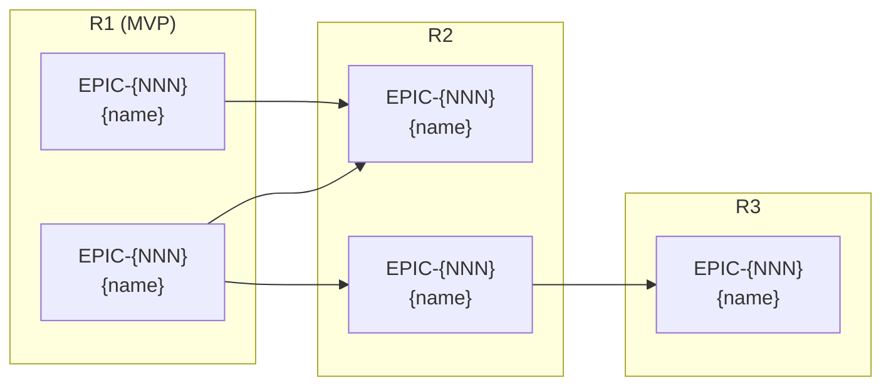

<!-- Copyright (c) 2026 Mohammad Maheri. Licensed under Apache 2.0. See LICENSE. Attribution required - see NOTICE. -->
---
generatedBy: AI-POLC
generatedVersion: 1.0.0
source: "stage-7-release-slicing"
generatedOn: "{ISO-date}"
ownership: hybrid
---

# Release Plan — {Product Name}

## Release Summary

| Release | Goal | Epics | Value Statement | Status |
|---------|------|:---:|-----------------|:---:|
| R1 (MVP) | {Goal} | {N} | "{One-sentence value to users}" | {Planned | In Progress | Shipped} |
| R2 | {Goal} | {N} | "{Value statement}" | {Planned} |
| R3 | {Goal} | {N} | "{Value statement}" | {Planned} |

---

## Release Timeline

```mermaid
gantt
    title Release Timeline — {Product Name}
    dateFormat YYYY-MM-DD
    axisFormat %b %Y

    section R1 (MVP)
    EPIC-{NNN}: {name}       :r1e1, {start}, {duration}
    EPIC-{NNN}: {name}       :r1e2, after r1e1, {duration}

    section R2
    EPIC-{NNN}: {name}       :r2e1, after r1e2, {duration}
    EPIC-{NNN}: {name}       :r2e2, after r2e1, {duration}

    section R3
    EPIC-{NNN}: {name}       :r3e1, after r2e2, {duration}
```

---

## Epic Dependency Graph



---

## MVP / MMP Scope

### In Scope (MVP)

| Epic | Rationale for Inclusion |
|------|------------------------|
| EPIC-{NNN}: {name} | {Why this is required for minimum viability} |
| EPIC-{NNN}: {name} | {Rationale} |

### Explicitly Out of MVP

| Epic | Rationale for Exclusion | Target Release |
|------|------------------------|:---:|
| EPIC-{NNN}: {name} | {Why it can wait} | R{N} |

---

## Release Details

### Release 1 (MVP)

**Goal:** {What this release achieves}
**Value Statement:** "{User-facing value in one sentence}"

**Epics:**
| Rank | Epic | Size | Dependencies | Status |
|:----:|------|:---:|---|:---:|
| 1 | EPIC-{NNN} | {S/M/L/XL} | {deps or "none"} | {status} |
| 2 | EPIC-{NNN} | {size} | {deps} | {status} |

#### User Stories — R1

| Epic | US ID | User Story | Priority | Size | Acceptance Criteria (summary) | Status |
|------|--------|-----------|:--------:|:----:|-------------------------------|:------:|
| EPIC-{NNN} | US-{NNNN} | As a {role}, I want {goal} so that {benefit} | {MoSCoW} | {S/M/L} | {Key criteria count or summary} | {To Do | In Progress | Done} |
| EPIC-{NNN} | US-{NNNN} | As a {role}, I want {goal} so that {benefit} | {MoSCoW} | {size} | {summary} | {status} |
| EPIC-{NNN} | US-{NNNN} | As a {role}, I want {goal} so that {benefit} | {MoSCoW} | {size} | {summary} | {status} |

**Readiness Criteria:**
- [ ] All epics at DoD
- [ ] Integration testing complete
- [ ] No P1/P2 open bugs in scope
- [ ] Stakeholder demo completed
- [ ] Release notes drafted
- [ ] Rollback plan documented

---

### Release 2

**Goal:** {What this release achieves}
**Value Statement:** "{User-facing value in one sentence}"

**Epics:**
| Rank | Epic | Size | Dependencies | Status |
|:----:|------|:---:|---|:---:|
| 1 | EPIC-{NNN} | {size} | {deps} | {status} |

#### User Stories — R2

| Epic | US ID | User Story | Priority | Size | Acceptance Criteria (summary) | Status |
|------|--------|-----------|:--------:|:----:|-------------------------------|:------:|
| EPIC-{NNN} | US-{NNNN} | As a {role}, I want {goal} so that {benefit} | {MoSCoW} | {size} | {summary} | {status} |

**Readiness Criteria:**
- [ ] All epics at DoD
- [ ] Integration testing complete
- [ ] No P1/P2 open bugs in scope
- [ ] Stakeholder demo completed
- [ ] Release notes drafted
- [ ] Rollback plan documented

---

### Release 3

**Goal:** {What this release achieves}
**Value Statement:** "{User-facing value in one sentence}"

**Epics:**
| Rank | Epic | Size | Dependencies | Status |
|:----:|------|:---:|---|:---:|
| 1 | EPIC-{NNN} | {size} | {deps} | {status} |

#### User Stories — R3

| Epic | US ID | User Story | Priority | Size | Acceptance Criteria (summary) | Status |
|------|--------|-----------|:--------:|:----:|-------------------------------|:------:|
| EPIC-{NNN} | US-{NNNN} | As a {role}, I want {goal} so that {benefit} | {MoSCoW} | {size} | {summary} | {status} |

**Readiness Criteria:**
- [ ] All epics at DoD
- [ ] Integration testing complete
- [ ] No P1/P2 open bugs in scope
- [ ] Stakeholder demo completed
- [ ] Release notes drafted
- [ ] Rollback plan documented

---

## Ship/Iterate/Pivot Framework

| Signal | Decision | Action |
|--------|----------|--------|
| Metrics meet goals | **Ship + Continue** | Proceed to next release |
| Metrics partially met | **Iterate** | Adjust next release based on learnings |
| Metrics significantly missed | **Pivot** | Re-evaluate vision; major reprioritization |
| External change | **Re-assess** | Full reprioritization |

---

## Release Cadence

- **Model:** {Continuous | Per-sprint | Quarterly | PI-aligned}
- **Rationale:** {Why this cadence fits the product context}

---

*Generated by AI-POLC v1.0.0*
