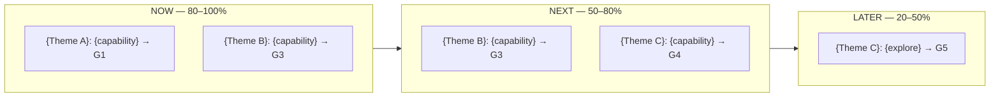

<!-- Copyright (c) 2026 Mohammad Maheri. Licensed under Apache 2.0. See LICENSE. Attribution required - see NOTICE. -->
---
generatedBy: AI-POLC
generatedVersion: 1.0.0
source: "{upstream-doc-path or user-input}"
generatedOn: "{ISO-date}"
ownership: hybrid
---

# Product Roadmap — {Product Name}

## Value Proposition

For {target users} who {need}, {product} provides {value} unlike {alternatives}.

---

## Strategic Themes

| # | Theme | Goals Served | Description |
|---|-------|:---:|------------|
| 1 | {Theme A} | G1, G2 | {What this area of the product focuses on} |
| 2 | {Theme B} | G3 | {Description} |
| 3 | {Theme C} | G4, G5 | {Description} |

---

## Roadmap: Now / Next / Later

### NOW (High confidence — current commitment)

| Theme | Capability | Goal | Epic(s) |
|-------|-----------|------|---------|
| {Theme A} | {What we're building} | G1 | EPIC-{NNN} |
| {Theme A} | {What we're building} | G2 | EPIC-{NNN} |
| {Theme B} | {What we're building} | G3 | EPIC-{NNN} |

### NEXT (Medium confidence — planned, sequenced)

| Theme | Capability | Goal | Epic(s) |
|-------|-----------|------|---------|
| {Theme B} | {What we plan to build} | G3 | EPIC-{NNN} |
| {Theme C} | {What we plan to build} | G4 | EPIC-{NNN} |

### LATER (Low confidence — directional intent)

| Theme | Capability | Goal | Epic(s) |
|-------|-----------|------|---------|
| {Theme C} | {Research/explore} | G5 | _[TBD]_ |

---

## Release Roadmap (visual)

> Now / Next / Later horizons at a glance. The Now/Next/Later tables above stay authoritative (DFE-extracted for the backlog dashboard); this diagram is the human view. `flowchart` is used as the portable fallback for the roadmap (date-driven `gantt`/`timeline` renderers vary across platforms; Now/Next/Later are confidence horizons, not fixed dates).

---

## Optional Dual-Date View (AI delivery method only)

> The roadmap is deliberately **undated** — Now / Next / Later are confidence horizons, not dates, and they stay authoritative. When an AI delivery method is recorded in `polc-state.md` → `## Velocity Model`, you MAY *optionally* attach a dual-date projection to the NOW items — manual-baseline target vs AI-method target — to make the compression visible to stakeholders. This is opt-in and never replaces the horizon model; manual-only projects keep the horizons-only roadmap. Multiplier source: `strategy/delivery-method-timing.md`.

---

## Roadmap Governance

| Aspect | Rule |
|--------|------|
| Review cadence | {Quarterly / per release / per PI} |
| Who can change | PO (with stakeholder communication per map) |
| Change logging | All roadmap changes logged as POLC-C-* in governance spine |
| Horizon confidence | Now: 80-100% | Next: 50-80% | Later: 20-50% |

---

*Generated by AI-POLC · AIFLC PDLC Family · © Mohammad Maheri · https://github.com/mbmd/AIFLC*
