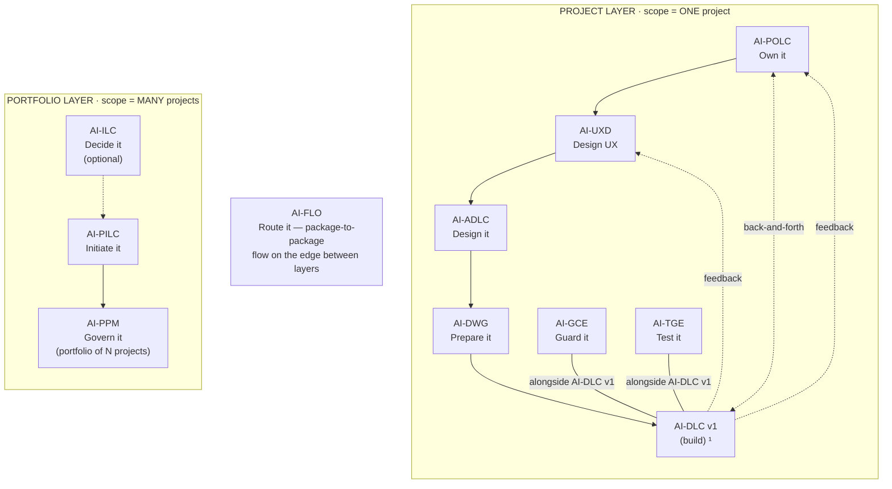

# AI-PPM: AI-Driven Project Portfolio Management

[](./LICENSE)

**Version:** 1.0.0

> **Govern the SET of projects — not just individual execution.**

AI-PPM is an injectable portfolio governance engine that manages multiple projects as a single governed portfolio. It registers, prioritizes, authorizes, monitors, and rebalances projects — answering the questions no single-project package can: *"Which projects should we run? In what order? Is the portfolio healthy? Should anything stop?"*

---

## The AI-* PDLC Family

AI-PPM is part of **AIFLC** (AI Full Life Cycle) — the AI-* PDLC Family of injectable workflow packages.


  ¹ AI-DLC v1 = Amazon's open-source build lifecycle (not ours; we feed it).

| Layer | Package | Type | Input | Output |
|-------|---------|------|-------|--------|
| Portfolio | **AI-ILC** ² | Interactive workflow (lifecycle) | Raw idea | Approved Idea Brief / Feature Brief |
| Portfolio | **AI-PILC** | Interactive workflow (lifecycle) | Raw requirement | Project Initiation Package (PIP) |
| Portfolio | **AI-PPM** ³ | Adaptive portfolio engine | Multiple PIPs + Approved Idea Briefs | Portfolio register + cross-project prioritization & governance |
| Edge | **AI-FLO** ³ | Router / orchestration engine | Any package output marker | Routing decision + handoff to next package/layer |
| Project | **AI-POLC** ³ | Interactive workflow (lifecycle) | PIP | Product Backlog Package (PBP) |
| Project | **AI-UXD** ³ | Interactive workflow (lifecycle) | PIP + PBP | UX Design Package (UXP): personas/journeys, IA, user flows, design system + tokens, accessibility baseline |
| Project | **AI-ADLC** | Interactive workflow (lifecycle) | PIP + PBP + UXP | Architecture Package (AP) |
| Project | **AI-DWG** | One-time generator | AP + PBP + UXP | Ready-to-code development workspace (DW) |
| Project | **AI-GCE** | Adaptive governance engine | DW (AI-DWG output) | Compliance enforcement layer |
| Project | **AI-TGE** | Test governance engine | DW / build artifacts | Test governance & quality layer |
| Project | **AI-DLC v1** ¹ | Interactive workflow (lifecycle) | DW + GCE + User Stories (from AI-POLC) | Working Software |

> ¹ **AI-DLC v1** ([awslabs/aidlc-workflows](https://github.com/awslabs/aidlc-workflows)) is NOT our product. Our chain produces the workspace AI-DLC v1 consumes.
> ² **AI-ILC** is an **optional pre-stage** (the funnel before the funnel). The chain still works without it for users who start at AI-PILC. `⇢` denotes the optional link.
> ³ All packages in this table are **built**. AI-PPM (portfolio engine), AI-FLO (router), AI-POLC (product ownership lifecycle), and AI-UXD (UX design lifecycle) were the last four — completed June 2026. Within the Project layer, **AI-POLC, AI-UXD, and AI-ADLC run sequentially** (POLC→UXD→ADLC) — each feeds the next, culminating at AI-DWG which receives all three outputs (AP + PBP + UXP). **AI-GCE and AI-TGE run alongside AI-DLC v1** as continuous quality engines; **AI-POLC ⇄ AI-DLC v1** exchange backlog/acceptance throughout delivery; and **AI-DLC v1 runtime feedback flows back to both AI-UXD and AI-POLC**. Feedback loops (ADLC→POLC cost/risk, ADLC→UXD constraints) provide iterative refinement without changing the forward sequence.

> **AI-DFE** ([Data Fabric Engine](../ai-dfe/)) is a family-scoped **companion** — it gathers data from all packages and distributes structured JSON for dashboards and status roll-ups. It runs alongside the chain rather than as a linear step, so it is not shown as a chain row above.

---

## Where AI-PPM Sits in the Chain

AI-PPM sits at the **top of the Portfolio layer** — the governance umbrella over the whole Project layer. Where AI-PILC initiates *one* project, AI-PPM governs the *set*: which projects run, in what order, and whether the portfolio stays healthy. It is a **continuous engine**, not a one-pass lifecycle — projects enter, are monitored, and retire over time.

| Aspect | AI-PPM |
|--------|---------|
| **Layer** | Portfolio (governance umbrella over the Project layer) |
| **Position** | Top of the Portfolio layer — after AI-PILC, above everything in the Project layer |
| **Reads — same layer (direct)** | AI-PILC (`pilc-state.md`) and AI-ILC (`ilc-state.md`) — registers projects and ideas |
| **Reads — cross layer (via AI-FLO)** | Per-project roll-up telemetry (progress, RAG, risk, budget, velocity, compliance, backlog health) — it **aggregates**, never recomputes |
| **Produces** | Portfolio register, strategic-alignment map, prioritization scorecard, governance decisions, and dispatch authorizations (carried DOWN to the Project layer by AI-FLO) |
| **Output location** | `pdlc-ws/portfolio/` |
| **Output marker** | `ppm-state.md` |
| **Correlation key** | Keys every portfolio roll-up by the `projectId` minted upstream by AI-PILC |
| **Capability emitted** | `portfolio-state@1` (internal + cross-family seam-out) and `delivery-feedback@1` (cross-family seam-out) |
| **Capability consumed** | `project-initiation@1`, `idea-decision@1`; optional cross-family `initiative-portfolio@1` seam-in |

**Simplified chain view** (see the diagram above for the full topology):

```
AI-ILC → AI-PILC → AI-PPM → AI-FLO → AI-POLC → AI-UXD → AI-ADLC → AI-DWG → AI-DLC v1
                      ▲ you are here (governs the SET; dispatches DOWN via AI-FLO)
```

AI-PPM answers **"which projects should we run, in what order, and is the portfolio healthy?"** — it never governs one project's internals (that's AI-PILC / POLC / ADLC / GCE / TGE). All cross-layer traffic transits AI-FLO; same-layer reads are direct (see [Key Design Principles](#key-design-principles) below).

### Standalone vs. chained

- **Standalone.** Describe your projects and AI-PPM builds a register and prioritization by interview — no other package required. It can even initialize an empty portfolio and grow it.
- **Chained (upstream).** With AI-PILC / AI-ILC present, it reads their markers directly (same layer) and registers projects/ideas without re-entry.
- **Chained (cross-layer).** With AI-FLO present, it ingests per-project roll-up telemetry UP and dispatches authorizations DOWN; without AI-FLO it degrades gracefully to a manual-status mode.
- **Cross-family (optional).** It can consume an `initiative-portfolio@1` seam from a strategy family (strategic initiatives cascading into projects) and emit `portfolio-state@1` / `delivery-feedback@1` back out.

---

## What AI-PPM Does

| Capability | Stage | What It Produces |
|---|:---:|---|
| **Register projects** | 1-2 | Portfolio Register with every project's identity and state |
| **Align to strategy** | 3 | Strategic Alignment Map (objectives × projects scoring) |
| **Prioritize cross-project** | 4 | Prioritization Scorecard (project-vs-project ranking) |
| **Govern admission** | 5 | Governance Decision Records (admit/pause/retire with rationale) |
| **Authorize execution** | 6 | Dispatch Authorizations (FLO carries to Project layer) |
| **Monitor health** | 7-8 | Portfolio Health Dashboard (aggregate views) |
| **Rebalance** | 9 | Rebalancing Proposals (when reality changes) |
| **Retire projects** | 10 | Retirement Records (formal closure with lessons) |

---

## Key Design Principles

### Layered Communication Rule

> **Cross-layer = through FLO. Same-layer = direct marker read.**

- AI-PPM reads AI-PILC and AI-ILC directly (same Portfolio layer)
- AI-PPM talks to Project-layer packages ONLY via AI-FLO
- FLO carries dispatch DOWN and roll-up telemetry UP

### No Duplication

AI-PPM never recomputes what downstream packages already produce:
- Per-project value scoring → AI-POLC
- Per-project resource planning → AI-PILC
- Per-project risk assessment → AI-PILC/POLC
- Per-project compliance → AI-GCE/TGE

AI-PPM **aggregates** their data (via FLO) into portfolio-level views.

### Continuous Engine (Not One-Pass)

Unlike lifecycle packages that complete, AI-PPM operates continuously:
- Projects enter and exit over time
- Health is monitored on cadence
- Priorities shift as reality changes
- There is no "workflow complete" — only episodes (register, review, rebalance, retire)

---

## Extensions (Opt-In)

| ID | Extension | Trigger |
|:--:|-----------|---------|
| E1 | Portfolio Balancing & Visualization | "balance" / >10 projects |
| E2 | What-If Scenario Modeling | "what-if" / capacity constraints |
| E3 | Cross-Project Dependency Mapping | >5 projects / "dependencies" |
| E4 | Portfolio-Level Capacity & Demand | "capacity" / shared teams |
| E5 | Investment Themes / Strategic Buckets | "strategic buckets" / formal categories |
| E6 | Financial Governance | "budget" / "funding" / enterprise |
| E7 | Benefits Realization Aggregation | "benefits" / projects completing |

---

## Usage

1. Open your workspace (with one or more initiated projects) in your IDE
2. Start a chat and say:
   ```
   Using AI-PPM, register and prioritize my portfolio
   ```
3. The engine reads project state, registers projects, and runs prioritization, authorization, and health monitoring
4. Review the Portfolio Register and dashboards; approve governance-gate decisions
5. Re-run anytime as the portfolio changes — it is continuous, not one-pass

## File Structure

```
ai-ppm/
├── README.md                    ← This file
├── LICENSE                      ← Apache 2.0 + Attribution
├── PLAN.md                      ← Build plan + scope decisions
├── ai-ppm-rules/
│   └── core-engine.md           ← Master dispatcher (read on demand by the orchestrator)
├── ai-ppm-rule-details/
│   ├── common/                  ← Cross-cutting rules (5 files)
│   ├── intake/                  ← Stages 1-2
│   ├── prioritization/          ← Stages 3-4
│   ├── authorization/           ← Stages 5-6
│   ├── monitoring/              ← Stages 7-8
│   ├── optimization/            ← Stages 9-10
│   ├── extensions/              ← 7 opt-in extensions
│   └── templates/               ← 9 output templates + agent
└── setup/
    └── INSTALL.md               ← Multi-platform installation
```

---

## Activation

**Explicit key:** type `_PPM_` in any prompt to activate AI-PPM unambiguously — even when other AI-* packages share the workspace. The status key `_ACTIVE_` reports which package is currently active. A package switch never happens without your explicit key or confirmation, and any switch is announced on the first line of the response (`Active package: AI-PPM`). See [`../TRIGGER_KEYS_REFERENCE.md`](../TRIGGER_KEYS_REFERENCE.md) for the full family key table.

---

## Installation

AI-PPM is pure Markdown — no runtime, no dependencies, no build step. "Installing" means placing two folders and one always-loaded router file where your AI agent will read them.

### The model (read this first)

Installation writes to exactly three places:

1. **The package home** — `ai-ppm-rules/` (the core **dispatcher**) and `ai-ppm-rule-details/` (stage details + templates, read on demand) are copied into `.aiflc/pdlc/`. This path is **identical on every platform**.
2. **One always-loaded orchestrator** — a single small router placed in your platform's native auto-load slot. It is the *only* file that loads automatically; it reads the AI-PPM core on demand when you activate the package. (Nothing under `.aiflc/` auto-loads — that keeps the context window free no matter how many packages you install.)
3. **The output workspace** — `pdlc-ws/` at your workspace root; AI-PPM writes portfolio artifacts under `pdlc-ws/portfolio/`.

### Option A — Install alongside the family (recommended)

Run the family installer from the repo root. It places AI-PPM (and any other packages you pick) correctly for your platform, deploys the orchestrator, and creates `pdlc-ws/`.

```powershell
# Windows (PowerShell) — install just AI-PPM on Kiro
.\installer\install.ps1 -TargetWorkspace "C:\path\to\your\project" -Platform kiro -Packages "ai-ppm"
```

```bash
# macOS / Linux — install just AI-PPM on Kiro
./installer/install.sh --target ~/path/to/your/project --platform kiro --packages ai-ppm
```

Swap `-Packages "ai-ppm"` for `-Bundle portfolio` (AI-ILC + AI-PILC + AI-PPM + AI-FLO) or `-Bundle full` to install more of the chain at once. Supported `-Platform` values: `kiro`, `cursor`, `claude-code`, `cline`, `amazonq`, `copilot`.

### Option B — Install this package individually (manual)

Two copy operations plus one orchestrator placement. Copy the two package folders into the uniform home (same on every platform):

```
ai-ppm/ai-ppm-rules/        →  <workspace>/.aiflc/pdlc/ai-ppm-rules/
ai-ppm/ai-ppm-rule-details/ →  <workspace>/.aiflc/pdlc/ai-ppm-rule-details/
```

Then place the always-loaded orchestrator (`session-orchestrator.md`, from the packages root) in your platform's slot:

| Platform | Orchestrator destination | How it loads |
|----------|--------------------------|--------------|
| **Kiro** | `.kiro/steering/session-orchestrator-pdlc.md` | Auto-loaded steering |
| **Amazon Q** | `.amazonq/rules/pdlc/session-orchestrator.md` | Auto-loaded rule |
| **Cursor** | `.cursor/rules/pdlc-session-orchestrator.mdc` | Add `alwaysApply: true` frontmatter |
| **Cline** | `.clinerules/pdlc-session-orchestrator.md` | Auto-loaded rule |
| **Claude Code** | `CLAUDE_PDLC_ORCHESTRATOR.md` | Import from root `CLAUDE.md` via `@CLAUDE_PDLC_ORCHESTRATOR.md` |
| **GitHub Copilot** | `.github/copilot-instructions-pdlc-orchestrator.md` | Workspace instructions |
| **Codex / VS Code agent** | `AGENTS.md` (workspace root) | Auto-loaded agent instructions |

> Claude Code uses a parallel orchestrator source, `session-orchestrator.claude.md`. Finally, create `pdlc-ws/` at your workspace root for output.

### For AI agents — machine-readable install manifest

An AI assistant can install AI-PPM by parsing and executing the block below. All `copy.from` and `orchestrator.source` paths are relative to `source_root`; every destination is relative to the workspace root. Pick the one `orchestrator.slot` row that matches the target platform. The manifest is **platform-agnostic** — everything except `orchestrator.slot` is identical on every platform.

```yaml
# AIFLC INSTALL MANIFEST — AI-PPM
package: AI-PPM
family: pdlc                       # package home: .aiflc/pdlc/
version: 1.0.0
runtime: none                      # pure Markdown; no deps, no build
source_root: pdlc-packages/        # clone root of the AIPDLC repo
activation_phrase: "Using AI-PPM, register and prioritize my portfolio"
trigger_key: "_PPM_"               # universal explicit key (recognized by the orchestrator on any platform); or use activation_phrase
status_key: "_ACTIVE_"             # reports which package is currently active
depends_on: []                     # standalone-capable; can initialize an empty portfolio
optional_inputs:
  - marker: pilc-state.md          # AI-PILC projects (same-layer direct read)
  - marker: ilc-state.md           # AI-ILC ideas (same-layer direct read)
  - type: "initiative-portfolio@^1"   # optional cross-family seam-in (strategy → portfolio)
emits_capability: "portfolio-state@1"   # also emits delivery-feedback@1 (cross-family seam-out)
output_marker: ppm-state.md
output_dir: pdlc-ws/portfolio/     # created under the workspace-root pdlc-ws/
copy:
  - from: ai-ppm/ai-ppm-rules
    to: .aiflc/pdlc/ai-ppm-rules
  - from: ai-ppm/ai-ppm-rule-details
    to: .aiflc/pdlc/ai-ppm-rule-details
orchestrator:
  source: session-orchestrator.md            # the ONLY always-loaded file
  source_claude: session-orchestrator.claude.md   # use this source for claude-code
  slot:
    kiro: .kiro/steering/session-orchestrator-pdlc.md
    amazonq: .amazonq/rules/pdlc/session-orchestrator.md
    cursor: .cursor/rules/pdlc-session-orchestrator.mdc   # + frontmatter alwaysApply: true
    cline: .clinerules/pdlc-session-orchestrator.md
    claude-code: CLAUDE_PDLC_ORCHESTRATOR.md              # import from root CLAUDE.md
    copilot: .github/copilot-instructions-pdlc-orchestrator.md
    codex: AGENTS.md
    vscode: AGENTS.md
core_entry: .aiflc/pdlc/ai-ppm-rules/core-engine.md       # orchestrator Reads this on activation
rule_details_home: .aiflc/pdlc/ai-ppm-rule-details/       # core resolves these on demand
verify:
  - path_exists: .aiflc/pdlc/ai-ppm-rules/core-engine.md
  - path_exists: .aiflc/pdlc/ai-ppm-rule-details/
  - orchestrator_present_in_platform_slot: true
  - action: 'say "Using AI-PPM, register and prioritize my portfolio" and expect the AI-PPM welcome message'
```

### Verify

1. Open the workspace in your IDE with the AI agent active.
2. Confirm the orchestrator loaded (Kiro: it appears in the Steering panel).
3. Start a chat: `Using AI-PPM, register and prioritize my portfolio`.
4. AI-PPM greets you and begins; portfolio output appears under `pdlc-ws/portfolio/`.

For the full per-platform walkthrough (including limitations and workarounds), see [setup/INSTALL.md](./setup/INSTALL.md) and the family-wide [INSTALL_GUIDE.md](../../INSTALL_GUIDE.md).

---

## Tenets

1. **Portfolio over project** — every decision is about the SET, never one project in isolation
2. **Explicit over implicit** — all decisions recorded with rationale and conditions
3. **Data-driven over opinion** — scoring models with evidence, not gut feel
4. **Continuous over one-shot** — the portfolio is always being governed
5. **Additive over disruptive** — extensions add depth without changing core behavior
6. **Layered communication** — cross-layer via FLO, same-layer direct
7. **Fallback graceful** — works without FLO (manual mode), without PILC (manual entry), without extensions (core suffices)

---

## Patterns, Methodologies & Frameworks Covered

AI-PPM operationalizes **portfolio-level governance** — managing many projects as one investment portfolio. It draws on:

- PMI Standard for Portfolio Management (4th Edition)
- MoP — Management of Portfolios (AXELOS)
- SAFe Lean Portfolio Management (patterns in extensions)
- Stage-Gate portfolio governance
- Benefits Realization Management (extension E7)

The table maps each to *what AI-PPM applies* and *where it stops*. AI-PPM **aligns with** these frameworks and adapts them to an AI-assisted, human-gated engine; it does not certify against any of them.

| Framework / body of knowledge | What AI-PPM applies | Where it stops (scope boundary) |
|---|---|---|
| **PMI Standard for Portfolio Management** | Portfolio register, strategic alignment, cross-project prioritization, governance gates, portfolio-health monitoring | Single-project management (initiation, delivery) — owned by AI-PILC and the Project layer |
| **MoP — Management of Portfolios** (AXELOS) | Portfolio *definition* (which projects) + portfolio *delivery* (keeping them on track) as continuous, governed cycles | Not strategy formulation itself — it governs against strategy, it does not set it |
| **SAFe Lean Portfolio Management** | Investment themes / strategic buckets and capacity-vs-demand as opt-in extensions (E5, E4) | Not full SAFe (no ARTs, PI planning, or team-level agile) — those are delivery-time |
| **Stage-gate portfolio governance** | Admit / pause / resume / retire decisions at an explicit portfolio governance gate, each a recorded decision | Per-project stage gates (e.g. AI-PILC's initiation gate) are separate and lower down |
| **Multi-criteria prioritization / weighted scoring** | A prioritization scorecard ranking projects against each other on weighted, evidence-based criteria | It does not recompute per-project value/risk/resource — it aggregates what downstream packages produce |
| **Benefits Realization Management** | Aggregating expected vs. realized benefits across the portfolio (extension E7) | Per-project benefit definition and tracking belong to initiation and delivery |

The defining constraint: AI-PPM **aggregates, never recomputes**. Per-project value scoring (AI-POLC), resource planning (AI-PILC), risk (AI-PILC/POLC), and compliance (AI-GCE/TGE) are read via AI-FLO and rolled up — never redone here.

---

## Author

**Maheri** — [LinkedIn](https://www.linkedin.com/in/mohammad-maheri-8399565b)

Built with the AI-* Package Builder methodology.

---

*AI-PPM v1.0.0 | Created: 2026-06-11*

---

## Further Reading

Deep-dive knowledge documents for this package (in the family repo under `knowledge_docs/`):

| Document | What it covers |
|----------|---------------|
| [How Portfolio Management Works](../../knowledge_docs/HOW_PORTFOLIO_MANAGEMENT_WORKS.md) | Internal mechanics of the 5-phase / 10-stage portfolio engine |
| [How to Manage a Portfolio of Projects](../../knowledge_docs/HOW_TO_MANAGE_A_PORTFOLIO_OF_PROJECTS.md) | Practitioner guide — running AI-PPM across multiple projects |
| [How Flow Orchestrator Works](../../knowledge_docs/HOW_FLOW_ORCHESTRATOR_WORKS.md) | How AI-FLO routes AI-PPM dispatches to the Project layer |
| [How Package Installation Works](../../knowledge_docs/HOW_PACKAGE_INSTALLATION_WORKS.md) | How the installer places packages into your workspace |
| [How Package Activation & Isolation Works](../../knowledge_docs/HOW_PACKAGE_ACTIVATION_ISOLATION_WORKS.md) | Activation keys, switching rules, multi-package coexistence |
| [How Chain Handoff Works](../../knowledge_docs/HOW_CHAIN_HANDOFF_WORKS.md) | How AI-PPM consumes PIPs and dispatches via AI-FLO |
| [How Gates and Approvals Work](../../knowledge_docs/HOW_GATES_AND_APPROVALS_WORK.md) | The human-in-the-loop gate model |
| [Pattern: Adaptive Intake](../../knowledge_docs/PATTERN_ADAPTIVE_INTAKE.md) | How AI-PPM adapts its intake based on what's available |

---

## License

**Apache License 2.0 with Attribution Addendum**

- **Free to use:** Personal, commercial, educational, and organizational use — all permitted
- **Modify and distribute:** Create derivative works, redistribute, sublicense — all permitted
- **Attribution required:** Any distributed product substantially based on this work must include:

> *"Built on AIFLC by Mohammad Maheri — [LinkedIn](https://www.linkedin.com/in/mohammad-maheri-8399565b)"*

- **No warranty:** Provided "AS IS" without warranties of any kind

See `LICENSE` and `NOTICE` in this directory for full terms.

**Copyright:** © 2026 Mohammad Maheri

---

*Part of [AIFLC](../../README.md) — the AI-* PDLC Family*
