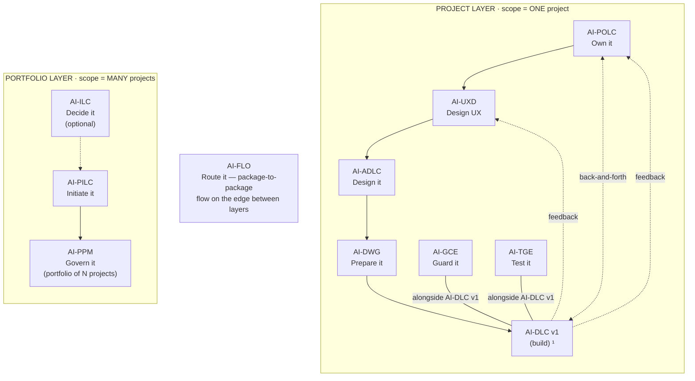

# AI-TGE (AI-Driven Test Governance Engine)

[](./LICENSE)

**Version:** 1.0.0
**Created By:** Maheri — [LinkedIn](https://www.linkedin.com/in/mohammad-maheri-8399565b)
**Inspired By:** [awslabs/aidlc-workflows](https://github.com/awslabs/aidlc-workflows) (MIT-0)
**License:** Apache 2.0 with Attribution Addendum — See `LICENSE` and `NOTICE`

---

## The AI-* PDLC Family

AI-TGE is part of **AIFLC** (AI Full Life Cycle) — the AI-* PDLC Family of injectable workflow packages.

The family is organized into two **layers** joined by a **router on the edge**: the
Portfolio layer reasons across MANY projects; the Project layer executes ONE project.


  ¹ AI-DLC v1 = Amazon's open-source build lifecycle (not ours; we feed it).

| Layer | Package | Type | Input | Output |
|-------|---------|------|-------|--------|
| Portfolio | **AI-ILC** ² | Interactive workflow (lifecycle) | Raw idea | Approved Idea Brief / Feature Brief |
| Portfolio | **AI-PILC** | Interactive workflow (lifecycle) | Raw requirement | Project Initiation Package (PIP) |
| Portfolio | **AI-PPM** ³ | Adaptive portfolio engine | Multiple PIPs + Approved Idea Briefs | Portfolio register + cross-project prioritization & governance |
| Edge | **AI-FLO** ³ | Router / orchestration engine | Any package output marker | Routing decision + handoff to next package/layer |
| Project | **AI-POLC** ³ | Interactive workflow (lifecycle) | PIP | Product Backlog Package (PBP) |
| Project | **AI-UXD** ³ | Interactive workflow (lifecycle) | PIP + PBP | UX Design Package (UXP): personas/journeys, IA, user flows, design system + tokens, accessibility baseline |
| Project | **AI-ADLC** | Interactive workflow (lifecycle) | PIP + PBP + UXP | Architecture Package (AP) |
| Project | **AI-DWG** | One-time generator | AP + PBP + UXP | Ready-to-code development workspace (DW) |
| Project | **AI-GCE** | Adaptive governance engine | DW (AI-DWG output) | Compliance enforcement layer |
| Project | **AI-TGE** | Test governance engine | DW / build artifacts | Test governance & quality layer |
| Project | **AI-DLC v1** ¹ | Interactive workflow (lifecycle) | DW + GCE + User Stories (from AI-POLC) | Working Software |

> ¹ **AI-DLC v1** ([awslabs/aidlc-workflows](https://github.com/awslabs/aidlc-workflows)) is NOT our product. Our chain produces the workspace AI-DLC v1 consumes.
> ² **AI-ILC** is an **optional pre-stage** (the funnel before the funnel). The chain still works without it for users who start at AI-PILC. `⇢` denotes the optional link.
> ³ All packages in this table are **built**. AI-PPM (portfolio engine), AI-FLO (router), AI-POLC (product ownership lifecycle), and AI-UXD (UX design lifecycle) were the last four — completed June 2026. Within the Project layer, **AI-POLC, AI-UXD, and AI-ADLC run sequentially** (POLC→UXD→ADLC) — each feeds the next, culminating at AI-DWG which receives all three outputs (AP + PBP + UXP). **AI-GCE and AI-TGE run alongside AI-DLC v1** as continuous quality engines; **AI-POLC ⇄ AI-DLC v1** exchange backlog/acceptance throughout delivery; and **AI-DLC v1 runtime feedback flows back to both AI-UXD and AI-POLC**. Feedback loops (ADLC→POLC cost/risk, ADLC→UXD constraints) provide iterative refinement without changing the forward sequence.

> **AI-DFE** ([Data Fabric Engine](../ai-dfe/)) is a family-scoped **companion** — it gathers data from all packages and distributes structured JSON for dashboards and status roll-ups. It runs alongside the chain rather than as a linear step, so it is not shown as a chain row above.

---

## Where AI-TGE Sits in the Chain

AI-TGE is a **continuous companion**, not a forward chain step — the family's first companion package. It runs **alongside AI-DLC v1** (the build), together with AI-GCE, inside the AI-DWG-generated development workspace. It reads what the architecture promised and what the build is doing, derives a test-governance layer, and continuously tracks whether what was designed is getting tested.

| Aspect | AI-TGE |
|--------|---------|
| **Layer** | Project — a continuous companion (runs in the dev workspace, alongside the build) |
| **Position** | Alongside AI-DLC v1 (not a sequential design step); sibling of AI-GCE |
| **Predecessors** | AI-ADLC (AP — the commitments to test) and AI-DWG (the workspace); observes AI-DLC v1 |
| **Runs with** | AI-DLC v1 (the build) and AI-GCE (its sibling companion) |
| **Reads (input)** | AP (`adlc-state.md`), DW (`.governance/workspace-manifest.yaml` / `rules/`), AI-DLC v1 state (`aidlc-docs/`), and existing tests (brownfield) |
| **Produces (output)** | A test-governance layer under `.governance/test/` — strategy, register, coverage report, debt scorecard, defect log (+ quality dashboard) |
| **Output marker** | `tge-state.md` (in `.governance/test/`) |
| **Correlation key** | Reads the `projectId` and stamps it into every coverage/defect record |
| **Capability emitted** | `test-strategy@1` (internal — companion to AI-DLC v1) |
| **Capability consumed** | `development-workspace@1` (AI-DWG) + `architecture-design@1` (AI-ADLC) |

**Simplified chain view** (see the diagram above for the full topology):

```
… AI-ADLC → AI-DWG → AI-DLC v1  (build)
                       ├── AI-GCE  (guards, alongside)
                       └── AI-TGE  ← you are here (tests, alongside)
```

AI-TGE answers **"do tests exist for what we designed, and which missing tests matter most?"** It **governs test accountability** — deriving the tests that MUST exist from architectural commitments, tracking what actually gets tested, and risk-scoring every gap. It never writes or runs test code (that's AI-DLC v1's build-and-test), and it is distinct from AI-GCE (code compliance) — see the Boundary Statement and Differences from AI-GCE below.

### Standalone vs. chained

- **Standalone.** It never requires the full chain — four auto-detected input modes: an AP alone yields architecture-derived strategy; existing tests alone yield a brownfield assessment; a running AI-DLC v1 alone yields observation-only tracking.
- **Chained.** With AP + DW + `aidlc-docs` present it runs full Strategy + Observation — deriving the register from commitments and tracking coverage as the build proceeds.
- **Delegation-on-activation.** When AI-TGE is active it **owns** `testing-strategy.md` (AI-DWG defers it); if AI-TGE is absent, AI-DWG produces a basic one from the architecture's quality attributes.
- **Graceful degradation (OR-input).** Each input is additive enrichment — its absence reduces scope but never halts the engine.
- **Platform-aware.** Its two report-only agents (`TGV__`, `CVR__`) render per platform; auto-execution/shortcuts are strongest on Kiro, advisory elsewhere.

---

## What is AI-TGE?

AI-TGE is an injectable test governance engine that reads architecture decisions (from AI-ADLC) and a development workspace (from AI-DWG), derives a structured test governance layer — strategy, register, coverage tracking, risk scoring — and continuously observes AI-DLC v1 execution to maintain test accountability.

It is the first **companion package** in the AI-* Family. Unlike sequential packages that sit in a linear handoff chain, AI-TGE runs **alongside** AI-DLC v1 together with AI-GCE as a continuous quality engine. It does not produce output for a downstream package — it feeds findings back into project quality.

**Metaphor:** A test governance inspector. It reads everything the architecture promised — API contracts, security decisions, integration maps, component designs — and builds a register of tests that MUST exist to verify those promises were kept. Then it watches the build, tracking what gets tested and what doesn't, scoring the risk of every gap.

---

## Key Features

| Feature | Description |
|---------|-------------|
| **Hybrid Engine** | Dual-mode operation: Strategy (derive what to test) + Observation (track what gets tested) |
| **Architecture-Driven** | Test requirements derived from architectural commitments, not invented ad-hoc |
| **Two-Source Model** | Architecture-derived requirements + universal baseline minimums — coverage even when AP is thin |
| **Risk-First Prioritization** | Missing tests scored by 4 factors (Architectural Risk × Blast Radius × Logic Complexity × Change Frequency) |
| **ISTQB-Aligned Taxonomy** | Three-dimensional classification: Level × Type × Technique |
| **Brownfield First-Class** | Existing projects with existing tests get assessment (map → gap → prioritize), not rejection |
| **Non-Destructive** | Reconciliation proposes changes; never auto-applies. Overrides mark, never delete. |
| **Adaptive Input** | Works with whatever exists — full chain, AP only, brownfield, or observation only |
| **Commitment-Based Coverage** | Measures "did we test what we designed?" — not just lines-of-code |
| **Silent When Complete** | Only speaks when gaps exist — no noise when coverage is full |
| **Injectable** | Drop into any workspace and activate — no project-specific setup |
| **Platform-Agnostic** | Works with Kiro, Amazon Q Developer, Cursor, Cline, Claude Code, GitHub Copilot |

---

## What It Produces

All artifacts are generated under `.governance/test/` in the workspace root:

| Artifact | Purpose |
|----------|---------|
| `tge-state.md` | Engine state + progress tracking (marker file) |
| `test-strategy.md` | Test approach, pyramid ratios, tools, coverage goals |
| `test-register.md` | Master list: commitment → required test → status |
| `coverage-report.md` | Multi-view coverage analysis (by commitment, component, type, risk) |
| `debt-scorecard.md` | Prioritized missing tests ranked by architectural risk |
| `defect-log.md` | Structured defect tracking linked to stories/components |

---

## Dual-Mode Operation

### Strategy Phase (Derive what to test)

```
🔵 Stage 1:  Workspace Detection     →  Detect inputs, determine mode and depth
🔵 Stage 2:  Architecture Reading    →  Read AP commitments, DW stack, DLC stories
🔵 Stage 3:  Test Requirement Derivation  →  Two-source: AP-derived + baseline
🔵 Stage 4:  Brownfield Assessment   →  Map existing tests to register (conditional)
🔵 Stage 5:  Test Strategy Generation →  Pyramid, tools, goals, data strategy
🔵 Stage 6:  Risk Scoring            →  Score every missing test by 4 risk factors
```

### Observation Phase (Track what gets tested)

```
🟢 Stage 7:  State Observation       →  Watch AI-DLC v1 progress, update register
🟢 Stage 8:  Story Acceptance Mapping →  Map acceptance criteria to tests (conditional)
🟢 Stage 9:  Coverage Reporting      →  Multi-view coverage analysis
🟢 Stage 10: Architecture Reconciliation →  Detect AP changes, propose updates (conditional)
🟢 Stage 11: Defect Logging          →  Structured defect capture (conditional)
🟢 Stage 12: Debt Reassessment       →  Re-score priorities as context changes
```

---

## Input Modes (Automatic Detection)

AI-TGE adapts to what exists. It never requires the full chain to have run.

| Mode | What Exists | Behavior |
|------|------------|----------|
| **Full Chain** | AP + DW + aidlc-docs (AI-DLC v1 running) | Full strategy + observation |
| **Architecture Only** | AP (from AI-ADLC) but no DW or DLC | Strategy mode only — derive register from AP |
| **Brownfield** | Existing project with existing tests (no AP) | Assessment mode — map tests, identify gaps |
| **Observation Only** | Active AI-DLC v1 with aidlc-docs but no prior TGE run | Jump to observation — register as you go |

**Standalone Usage (OR-input):** AI-TGE never blocks on a missing predecessor. AP alone produces architecture-derived strategy. Existing tests alone produce brownfield assessment. Running AI-DLC v1 alone produces observation-only tracking. Each input is additive enrichment — its absence reduces scope but never halts the engine. You do NOT need to run AI-PILC, AI-ADLC, or AI-DWG first if you have existing code with tests to assess.

---

## Adaptive Depth

AI-TGE calibrates its depth based on project complexity (5 factors scored 1-5):

| Depth | Score Range | Behavior |
|-------|:-----------:|----------|
| **Minimal** | 5–10 | Strategy + register only |
| **Standard** | 11–18 | + coverage reports + debt scoring + brownfield |
| **Comprehensive** | 19–25 | + full traceability + reconciliation + story mapping |

You can override the depth at any time: "Change depth to Comprehensive"

---

## Risk Scoring

Not all missing tests are equal. Each is scored on 4 factors (1–5 each):

| Factor | What It Measures |
|--------|-----------------|
| **Architectural Risk** | Impact if this goes untested |
| **Blast Radius** | How many things break if this fails |
| **Logic Complexity** | How likely a bug exists here |
| **Change Frequency** | How often this code changes |

**Composite:** Risk × Blast × Complexity × Frequency = 1–625

| Bucket | Score | Action |
|--------|:-----:|--------|
| **Critical** | 400–625 | Test immediately |
| **High** | 150–399 | Test within current sprint |
| **Medium** | 50–149 | Test within next 2 sprints |
| **Low** | 1–49 | Test when convenient |

---

## Session Continuity

AI-TGE supports multi-session workflows:

- Progress is saved in `.governance/test/tge-state.md` after every stage
- On new session start, the engine detects existing state and offers to resume
- You can safely close and return at any time
- All register entries, coverage data, and risk scores are preserved

---

## Activation

**Explicit key:** type `_TGE_` in any prompt to activate AI-TGE unambiguously — even when other AI-* packages share the workspace. The status key `_ACTIVE_` reports which package is currently active. A package switch never happens without your explicit key or confirmation, and any switch is announced on the first line of the response (`Active package: AI-TGE`). See [`../TRIGGER_KEYS_REFERENCE.md`](../TRIGGER_KEYS_REFERENCE.md) for the full family key table.

---

## Installation

AI-TGE is pure Markdown — no runtime, no dependencies, no build step. "Installing" the package means placing two folders and one always-loaded router file where your AI agent will read them. (What AI-TGE then *produces* — the `.governance/test/` layer — is written into the development workspace at run time.)

> **Companion note.** AI-TGE is a **Layer-3 (Execute) companion**. In the normal chain, **AI-DWG provisions it into the generated dev workspace automatically** (its Config Gate Q3), where it activates on `_TGE_`. Install it **directly** (below) only for standalone or brownfield adoption into an existing repository.

### The model (read this first)

Installation writes to exactly three places:

1. **The package home** — `ai-tge-rules/` (the core **engine/dispatcher**) and `ai-tge-rule-details/` (strategy, observation, and templates, read on demand) are copied into `.aiflc/pdlc/`. This path is **identical on every platform**.
2. **One always-loaded orchestrator** — a single small router placed in your platform's native auto-load slot. It is the *only* file that loads automatically; it reads the AI-TGE core on demand when you activate the package.
3. **The output layer** — AI-TGE writes its governance artifacts into the target workspace's `.governance/test/` at run time.

### Option A — Install alongside the family (direct adoption)

Use the `governance` bundle to install AI-TGE (+ AI-GCE) directly into an **existing** project repository:

```powershell
# Windows (PowerShell) — governance companions into an existing repo
.\installer\install.ps1 -TargetWorkspace "C:\path\to\your\project" -Platform kiro -Bundle governance
```

```bash
# macOS / Linux
./installer/install.sh --target ~/path/to/your/project --platform kiro --bundle governance
```

Install just AI-TGE with `-Packages "ai-tge"`. Supported `-Platform` values: `kiro`, `cursor`, `claude-code`, `cline`, `amazonq`, `copilot`. (For a greenfield project, prefer `-Bundle design` and let AI-DWG provision AI-TGE into the generated workspace.)

### Option B — Install this package individually (manual)

Two copy operations plus one orchestrator placement. Copy the two package folders into the uniform home (same on every platform):

```
ai-tge/ai-tge-rules/        →  <workspace>/.aiflc/pdlc/ai-tge-rules/
ai-tge/ai-tge-rule-details/ →  <workspace>/.aiflc/pdlc/ai-tge-rule-details/
```

Then place the always-loaded orchestrator (`session-orchestrator.md`, from the packages root) in your platform's slot:

| Platform | Orchestrator destination | How it loads |
|----------|--------------------------|--------------|
| **Kiro** | `.kiro/steering/session-orchestrator-pdlc.md` | Auto-loaded steering |
| **Amazon Q** | `.amazonq/rules/pdlc/session-orchestrator.md` | Auto-loaded rule |
| **Cursor** | `.cursor/rules/pdlc-session-orchestrator.mdc` | Add `alwaysApply: true` frontmatter |
| **Cline** | `.clinerules/pdlc-session-orchestrator.md` | Auto-loaded rule |
| **Claude Code** | `CLAUDE_PDLC_ORCHESTRATOR.md` | Import from root `CLAUDE.md` via `@CLAUDE_PDLC_ORCHESTRATOR.md` |
| **GitHub Copilot** | `.github/copilot-instructions-pdlc-orchestrator.md` | Workspace instructions |
| **Codex / VS Code agent** | `AGENTS.md` (workspace root) | Auto-loaded agent instructions |

> AI-TGE's agents are **report-only** (`TGV__`, `CVR__`) — it informs, it never blocks. Claude Code uses a parallel orchestrator source, `session-orchestrator.claude.md`.

### For AI agents — machine-readable install manifest

An AI assistant can install AI-TGE by parsing and executing the block below. All `copy.from` and `orchestrator.source` paths are relative to `source_root`; every destination is relative to the workspace root. Pick the one `orchestrator.slot` row that matches the target platform. The manifest is **platform-agnostic** — everything except `orchestrator.slot` is identical on every platform.

```yaml
# AIFLC INSTALL MANIFEST — AI-TGE
package: AI-TGE
family: pdlc                       # package home:.aiflc/pdlc/
version: 1.0.0
runtime: none                      # pure Markdown; no deps, no build
role: layer-3-companion            # normally provisioned by AI-DWG; direct install for standalone/brownfield
source_root: pdlc-packages/        # clone root of the AIPDLC repo
activation_phrase: "Using AI-TGE, establish test governance"
trigger_key: "_TGE_"               # universal explicit key (recognized by the orchestrator on any platform); or use activation_phrase
status_key: "_ACTIVE_"             # reports which package is currently active
depends_on: []                     # standalone-capable; four auto-detected input modes
optional_inputs:
  - marker: adlc-state.md                         # AP — architectural commitments to test
  - marker:.governance/workspace-manifest.yaml   # AI-DWG discovery contract (primary)
  - marker: rules/workspace-rules.md              # legacy DW fallback
  - marker: aidlc-docs/aidlc-state.md             # AI-DLC v1 build state (observation)
emits_capability: "test-strategy@1"
output_marker: tge-state.md        # in.governance/test/
output_dir:.governance/test/      # test-governance layer written into the target workspace root
copy:
  - from: ai-tge/ai-tge-rules
    to:.aiflc/pdlc/ai-tge-rules
  - from: ai-tge/ai-tge-rule-details
    to:.aiflc/pdlc/ai-tge-rule-details
orchestrator:
  source: session-orchestrator.md            # the ONLY always-loaded file
  source_claude: session-orchestrator.claude.md   # use this source for claude-code
  slot:
    kiro:.kiro/steering/session-orchestrator-pdlc.md
    amazonq:.amazonq/rules/pdlc/session-orchestrator.md
    cursor:.cursor/rules/pdlc-session-orchestrator.mdc   # + frontmatter alwaysApply: true
    cline:.clinerules/pdlc-session-orchestrator.md
    claude-code: CLAUDE_PDLC_ORCHESTRATOR.md              # import from root CLAUDE.md
    copilot:.github/copilot-instructions-pdlc-orchestrator.md
    codex: AGENTS.md
    vscode: AGENTS.md
core_entry:.aiflc/pdlc/ai-tge-rules/core-engine.md       # orchestrator Reads this on activation
rule_details_home:.aiflc/pdlc/ai-tge-rule-details/       # core resolves these on demand
verify:
  - path_exists:.aiflc/pdlc/ai-tge-rules/core-engine.md
  - path_exists:.aiflc/pdlc/ai-tge-rule-details/
  - orchestrator_present_in_platform_slot: true
  - action: 'say "Using AI-TGE, establish test governance" and expect the AI-TGE mode detection'
```

### Verify

1. Open the target workspace in your IDE with the AI agent active.
2. Confirm the orchestrator loaded (Kiro: it appears in the Steering panel).
3. Start a chat: `Using AI-TGE, establish test governance` (or, for brownfield, `assess my existing test coverage against the architecture`).
4. AI-TGE detects your input mode and generates the `.governance/test/` layer (strategy, register, coverage, debt scorecard).

For the full per-platform walkthrough, see [setup/INSTALL.md](./setup/INSTALL.md) and the family-wide [INSTALL_GUIDE.md](../../INSTALL_GUIDE.md).

---

## Usage

1. Open your workspace in your IDE with the AI assistant active
2. Start a chat and say:

   ```
   Using AI-TGE, derive a test governance strategy for this project
   ```

   Or for brownfield:

   ```
   Using AI-TGE, assess my existing test coverage against the architecture
   ```

3. The engine activates, detects your input mode, and guides you from there
4. Review and approve the test strategy and register at gates
5. During development, invoke observation: "Check test coverage now"
6. All artifacts are generated in `.governance/test/`

---

## Boundary Statement

**AI-TGE is NOT:**
- A test runner (doesn't execute tests)
- A test writer (doesn't generate test code)
- A CI/CD tool (doesn't connect to pipelines)
- A replacement for AI-GCE (GCE governs code compliance; TGE governs test completeness)
- A replacement for AI-DLC v1's Build-and-Test stage (that generates test instructions; TGE governs whether those instructions are sufficient)

**AI-TGE IS:**
- A test governance engine that knows what tests SHOULD exist
- A coverage tracker that measures architectural commitment verification
- A risk scorer that prioritizes which missing tests matter most
- An observer that watches the build and maintains test accountability

---

## Differences from AI-GCE

| Aspect | AI-GCE | AI-TGE |
|--------|--------|--------|
| **Domain** | Code compliance & governance rules | Test completeness & coverage governance |
| **Question** | "Does the code follow the rules?" | "Do tests exist for what was designed?" |
| **Mechanism** | Hooks + rules that enforce standards | Register + risk scoring that tracks gaps |
| **Trigger** | File changes (automatic) | User invocation + DLC state observation |
| **Output** | Compliance log, enforcement actions | Test register, coverage report, debt scorecard |
| **Overlap** | None — different concerns | None — complementary quality engines |

---

## File Structure

```
ai-tge/
├── README.md                          ← This file
├── LICENSE                            ← Apache 2.0 (unmodified)
├── NOTICE                             ← Attribution requirement
├── ai-tge-rules/
│   └── core-engine.md                 ← Master orchestration engine (read on demand by the orchestrator)
├── ai-tge-rule-details/
│   ├── common/
│   │   ├── process-overview.md        ← High-level process map
│   │   ├── session-continuity.md      ← Resume/state management rules
│   │   ├── question-format-guide.md   ← Structured question formatting
│   │   ├── content-validation.md      ← Deliverable quality checks
│   │   ├── welcome-message.md         ← One-time welcome display
│   │   ├── test-taxonomy.md           ← ISTQB-based classification
│   │   └── two-source-model.md        ← Architecture + baseline derivation
│   ├── strategy/                      ← Phase 1 stage details (Stages 1-6)
│   │   ├── workspace-detection.md     ← Stage 1: Detect inputs, mode, depth
│   │   ├── architecture-reading.md    ← Stage 2: Read AP commitments
│   │   ├── test-requirement-derivation.md ← Stage 3: Two-source derivation
│   │   ├── brownfield-assessment.md   ← Stage 4: Map existing tests
│   │   ├── test-strategy-generation.md ← Stage 5: Pyramid, tools, goals
│   │   └── risk-scoring.md            ← Stage 6: 4-factor risk scoring
│   ├── observation/                   ← Phase 2 stage details (Stages 7-12)
│   │   ├── state-observation.md       ← Stage 7: Watch DLC progress
│   │   ├── story-acceptance-mapping.md ← Stage 8: AC → test mapping
│   │   ├── coverage-reporting.md      ← Stage 9: Multi-view analysis
│   │   ├── architecture-reconciliation.md ← Stage 10: AP change detection
│   │   ├── defect-logging.md          ← Stage 11: Structured defect capture
│   │   └── debt-reassessment.md       ← Stage 12: Re-score priorities
│   └── templates/
│       ├── test-strategy.md           ← Test strategy output template
│       ├── test-register.md           ← Test register output template
│       ├── coverage-report.md         ← Coverage report output template
│       ├── debt-scorecard.md          ← Debt scorecard output template
│       ├── defect-log.md              ← Defect log output template
│       ├── tge-state.md               ← Engine state marker template
│       ├── management-framework.md    ← Governance spine contribution
│       ├── quality-dashboard-template.md ← TGE quality dashboard
│       └── agents/
│           ├── test-governance-agent.md   ← TGV__ agent template
│           ├── coverage-review-agent.md   ← CVR__ agent template
│           ├── shortcut-rules-block.md    ← Shortcut trigger definitions
│           └── agent-guide.md             ← Agent installation guide
└── setup/
    ├── INSTALL.md                     ← Platform installation instructions (6 platforms)
    └── TEST_MODE_USER_GUIDE.md        ← Testing mode documentation
```

---

## Tenets

1. **Govern, don't write.** Identify what tests must exist — never generate test code.
2. **Architecture-driven.** Derive from commitments, not assumptions.
3. **Risk-aware.** Prioritize by impact, not by count.
4. **Non-destructive.** Propose, don't auto-apply. Mark, don't delete.
5. **Adaptive.** Work with whatever input exists — never block on missing predecessors.
6. **Silent when complete.** Only speak when gaps exist.
7. **Commitment-based.** Measure "did we test what we designed?" — not code coverage percentages.
8. **Observable.** Everything tracked in `.governance/test/` — fully auditable.
9. **Agnostic.** No dependency on specific IDE, model, or vendor.
10. **Professional.** ISTQB-aligned terminology. Quality engineering standards.

---

## Patterns, Methodologies & Frameworks Covered

AI-TGE operationalizes **test governance** — deciding what MUST be tested and tracking whether it is. It draws from:

- **ISTQB** — Test levels, types, and techniques taxonomy
- **IEEE 829** — Test documentation standards (adapted for agile governance)
- **Risk-Based Testing** — Prioritization by architectural and business risk
- **AIDLC** — Adaptive workflow structure and interaction patterns (inspired by [awslabs/aidlc-workflows](https://github.com/awslabs/aidlc-workflows))

The table maps each to *what AI-TGE applies* and *where it stops*. AI-TGE **aligns with** these bodies of knowledge and adapts them to an AI-assisted governance engine; it does not certify against any of them.

| Framework / body of knowledge | What AI-TGE applies | Where it stops (scope boundary) |
|---|---|---|
| **ISTQB taxonomy** | Three-dimensional classification of every required test — Level (Unit/Integration/System/Acceptance) × Type (Functional/Non-Functional/Structural) × Technique | It classifies and governs tests; it does not run an ISTQB process or certify testers |
| **IEEE 829 test documentation** | A governed test strategy + register (adapted for agile) — the documented plan of what must be verified | Adapted, not the literal IEEE 829 document set — governance over ceremony |
| **Risk-Based Testing** | 4-factor scoring (Architectural Risk × Blast Radius × Logic Complexity × Change Frequency) ranking every missing test Critical → Low | It prioritizes gaps; it does not make the release go/no-go call |
| **Test pyramid** | Pyramid ratios, tooling, and coverage goals in the generated test strategy | It recommends the shape; it does not write the tests to fill it |
| **Two-source derivation** | Architecture-derived requirements + a universal baseline minimum — coverage even when the AP is thin | It derives from commitments; it never invents requirements the design/baseline don't imply |
| **Commitment-based coverage** | Traceable "did we test what we designed?" — every register entry maps to an architectural promise or baseline rule | Not line-of-code coverage — it measures verification of commitments, not code % |
| **Technical-debt governance** | A debt scorecard of prioritized missing tests, re-scored as context changes | It surfaces and ranks test debt; remediation (writing the tests) is the build's job |

The hard boundary (see the Boundary Statement above): AI-TGE **governs — it does not write or run tests**. It is not a test runner, a test-code generator, or a CI/CD tool, and it is complementary to (not a replacement for) AI-GCE (code compliance) or AI-DLC v1's build-and-test stage.

---

## Cross-Cutting Lenses (AI · Automation · Agentic)

AI-TGE is the **quality end** of the family's lens system. Engine cores carry no design-time lens seam; instead AI-TGE tests whatever the upstream lenses tagged, via Layer-3 agents provisioned into the workspace.

| Lens | Quality agent | What AI-TGE checks |
|------|---------------|--------------------|
| **AI Lens** | `AIQ__` | Test quality for AI-lens features (`aiFeature` work) |
| **Automation Lens** | `ATQ__` | Test quality for automation-lens features (`automationFeature` work) |
| **Agentic** (AI ∩ Automation) | `AIQ__` + `ATQ__` (extended) | Adds agentic test depth — agent trajectory evaluation and step-cap tests |

Modes originate upstream (set at AI-PILC in `Lens_Status.md`, tagged per-feature at AI-POLC); AI-TGE checks the tagged features. AI-GCE is the governance counterpart (`AIG__` / `ATG__`).

---

## Contributing

Contributions welcome. When modifying:

- Core engine changes affect all users — test thoroughly
- Stage detail files can be enhanced independently
- Templates can be customized per organization
- Always maintain zero project-specific content in the framework

---

## Author

Created by **Maheri** — [LinkedIn](https://www.linkedin.com/in/mohammad-maheri-8399565b)

Designed to bridge the gap between architecture promises and test accountability — ensuring that what was designed gets tested, and what isn't tested is visible and risk-scored.

---

## Further Reading

Deep-dive knowledge documents for this package (in the family repo under `knowledge_docs/`):

| Document | What it covers |
|----------|---------------|
| [How TGE Test Governance Works](../../knowledge_docs/HOW_TGE_TEST_GOVERNANCE_WORKS.md) | Internal mechanics of the 2-phase / 12-stage test engine |
| [How Test Strategy Works](../../knowledge_docs/HOW_TEST_STRATEGY_WORKS.md) | How AI-TGE derives test strategy from the workspace |
| [How to Use Test Mode](../../knowledge_docs/HOW_TO_USE_TEST_MODE.md) | The opt-in test-mode feedback layer |
| [How Package Installation Works](../../knowledge_docs/HOW_PACKAGE_INSTALLATION_WORKS.md) | How the installer places packages into your workspace |
| [How Package Activation & Isolation Works](../../knowledge_docs/HOW_PACKAGE_ACTIVATION_ISOLATION_WORKS.md) | Activation keys, switching rules, companion staging |
| [How Tiered Governance Works](../../knowledge_docs/HOW_TIERED_GOVERNANCE_WORKS.md) | The 3-tier progressive compliance model (shared with AI-GCE) |
| [Pattern: Two Source Model](../../knowledge_docs/PATTERN_TWO_SOURCE_MODEL.md) | How AI-TGE combines architecture + workspace to derive coverage |
| [Why Testing Strategy Matters](../../knowledge_docs/WHY_TESTING_STRATEGY_MATTERS.md) | Stakeholder justification for governed test strategy |
| [Interaction Between Depth and Governance](../../knowledge_docs/INTERACTION_BETWEEN_DEPTH_AND_GOVERNANCE.md) | How depth levels affect test tier availability |

---

## License

**Apache License 2.0 with Attribution Addendum**

- **Free to use:** Personal, commercial, educational, and organizational use — all permitted
- **Modify and distribute:** Create derivative works, redistribute, sublicense — all permitted
- **Attribution required:** Any distributed product substantially based on this work must include:

> *"Built on AIFLC by Mohammad Maheri — [LinkedIn](https://www.linkedin.com/in/mohammad-maheri-8399565b)"*

- **No warranty:** Provided "AS IS" without warranties of any kind

See `LICENSE` and `NOTICE` in this directory for full terms.

**Copyright:** © 2026 Mohammad Maheri

> **Note:** AI-DLC v1 (Development Life Cycle) is NOT part of the AI-* Family — it is a separate AWS product ([awslabs/aidlc-workflows](https://github.com/awslabs/aidlc-workflows)) licensed under MIT-0.

---

*Part of [AIFLC](../../README.md) — the AI-* PDLC Family*
