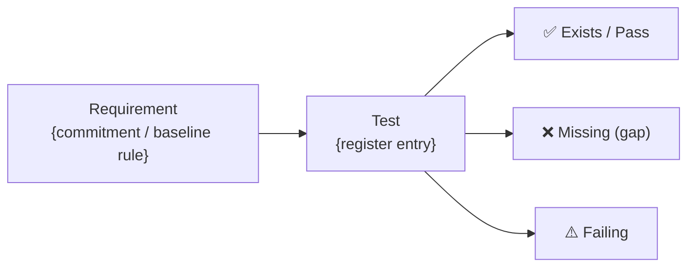

<!-- Copyright (c) 2026 Mohammad Maheri. Licensed under Apache 2.0. See LICENSE. Attribution required - see NOTICE. -->
# Coverage Report — Template

---
generatedBy: AI-TGE
generatedVersion: {version}
source: test-register
generatedOn: {ISO-date}
ownership: generated
---

**Type:** Coverage Report
**Generated:** {ISO-date}
**Engine:** AI-TGE v{version}
**Mode:** {Full Chain / Architecture Only / Brownfield / Observation Only}
**Observation Fidelity:** {✅ Full / ⚠️ Degraded / ❌ Unknown}
**Depth:** {Minimal / Standard / Comprehensive}
**Project:** {project_name}

{IF Observation Fidelity is not ✅ Full — this banner is MANDATORY and sits HERE, above the Executive Summary:}
> ⚠️ **DEGRADED OBSERVATION — these figures are incomplete.**
> {n} of {N} declared inputs for {mode} mode did not resolve:
> - **{input}** — expected at `{path}`; substituted with {substitute}
>
> **Therefore unmeasured:** {unmeasured consequence}
> **Unaffected:** {which views remain intact}
> {IF ❌ Unknown:} Fidelity was not assessed for this cycle, so it is reported as degraded.
>
> Full per-input detail: the **Completeness & Downstream Resolution** section below.

---

## Executive Summary

| Metric | Value |
|--------|:-----:|
| **Overall Coverage** | **{n}%**{⚠️ if degraded} |
| Active register entries | {N} |
| Tests existing | {n} |
| Tests missing | {n} |
| Tests failing | {n} |
| Critical gaps remaining | {n} |
| Trend (vs. last report) | {↑ +n% / → stable / ↓ -n%}{⚠️ if any contributing cycle was degraded} |
| Target (from strategy) | {n}% |
| Gap to target | {n}% |

> **Reading a marked figure.** A `⚠️` means the number was derived wholly or partly from a substitute for an input that did not resolve — so it is a **lower bound on what is known**, not a measurement of the project. Which input, and what it costs, is in Completeness & Downstream Resolution.

---

## Coverage Traceability (visual)

> The coverage chain at a glance — requirement → test → result. The coverage tables (Views 1–6) and the linked register stay authoritative (DFE-extracted for the quality dashboard); this diagram is the human view of how each architectural commitment or baseline rule traces through a test to a verified result.

---

## View 1: Coverage by Commitment Category

| Category | Active | Covered | Missing | Failing | Coverage % | Target | Status |
|----------|:------:|:-------:|:-------:|:-------:|:----------:|:------:|:------:|
| API | {n} | {n} | {n} | {n} | {n}% | {n}% | {✅/⚠️/❌} |
| Security | {n} | {n} | {n} | {n} | {n}% | {n}% | {status} |
| Business Logic | {n} | {n} | {n} | {n} | {n}% | {n}% | {status} |
| Integration | {n} | {n} | {n} | {n} | {n}% | {n}% | {status} |
| Data | {n} | {n} | {n} | {n} | {n}% | {n}% | {status} |
| Performance/NFR | {n} | {n} | {n} | {n} | {n}%{⚠️ if the NFR location did not resolve} | {n}% | {status} |
| Workflow | {n} | {n} | {n} | {n} | {n}% | {n}% | {status} |
| Configuration | {n} | {n} | {n} | {n} | {n}% | {n}% | {status} |

**Legend:** ✅ At or above target | ⚠️ Within 10% of target | ❌ More than 10% below target
**Fidelity marker:** a `⚠️` beside a *Coverage %* value means that row's source input did not resolve — the figure is unmeasured, not merely low. Distinct from the target-status column above.

---

## View 2: Coverage by Component

| Component | Active | Covered | Missing | Coverage % | Risk Exposure | Priority |
|-----------|:------:|:-------:|:-------:|:----------:|:-------------:|:--------:|
| {ComponentName} | {n} | {n} | {n} | {n}% | {sum of missing risk scores} | {🔴🟠🟡🟢} |
| {ComponentName} | {n} | {n} | {n} | {n}% | {risk exposure} | {priority} |

**Most at-risk:** {component} — {n}% coverage, risk exposure {score}
**Best covered:** {component} — {n}% coverage

---

## View 3: Coverage by Test Level (Pyramid)

| Level | Required | Existing | Missing | Coverage % | Pyramid Target | Health |
|-------|:--------:|:--------:|:-------:|:----------:|:--------------:|:------:|
| Unit | {n} | {n} | {n} | {n}% | {n}% | {status} |
| Integration | {n} | {n} | {n} | {n}% | {n}% | {status} |
| System | {n} | {n} | {n} | {n}% | {n}% | {status} |
| Acceptance | {n} | {n} | {n} | {n}%{⚠️ if the user-story location did not resolve} | {n}% | {status} |

**Pyramid health:** {Assessment — balanced / unit-heavy / integration-gap / etc.}

> ⚠️ **If the Acceptance row is marked, do not read it as a pyramid finding.** Acceptance requirements are derived from user stories; when the story location did not resolve, this row reports **zero data**, not zero tests. A pyramid assessment that treats it as a genuine gap will recommend writing acceptance tests that may already exist.

---

## View 4: Coverage by Risk Level

| Risk Bucket | Active | Covered | Missing | Coverage % | Interpretation |
|-------------|:------:|:-------:|:-------:|:----------:|---------------|
| 🔴 Critical | {n} | {n} | {n} | {n}% | {comment} |
| 🟠 High | {n} | {n} | {n} | {n}% | {comment} |
| 🟡 Medium | {n} | {n} | {n} | {n}% | {comment} |
| 🟢 Low | {n} | {n} | {n} | {n}% | {comment} |

**Risk-weighted assessment:** {Key insight — e.g., "Critical coverage at 67% — 1 gap remains (SEC-003)"}

---

## View 5: Trend

| Report Date | Fidelity | Coverage % | Critical Gaps | Tests Added | Tests Deprecated | Net Change |
|:-----------:|:--------:|:----------:|:-------------:|:-----------:|:----------------:|:----------:|
| {date} | {✅ / ⚠️ / ❌} | {n}% | {n} | — | — | — |
| {date} | {✅ / ⚠️ / ❌} | {n}% | {n} | +{n} | {n} | {±n} |
| {current} | {✅ / ⚠️ / ❌} | {n}% | {n} | +{n} | {n} | {±n} |

**Velocity:** {n} tests added per observation cycle (average) — {or "suppressed: this period includes a degraded cycle"}
**Direction:** {Improving / Stable / Declining} — {or "not assessable: this period includes a degraded cycle"}

> ⚠️ **A trend that spans a degraded cycle is not a trend in tests.** When a degraded cycle is followed by a full one, coverage rises because the engine began seeing entries it could not see before — the movement is in the **measurement**, not in the project. Velocity and direction are therefore suppressed rather than estimated across such a period, because a plausible number invites planning against it.

---

## View 6: Top Gaps (Immediate Attention)

| # | ID | Test Name | Component | Level | Type | Risk Score | Bucket |
|---|:--:|-----------|-----------|:-----:|:----:|:----------:|:------:|
| 1 | {id} | {name} | {comp} | {level} | {type} | {score} | 🔴 |
| 2 | {id} | {name} | {comp} | {level} | {type} | {score} | 🔴 |
| 3 | {id} | {name} | {comp} | {level} | {type} | {score} | 🟠 |
| 4 | {id} | {name} | {comp} | {level} | {type} | {score} | 🟠 |
| 5 | {id} | {name} | {comp} | {level} | {type} | {score} | 🟠 |

---

## Forecast (Comprehensive Depth)

{IF any cycle contributing to velocity was not ✅ Full — emit THIS instead of a forecast:}
**Forecast suppressed.** Velocity cannot be derived across a period containing a degraded cycle ({cycle} — {which input did not resolve}). A forecast built on a measurement artefact would carry a date, and a dated projection gets planned against.

{OTHERWISE:}
At current velocity ({n} tests per cycle):
- {n}% coverage: ~{n} sprints
- {n}% coverage: ~{n} sprints
- {n}% coverage: ~{n} sprints

**Bottleneck:** {category/component with slowest progress}
**Recommendation:** {specific action to accelerate coverage}

---

## Calculation Notes

- **Active entries** = Total - Deprecated - Overridden
- **Coverage %** = (Exists + Failing) / Active × 100
- **Failing tests count as covered** (test exists, needs fixing — different from missing)
- **Risk Exposure** = sum of risk scores for all Missing entries in a component

---

## Completeness & Downstream Resolution

> Mandatory artifact section (IMP-002, `common/artifact-sections.md`). It answers three questions: what this report measures completely, what it measures only partially and where that gets resolved, and what it does not attempt at all.

### Observation Fidelity — {✅ Full / ⚠️ Degraded / ❌ Unknown}

**Mode assessed against:** {Full Chain / Architecture Only / Brownfield / Observation Only} · **Declared inputs resolved:** {n} of {N} · **Assessed at:** {ISO-date}

| Input | Expected At | Resolved | Substitute Used | Unmeasured Consequence |
|-------|-------------|:-------:|-----------------|------------------------|
| **Build state** | {path or "not declared by this mode"} | {✅ / ❌ / n/a} | {— / modification-time heuristic} | {— / unit completion is inferred from file timestamps, not read} |
| **Unit-progress vocabulary** | {source or "not declared by this mode"} | {✅ / ❌ / n/a} | {— / completions treated as generic} | {— / per-unit stage position unavailable} |
| **User-story location** | {path or "not declared by this mode"} | {✅ / ❌ / n/a} | {— / story mapping skipped} | {— / story-derived acceptance coverage is zero, not complete} |
| **NFR location** | {path or "not declared by this mode"} | {✅ / ❌ / n/a} | {— / story-carried NFR extraction skipped} | {— / NFR coverage reflects the Architecture Package only} |

{IF ✅ Full:} Every input this mode declares resolved. No figure in this report is inferred from a substitute.
{IF ❌ Unknown:} Fidelity was not assessed for this cycle. It is reported as degraded, because an unassessed run is never treated as a clean one.

### What This Report Measures Completely

- **Commitment-based coverage** for every register entry derived from inputs that resolved — did a test exist for each architectural promise and each baseline rule.
- **Risk-weighted gap ranking** across all Active entries, since risk scores are derived from the register itself and depend on no external input.
- {IF ✅ Full:} All six views. {OTHERWISE:} The views listed as unaffected in the banner above.

### What Is Partial — and Where It Gets Resolved

| What is partial | Why | Where it gets resolved |
|---|---|---|
| {figure or view} | {which declared input did not resolve} | {the action that would resolve it — e.g. confirm the workspace's story location, then re-run the observation cycle} |
| Test **assertion** quality at Minimal and Standard depth | Existence is checked by filename and describe-block match; assertion content is read only at Comprehensive depth | Raise depth, or review flagged `Exists (unverified)` entries manually |
| Entries marked `Exists (unverified)` | Matched at medium or low confidence | Manual verification against the named file |

{IF nothing is partial:} Nothing. All declared inputs resolved and all views are fully derived.

### What Is Out of Scope

- **Line-of-code coverage.** This report measures whether the tests the architecture requires exist, not what fraction of code executes under test. The two answer different questions and neither substitutes for the other.
- **Whether existing tests are correct.** A test that exists and passes counts as covered; a test that exists and fails counts as covered too, because the gap is in the code, not the test governance.
- **Writing or fixing tests.** AI-TGE governs and reports; it never authors test code. Hard boundary.
- **Deprecated and Overridden entries.** Excluded from Active by design, so they cannot depress or inflate coverage. They remain in the register with their status and rationale.

---

*Generated by AI-TGE · AIFLC PDLC Family · © Mohammad Maheri · https://github.com/mbmd/AIFLC*
