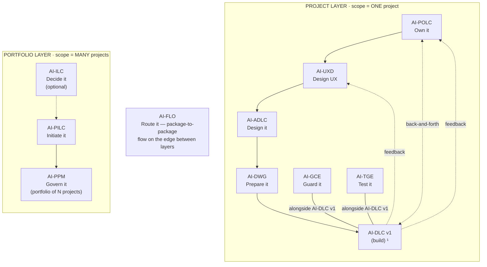

# AI-UXD — AI-Driven UX Design Life Cycle

[](./LICENSE)

**Version:** 1.0.0
**Created By:** Maheri — [LinkedIn](https://www.linkedin.com/in/mohammad-maheri-8399565b)
**Inspired By:** Double Diamond (UK Design Council), Atomic Design (Brad Frost), W3C Design Tokens
**License:** Apache 2.0 with Attribution

---

## What Is AI-UXD?

AI-UXD is an injectable UX design lifecycle that guides you from user research to a governed design system — producing artifacts that downstream development tools can consume directly. It reasons and writes as a senior UX designer, producing professional-grade deliverables without requiring prior UX expertise.

**In one sentence:** AI-UXD turns business intent and user research into a governed UX Design Package (UXP) — personas, journeys, information architecture, user flows, a complete design system with tokens and components, and an accessibility baseline.

---

## Family Position

AI-UXD is part of **AIFLC** (AI Full Life Cycle) — the AI-* PDLC Family of injectable workflow packages that feed each other:


  ¹ AI-DLC v1 = Amazon's open-source build lifecycle (not ours; we feed it).

| Layer | Package | Type | Input | Output |
|-------|---------|------|-------|--------|
| Portfolio | **AI-ILC** ² | Interactive workflow (lifecycle) | Raw idea | Approved Idea Brief / Feature Brief |
| Portfolio | **AI-PILC** | Interactive workflow (lifecycle) | Raw requirement | Project Initiation Package (PIP) |
| Portfolio | **AI-PPM** ³ | Adaptive portfolio engine | Multiple PIPs + Approved Idea Briefs | Portfolio register + cross-project prioritization & governance |
| Edge | **AI-FLO** ³ | Router / orchestration engine | Any package output marker | Routing decision + handoff to next package/layer |
| Project | **AI-POLC** ³ | Interactive workflow (lifecycle) | PIP | Product Backlog Package (PBP) |
| Project | **AI-UXD** ³ | Interactive workflow (lifecycle) | PIP + PBP | UX Design Package (UXP): personas/journeys, IA, user flows, design system + tokens, accessibility baseline |
| Project | **AI-ADLC** | Interactive workflow (lifecycle) | PIP + PBP + UXP | Architecture Package (AP) |
| Project | **AI-DWG** | One-time generator | AP + PBP + UXP | Ready-to-code development workspace (DW) |
| Project | **AI-GCE** | Adaptive governance engine | DW (AI-DWG output) | Compliance enforcement layer |
| Project | **AI-TGE** | Test governance engine | DW / build artifacts | Test governance & quality layer |
| Project | **AI-DLC v1** ¹ | Interactive workflow (lifecycle) | DW + GCE + User Stories (from AI-POLC) | Working Software |

> ¹ **AI-DLC v1** ([awslabs/aidlc-workflows](https://github.com/awslabs/aidlc-workflows)) is NOT our product. Our chain produces the workspace AI-DLC v1 consumes.
> ² **AI-ILC** is an **optional pre-stage** (the funnel before the funnel). The chain still works without it for users who start at AI-PILC. `⇢` denotes the optional link.
> ³ All packages in this table are **built**. AI-PPM (portfolio engine), AI-FLO (router), AI-POLC (product ownership lifecycle), and AI-UXD (UX design lifecycle) were the last four — completed June 2026. Within the Project layer, **AI-POLC, AI-UXD, and AI-ADLC run sequentially** (POLC→UXD→ADLC) — each feeds the next, culminating at AI-DWG which receives all three outputs (AP + PBP + UXP). **AI-GCE and AI-TGE run alongside AI-DLC v1** as continuous quality engines; **AI-POLC ⇄ AI-DLC v1** exchange backlog/acceptance throughout delivery; and **AI-DLC v1 runtime feedback flows back to both AI-UXD and AI-POLC**. Feedback loops (ADLC→POLC cost/risk, ADLC→UXD constraints) provide iterative refinement without changing the forward sequence.

> **AI-DFE** ([Data Fabric Engine](../ai-dfe/)) is a family-scoped **companion** — it gathers data from all packages and distributes structured JSON for dashboards and status roll-ups. It runs alongside the chain rather than as a linear step, so it is not shown as a chain row above.

---

## Where AI-UXD Sits in the Chain

AI-UXD is the **second step of the Project layer** — the middle of the sequential design chain **AI-POLC → AI-UXD → AI-ADLC → AI-DWG**. It was built to fill the family's "missing producer" gap: downstream packages assumed design tokens, components, and an accessibility baseline already existed, but nothing produced them. AI-UXD is that producer.

| Aspect | AI-UXD |
|--------|---------|
| **Layer** | Project |
| **Position** | Second in the Project-layer sequence (POLC → UXD → ADLC → DWG) |
| **Predecessor** | AI-POLC (value goals, strategy exchange); AI-PILC (PIP) |
| **Direct successors** | AI-ADLC (next in sequence); feeds AI-DWG (design system + tokens → `design-system.md` + `frontend-standards.md`), AI-POLC (personas/journeys), AI-GCE (accessibility baseline → `accessibility-compliance` rule) |
| **Reads (input)** | PIP (`pilc-state.md`), PBP (`polc-state.md`); optionally AP constraints (`adlc-state.md`) |
| **Produces (output)** | UX Design Package (UXP) under `pdlc-ws/projects/PRJ-{ABBREV}-{slug}/ux/` |
| **Output marker** | `uxd-state.md` |
| **Correlation key** | Adopts the upstream `projectId` (never re-mints) |
| **Capability emitted** | `ux-design@1` (consumed by AI-POLC and AI-DWG) |
| **Capability consumed** | `project-initiation@1`, `product-backlog@1`, `architecture-design@1` (all internal) |

**Simplified chain view** (see the diagram above for the full topology):

```
AI-PILC → [ AI-POLC → AI-UXD → AI-ADLC → AI-DWG ] → AI-DLC v1
                       ▲ you are here    (AI-DLC v1 runtime UX feedback loops back to AI-UXD)
```

AI-UXD answers **"how should this feel and flow for its users, as a governed system?"** — it defines the UX system (personas → journeys → IA → flows → design system → tokens → components → accessibility). It does not design the technical architecture (AI-ADLC) or build the UI (AI-DLC v1), and it receives AI-DLC v1 runtime usability/accessibility feedback for refinement.

### Standalone vs. chained

- **Standalone.** Give it a product brief plus any user research and it produces a complete UXP — no other package required (it mints its own project when it originates).
- **Chained (upstream).** It reads `pilc-state.md` (context, user types) and exchanges with `polc-state.md` (value goals focus the research); optional `adlc-state.md` supplies technical constraints.
- **Chained (downstream).** On completion it writes `uxd-state.md` and the UXP; three consumers pick up distinct slices — AI-POLC (personas/journeys), AI-DWG (design system/tokens/components), AI-GCE (accessibility baseline).
- **Four input modes.** Full chain (PIP + AP) · PIP only · Standalone brief · Brownfield (reads an existing design system / component library).

---

## Features

- **5 phases, 16 stages** — Discover → Define → Design → Validate → Assemble
- **Evidence-backed personas** with JTBD framing and accessibility considerations
- **Journey mapping** with emotional tracking, error paths, and service blueprints
- **Information architecture** — organization, labeling, navigation, and search systems
- **User flows** — task flows, user flows, wireflows with error/edge-case paths
- **Full design system** — colors, typography, spatial grid, iconography, voice & tone
- **W3C-aligned design tokens** — three-tier architecture (global → semantic → component)
- **Component library** — every component with ALL states, interactions, accessibility, responsive behavior
- **Multi-brand theming** — dark mode, brand variants, token inheritance (conditional)
- **i18n/RTL** — text expansion, bidirectional layout, locale-aware tokens (conditional)
- **Accessibility-by-design** — WCAG 2.2 baseline embedded in every stage, not bolted on
- **Design QA framework** — governed drift detection for implementation fidelity
- **Usability validation** — heuristic evaluation + test plan + feedback intake
- **UXC__ governance agent** — on-demand consistency validation
- **Adaptive depth** — Minimal / Standard / Comprehensive based on project complexity
- **4 input modes** — Full chain (PIP+AP) / PIP only / Standalone / Brownfield
- **Gates at every stage** — nothing proceeds without your approval

---

## Activation

**Explicit key:** type `_UXD_` in any prompt to activate AI-UXD unambiguously — even when other AI-* packages share the workspace. The status key `_ACTIVE_` reports which package is currently active. A package switch never happens without your explicit key or confirmation, and any switch is announced on the first line of the response (`Active package: AI-UXD`). See [`../TRIGGER_KEYS_REFERENCE.md`](../TRIGGER_KEYS_REFERENCE.md) for the full family key table.

---

## Installation

AI-UXD is pure Markdown — no runtime, no dependencies, no build step. "Installing" means placing two folders and one always-loaded router file where your AI agent will read them.

### The model (read this first)

Installation writes to exactly three places:

1. **The package home** — `ai-uxd-rules/` (the core **dispatcher**) and `ai-uxd-rule-details/` (stage details + templates, read on demand) are copied into `.aiflc/pdlc/`. This path is **identical on every platform**.
2. **One always-loaded orchestrator** — a single small router placed in your platform's native auto-load slot. It is the *only* file that loads automatically; it reads the AI-UXD core on demand when you activate the package. (Nothing under `.aiflc/` auto-loads — that keeps the context window free no matter how many packages you install.)
3. **The output workspace** — `pdlc-ws/` at your workspace root; AI-UXD writes the UXP under `pdlc-ws/projects/PRJ-{ABBREV}-{slug}/ux/`.

### Option A — Install alongside the family (recommended)

Run the family installer from the repo root. It places AI-UXD (and any other packages you pick) correctly for your platform, deploys the orchestrator, and creates `pdlc-ws/`.

```powershell
# Windows (PowerShell) — install just AI-UXD on Kiro
.\installer\install.ps1 -TargetWorkspace "C:\path\to\your\project" -Platform kiro -Packages "ai-uxd"
```

```bash
# macOS / Linux — install just AI-UXD on Kiro
./installer/install.sh --target ~/path/to/your/project --platform kiro --packages ai-uxd
```

Swap `-Packages "ai-uxd"` for `-Bundle full` to install the whole chain at once. Supported `-Platform` values: `kiro`, `cursor`, `claude-code`, `cline`, `amazonq`, `copilot`.

### Option B — Install this package individually (manual)

Two copy operations plus one orchestrator placement. Copy the two package folders into the uniform home (same on every platform):

```
ai-uxd/ai-uxd-rules/        →  <workspace>/.aiflc/pdlc/ai-uxd-rules/
ai-uxd/ai-uxd-rule-details/ →  <workspace>/.aiflc/pdlc/ai-uxd-rule-details/
```

Then place the always-loaded orchestrator (`session-orchestrator.md`, from the packages root) in your platform's slot:

| Platform | Orchestrator destination | How it loads |
|----------|--------------------------|--------------|
| **Kiro** | `.kiro/steering/session-orchestrator-pdlc.md` | Auto-loaded steering |
| **Amazon Q** | `.amazonq/rules/pdlc/session-orchestrator.md` | Auto-loaded rule |
| **Cursor** | `.cursor/rules/pdlc-session-orchestrator.mdc` | Add `alwaysApply: true` frontmatter |
| **Cline** | `.clinerules/pdlc-session-orchestrator.md` | Auto-loaded rule |
| **Claude Code** | `CLAUDE_PDLC_ORCHESTRATOR.md` | Import from root `CLAUDE.md` via `@CLAUDE_PDLC_ORCHESTRATOR.md` |
| **GitHub Copilot** | `.github/copilot-instructions-pdlc-orchestrator.md` | Workspace instructions |
| **Codex / VS Code agent** | `AGENTS.md` (workspace root) | Auto-loaded agent instructions |

> Claude Code uses a parallel orchestrator source, `session-orchestrator.claude.md`. Finally, create `pdlc-ws/` at your workspace root for output.

### For AI agents — machine-readable install manifest

An AI assistant can install AI-UXD by parsing and executing the block below. All `copy.from` and `orchestrator.source` paths are relative to `source_root`; every destination is relative to the workspace root. Pick the one `orchestrator.slot` row that matches the target platform. The manifest is **platform-agnostic** — everything except `orchestrator.slot` is identical on every platform.

```yaml
# AIFLC INSTALL MANIFEST — AI-UXD
package: AI-UXD
family: pdlc                       # package home: .aiflc/pdlc/
version: 1.0.0
runtime: none                      # pure Markdown; no deps, no build
source_root: pdlc-packages/        # clone root of the AIPDLC repo
activation_phrase: "Using AI-UXD, design the user experience"
trigger_key: "_UXD_"               # universal explicit key (recognized by the orchestrator on any platform); or use activation_phrase
status_key: "_ACTIVE_"             # reports which package is currently active
depends_on: []                     # standalone-capable from a brief
optional_inputs:
  - marker: pilc-state.md          # AI-PILC PIP (context, user types)
  - marker: polc-state.md          # AI-POLC value goals (strategy exchange)
  - marker: adlc-state.md          # AI-ADLC technical constraints (optional)
emits_capability: "ux-design@1"
output_marker: uxd-state.md
output_dir: pdlc-ws/               # per-project UXP under pdlc-ws/projects/PRJ-.../ux/
copy:
  - from: ai-uxd/ai-uxd-rules
    to: .aiflc/pdlc/ai-uxd-rules
  - from: ai-uxd/ai-uxd-rule-details
    to: .aiflc/pdlc/ai-uxd-rule-details
orchestrator:
  source: session-orchestrator.md            # the ONLY always-loaded file
  source_claude: session-orchestrator.claude.md   # use this source for claude-code
  slot:
    kiro: .kiro/steering/session-orchestrator-pdlc.md
    amazonq: .amazonq/rules/pdlc/session-orchestrator.md
    cursor: .cursor/rules/pdlc-session-orchestrator.mdc   # + frontmatter alwaysApply: true
    cline: .clinerules/pdlc-session-orchestrator.md
    claude-code: CLAUDE_PDLC_ORCHESTRATOR.md              # import from root CLAUDE.md
    copilot: .github/copilot-instructions-pdlc-orchestrator.md
    codex: AGENTS.md
    vscode: AGENTS.md
core_entry: .aiflc/pdlc/ai-uxd-rules/core-workflow.md     # orchestrator Reads this on activation
rule_details_home: .aiflc/pdlc/ai-uxd-rule-details/       # core resolves these on demand
verify:
  - path_exists: .aiflc/pdlc/ai-uxd-rules/core-workflow.md
  - path_exists: .aiflc/pdlc/ai-uxd-rule-details/
  - orchestrator_present_in_platform_slot: true
  - action: 'say "Using AI-UXD, design the user experience" and expect the AI-UXD welcome message'
```

### Verify

1. Open the workspace in your IDE with the AI agent active.
2. Confirm the orchestrator loaded (Kiro: it appears in the Steering panel).
3. Start a chat: `Using AI-UXD, design the user experience`.
4. AI-UXD greets you and begins; UX output appears under `pdlc-ws/projects/PRJ-.../ux/`.

For the full per-platform walkthrough (including limitations and workarounds), see [setup/INSTALL.md](./setup/INSTALL.md) and the family-wide [INSTALL_GUIDE.md](../../INSTALL_GUIDE.md).

---

## Usage

1. Open your workspace in your IDE with the AI assistant active
2. Start a chat and say:
   ```
   Using AI-UXD, design the UX for [feature or product]
   ```
3. The workflow guides you through research, personas, journeys, information architecture, flows, design system, and an accessibility baseline
4. Answer structured questions and approve each deliverable at gates
5. A UX Design Package (UXP) is produced for AI-ADLC / AI-POLC to consume

## File Structure

```
ai-uxd/
├── README.md                          ← This file
├── LICENSE                            ← Apache 2.0 + Attribution
├── PLAN.md                            ← Design rationale
├── ai-uxd-rules/
│   └── core-workflow.md               ← Master dispatcher — the spec (read on demand by the orchestrator)
├── ai-uxd-rule-details/
│   ├── common/                        ← Cross-cutting (11 files)
│   ├── discover/                      ← Phase 1 stages (3 files)
│   ├── define/                        ← Phase 2 stages (3 files)
│   ├── design/                        ← Phase 3 stages (4 files)
│   ├── validate/                      ← Phase 4 stages (3 files)
│   ├── assemble/                      ← Phase 5 stages (4 files)
│   ├── data-schema/                   ← AI-DFE data interface (3 files)
│   ├── drift-intake/                  ← Governance drift-intake (1 file)
│   ├── ai-lens/                       ← AI-opportunity lens facet (1 file)
│   └── templates/                     ← Output templates (17 files)
│       └── agents/                    ← Governance + upgrade + sync agents (5 files)
└── setup/
    └── INSTALL.md                     ← Platform setup guide
```

---

## Tenets

1. **Systems over screens** — the design system generates consistent screens; individual pages are expressions of the system
2. **Accessibility is embedded** — every stage considers it; Stage 11 consolidates, doesn't start from zero
3. **Traceability is non-negotiable** — persona → journey → flow → screen → component → token → principle
4. **Artifact, not tool** — governs structure and specifications; doesn't replace Figma or design tools
5. **States are mandatory** — a component without all its states is incomplete
6. **Voice is design** — words are part of the experience and governed alongside visuals
7. **Responsive as constraint** — breakpoints and reflow are design system decisions, not developer discoveries

---

## Patterns, Methodologies & Frameworks Covered

AI-UXD operationalizes **end-to-end UX design as a governed system**. It aligns with the bodies of knowledge below and adapts their concepts to an AI-assisted, human-gated workflow; it does not certify against any of them.

| Framework / body of knowledge | What AI-UXD applies | Where it stops (scope boundary) |
|---|---|---|
| **Double Diamond** (UK Design Council) | The 5-phase Discover → Define → Design → Validate → Assemble flow, run as divergent/convergent passes | Not a discovery-only or research-ops method — it always converges to a governed UXP |
| **Atomic Design** (Brad Frost) | A layered design system — tokens → components → patterns — with every component fully specified (states, interactions, responsive, ARIA) | Not a component code library or Storybook build — it specifies, it does not implement |
| **W3C Design Tokens** | A three-tier token architecture (global → semantic → component), consumable by AI-DWG | Not a token build pipeline / Style Dictionary export — it defines the token spec |
| **WCAG 2.2** | An accessibility baseline embedded at every stage (POUR checklist + explicit conformance target) | Not an automated a11y audit of shipped software — that is runtime testing / AI-GCE enforcement |
| **Jobs-to-be-Done** | Evidence-backed personas framed by jobs, goals, pains, and context | Not market research or quantitative segmentation |
| **Information architecture** (organize / label / navigate / search) | Site maps, taxonomy, navigation and search models | Bounded to structure — not content authoring |
| **Journey mapping · service blueprints · heuristic evaluation** | Journeys per persona (emotion, error paths), service blueprints, Nielsen-style heuristics + a usability test plan | It plans and specifies validation; it does not run live usability studies |

The defining boundary: AI-UXD is an **artifact, not a tool** — it governs structure and specifications (personas, IA, flows, tokens, component specs, a11y baseline). It does not replace Figma or produce pixel comps, prototypes, or UI code (that is AI-DLC v1's build), and it does not design the technical architecture (AI-ADLC).

---

## Cross-Cutting Lenses (AI · Automation · Agentic)

AI-UXD designs the **interaction** side of the family's cross-cutting lenses — for any feature the lenses tagged upstream (modes live in `Lens_Status.md`, set at AI-PILC and tagged at AI-POLC).

| Lens | Mode (on / off) | Key | What AI-UXD does when it's on |
|------|-----------------|-----|-------------------------------|
| **AI Lens** | AI-Powered / No-AI | `_AILENS_` | Designs the AI-feature UX (human-in-the-loop patterns, output/confidence transparency) |
| **Automation Lens** | Automated / Manual | `_AUTOLENS_` | Designs the automation UX (approval, monitoring, override) |
| **Agentic** (AI ∩ Automation) | derived — both on | — | Adds agent-interaction transparency — reasoning/tool-use visibility, agent "working" states, and interruptibility |

Downstream, AI-DWG provisions the scaffolding and AI-GCE / AI-TGE govern and test the tagged features via Layer-3 agents (`AIG__`/`ATG__`, `AIQ__`/`ATQ__`).

---

## Output Directory Structure

AI-UXD outputs into the standard multi-project layout. UX design artifacts land in `ux/` within the project folder:

```
pdlc-ws/projects/
├── PROJECTS.md                          ← workspace registry
└── PRJ-{ABBREV}-{slug}/                  ← one project
    ├── management_framework/             ← shared governance spine
    └── ux/                               ← AI-UXD output
        ├── uxd-state.md                  ← progress marker
        ├── 01_Research_Synthesis.md
        ├── 02_Personas/
        ├── 03_Journey_Maps/
        ├── 04_Information_Architecture.md
        ├── 05_User_Flows/
        ├── 06_Wireframe_Specifications/
        ├── 07_Design_System/
        ├── 08_Component_Library/
        ├── [09_Multi_Brand_Theming.md]   (conditional)
        ├── 10_Accessibility_Baseline.md
        ├── 11_Usability_Test_Plan.md
        ├── 12_Design_QA_Framework.md
        └── UXP_README.md
```

> The `projects/` structure is always-on — solo, single-project, and multi-project alike. See `OUTPUT_AND_STATE_CONTRACT.md` for full details.

---

## Author

**Mohammad Maheri** — Process designer specializing in injectable AI workflow packages.

AI-UXD was designed to fill the "missing producer" gap in the AI-* Family: downstream packages assumed design tokens, components, and accessibility baselines existed — but nothing produced them. AI-UXD is that producer.

---

*v1.0.0 | 2026-06-12*

---

## Further Reading

Deep-dive knowledge documents for this package (in the family repo under `knowledge_docs/`):

| Document | What it covers |
|----------|---------------|
| [How UX Design Lifecycle Works](../../knowledge_docs/HOW_UX_DESIGN_LIFECYCLE_WORKS.md) | Internal mechanics of the 5-phase / 16-stage UX engine |
| [How to Design User Experience](../../knowledge_docs/HOW_TO_DESIGN_USER_EXPERIENCE.md) | Practitioner guide — running AI-UXD on a real project |
| [How Package Installation Works](../../knowledge_docs/HOW_PACKAGE_INSTALLATION_WORKS.md) | How the installer places packages into your workspace |
| [How Package Activation & Isolation Works](../../knowledge_docs/HOW_PACKAGE_ACTIVATION_ISOLATION_WORKS.md) | Activation keys, switching rules, multi-package coexistence |
| [How Chain Handoff Works](../../knowledge_docs/HOW_CHAIN_HANDOFF_WORKS.md) | How AI-UXD reads PBP and feeds AI-ADLC |
| [How Gates and Approvals Work](../../knowledge_docs/HOW_GATES_AND_APPROVALS_WORK.md) | The human-in-the-loop gate model at every stage |
| [How Depth Levels Work](../../knowledge_docs/HOW_DEPTH_LEVELS_WORK.md) | Minimal / Standard / Comprehensive adaptive tiers |
| [How Project Layer Collaboration Works](../../knowledge_docs/HOW_PROJECT_LAYER_COLLABORATION_WORKS.md) | How UXD, POLC, and ADLC collaborate and feed AI-DWG |

---

## License

**Apache License 2.0 with Attribution Addendum**

- **Free to use:** Personal, commercial, educational, and organizational use — all permitted
- **Modify and distribute:** Create derivative works, redistribute, sublicense — all permitted
- **Attribution required:** Any distributed product substantially based on this work must include:

> *"Built on AIFLC by Mohammad Maheri — [LinkedIn](https://www.linkedin.com/in/mohammad-maheri-8399565b)"*

- **No warranty:** Provided "AS IS" without warranties of any kind

See `LICENSE` and `NOTICE` in this directory for full terms.

**Copyright:** © 2026 Mohammad Maheri

---

*Part of [AIFLC](../../README.md) — the AI-* PDLC Family*
